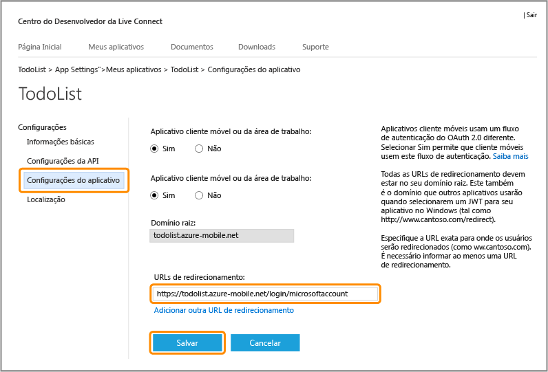
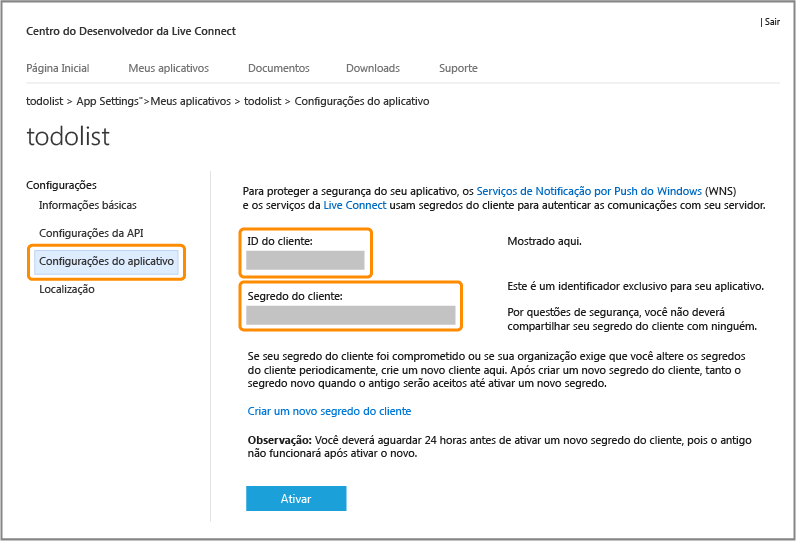

<properties 
	pageTitle="Registrar para autenticação Microsoft - Serviços Móveis" 
	description="Saiba como registrar-se para autenticação da Microsoft em seu aplicativo de serviços móveis do Azure." 
	authors="ggailey777" 
	services="mobile-services" 
	documentationCenter="Mobile" 
	manager="dwrede" 
	editor=""/>

<tags 
	ms.service="mobile-services" 
	ms.workload="mobile" 
	ms.tgt_pltfrm="NA" 
	ms.devlang="multiple" 
	ms.topic="article" 
	ms.date="06/14/2015" 
	ms.author="glenga"/>

# Registrar seu aplicativo para usar a conta da Microsoft para autenticação

[AZURE.INCLUDE [mobile-services-selector-register-identity-provider](../../includes/mobile-services-selector-register-identity-provider.md)]

## Visão geral 

Este tópico mostra como registrar seu aplicativo móvel para poder usar a conta da Microsoft como um provedor de identidade com os Serviços Móveis do Azure. As mesmas etapas servem tanto para a autenticação orientada a serviços quanto para a direcionada a clientes usando o Live SDK.

##Registrar seu aplicativo da Windows Store no Centro de Desenvolvimento do Windows

Os aplicativos da Windows Store devem ser registrados primeiro no Centro de Desenvolvimento do Windows.

>[AZURE.NOTE]Windows Phone 8, Windows Phone 8.1 Silverlight e aplicativos que não são Windows podem ignorar esta seção.

1. Se você não tiver registrado seu aplicativo, navegue até o [Enviar uma página de aplicativo] no Centro de Desenvolvimento de aplicativos da Windows Store, faça logon com sua conta da Microsoft e, em seguida, clique em **Nome do aplicativo**.

   	

2. Selecione **Criar um novo aplicativo ao reservar um nome exclusivo** e clique em **Continuar**. Em seguida, digite um nome para seu aplicativo em **Nome do aplicativo**, clique em **Reservar nome do aplicativo** e em **Salvar**.

   	

   	Isso cria um novo registro da Windows Store para seu aplicativo.

3. No Visual Studio, abra o projeto criado quando você concluiu o tutorial [Introdução aos Serviços Móveis](mobile-services-dotnet-backend-windows-store-dotnet-get-started.md).

4. No gerenciador de soluções, clique com o botão direito do mouse no projeto do aplicativo da Windows Store, clique em **Armazenar** e, em seguida, clique em **Aplicativo associado à Store...**.

  	

   	Isso exibe o assistente **Associar seu aplicativo à Windows Store**.

5. No assistente, clique em **Entrar** e faça logon com sua conta da Microsoft. Selecione o nome do aplicativo que você reservou na etapa 2 e clique em **Avançar** > **Associar**.

   	Isso adiciona as informações de registro necessárias da Windows Store para o manifesto do aplicativo.

6. (Opcional) Para um aplicativo Windows universal, repita as etapas 4 e 5 para o projeto da Windows Phone Store.

6. De volta à página do Centro de Desenvolvimento do Windows do seu novo aplicativo, clique em **Serviços**.

   	

7. Na página Serviços, clique em **Site do Live Services** em **Serviços Móveis do Azure**.

	

Isso exibe a página da conta da Microsoft para o seu aplicativo.

## Configurar o registro de conta da Microsoft e conectar-se aos Serviços Móveis

A primeira etapa nesta seção se aplica apenas ao Windows Phone 8, ao Windows Phone 8.1 Silverlight e a aplicativos que não forem da Windows Store. Para esses aplicativos, você também pode ignorar o SID (identificador de segurança) do Pacote, que está disponível somente para aplicativos Windows Store.

1. Para um aplicativo que não for Windows Store, navegue até a página <a href="http://go.microsoft.com/fwlink/p/?LinkId=262039" target="_blank">Meus aplicativos</a> na conta do Microsoft Developer Center, faça logon com sua conta da Microsoft (se necessário), clique em **Criar aplicativo**, digite um **Nome de aplicativo** e clique em **Aceito**.

   	Assim você reserva o nome do aplicativo com a conta da Microsoft e exibe a página da conta da Microsoft para o seu aplicativo.

2. Na página de conta da Microsoft para o seu aplicativo, clique em **Configurações da API**, habilite **Aplicativo cliente móvel ou de desktop**, defina a URL de serviço móvel como o **Domínio de destino**, forneça um valor de `https://<mobile_service>.azure-mobile.net/login/microsoftaccount/` na **URL de redirecionamento** e clique em **Salvar**.

	 >[AZURE.NOTE]Para um serviço móvel de back-end do .NET publicado no Azure usando o Visual Studio, a URL de redirecionamento é a URL do seu serviço móvel anexada com o caminho _signin-microsoft_ do seu serviço móvel como um serviço .NET, por exemplo, `https://todolist.azure-mobile.net/signin-microsoft`.

    

	O **Domínio raiz** deve ser preenchido automaticamente.

4. Clique em **Configurações da API** e anote os valores da **ID do cliente**, do **Segredo do cliente** e do **SID do pacote**.
	
   	
	
	
    > [AZURE.NOTE]O segredo do cliente é uma credencial de segurança importante. Não compartilhe o segredo do cliente com ninguém nem o distribua com seu aplicativo. Somente os registros de aplicativo Windows Store verão um campo de SID do pacote.

4. No [Portal de Gerenciamento do Azure], clique na guia **Identidade** d serviço móvel, insira a ID do cliente, o segredo do cliente e o SID do pacote obtido de seu provedor de identidade e clique em **Salvar**.

 	
	
	>[AZURE.NOTE]Você não precisa fornecer um valor de SID de pacote para um Windows Phone 8, um Windows Phone Store 8.1 Silverlight ou um aplicativo não Windows.
	
O serviço móvel e o seu aplicativo agora estão configurados para trabalhar com a conta da MIcrosoft.

<!-- Anchors. -->

<!-- Images. -->

<!-- URLs. -->

[Enviar uma página de aplicativo]: http://go.microsoft.com/fwlink/p/?LinkID=266582
[My Applications]: http://go.microsoft.com/fwlink/p/?LinkId=262039

[Portal de Gerenciamento do Azure]: https://manage.windowsazure.com/
 

<!---HONumber=July15_HO2-->