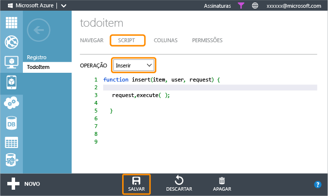

<properties 
	pageTitle="Introdução às notificações por push (Android JavaScript) | Microsoft Azure" 
	description="Saiba como usar serviços móveis do Azure para enviar notificações por push para seu aplicativo JavaScript do Android." 
	services="mobile-services, notification-hubs" 
	documentationCenter="android" 
	authors="RickSaling" 
	manager="dwrede" 
	editor=""/>

<tags 
	ms.service="mobile-services" 
	ms.workload="mobile" 
	ms.tgt_pltfrm="mobile-android" 
	ms.devlang="java" 
	ms.topic="article" 
	ms.date="06/03/2015" 
	ms.author="ricksal"/>

# Adicionar notificações por push a seu aplicativo de Serviços Móveis

[AZURE.INCLUDE [mobile-services-selector-get-started-push](../../includes/mobile-services-selector-get-started-push-EC.md)]

Este tópico mostra como usar os Serviços Móveis do Azure para enviar notificações por push a um aplicativo Android usando o serviço de Mensagens de Nuvem do Google (GCM). Neste tutorial, você habilita as notificações por push usando os Hubs de Notificação do Azure para o projeto de início rápido. Ao concluir, seu serviço móvel enviará uma notificação por push sempre que um registro for inserido.

Este tutorial explica as etapas básicas para habilitar as notificações por push:

1. [Habilitar as mensagens em nuvem do Google](#register)
2. [Configurar os Serviços Móveis](#configure)
3. [Adicionar notificações de push para seu aplicativo](#add-push)
4. [Atualizar scripts para enviar notificações por push](#update-scripts)
5. [Inserir dados para receber notificações](#test)

>[AZURE.NOTE]Se você gostaria de ver o código-fonte do aplicativo concluído, clique <a href="https://github.com/RickSaling/mobile-services-samples/tree/futures/GettingStartedWithPush/Android" target="_blank">aqui</a>.

##Pré-requisitos

[AZURE.INCLUDE [mobile-services-android-prerequisites](../../includes/mobile-services-android-prerequisites-EC.md)]

##Habilitar as mensagens em nuvem do Google

[AZURE.INCLUDE [Habilite o GCM](../../includes/mobile-services-enable-Google-cloud-messaging.md)]

##Configurar Serviços Móveis para enviar solicitações de push

[AZURE.INCLUDE [mobile-services-android-configure-push](../../includes/mobile-services-android-configure-push.md)]

##Adicionar notificações de push para seu aplicativo

###Verificar Versão de SDK do Android

[AZURE.INCLUDE [Verifique o SDK](../../includes/mobile-services-verify-android-sdk-version-EC.md)]

A próxima etapa é instalar os serviços do Google Play. A mensagens de nuvem do Google tem alguns requisitos mínimos de nível do API para desenvolvimento e teste, o que a propriedade **minSdkVersion** no manifesto deve estar de acordo.

Se estiver testando com um dispositivo mais antigo, consulte [Configurar o SDK do Google Play Services] para determinar o mínimo que pode ser definido para esse valor e defina-o de maneira apropriada.

###Inclua o Google Play Services no projeto

[AZURE.INCLUDE [Adicionar Play Services](../../includes/mobile-services-add-Google-play-services-EC.md)]

###Incluir código

[AZURE.INCLUDE [mobile-services-android-getting-started-with-push](../../includes/mobile-services-android-getting-started-with-push-EC.md)]

##Atualizar o script de inserção registrados no Portal de Gerenciamento

1. No Portal de Gerenciamento, clique na guia **Dados** e clique na tabela **TodoItem**. 

   	

2. Em **todoitem**, clique na guia **Script** e selecione **Inserir**.
   
  	

   	Isso exibe a função que é chamada quando ocorre uma inserção na tabela **TodoItem**.

3. Substitua a função de inserção com o seguinte código e **Salvar**:

		function insert(item, user, request) {
		// Define a payload for the Google Cloud Messaging toast notification.
		var payload = {
		    "data": {
		        "message": item.text 
		    }
		};		
		request.execute({
		    success: function() {
		        // If the insert succeeds, send a notification.
		        push.gcm.send(null, payload, {
		            success: function(pushResponse) {
		                console.log("Sent push:", pushResponse, payload);
		                request.respond();
		                },              
		            error: function (pushResponse) {
		                console.log("Error Sending push:", pushResponse);
		                request.respond(500, { error: pushResponse });
		                }
		            });
		        },
		    error: function(err) {
		        console.log("request.execute error", err)
		        request.respond();
		    }
		  });
		}

   	Isso registra um novo script de inserção, que usa o [objeto gcm] para enviar uma notificação por push a todos os dispositivos registrados depois que a inserção for bem-sucedida.

##Testar notificações por push no seu aplicativo

Você pode testar o aplicativo anexando um telefone Android com um cabo USB diretamente ou usando um dispositivo virtual no emulador.

###Configurando o emulador para teste

Quando você executa o aplicativo no emulador, certifique-se de usar um Android Virtual Device (AVD) que oferece suporte a APIs do Google.

1. Reinicie o Eclipse, em seguida, no Gerenciador de Pacotes, clique com botão direito do mouse no projeto, clique em **Propriedades**, em **Android**, marque **Google APIs** e clique em **OK**.

	

  	Isso tem como alvo o projeto para APIs do Google.

2. Na **Janela**, selecione **Android Virtual Device Manager**, selecione o dispositivo e clique em **Editar**.

	

3. Selecione **Google APIs** em **Destino** e clique em OK.

   	

	Destina-se ao AVD para usar APIs do Google.

###Executando o teste

1. No menu **Executar** no Eclipse, clique em **Executar** para iniciar o aplicativo.

2. No aplicativo, digite um texto significativo, como _Uma nova tarefa de Serviços Móveis_ e clique no botão **Incluir**.

  	

3. Passe o dedo para baixo da parte superior da tela para abrir a Central de Notificação do dispositivo para ver a notificação.

Este tutorial foi concluído com êxito.

## Próximas etapas

<!---This tutorial demonstrated the basics of enabling an Android app to use Mobile Services and Notification Hubs to send push notifications. Next, consider completing the next tutorial, [Send push notifications to authenticated users], which shows how to use tags to send push notifications from a Mobile Service to only an authenticated user.

+ [Send push notifications to authenticated users]
	 Learn how to use tags to send push notifications from a Mobile Service to only an authenticated user.

+ [Send broadcast notifications to subscribers]
	 Learn how users can register and receive push notifications for categories they're interested in.

+ [Send template-based notifications to subscribers]
	 Learn how to use templates to send push notifications from a Mobile Service, without having to craft platform-specific payloads in your back-end.
-->

Saiba mais sobre os Serviços Móveis e Hubs de Notificação nos tópicos a seguir:

* [Introdução aos dados]  Saiba mais sobre armazenar e consultar dados usando os Serviços Móveis.

* [Introdução à autenticação do seu aplicativo][Get started with authentication]  Saiba como autenticar usuários de seu aplicativo com diferentes tipos de contas usando Serviços Móveis.

* [O que são Hubs de Notificação?]  Saiba mais sobre como os Hubs de Notificação funcionam para entregar notificações aos seus aplicativos entre todas as diversas principais plataformas de cliente.

* [Depuração de aplicativos de Hubs de Notificação](http://go.microsoft.com/fwlink/p/?linkid=386630)  Obtenha diretrizes de solução de problemas e depuração de soluções de Hubs de Notificação.

* [Como usar a biblioteca de cliente Android para os Serviços Móveis]  Saiba mais sobre como usar os Serviços Móveis com o Android.

* [Referência de script de servidor dos Serviços Móveis]  Saiba mais sobre como implementar a lógica de negócios no seu serviço móvel.

<!-- Anchors. -->
[Register your app for push notifications and configure Mobile Services]: #register
[Update the generated push notification code]: #update-scripts
[Insert data to receive notifications]: #test
[Next Steps]: #next-steps

<!-- Images. -->
[13]: ./media/mobile-services-windows-store-javascript-get-started-push/mobile-quickstart-push1.png
[14]: ./media/mobile-services-windows-store-javascript-get-started-push/mobile-quickstart-push2.png

<!-- URLs. -->
[Submit an app page]: http://go.microsoft.com/fwlink/p/?LinkID=266582
[My Applications]: http://go.microsoft.com/fwlink/p/?LinkId=262039
[Live SDK for Windows]: http://go.microsoft.com/fwlink/p/?LinkId=262253
[Introdução aos Serviços Móveis]: mobile-services-android-get-started.md
[Introdução aos dados]: mobile-services-android-get-started-data.md
[Get started with authentication]: mobile-services-android-get-started-users.md
[Get started with push notifications]: /develop/mobile/tutorials/get-started-with-push-js
[Push notifications to app users]: /develop/mobile/tutorials/push-notifications-to-users-js
[Authorize users with scripts]: /develop/mobile/tutorials/authorize-users-in-scripts-js
[JavaScript and HTML]: /develop/mobile/tutorials/get-started-with-push-js
[Configurar o SDK do Google Play Services]: http://go.microsoft.com/fwlink/?LinkId=389801
[Azure Management Portal]: https://manage.windowsazure.com/
[Como usar a biblioteca de cliente Android para os Serviços Móveis]: mobile-services-android-how-to-use-client-library.md

[objeto gcm]: http://go.microsoft.com/fwlink/p/?LinkId=282645

[Referência de script de servidor dos Serviços Móveis]: http://go.microsoft.com/fwlink/?LinkId=262293

[Send push notifications to authenticated users]: mobile-services-javascript-backend-android-push-notifications-app-users.md

[O que são Hubs de Notificação?]: ../notification-hubs-overview.md
[Send broadcast notifications to subscribers]: ../notification-hubs-android-send-breaking-news.md
[Send template-based notifications to subscribers]: ../notification-hubs-android-send-localized-breaking-news.md
 

<!---HONumber=August15_HO7-->