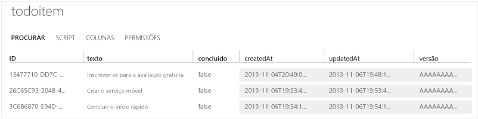

<properties
	pageTitle="Introdução aos Serviços Móveis com PhoneGap | Centro de Desenvolvimento de Serviços Móveis"
	description="Siga este tutorial para começar a usar os serviços móveis do Azure para desenvolvimento em PhoneGap para iOS, Android e Windows Phone."
	services="mobile-services"
	documentationCenter=""
	authors="ggailey777"
	manager="dwrede"
	editor=""/>

<tags
	ms.service="mobile-services"
	ms.workload="mobile"
	ms.tgt_pltfrm="mobile-phonegap"
	ms.devlang="multiple"
	ms.topic="article" 
	ms.date="04/24/2015"
	ms.author="ggailey777"/>

# Introdução aos Serviços Móveis

[AZURE.INCLUDE [mobile-services-selector-get-started](../../includes/mobile-services-selector-get-started.md)]

Este tutorial mostra como adicionar um serviço de back-end baseado em nuvem a um aplicativo usando os Serviços Móveis do Azure. Neste tutorial, você criará um novo serviço móvel e um aplicativo simples _To do list_ que armazena dados do aplicativo no novo serviço móvel.

Uma captura de tela do aplicativo completo está disponível abaixo:

![][3]

### Requisitos adicionais

A conclusão deste tutorial exige o seguinte:

+ Ferramentas do PhoneGap (v3.2+ necessária para projetos do Windows Phone 8).

+ Uma conta ativa do Microsoft Azure.

+ O PhoneGap dá suporte ao desenvolvimento para várias plataformas. Além das próprias ferramentas do PhoneGap, você deve instalar as ferramentas para cada plataforma de destino:

	- Windows Phone: instale o [Visual Studio 2012 Express para Windows Phone](https://go.microsoft.com/fwLink/p/?LinkID=268374)
	- iOS: instale o [Xcode] (v4.4+ necessária)
	- Android: instale as [Android Developer Tools][Android SDK]  (o SDK dos Serviços Móveis para Android dá suporte a aplicativos para o Android 2.2 ou uma versão posterior. O Android 4.2 ou versão posterior é necessário para executar o aplicativo de início rápido.)

## Criar um novo serviço móvel

[AZURE.INCLUDE [mobile-services-create-new-service](../../includes/mobile-services-create-new-service.md)]

## Criar um novo aplicativo PhoneGap

Nesta seção você criará um novo aplicativo PhoneGap que está conectado ao seu serviço móvel.

1.  No Portal de Gerenciamento, clique em **Serviços Móveis**e, em seguida, clique no serviço móvel que você acabou de criar.

2. Na guia quickstart, clique em **PhoneGap** em **Escolher plataforma** e expanda **Criar um novo aplicativo PhoneGap**.

   	![][0]

   	Isso exibirá as três etapas fáceis para a criação de um aplicativo PhoneGap conectado ao seu serviço móvel.

  	![][1]

3. Se ainda não o fez, baixe e instale o PhoneGap e pelo menos uma das ferramentas de desenvolvimento da plataforma (Windows Phone, iOS e Android).

4. Clique em **Criar tabela TodoItem** para criar uma tabela para armazenar os dados do aplicativo.

5. Em **Baixe e execute o aplicativo**, clique em **Baixar**.

	Isso baixa o projeto para o aplicativo de exemplo _To do list_ que está conectado ao serviço móvel, juntamente com o SDK do JavaScript dos Serviços Móveis. Salve o arquivo de projeto compactado em seu computador local e anote onde ele foi salvo.

## Executar seu novo aplicativo PhoneGap

O estágio final deste tutorial é compilar e executar seu novo aplicativo.

1.	Navegue até o local onde você salvou os arquivos do projeto compactados e expanda os arquivos em seu computador.

2.	Abra e execute o projeto de acordo com as instruções abaixo para cada plataforma.

	+ **Windows Phone 8**

		1. Windows Phone 8: abra o arquivo .sln na pasta **platforms\\wp8** no Visual Studio 2012 Express para Windows Phone.

		2. Pressione a tecla **F5** para recompilar o projeto e iniciar o aplicativo.

	  	![][2]

	+ **iOS**

		1. Abra o projeto na pasta **plataformas/ios** no Xcode.

		2. Pressione o botão **Executar** para criar o projeto e iniciar o aplicativo no emulador do iPhone, que é o padrão para este projeto.

	  	![][3]

	+ **Android**

		1. No Eclipse, clique em **Arquivo**, em **Importar**, expanda **Android**, clique em **Código Android existente no espaço de trabalho** e clique em **Avançar.**

		2. Clique em **Procurar**, navegue até o local dos arquivos de projeto expandidos, clique em **OK**, certifique-se de que o projeto TodoActivity está marcado e clique em **Concluir**. 
Isso importa os arquivos de projeto para o espaço de trabalho atual.

		3. No menu **Executar**, clique em **Executar** para iniciar o projeto no emulador Android.

			![][4]

		>[AZURE.NOTE]Para que seja possível executar o projeto no emulador do Android, você deve definir no mínimo um AVD (Dispositivo Virtual Android). Use o Gerenciador do AVD para criar e gerenciar esses dispositivos.

3. Depois de iniciar o aplicativo em um dos emuladores de dispositivos móveis acima, digite texto na caixa de texto e, em seguida, clique em **Adicionar**.

	Isso envia uma solicitação de POST para o novo serviço móvel hospedado no Azure. Os dados da solicitação são inseridos na tabela **TodoItem**. Os itens armazenados na tabela são retornados pelo serviço móvel, e os dados são exibidos na lista.

	> [AZURE.IMPORTANT]As alterações neste projeto de plataforma serão substituídas se o projeto principal for recriado com as ferramentas do PhoneGap. Em vez disso, faça alterações no diretório www raiz do projeto, conforme descrito na seção a seguir.

4. De volta ao Portal de Gerenciamento, clique na guia **Dados** e na tabela **TodoItem**.

	

	Isso permite que você procure os dados inseridos pelo aplicativo na tabela.

	

## Fazer atualizações no aplicativo e recriar projetos para cada plataforma

1. Faça as alterações nos arquivos de código no diretório ´www´ que, neste caso, é ´todolist/www´.

2. Verifique se todas as ferramentas da plataforma de destino estão acessíveis no caminho do sistema.

2. Abra um prompt de comando no diretório raiz do projeto e execute um dos seguintes comandos específicos à plataforma:

	+ **Windows Phone**

		Execute o seguinte comando no prompt de comando do Desenvolvedor do Visual Studio:

    		phonegap local build wp8

	+ **iOS**

		Abra o terminal e execute o seguinte comando:

    		phonegap local build ios

	+ **Android**

		Abra uma janela de prompt de comando ou de terminal e execute o comando a seguir.

		    phonegap local build android

4. Abra cada projeto no ambiente de desenvolvimento apropriado, conforme descrito na seção anterior.

>[AZURE.NOTE]Você pode examinar o código que acessa o seu serviço móvel para consultar e inserir dados, que estão localizados no arquivo js/index.js.

## Próximas etapas
Agora que você concluiu o início rápido, aprenda a executar tarefas adicionais importantes nos Serviços Móveis:

* [Adicionar autenticação ao seu aplicativo]  Saiba como autenticar usuários de seu aplicativo com um provedor de identidade.

* [Adicionar notificações por push ao seu aplicativo](https://msdn.microsoft.com/magazine/dn879353.aspx)  Saiba como registrar-se em seu aplicativo e enviar uma notificação por push para ele.

<!-- Images. -->
[0]: ./media/mobile-services-javascript-backend-phonegap-get-started/portal-screenshot1.png
[1]: ./media/mobile-services-javascript-backend-phonegap-get-started/portal-screenshot2.png
[2]: ./media/mobile-services-javascript-backend-phonegap-get-started/mobile-portal-quickstart-wp8.png
[3]: ./media/mobile-services-javascript-backend-phonegap-get-started/mobile-portal-quickstart-ios.png
[4]: ./media/mobile-services-javascript-backend-phonegap-get-started/mobile-portal-quickstart-android.png

<!-- URLs. -->
[Add Mobile Services to an existing app]: mobile-services-html-get-started-data.md
[Adicionar autenticação ao seu aplicativo]: mobile-services-html-get-started-users.md
[Android SDK]: https://go.microsoft.com/fwLink/p/?LinkID=280125
[Management Portal]: https://manage.windowsazure.com/
[Xcode]: https://go.microsoft.com/fwLink/p/?LinkID=266532
[Visual Studio 2012 Express for Windows Phone]: https://go.microsoft.com/fwLink/p/?LinkID=268374
 

<!---HONumber=July15_HO3-->