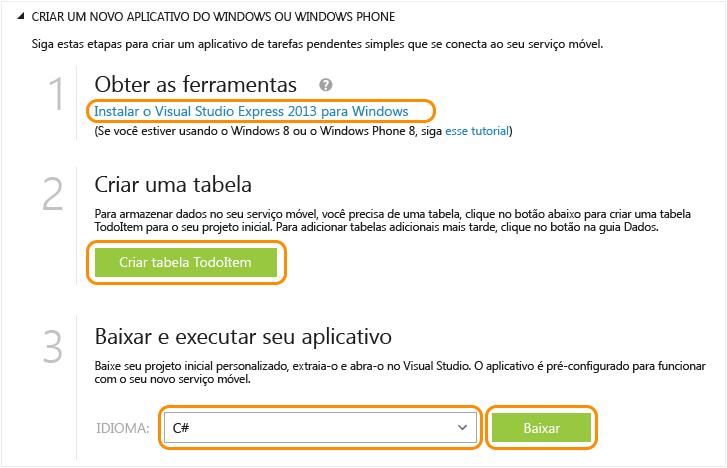

<properties
	pageTitle="Introdução aos Serviços Móveis para aplicativos da Windows Store | Centro de Desenvolvimento de Serviços Móveis"
	description="Siga este tutorial para começar a usar os serviços móveis do Azure para desenvolvimento da Windows Store em C# ou JavaScript."
	services="mobile-services"
	documentationCenter="windows"
	authors="ggailey777"
	manager="dwrede"
	editor=""/>

<tags
	ms.service="mobile-services"
	ms.workload="mobile"
	ms.tgt_pltfrm="mobile-windows"
	ms.devlang="dotnet"
	ms.topic="article" 
	ms.date="04/24/2015"
	ms.author="glenga"/>

# Introdução aos Serviços Móveis

[AZURE.INCLUDE [mobile-services-selector-get-started](../../includes/mobile-services-selector-get-started.md)]

Este tutorial mostra como adicionar um serviço de back-end baseado na nuvem a um aplicativo universal do Windows usando os Serviços Móveis do Azure. Soluções de aplicativos universais do Windows incluem projetos para a Windows Store 8.1 e a Loja do Windows Phone 8.1, e um projeto compartilhado comum. Para obter mais informações, consulte [Criar aplicativos universais do Windows voltados para Windows e Windows Phone](http://msdn.microsoft.com/library/windows/apps/xaml/dn609832.aspx).

Neste tutorial, você criará um novo serviço móvel e um aplicativo simples *To do list* que armazena dados do aplicativo no novo serviço móvel. O serviço móvel que você criará usa JavaScript para a lógica de negócios do lado do servidor. Para criar um serviço móvel que permita escrever sua lógica de negócios do lado do servidor nos idiomas com suporte de .NET usando o Visual Studio, consulte Versão de back-end do .NET deste tópico.

>[AZURE.NOTE]Este tópico mostra como criar um novo projeto de serviço móvel e o aplicativo universal do Windows usando o Portal de Gerenciamento do Azure. Usando o Visual Studio 2013, você também pode adicionar um novo projeto de serviço móvel a uma solução existente do Visual Studio. Para obter mais informações, consulte [Adicionar Serviços Móveis a um aplicativo existente](mobile-services-javascript-backend-windows-universal-dotnet-get-started-data.md).

>Para adicionar um serviço móvel a um projeto de aplicativo para Windows Phone 8.0 ou Windows Phone Store 8.1, consulte [Adicionar Serviços Móveis a um aplicativo do Windows Phone existente](mobile-services-windows-phone-get-started-data.md).

[AZURE.INCLUDE [mobile-services-windows-universal-get-started](../../includes/mobile-services-windows-universal-get-started.md)]

Para concluir este tutorial, você precisará do seguinte:

* Uma conta ativa do Azure. Se você não tem uma conta, você pode se inscrever para uma avaliação do Azure e obter até 10 serviços móveis gratuitos que você pode continuar usando mesmo depois do fim de sua avaliação. Para obter detalhes, consulte [Avaliação gratuita do Azure](http://azure.microsoft.com/pricing/free-trial/?WT.mc_id=A0E0E5C02&amp;returnurl=http%3A%2F%2Fazure.microsoft.com%2Fpt-br%2Fdocumentation%2Farticles%2Fmobile-services-javascript-backend-windows-store-javascript-get-started%2F).
* [Visual Studio 2013 Express para Windows]

## Criar um novo serviço móvel

[AZURE.INCLUDE [mobile-services-create-new-service](../../includes/mobile-services-create-new-service.md)]

## Criar um novo aplicativo universal do Windows

Depois de criar seu serviço móvel, você poderá seguir um fácil início rápido no Portal de Gerenciamento para criar um novo aplicativo universal do Windows ou modificar um projeto de aplicativo existente da Windows Store ou Windows Phone para se conectar ao seu serviço móvel.

Nesta seção, você criará um novo aplicativo universal do Windows conectado ao seu serviço móvel.

1.  No Portal de Gerenciamento, clique em **Serviços Móveis**e, em seguida, clique no serviço móvel que você acabou de criar.

2. Na guia de início rápido, clique em **Windows** em **Escolher plataforma** e expanda **Criar um novo aplicativo da Windows Store**.

   	Isso exibe as três etapas fáceis para criar um aplicativo da Windows Store conectado ao seu serviço móvel.

  	

3. Se ainda não o fez, baixe e instale [Visual Studio 2013 Express para Windows] em seu computador local ou máquina virtual.

4. Clique em **Criar tabela TodoItem** para criar uma tabela para armazenar os dados do aplicativo.

5. Em **Baixe e execute seu aplicativo**, selecione um idioma para seu aplicativo e clique em **Baixar**.

  	Isso baixa o projeto para o aplicativo de exemplo *To do list* que está conectado ao seu serviço móvel. Salve o arquivo do projeto compactado em seu computador local e anote onde ele foi salvo.

## Executar seu aplicativo do Windows

[AZURE.INCLUDE [mobile-services-javascript-backend-run-app](../../includes/mobile-services-javascript-backend-run-app.md)]

>[AZURE.NOTE]Você pode rever o código que acessa o serviço móvel para consultar e inserir dados, que está localizado no arquivo MainPage.xaml.cs.

## Próximas etapas
Agora que você concluiu o início rápido, aprenda a executar tarefas adicionais importantes nos Serviços Móveis:

* [Adicionar Serviços Móveis a um aplicativo existente][Get started with data]  Saiba mais sobre como armazenar e consultar dados usando os Serviços Móveis.

* [Introdução à sincronização de dados offline]  Saiba como usar a sincronização de dados offline para tornar o seu aplicativo responsivo e robusto.

* [Adicionar autenticação ao aplicativo de Serviços Móveis][Get started with authentication]  Saiba como autenticar usuários de seu aplicativo com um provedor de identidade.

* [Adicionar notificações por push ao seu aplicativo][Get started with push notifications]  Saiba como enviar uma notificação por push bem básica ao seu aplicativo.

Para obter mais informações sobre os aplicativos universais do Windows, consulte [Suporte a plataformas de múltiplos dispositivos por meio de um único serviço móvel](mobile-services-how-to-use-multiple-clients-single-service.md#shared-vs).

<!-- Anchors. -->
[Getting started with Mobile Services]: #getting-started
[Create a new mobile service]: #create-new-service
[Define the mobile service instance]: #define-mobile-service-instance
[Next Steps]: #next-steps

<!-- Images. -->

<!-- URLs. -->
[Get started with data]: mobile-services-javascript-backend-windows-universal-dotnet-get-started-data.md
[Get started with data]: ../mobile-services-windows-store-dotnet-get-started-data.md
[Introdução à sincronização de dados offline]: mobile-services-windows-store-dotnet-get-started-offline-data.md
[Get started with authentication]: ../mobile-services-windows-store-dotnet-get-started-users.md
[Get started with push notifications]: ../mobile-services-javascript-backend-windows-store-dotnet-get-started-push.md
[Visual Studio 2013 Express para Windows]: http://go.microsoft.com/fwlink/?LinkId=257546
[Mobile Services SDK]: http://go.microsoft.com/fwlink/?LinkId=257545
[Management Portal]: https://manage.windowsazure.com/
[Get started with data in Mobile Services using Visual Studio 2012]: ../mobile-services-windows-store-dotnet-get-started-data-vs2012.md
 

<!---HONumber=July15_HO2-->