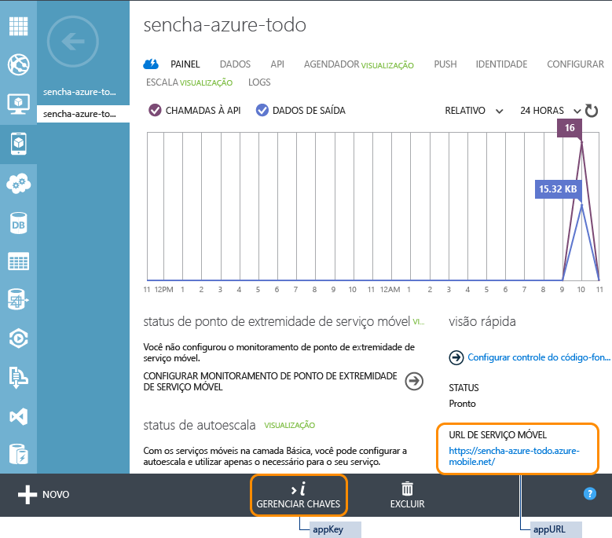

# Introdução aos Serviços Móveis e ao Sencha Touch
[!INCLUDE [mobile-service-note-mobile-apps](../../includes/mobile-services-note-mobile-apps.md)]

&nbsp;

[!INCLUDE [mobile-services-selector-get-started](../../includes/mobile-services-selector-get-started.md)]

&nbsp;

[!INCLUDE [mobile-services-hero-slug](../../includes/mobile-services-hero-slug.md)]

## Visão geral
Este tutorial mostra como usar os Serviços Móveis do Azure no aplicativo Sencha Touch. Você criará um aplicativo simples de *Lista de Tarefas Pendentes* usando o Sencha Touch, que usa um serviço móvel definido por meio do portal clássico do Azure. Este tutorial destina-se a desenvolvedores de aplicativos web intermediários a avançados que tenham um bom entendimento do JavaScript e que estejam familiarizados com a estrutura do Sencha Touch.

Se você preferir assistir a um vídeo, o clipe segue as mesmas etapas deste tutorial. No vídeo, Arthur Kay explica como criar um aplicativo do Sencha Touch usando um back-end dos Serviços Móveis do Azure.

> [!VIDEO https://channel9.msdn.com/Series/Windows-Azure-Mobile-Services/Getting-Started-with-Windows-Azure-for-Sencha-Touch/player]
> 
> 

Uma captura de tela do aplicativo completo é mostrada abaixo:

![][0]

## Requisitos
* Baixe e instale o [Sencha Touch](http://wwww.sencha.com/products/touch/download" target="_blank").
* Baixe e instale [Sencha Cmd Tool](http://www.sencha.com/products/sencha-cmd/download" target="_blank").
* Java Runtime Environment (JRE) ou Java Development Kit (se você estiver criando aplicativos para o Android)
* Gem Ruby e SASS.

## Criar um novo serviço móvel
[!INCLUDE [mobile-services-create-new-service](../../includes/mobile-services-create-new-service.md)]

## Criar uma tabela TodoItems
Após a criação do seu serviço móvel, será possível seguir as etapas de um início rápido e fácil no portal clássico do Azure para criar uma nova tabela do banco de dados para usar em seu serviço móvel.

1. No [portal clássico do Azure], clique em **Serviços Móveis** e clique no serviço móvel que você acabou de criar.
2. Na guia de início rápido, clique em **HTML** em **Escolher plataforma** e expanda **Criar um novo aplicativo HTML**.
   
    
   
    Isso exibirá as três etapas fáceis para a criação e a hospedagem de um aplicativo HTML conectado ao seu serviço móvel.
   
    
3. Clique em **Criar tabela TodoItems** para criar uma tabela para armazenar dados de aplicativo.
   
   > [!NOTE]
   > NÃO baixe o aplicativo HTML do portal clássico do Azure. Em vez disso, criaremos manualmente um aplicativo do Sencha Touch na seção abaixo.
   > 
   > 
4. Anote o **appKey** e o **appUrl** no portal clássico do Azure. Você irá usá-los em outras seções deste tutorial.
   
    
5. Na guia **Configurar**, verifique se `localhost` já está relacionado na lista **Permitir solicitações de nomes de host** em **Compartilhamento de Recursos entre Origens (CORS)**. Se ele não estiver, digite `localhost` no campo **Nome do host** e clique em **Salvar**.
   
    

## Gerar o seu aplicativo do Touch
Gerar um aplicativo de um modelo do Sencha Touch é uma tarefa simples que usa o Sencha Cmd e é uma ótima maneira de executar um aplicativo de forma muito rápida.

No diretório onde você instalou a estrutura do Touch, emita o seguinte comando:

    $ sencha generate app Basic /path/to/application

Isso gera um aplicativo do modelo do Touch com um nome de aplicativo 'Básico'. Para iniciar o aplicativo, basta apontar seu navegador para o diretório /path/to/application. A amostra do aplicativo do Touch padrão será exibido.

## Instalando as extensões do Sencha Touch para o Azure
A extensão para o Azure é instalada manualmente ou como um pacote do Sencha. O método utilizado depende totalmente de você.

### Instalação manual
Na maioria dos aplicativos do Touch, caso deseje adicionar uma biblioteca externa de classes, basta baixar o pacote, descompactá-lo no diretório do aplicativo e configurar o carregador do Touch com o local da biblioteca.

Você pode adicionar manualmente as extensões do Azure ao aplicativo, usando as seguintes etapas:

1. Baixe o pacote de extensões do Azure [aqui](https://market.sencha.com/extensions/sencha-extensions-for-microsoft-azure). (Você pode usar sua ID dos Fóruns do Sencha para acessar esta área).
2. Copie o pacote de extensões do Azure do diretório de download para o local em que você desejaria que ele resida e descompacte-o:
   
        $ cd /path/to/application
        $ mv /download-location/azure.zip .
        $ unzip azure.zip
   
    Isso cria um diretório **azure**, que contém todo o código-fonte, exemplos e documentação do pacote. O código-fonte residirá no diretório **azure/src**.

### Instalação como um pacote do Sencha
> [!NOTE]
> Você só pode usar este método quando seu aplicativo tiver sido gerado com o uso do comando <code>sencha generate app</code>.
> 
> 

Todos os aplicativos gerados pelo Sencha Cmd têm uma pasta de "pacotes" na raiz. O local dessa pasta pode ser configurado, mas independentemente de sua localização, a função da pasta "pacotes" é servir como o armazenamento de todos os pacotes usados pelo aplicativo (ou pelos aplicativos, caso tenha criado um Espaço de Trabalho do Sencha).

Como Ext.Azure é um "pacote" do Sencha Cmd, o código-fonte pode ser facilmente instalado e incluído em seu aplicativo usando o Sencha Cmd. (Consulte [Pacotes do Sencha Cmd](http://docs.sencha.com/cmd/6.x/cmd_packages/cmd_packages.html) para obter mais informações).

Para baixar e instalar o pacote de extensões do Azure do repositório de Pacotes do Sencha, você precisará adicionar o nome do pacote ao arquivo **app.json** e criar seu aplicativo:

1. Adicione o pacote do Azure à seção solicitada do arquivo app.json:
   
        {
            "name": "Basic",
            "requires": [
                "touch-azure"
            ]
        }
2. Recompile o seu aplicativo usando **sencha cmd** para buscar e instalar o pacote:
   
        $ sencha app build

O **sencha app build** e **sencha app refresh** realizarão agora as etapas necessárias para integrar o pacote ao seu aplicativo. Geralmente, depois de alterar os requisitos do pacote, você precisará executar **sencha app refresh**, para que os metadados necessários para suportar o "modo de desenvolvimento" sejam atualizados.

Qualquer que seja o comando executado, o Sencha Cmd será baixado e expandirá o pacote para a pasta "pacotes". Depois disso, você encontrará uma pasta "pacotes/touch-azure" em sua área de trabalho.

## Incluir e configurar o Azure
**Nome do arquivo**: app.js

Agora que a extensão do Azure foi baixada e instalada no diretório de aplicativos, a próxima etapa é saber onde localizar os arquivos de origem e solicitá-los:

1. Configure o carregador do Sencha com o local do código-fonte:
   
        Ext.Loader.setConfig({
               enabled : true,
               paths   : {
                   'Ext'       : 'touch/src',
                   'Ext.azure' : '/path-to/azure-for-touch/azure/src'
            }
        });
2. Solicite os arquivos de classe do Azure:
   
        Ext.application({
   
            requires: [ 'Ext.azure.Azure' ],
   
            // ...
   
        });
3. Configurando o Azure
   
    O pacote do Azure é inicializado ao chamar o método **Ext.Azure.init** na seção de inicialização do aplicativo. Este método transmite um objeto de configuração que contém credenciais de serviço móvel, bem como outras credenciais e recursos que deseja usar.
   
    Enquanto você pode transmite o objeto de configuração diretamente ao método de inicialização, sugerimos a criação de uma propriedade de configuração do aplicativo do Sencha chamada **azure** e a inclusão de todas as informações adequadas nesse local. Em seguida, você pode transmitir esse valor de propriedade para o método Ext.Azure.init.
   
    Ao criar um serviço móvel no Azure (consulte [Introdução ao Azure](http://senchaazuredocs.azurewebsites.net/#!/guide/getting_started)), uma chave do aplicativo e uma URL são atribuídas a esse serviço. Essas informações devem ser fornecidas ao pacote do Azure para que ele possa se conectar ao serviço.
   
    Este exemplo mostra uma configuração e inicialização muito simples do Azure, por meio do fornecimento de apenas a chave do aplicativo e URL:
   
        Ext.application({
            name: 'Basic',
   
            requires: [ 'Ext.azure.Azure' ],
   
            azure: {
                appKey: 'myazureservice-access-key',
                appUrl: 'myazure-service.azure-mobile.net'
            },
   
            launch: function() {
   
                // Call Azure initialization
   
                Ext.Azure.init(this.config.azure);
   
            }
        });
   
    Para obter mais informações sobre as opções de configuração do Azure, consulte a documentação da API do Ext.Azure.

Parabéns! Seu aplicativo agora deve obter o acesso ao serviço móvel.

## Compilar o aplicativo ToDo
Agora que configuramos seu aplicativo para incluir a extensão do Azure e fornecemos a ele suas credenciais de serviço móvel, podemos passar para a criação de um aplicativo do Touch, que utiliza o serviço móvel para exibir e editar os dados da lista ToDo armazenados no serviço.

### Configurar o proxy de dados do Azure
**Nome do arquivo**: app/model/TodoItem.js

Seu aplicativo do Touch se comunicará com o serviço móvel por meio de um proxy de dados. O proxy faz todo o trabalho de enviar solicitações e receber dados do serviço móvel. Utilizado em combinação com um modelo de dados e armazenamento do Touch, o trabalho pesado de processar dados remotos e colocá-los em seu aplicativo é removido e manipulado pelo próprio Touch.

Os modelos do Sencha Touch fornecem a definição dos registros de dados que você usará em seu aplicativo. Eles permitem não apenas definir os campos de dados, mas também fornecem a configuração sobre o proxy que manipulará a comunicação entre o aplicativo e o serviço móvel do Azure.

No código abaixo, é possível observar que definimos os campos (e seus tipos) para o modelo e também fornecemos uma configuração de proxy. Ao configurar seu proxy, você precisa dar a ele um tipo (nesse caso 'azure'), o nome da tabela do serviço móvel (ToDoItem) e outros parâmetros opcionais. Neste exemplo, passaremos para a paginação de proxy para que possamos avançar e voltar as páginas de forma perfeita por meio dos itens da lista.

O proxy do Azure definirá automaticamente todos os cabeçalhos HTTP com as operações CRUD adequadas esperadas pela API do Azure (incluindo as credenciais de autenticação, se aplicáveis).

    Ext.define('Basic.model.TodoItem', {
        extend : 'Ext.data.Model',

        requires : [
            'Ext.azure.Proxy'
        ],

        config : {
            idProperty : 'id',
            useCache   : false,

            fields     : [
                {
                    name : 'id',
                    type : 'int'
                },
                {
                    name : 'text',
                    type : 'string'
                },
                {
                    name : 'complete',
                    type : 'boolean'
                }
            ],

            proxy : {
                type               : 'azure',
                tableName          : 'TodoItem',
                enablePagingParams : true
            }
        }
    });

### Armazenar os seus itens ToDo
**Nome do arquivo**: app/store/TodoItems.js

Os armazenamentos do Sencha Touch são usados para armazenar conjuntos de registros de dados (modelos) que podem ser usados como fontes para os componentes do Touch para exibir os registros de diferentes maneiras. Isso pode incluir Grades, Gráficos, Listas e outros.

Aqui definimos uma loja que será usada para armazenar todos os seus itens da lista ToDo da loja que são recuperados do serviço móvel do Azure. Observe que a configuração da loja contém o nome do tipo de modelo (Basic.model.TodoItem - definido acima). Isso define a estrutura dos registros que estão contidos na loja.

Também temos algumas opções de configuração adicionais para a loja, como especificar o tamanho da página (8 registros) e que a classificação de registros para esta loja é feita remotamente pelo serviço móvel do Azure (nenhuma classificação é feita localmente na própria loja).

    Ext.define('Basic.store.TodoItems', {
        extend : 'Ext.data.Store',

        requires : [
            'Basic.model.TodoItem'
        ],

        config : {
            model        : 'Basic.model.TodoItem',
            pageSize     : 8,
            remoteSort   : true,
            remoteFilter : true
        }
    });

### Visualizar e editar os itens ToDo
**Nome do arquivo**: app/view/DataItem.js

Agora que definimos a estrutura de cada item ToDo e criamos uma loja para colocar todos os registros, devemos pensar em como desejamos exibir essas informações para o usuário do aplicativo. Podemos geralmente exibir as informações para o usuário por meio do uso de **Modos de Exibição**. Um modo de exibição pode ser um número de componentes do Touch, individualmente ou combinado com outros.

O modo de exibição abaixo é composto de um ListItem que define como cada registro será exibido juntamente com alguns botões que acomodarão ações para excluir cada um dos itens.

    Ext.define('Basic.view.DataItem', {
        extend : 'Ext.dataview.component.ListItem',
        xtype  : 'basic-dataitem',

        requires : [
            'Ext.Button',
            'Ext.layout.HBox',
            'Ext.field.Checkbox'
        ],

        config : {
            checkbox : {
                docked     : 'left',
                xtype      : 'checkboxfield',
                width      : 50,
                labelWidth : 0
            },

            text : {
                flex : 1
            },

            button : {
                docked   : 'right',
                xtype    : 'button',
                ui       : 'plain',
                iconMask : true,
                iconCls  : 'delete',
                style    : 'color: red;'
            },

            dataMap : {
                getText : {
                    setHtml : 'text'
                },

                getCheckbox : {
                    setChecked : 'complete'
                }
            },

            layout : {
                type : 'hbox',
                align: 'stretch'
            }
        },

        applyCheckbox : function(config) {
            return Ext.factory(config, Ext.field.Checkbox, this.getCheckbox());
        },

        updateCheckbox : function (cmp) {
            if (cmp) {
                this.add(cmp);
            }
        },

        applyButton : function(config) {
            return Ext.factory(config, Ext.Button, this.getButton());
        },

        updateButton : function (cmp) {
            if (cmp) {
                this.add(cmp);
            }
        }

    });

### Criar o modo de exibição primário
**Nome do arquivo**: app/view/Main.js

Agora que definimos o layout de um item individual da lista ToDo (acima), desejamos encapsular uma interface do usuário completa ao redor da lista que define a lista atual de itens, o título de um aplicativo e um botão para adicionar uma nova tarefa.

    Ext.define('Basic.view.Main', {
        extend : 'Ext.dataview.List',
        xtype  : 'main',

        requires : [
            'Ext.TitleBar',
            'Ext.dataview.List',
            'Ext.data.Store',
            'Ext.plugin.PullRefresh',
            'Ext.plugin.ListPaging',
            'Basic.view.DataItem'
        ],

        config : {
            store : 'TodoItems',

            useSimpleItems : false,
            defaultType    : 'basic-dataitem',

            plugins : [
                {
                    xclass          : 'Ext.plugin.PullRefresh',
                    pullRefreshText : 'Pull down to refresh!'
                },
                {
                    xclass     : 'Ext.plugin.ListPaging',
                    autoPaging : true
                }
            ],

            scrollable : {
                direction     : 'vertical',
                directionLock : true
            },

            items : [
                {
                    docked : 'top',
                    xtype  : 'titlebar',
                    title  : 'Azure Mobile - Basic Data Example'
                },
                {
                    xtype  : 'toolbar',
                    docked : 'bottom',
                    items  : [
                        {
                            xtype       : 'textfield',
                            placeHolder : 'Enter new task',
                            flex        : 1
                        },
                        {
                            xtype  : 'button',
                            action : 'add',
                            text   : 'Add'
                        }
                    ]
                }
            ]
        }
    });

### Fazer tudo funcionar junto
**Nome do arquivo**: app/controller/Main.js

A etapa final em nosso aplicativo é responder às pressões de botão (excluir, salvar etc.) e fornecer a lógica por trás de todas essas solicitações. O Sencha Touch utiliza controladores que escutam esses eventos e respondem de acordo.

    Ext.define('Basic.controller.Main', {
        extend : 'Ext.app.Controller',

        config : {
            refs : {
                todoField : 'main toolbar textfield',
                main      : 'main'
            },

            control : {
                'button[action=add]'    : {
                    tap : 'onAddItem'
                },
                'button[action=reload]' : {
                    tap : 'onReload'
                },

                main : {
                    activate      : 'loadInitialData',
                    itemdoubletap : 'onItemEdit'
                },

                'basic-dataitem checkboxfield' : {
                    change : 'onItemCompleteTap'
                },

                'basic-dataitem button' : {
                    tap : 'onItemDeleteTap'
                }
            }
        },

        loadInitialData : function () {
            Ext.getStore('TodoItems').load();
        },

        onItemDeleteTap : function (button, e, eOpts) {
            var store    = Ext.getStore('TodoItems'),
                dataItem = button.up('dataitem'),
                rec      = dataItem.getRecord();

            rec.erase({
                success: function (rec, operation) {
                    store.remove(rec);
                },
                failure: function (rec, operation) {
                    Ext.Msg.alert(
                        'Error',
                        Ext.util.Format.format('There was an error deleting this task.      Status Code: {0} Status Text: {1}',
                        operation.error.status,
                        operation.error.statusText)
                    );
                }
            });
        },

        onItemCompleteTap : function (checkbox, newVal, oldVal, eOpts) {
            var dataItem = checkbox.up('dataitem'),
                rec      = dataItem.getRecord(),
                recVal   = rec.get('complete');

            // this check is needed to prevent an issue where multiple creates get triggered from one create
            if (newVal !== recVal) {
                rec.set('complete', newVal);
                rec.save({
                    success: function (rec, operation) {
                        rec.commit();
                    },
                    failure: function (rec, operation) {
                        // since there was a failure doing the update on the server then silently reject the change
                        rec.reject(true);
                        Ext.Msg.alert(
                            'Error',
                            Ext.util.Format.format('There was an error updating this task.  Status Code: {0} Status Text: {1}',
                            operation.error.status,
                            operation.error.statusText)
                        );
                    }
                });
            }
        },

        onItemEdit : function (list, index, target, record, e, eOpts) {
            var rec = list.getSelection()[0];

            Ext.Msg.prompt('Edit', 'Rename task',
                function (buttonId, value) {
                    if (buttonId === 'ok') {
                        rec.set('text', value);
                        rec.save({
                            success: function (rec, operation) {
                                rec.commit();
                            },
                            failure: function (rec, operation) {
                                // since there was a failure doing the update on the server then reject the change
                                rec.reject();
                                Ext.Msg.alert(
                                    'Error',
                                    Ext.util.Format.format('There was an error updating this task.  Status Code: {0} Status Text: {1}',
                                    operation.error.status,
                                    operation.error.statusText)
                                );
                            }
                        });
                    }
                },
                null,
                false,
                record.get('text')
            );
        },

        onReload : function () {
            Ext.getStore('TodoItems').load();
        },

        onAddItem : function () {
            var me = this,
                rec,
                store = Ext.getStore('TodoItems'),
                field = me.getTodoField(),
                value = field.getValue();

            if (value === '') {
                Ext.Msg.alert('Error', 'Please enter Task name', Ext.emptyFn);
            }
            else {
                rec = Ext.create('Basic.model.TodoItem', {
                    complete : false,
                    text     : value
                });
                //store.insert(0, rec); //insert at the top
                //store.sync();
                rec.save({
                    success: function (rec, operation) {
                        store.insert(0, rec); //insert at the top
                        field.setValue('');
                    },
                    failure: function (rec, operation) {
                        Ext.Msg.alert(
                            'Error',
                            Ext.util.Format.format('There was an error creating this task.  Status Code: {0} Status Text: {1}',
                            operation.error.status,
                            operation.error.statusText)
                        );
                    }
                });
            }
        }
    });

### Colocar tudo isso junto
**Nome do arquivo**: app.js

A etapa final é concluir a edição do arquivo principal do aplicativo e fornecer informações sobre os modelos, lojas, modos de exibição e controladores que foram definidos. Os arquivos de origem para esses recursos são automaticamente carregados no aplicativo. Por fim, o método de inicialização é chamado, que cria e exibe o modo de exibição primário do aplicativo 'Basic.main.View'.

    Ext.Loader.setConfig({
        enabled : true,
        paths   : {
            'Ext'       : 'touch/src',
            'Ext.azure' : 'packages/azure/src'
        }
    });

    Ext.application({
        name : 'Basic',

        requires : [
            'Ext.MessageBox',
            'Ext.azure.Azure'
        ],

        views : [
            'Main'
        ],

        controllers : [
            'Main'
        ],

        stores : [
            'TodoItems'
        ],

        azure : {
            appUrl : 'YOUR_APP_URL.azure-mobile.net',
            appKey : 'YOUR_APP_KEY'
        },

        icon : {
            '57'  : 'resources/icons/Icon.png',
            '72'  : 'resources/icons/Icon~ipad.png',
            '114' : 'resources/icons/Icon@2x.png',
            '144' : 'resources/icons/Icon~ipad@2x.png'
        },

        isIconPrecomposed : true,

        startupImage : {
            '320x460'   : 'resources/startup/320x460.jpg',
            '640x920'   : 'resources/startup/640x920.png',
            '768x1004'  : 'resources/startup/768x1004.png',
            '748x1024'  : 'resources/startup/748x1024.png',
            '1536x2008' : 'resources/startup/1536x2008.png',
            '1496x2048' : 'resources/startup/1496x2048.png'
        },

        launch : function () {
            // Destroy the #appLoadingIndicator element
            Ext.fly('appLoadingIndicator').destroy();

            // Initialize Azure
            Ext.Azure.init(this.config.azure);

            // Initialize the main view
            Ext.Viewport.add(Ext.create('Basic.view.Main'));
        },

        onUpdated : function () {
            Ext.Msg.confirm(
                "Application Update",
                "This application has just successfully been updated to the latest version. Reload now?",
                function (buttonId) {
                    if (buttonId === 'yes') {
                        window.location.reload();
                    }
                }
            );
           }
    });

### Hospedar e executar o aplicativo do Sencha Touch
O estágio final deste tutorial consiste em hospedar e executar seu novo aplicativo no computador local.

1. No terminal, vá até o local do aplicativo descompactado.
2. Usando o Sencha Cmd, execute os comandos a seguir:
   
   * *sencha app refresh* : isso instruirá o Sencha Cmd a localizar todas as dependências do aplicativo e baixar os pacotes necessários (por exemplo, [Extensões do Sencha Touch para o Azure](https://market.sencha.com/extensions/sencha-extensions-for-microsoft-azure)).
   * *sencha web start*: Isso iniciará um servidor web local para testar o aplicativo.
   
   
3. Abra a URL listada no seu terminal em um navegador da Web para iniciar o aplicativo (por ex., http://localhost:1841).
4. No aplicativo, digite um texto significativo, como “Concluir o tutorial” e clique em **Adicionar**.
   
   
   
   Isso envia uma solicitação de POST para o novo serviço móvel hospedado no Azure. Os dados da solicitação são inseridos na tabela TodoItem.
5. No [portal clássico do Azure], clique na guia **Dados** e na tabela TodoItems.
   
   
   
   Isso permite que você procure os dados inseridos pelo aplicativo na tabela.
   
   

## Próximas etapas
Agora que você concluiu o Guia de Introdução, saiba como realizar tarefas adicionais importantes nos Serviços Móveis com o Sencha.

[Baixe](https://github.com/arthurakay/sencha-touch-azure-example) uma amostra do aplicativo completo com estilos e recursos adicionais para ver o que mais o Sencha Touch pode fazer!

Em seguida, obtenha mais informações sobre as Extensões do Sencha Touch para o Azure:

* Exemplo do aplicativo [walkthrough](http://docs.sencha.com/touch-azure/1.0.0/#!/guide/data_filters)
* Obtenha ajuda nos [Fóruns do Sencha](http://www.sencha.com/forum)
* Leia a [Documentação do Sencha](http://docs.sencha.com/)
* Usando o Sencha com os Serviços Móveis do Azure: [(Vídeo)](http://channel9.msdn.com/Shows/Cloud+Cover/Episode-126-Using-Sencha-With-Windows-Azure-Mobile-Services)

## Recursos adicionais
* [Baixe o Sencha Touch](http://pages.sencha.com/touch-for-azure.html)
* [Extensões do Sencha Touch para o Azure](https://market.sencha.com/extensions/sencha-extensions-for-microsoft-azure)

## Resumo
O exemplo descrito aqui é fornecido na Extensão do Sencha Touch para o pacote do Azure e está localizado no diretório de exemplos, como o exemplo de Dados Básicos. Existem alguns outros exemplos que são fornecidos, que demonstraram outras funcionalidades desta extensão juntamente com explicações e comentários detalhados.

Para obter mais informações sobre como começar a usar o Sencha Touch, acesse o conjunto completo de [guias](http://docs.sencha.com/touch/#!/guide)

[!INCLUDE [app-service-disqus-feedback-slug](../../includes/app-service-disqus-feedback-slug.md)]

<!-- images -->
[0]: ./media/partner-sencha-mobile-services-get-started/finished-app.png

[portal clássico do Azure]: https://manage.windowsazure.com/

<!---HONumber=AcomDC_0727_2016-->