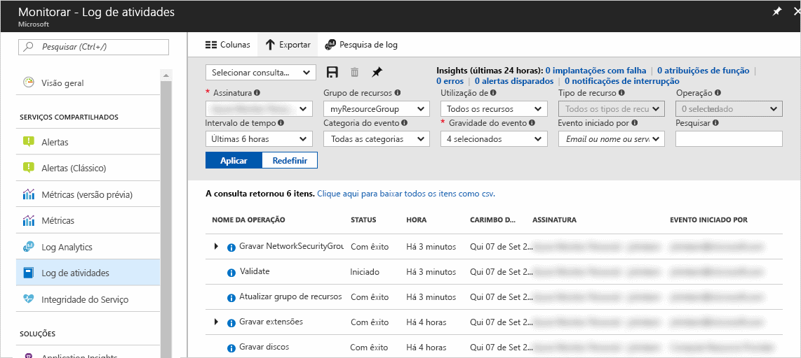
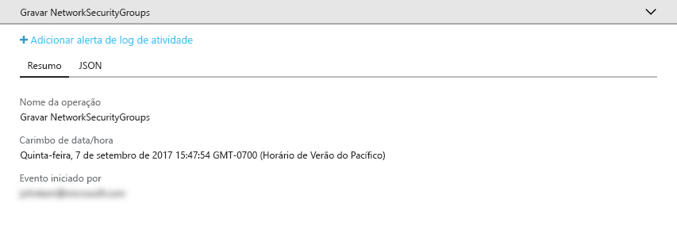
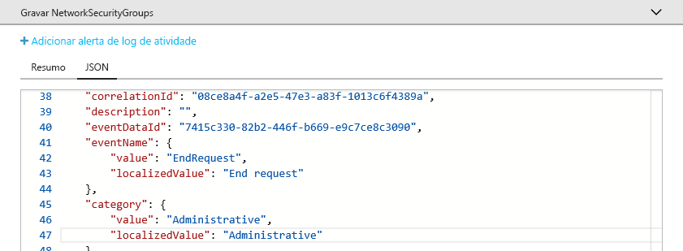
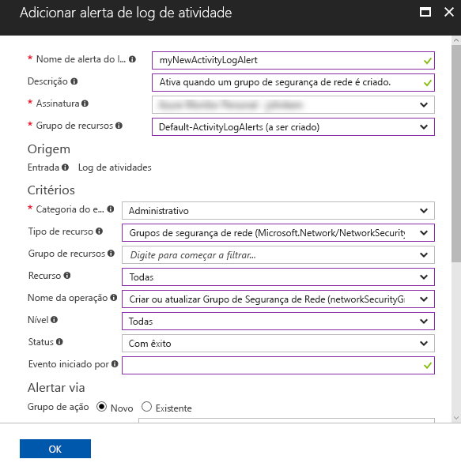
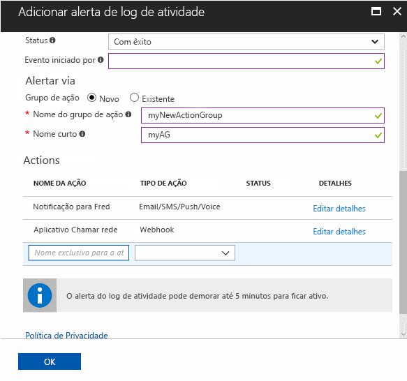

# Auditar e receber notificações sobre ações importantes em sua assinatura do Azure

O **Log de Atividades do Azure** fornece um histórico de eventos no nível da assinatura no Azure. Ele oferece informações sobre *quem* criou, atualizou ou excluiu *quais* recursos e *quando* fizeram isso. Crie um **alerta do Log de Atividades** para receber notificações por email, SMS ou webhook quando ocorrer uma atividade que corresponde às condições de alerta. Este Guia de início rápido executa em etapas a criação de um grupo de segurança de rede simples, a navegação pelo Log de Atividades para entender o evento ocorrido e, em seguida, a criação de um alerta do Log de Atividades para ser notificado de quando um grupo de segurança de rede é criado e assim por diante.

Se você não tiver uma assinatura do Azure, crie uma conta [gratuita](https://azure.microsoft.com/free/) antes de começar.

## Faça logon no Portal do Azure

Faça logon no [Portal do Azure](https://portal.azure.com/).

## Criar um grupo de segurança de rede

1. Clique no botão **Novo** no canto superior esquerdo do Portal do Azure.

2. Selecione **Rede** e **Grupo de segurança de rede**.

3. Insira “myNetworkSG” como o **Nome** e crie um novo grupo de recursos chamado **myResourceGroup**. Selecione o botão **Criar** .

    

## Navegar pelo Log de Atividades no portal

Um evento agora foi adicionado ao Log de Atividades, que descreve a criação do grupo de segurança de rede. Use as instruções a seguir para identificar o evento.

1. Clique no botão **Monitorar** encontrado na lista de navegação à esquerda. Ele é aberto primeiro na seção Log de Atividades. Essa seção contém um histórico de todas as ações que os usuários executaram em recursos de sua assinatura, que podem ser filtrados por várias propriedades, como **Grupo de Recursos**, **Intervalo de Tempo** e **Categoria**.

2. Na seção **Log de Atividades**, clique na lista suspensa **Grupo de Recursos** e selecione **myResourceGroup**. Altere a lista suspensa **Intervalo de Tempo** para **Última 1 hora**. Clique em **Aplicar**.

    

3. Clique no evento **Gravar NetworkSecurityGroups** na tabela de eventos mostrados.

## Procurar um evento no Log de Atividades

A seção exibida contém detalhes básicos da operação executada, incluindo o nome, o carimbo de data/hora e o usuário ou o aplicativo que a executou.

Clique na guia **JSON** para exibir os detalhes completos do evento. Isso inclui os detalhes de como o usuário ou o aplicativo foi autorizado a executar a operação, a categoria e o nível do evento e o status da operação.

## Criar um alerta do Log de Atividades

1. Clique na guia **Resumo** para retornar ao resumo do evento.

2. Na seção de resumo exibida, clique em **Adicionar alerta do log de atividades**.

    

3. Na seção exibida, dê ao alerta do Log de Atividades um nome e uma descrição.

4. Em **Critérios**, verifique se **Categoria de evento** está definido como **Administrativo**, **Tipo de recurso** está definido como **Grupos de segurança rede**, **Nome da operação** está definido como **Criar ou Atualizar Grupo de Segurança de Rede**, **Status** está definido como **Êxito** e todos os outros campos de critérios estão em branco ou definidos como **Todos**. Os critérios definem as regras usadas para determinar se o alerta deve ser ativado quando um novo evento é exibido no Log de Atividades.

    

5. Em **Alerta**, selecione **Novo** grupo de ação e forneça um **nome** e um **nome curto** para o grupo de ação. O grupo de ação define o conjunto de ações executadas quando o alerta é ativado (quando os critérios correspondem a um novo evento).

6. Em **Ações**, adicione uma ou mais ações fornecendo um **Nome** para a ação, o **Tipo de ação** (por exemplo, email ou SMS), e os **Detalhes** desse tipo de ação específica (por exemplo, uma URL de webhook, um endereço de email ou um número de SMS).

    

7. Clique em **OK** para salvar o alerta do Log de Atividades.

## Testar o alerta do Log de Atividades

> [!NOTE]
> Leva aproximadamente 10 minutos para que um alerta do Log de Atividades fique totalmente habilitado. Novos eventos que ocorrem antes que o alerta do Log de Atividades esteja totalmente habilitado não geram notificações.
>
>

Para testar o alerta, repita a seção anterior para **Criar um grupo de segurança de rede**, mas dê outro nome a esse grupo de segurança de rede e reutilize o grupo de recursos existente. Em alguns minutos, você receberá uma notificação informando que o grupo de segurança de rede foi criado.

## Limpar recursos

Quando não for mais necessário, exclua o grupo de recursos e o grupo de segurança de rede. Para fazer isso, digite o nome do grupo de recursos criado na caixa de pesquisa na parte superior do portal e clique no nome do grupo de recursos. Na seção exibida, clique no botão **Excluir grupo de recursos**, digite o nome do grupo de recursos e clique em **Excluir**.

## Próximas etapas

Neste guia de início rápido, você executou uma operação para gerar um evento do Log de Atividades e, depois, criou um alerta do Log de Atividades para ser notificado quando essa operação ocorrer novamente no futuro. Em seguida, você testou o alerta executando a operação novamente. O Azure disponibiliza os eventos do Log de Atividades dos últimos 90 dias. Caso você precise reter eventos com mais de 90 dias, tente arquivar os dados do Log de Atividades juntamente com os outros dados de monitoramento.

> [!div class="nextstepaction"]
> [Arquivar dados de monitoramento](./monitor-tutorial-archive-monitoring-data.md)
