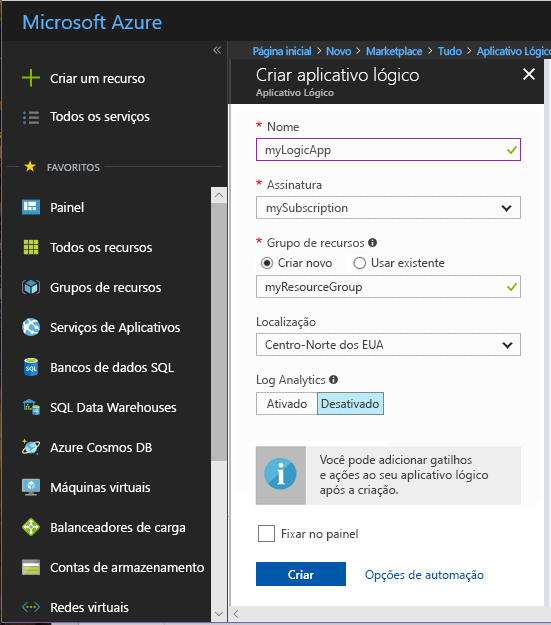
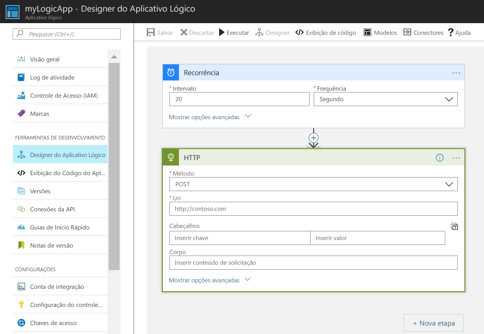
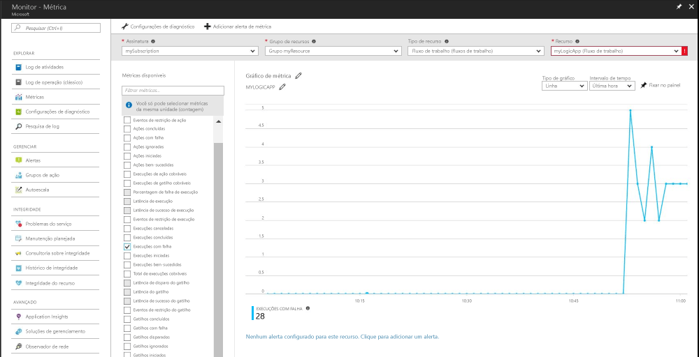
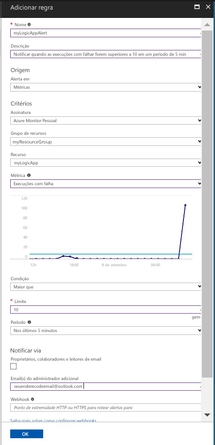

# Receber uma notificação quando um valor de métrica atender a uma condição

O Azure Monitor disponibiliza métricas para muitos recursos do Azure. Essas métricas transmitem o desempenho e a integridade desses recursos. Em muitos casos, os valores de métrica podem apontar para algo errado com um recurso. Você pode criar alertas de métrica para monitorar o comportamento anormal e ser notificado quando isso ocorrer. Este Guia de início rápido executa em etapas a criação de um Aplicativo Lógico, a criação de um trabalho e a visualização das métricas do aplicativo lógico. Em seguida, ele explica como criar um alerta e receber uma notificação de uma métrica para o recurso Aplicativo Lógico.

Para obter mais informações sobre métricas e alertas de métrica, consulte [Visão geral das métricas do Azure Monitor](./monitoring-overview-metrics.md) e [Visão geral dos alertas do Azure Monitor](./monitoring-overview-alerts.md). 

Se você não tiver uma assinatura do Azure, crie uma conta [gratuita](https://azure.microsoft.com/free/) antes de começar.

## Entrar no Portal do Azure

Entre no [portal do Azure](https://portal.azure.com/).

## Criar um aplicativo lógico

1. Clique no botão **Criar um recurso** encontrado na parte superior esquerda do portal do Azure.

2. Pesquise e selecione **Aplicativo Lógico**. Selecione o botão **Criar** .

3. Insira as informações do aplicativo lógico mostradas na imagem a seguir.  Use o local padrão. Marque a opção **Fixar no Painel**.  Ao concluir, clique em **Criar**. 

      

4. O aplicativo lógico deve estar fixado no painel. Navegue para o aplicativo lógico clicando nele.

5. No painel Aplicativo Lógico, selecione **Designer de Aplicativo Lógico**

       

6. Configure os valores, conforme visto no diagrama a seguir.

    . 

7. No designer, selecione o gatilho **Recorrência**.

8. Defina um intervalo de 20 e uma frequência de segundos para garantir que o aplicativo lógico é disparado a cada 20 segundos.

9. Clique no botão **Nova Etapa** e, em seguida, selecione **Adicionar uma ação**.

10. Escolha a opção **HTTP** e selecione **HTTP-HTTP**.

11. Defina o **Método** como POST e o **Uri** como um endereço web de sua escolha.

12. Clique em **Salvar**.

13. Pode levar até 5 minutos para o aplicativo lógico executar ações para ocorrer.  

## Exibir as métricas do aplicativo lógico

1. Clique na opção **Monitorar** no painel de navegação à esquerda.

2. Selecione a guia **Métricas** e preencha as informações de **Assinatura**, **Grupo de Recursos**, **Tipo de Recurso** e **Recurso** do aplicativo lógico.

3. Na lista de métricas, escolha **Execuções Iniciadas**.

4. Modifique o **Intervalo de tempo** do gráfico para exibir dados da hora anterior.

5. Agora você deverá ver um gráfico plotando o número total de execuções que o aplicativo lógico iniciou durante a última hora. Se você não vir nenhuma, verifique se aguardou pelo menos 5 minutos após a etapa anterior. Em seguida, atualize seu navegador. 

    

## Criar um alerta de métrica para o aplicativo lógico

1.  Na parte superior direita do painel de métricas, clique no botão **Adicionar alerta de métrica**.

2. Nomeie o alerta de métrica “myLogicAppAlert” e forneça uma breve descrição para o alerta.

3. Defina a **Condição** do alerta de métrica como “Maior que”, defina o **Limite** como “10” e defina o **Período** como “Nos últimos 5 minutos”.

4. Por fim, em **Email(s) do administrador adicionais**, insira seu endereço de email. Esse alerta garante que você receberá um email no caso de o aplicativo lógico ter mais de 10 execuções com falha em um período de 5 minutos.

    

## Receber notificações de alerta de métrica para o aplicativo lógico
1. Em alguns momentos, você deverá receber um email dos “Alertas do Microsoft Azure” para informar que o alerta foi “ativado”.

2. Navegue de volta para o aplicativo lógico e modifique o gatilho de recorrência para um intervalo igual a 1 e a frequência de hora.

3. Em alguns minutos, você deverá receber um email dos “Alertas do Microsoft Azure” informando que o alerta foi “resolvido”.

## Limpar recursos

Outros guias de início rápido desta coleção se baseiam neste guia de início rápido. Se você pretende continuar trabalhando com guias de início rápido posteriores ou com os tutoriais, não limpe os recursos criados neste guia de início rápido. Caso contrário, siga estas etapas para excluir todos os recursos criados por esse início rápido no Portal do Azure.

1. No menu à esquerda no portal do Azure, clique em **Monitorar**.

2. Selecione a guia **Alertas**, localize o alerta criado neste guia de início rápido e clique nele.

3. No painel de alertas de métrica, clique em **Excluir**.

4. No menu à esquerda no portal do Azure, pesquise **Aplicativo Lógico** e, em seguida, clique em **Aplicativos lógicos**.

5. No painel, clique no aplicativo lógico criado neste guia de início rápido na caixa de texto e, em seguida, clique em **Excluir**.

## Próximas etapas

Neste guia de início rápido, você aprendeu a criar um alerta de métrica para os recursos. Para obter mais informações sobre alertas de métrica, clique em nossa visão geral sobre alertas.

> [!div class="nextstepaction"]
> [Alertas de ação de assinatura do Azure Monitor](./monitor-quick-audit-notify-action-in-subscription.md )
