# Introdução ao Azure Monitor
O Azure Monitor é o serviço de plataforma que fornece uma única fonte para monitorar os recursos do Azure. Com o Azure Monitor, você pode visualizar, consultar, rotear, arquivar e tomar medidas relacionadas às métricas e aos logs provenientes dos recursos do Azure. Você pode trabalhar com esses dados usando a folha do portal do Monitor, [Cmdlets do PowerShell do Monitor](insights-powershell-samples.md), [CLI de plataforma cruzada](insights-cli-samples.md) ou [APIs REST do Azure Monitor](https://msdn.microsoft.com/library/dn931943.aspx). Neste artigo, veremos alguns dos principais componentes do Azure Monitor usando o portal para demonstração.

## Passo a passo
1. No portal, navegue até **Mais serviços** e localize a opção **Monitor**. Clique no ícone de estrela para adicionar essa opção à lista de favoritos para que fique sempre facilmente acessível na barra de navegação à esquerda.

    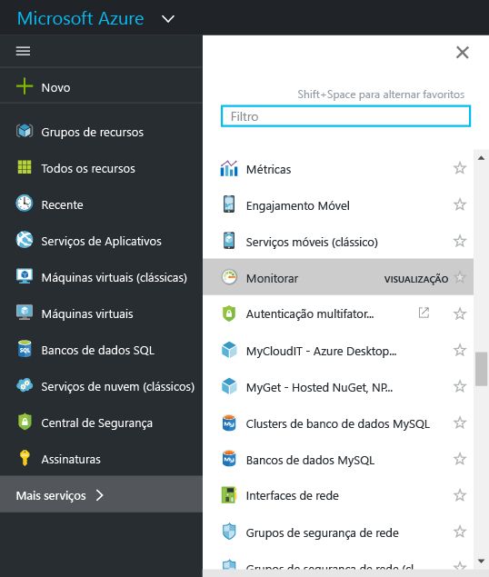
2. Clique na opção **Monitor** para abrir a folha **Monitor**. Esta folha reúne todas as suas configurações e dados de monitoramento em uma exibição consolidada. Ela abre primeiro na seção **Log de atividades** .

    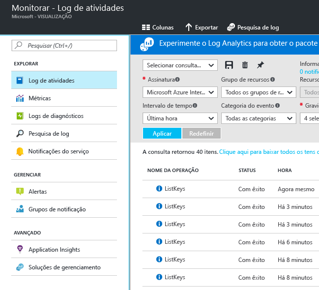

    O Azure Monitor tem três categorias básicas de monitoramento: **log de atividades**, **métricas** e **logs de diagnóstico**.
3. Clique em **Log de atividades** para garantir que a seção do log de atividades seja exibida.

    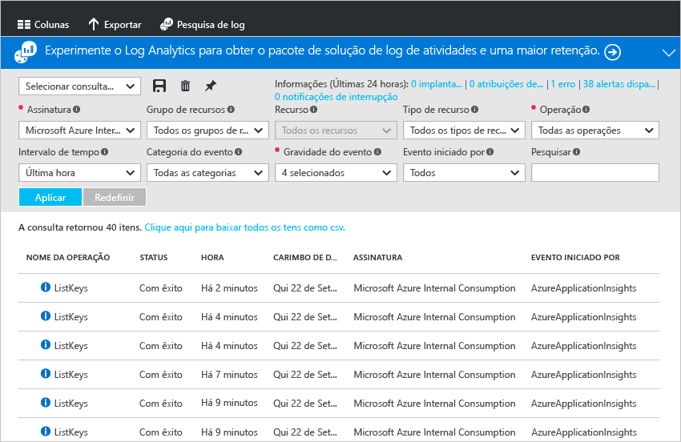

    O [**log de atividades**](monitoring-overview-activity-logs.md)descreve todas as operações executadas nos recursos em sua assinatura. Usando o Log de Atividades, você pode determinar 'o que, quem e quando' para quaisquer operações de criação, atualização ou exclusão nos recursos em sua assinatura. Por exemplo, o Log de Atividades informa quando um aplicativo Web foi interrompido e quem o interrompeu. Os eventos do Log de Atividades são armazenados na plataforma e ficam disponíveis para consulta por 90 dias.

    Você pode criar e salvar consultas para os filtros comuns e fixar as consultas mais importantes em um painel do portal para que sempre saiba se ocorreram eventos que atendem aos seus critérios.
4. Filtre a exibição para um determinado grupo de recursos na última semana, então, clique no botão **Salvar** .

    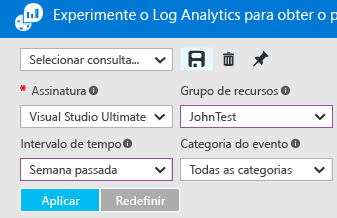
5. Agora, clique no **Fixar** .

    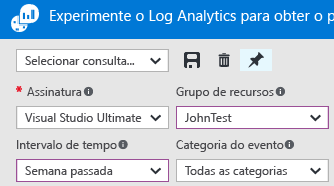

    A maioria das exibições neste passo a passo pode ser fixada em um painel. Isso ajuda a criar uma única fonte de informações para os dados operacionais em seus serviços.
6. Volte para o painel. Agora, você pode ver que a consulta (e o número de resultados) é exibida no painel. Isso é útil se você deseja ver rapidamente as ações importantes que ocorreram recentemente em sua assinatura, por exemplo, uma nova função foi atribuída ou uma VM foi excluída.

    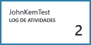
7. Volte para o bloco **Monitor** e clique na seção **Métricas**. Primeiro, você precisa selecionar um recurso filtrando e selecionando com as opções da lista suspensa na parte superior da folha.

    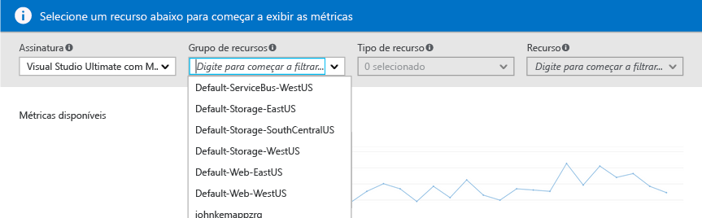

    Todos os recursos do Azure emitem [**métricas**](monitoring-overview-metrics.md). Essa exibição reúne todas as métricas em um único painel para que você possa compreender facilmente como os recursos estão sendo executados. Além disso, confira nossa [nova experiência de criação de gráficos de métricas](https://aka.ms/azuremonitor/new-metrics-charts) clicando na guia **Métricas (versão prévia)**.
8. Depois de selecionar um recurso, todas as métricas disponíveis aparecerão no lado esquerdo da folha. Você pode representar graficamente várias métricas de uma vez selecionando as métricas e modificando o tipo de gráfico e o intervalo de tempo. Também pode exibir todos os alertas de métrica definidos nesse recurso.

    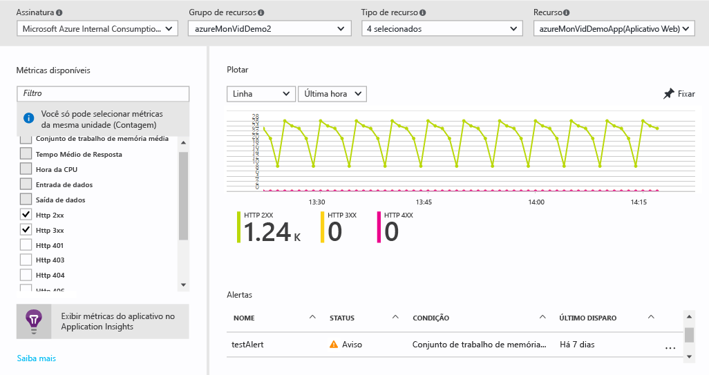

   > [!NOTE]
   > Algumas métricas só estão disponíveis habilitando o [Application Insights](../application-insights/app-insights-overview.md) e/ou o Windows ou o Linus Azure Diagnostics em seu recurso.
   >
   >
9. Quando você estiver satisfeito com seu gráfico, poderá usar o botão **Fixar** para fixar em seu painel.
10. Volte para a folha **Monitor** e clique em **Logs de diagnóstico**.

    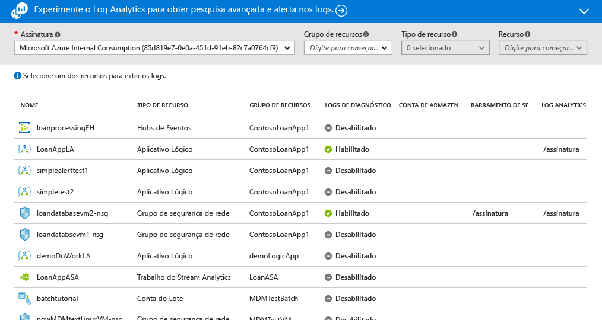

    Os [**logs de diagnóstico**](monitoring-overview-of-diagnostic-logs.md) são logs emitidos *por* um recurso, fornecendo dados sobre a operação desse determinado recurso. Por exemplo, os Contadores de Regras do Grupo de Segurança da Rede e os Logs do Fluxo de Trabalho do Aplicativo Lógico são dois tipos de logs de diagnóstico. Esses logs podem ser armazenados em uma conta de armazenamento, transmitidos para um Hub de eventos e/ou enviados para [Log Analytics](../log-analytics/log-analytics-overview.md). O Log Analytics é um produto de inteligência operacional da Microsoft para pesquisa avançada e alertas.

    No portal, você pode exibir e filtrar uma lista de todos os recursos em sua assinatura para identificar se eles tiverem os logs de diagnóstico habilitados.
11. Clique em um recurso na folha dos logs de diagnóstico. Se os logs de diagnóstico estiverem sendo armazenados em uma conta de armazenamento, você verá uma lista dos registros por hora que podem ser baixados diretamente.

    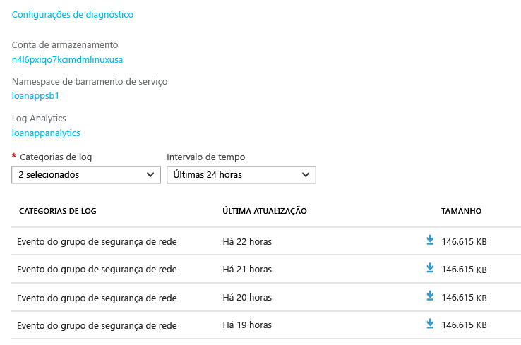

    Você também pode clicar em **Configurações de diagnóstico**, que permite configurar ou modificar as configurações do arquivamento em uma conta de armazenamento, transmitir os Hubs de Eventos ou enviar para um espaço de trabalho do Log Analytics.

    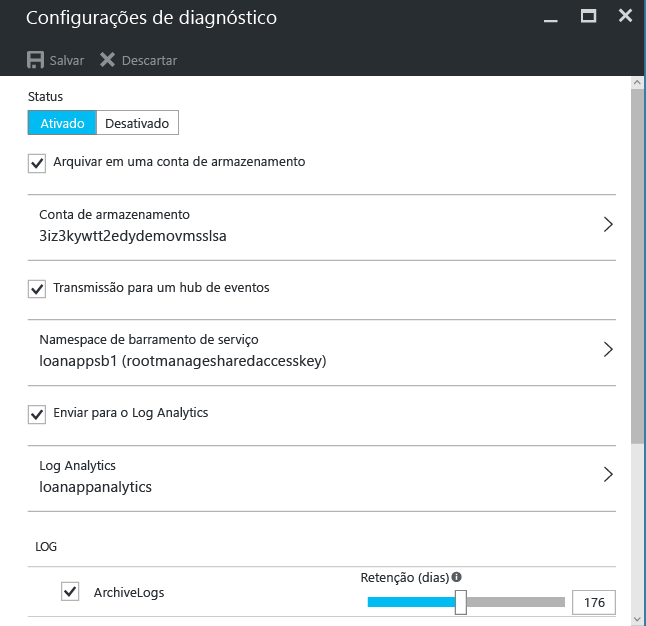

    Se você configurou os logs de diagnóstico para o Log Analytics, poderá pesquisá-los na seção **Pesquisar Log** do portal.
12. Navegue até a seção **Alertas** da folha Monitor.

    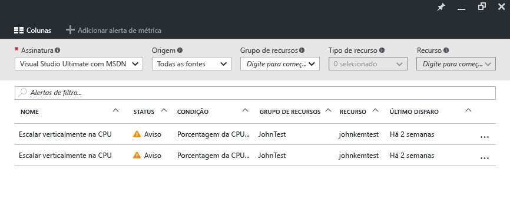

    Aqui, você pode gerenciar todos os [**alertas**](monitoring-overview-alerts.md) nos recursos do Azure. Isso inclui alertas sobre as métricas, eventos do log de atividades, testes da Web do Application Insights (Locais) e diagnóstico proativo do Application Insights. Os alertas podem disparar um envio de email ou um HTTP POST para uma URL de webhook.
13. Clique em **Adicionar alerta da métrica** para criar um alerta.

    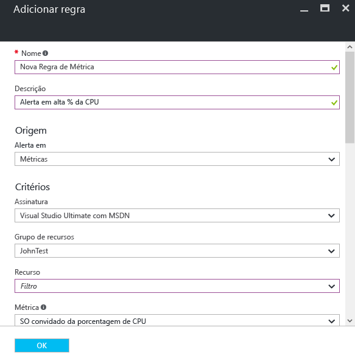

    Em seguida, você pode fixar um alerta no painel para ver facilmente seu estado a qualquer momento.

    O Azure Monitor também tem [**alertas de métrica quase em tempo real**](https://aka.ms/azuremonitor/near-real-time-alerts) (versão prévia) que podem ser avaliados em uma frequência que chega a um minuto!
    
14. A seção Monitor também inclui links para os aplicativos [Application Insights](../application-insights/app-insights-overview.md) e as soluções de gerenciamento do [Log Analytics](../log-analytics/log-analytics-overview.md). Esses outros produtos da Microsoft têm uma profunda integração com o Azure Monitor.
15. Se você não estiver usando o Application Insights nem o Log Analytics, as chances são de que o Azure Monitor tem uma parceria com o monitoramento, log e alerta de produtos atuais. Consulte nossa [página de parceiros](monitoring-partners.md) para ver uma lista completa e ter instruções sobre como integrar.

Seguindo essas etapas e fixando todos os blocos relevantes em um painel, você pode criar exibições detalhadas de seus aplicativos e da infraestrutura assim:

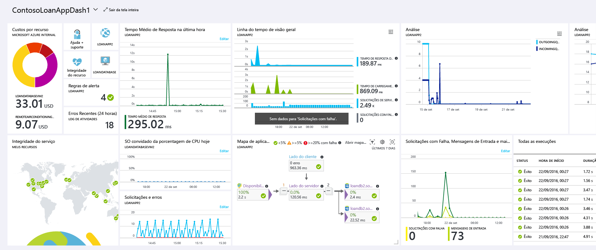

## Próximas etapas
* Leia a [Visão Geral do Azure Monitor](monitoring-overview.md)
