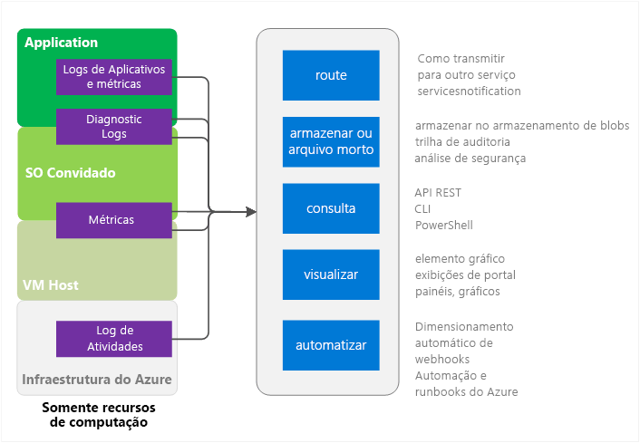
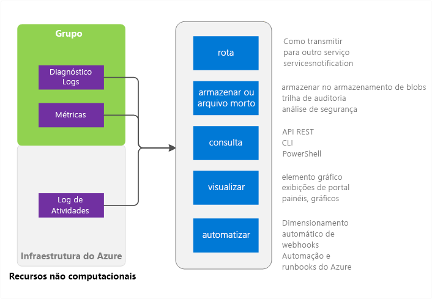

# Visão geral do Azure Monitor
Este artigo fornece uma visão geral do Serviço do Azure Monitor no Microsoft Azure. Ele aborda o que o Azure Monitor faz e fornece ponteiros para informações adicionais sobre como usar o Azure Monitor.  Se preferir uma introdução em vídeo, consulte os links em Próximas etapas no final deste artigo. 

## Por que monitorar seu aplicativo ou sistema
Os aplicativos em nuvem são complexos com muitas partes móveis. O monitoramento fornece dados para garantir que seu aplicativo permaneça ativo e em execução em um estado íntegro. Ele também ajuda a afastar os problemas potenciais ou solucionar problemas antigos. Além disso, você pode usar os dados de monitoramento para obter mais informações sobre seu aplicativo. Esse conhecimento pode ajudá-lo a melhorar o desempenho ou a capacidade de manutenção do aplicativo ou automatizar ações que normalmente exigiriam intervenção manual.

## Azure Monitor e outros produtos de monitoramento da Microsoft
O Azure Monitor fornece logs e métricas de infraestrutura de nível básico para a maioria dos serviços do Microsoft Azure. Serviços do Azure que ainda não colocam seus dados no Azure Monitor o farão no futuro. 

A Microsoft fornece produtos e serviços adicionais que oferecem mais recursos de monitoramento para desenvolvedores, DevOps ou operações de TI que também têm instalações locais. Para ter uma compreensão e visão geral de como esses diferentes produtos e serviços funcionam juntos, consulte [Monitoramento no Microsoft Azure](monitoring-overview.md).

## Fontes de monitoramento – Computação

Os serviços de Computação incluem 
- Serviços de Nuvem 
- Máquinas Virtuais 
- Conjuntos de escala de Máquina Virtual 
- Service Fabric

### Aplicativo - Logs de Diagnóstico, Logs de Aplicativo e Métrica
Os aplicativos podem ser executados sobre o SO convidado no modelo de computação. Eles emitem seu próprio conjunto de métricas e logs. O Azure Monitor se baseia na extensão de diagnóstico do Azure (Windows ou Linux) para coletar a maioria dos logs e métricas de nível do aplicativo. Os tipos incluem

* Contadores de desempenho
* Logs de aplicativo
* Logs de Eventos do Windows
* Fonte de evento do .NET
* Logs IIS
* Manifesto com base no ETW
* Despejos de Falha
* Logs de Erro do Cliente

Sem a extensão de diagnóstico, somente algumas métricas, como o uso da CPU, estão disponíveis. 

### Métricas de VM host e convidada
Os recursos de computação listados anteriormente têm uma VM host dedicada e SO convidado com que interagem. A VM host e o SO convidado são equivalentes à VM raiz e à VM convidada no modelo de hipervisor Hyper-V. Você pode coletar métricas sobre ambos. Você também pode coletar logs de diagnóstico sobre o SO convidado.   

### Log de Atividade
Você pode pesquisar o Log de atividade (anteriormente chamado de Logs de auditoria ou operacionais) para obter informações sobre o recurso como visto pela infraestrutura do Azure. O log contém informações como os horários quando os recursos são criados ou destruídos.  Para obter mais informações, consulte [Visão geral do log de atividades](monitoring-overview-activity-logs.md). 

## Fontes de monitoramento – todo o restante

### Recursos - Métricas e Logs de Diagnóstico
As métricas e logs de diagnóstico que podem ser coletados variam com base no tipo de recurso. Por exemplo, os Aplicativos Web fornecem estatísticas sobre E/S de disco e Porcentagem da CPU. Essas métricas não existem para uma fila do Barramento de Serviço, que, em vez disso, fornece métricas como tamanho da fila e taxa de transferência de mensagem. Uma lista de métricas que podem ser coletadas para cada recurso está disponível em [métricas com suporte](monitoring-supported-metrics.md). 

### Métricas de VM host e convidada
Não há necessariamente um mapeamento individual entre o recurso e uma determinada VM host ou convidada, portanto, as métricas não estão disponíveis.

### Log de Atividade
O log de atividades é igual ao dos recursos de computação.  

## Usos dos Dados de Monitoramento
Depois de coletar os dados, você pode fazer o seguinte com eles no Azure Monitor

### Rota
Você pode transmitir os dados de monitoramento para outros locais em tempo real.

Os exemplos incluem:

- Enviar para o Application Insights para que você possa usar ferramentas mais avançadas de visualização e análise.
- Enviar para os Hubs de Eventos para que você possa rotear para ferramentas de terceiros. 

### Armazenar e arquivar
Alguns dados de monitoramento já ficam armazenados e disponíveis no Azure Monitor por um período determinado. 
- As métricas são armazenadas por 30 dias. 
- As entradas do log de atividades são armazenadas por 90 dias. 
- Logs de diagnóstico não são armazenados. 

Se quiser armazenar dados por mais tempo que os períodos listados acima, você poderá usar um armazenamento do Azure. Os dados de monitoramento são mantidos em sua conta de armazenamento com base em uma política de retenção que você definir. Você precisa pagar pelo espaço os dados ocupam no armazenamento do Azure. 

Algumas formas de usar esses dados:

- Uma vez gravados, você pode ter outras ferramentas dentro ou fora do Azure para lê-los e processá-los.
- Você baixa os dados localmente para um arquivo local ou altera a política de retenção na nuvem para manter os dados por longos períodos de tempo.  
- Deixe os dados no armazenamento do Azure indefinidamente para fins de arquivamento. 

### Consultar
Você pode usar a API REST do Azure Monitor, comandos de CLI (interface de linha de comando) entre plataformas, cmdlets do PowerShell ou o SDK do .NET para acessar os dados no sistema ou no armazenamento do Azure

Alguns exemplos incluem: 

* Obtendo dados para um aplicativo de monitoramento personalizado escrito por você
* Criando consultas personalizadas e enviando esses dados para um aplicativo de terceiros.

### Visualizar
Visualizar os dados de monitoramento em gráficos ajuda a localizar tendências mais rapidamente do que examinar os dados em si.  

Alguns métodos de visualização incluem:

* Use o Portal do Azure
* Rotear os dados para Application Insights do Azure
* Rotear os dados para o Microsoft PowerBI
* Rotear os dados para uma ferramenta de visualização de terceiros usando a transmissão ao vivo ou com a ferramenta de leitura de um arquivo no armazenamento do Azure

### Automatizar
Você pode usar os dados de monitoramento para disparar alertas ou até processos inteiros. Os exemplos incluem:

* Use os dados para dimensionar automaticamente as instâncias de computação com base na carga do aplicativo.
* Envie emails quando uma métrica passar de um limite predeterminado.
* Chame uma URL da Web (webhook) para executar uma ação em um sistema fora do Azure
* Inicie um runbook na automação do Azure para executar quaisquer tarefas

## Métodos para acessar o Azure Monitor
Em geral, você pode manipular o controle, roteamento e recuperação dos dados usando um dos métodos a seguir. Nem todos os métodos estão disponíveis para todas as ações ou tipos de dados.

* [Portal do Azure](https://portal.azure.com)
* [PowerShell](insights-powershell-samples.md)  
* [CLI (Interface de linha de comando) de plataforma cruzada](insights-cli-samples.md)
* [API REST](https://docs.microsoft.com/rest/api/monitor/)
* [SDK .NET](https://msdn.microsoft.com/library/dn802153.aspx)

## Próximas etapas
Saiba mais sobre
- Um passo a passo em vídeo do Azure Monitor está disponível em  
[Introdução ao Azure Monitor](https://channel9.msdn.com/Blogs/Azure-Monitoring/Get-Started-with-Azure-Monitor). Um vídeo adicional explicando um cenário no qual você pode usar o Azure Monitor está disponível em [Explore o monitoramento e diagnósticos no Microsoft Azure](https://channel9.msdn.com/events/Ignite/2016/BRK2234) e [Azure Monitor em um vídeo do Ignite 2016](https://myignite.microsoft.com/videos/4977)
- Percorra a interface do Azure Monitor na [Introdução ao Azure Monitor](monitoring-get-started.md)
- Configure as [Extensões de Diagnóstico do Azure](../azure-diagnostics.md) se você estiver tentando diagnosticar problemas em seu Serviço de Nuvem, Máquina Virtual, conjunto de dimensionamento de máquinas virtuais ou aplicativo do Service Fabric.
- [Application Insights](https://azure.microsoft.com/documentation/services/application-insights/) se você tiver problemas de diagnóstico em seu aplicativo Web do Serviço de Aplicativo.
- [Solucionar de problemas no Armazenamento do Azure](../storage/storage-e2e-troubleshooting.md) ao usar os Blobs, Tabelas ou Filas de Armazenamento
- [Log Analytics](https://azure.microsoft.com/documentation/services/log-analytics/) e [Operations Management Suite](https://www.microsoft.com/oms/)

