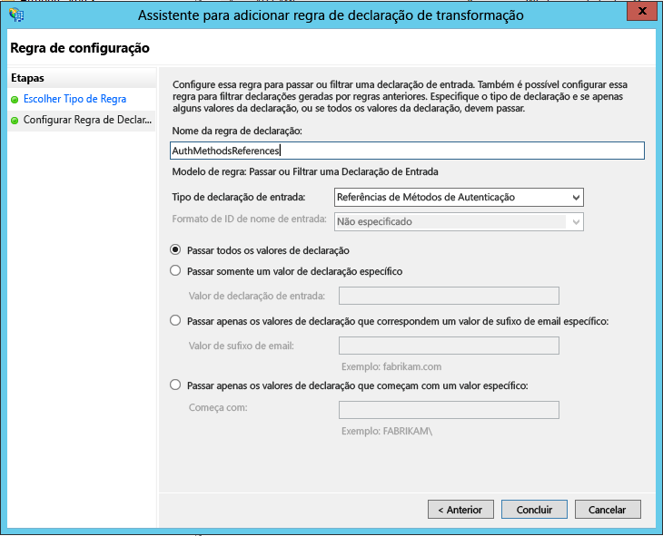

# Protegendo os recursos de nuvem usando a Autenticação Multifator do Azure e o AD FS
Se sua organização for federada com o Azure Active Directory, use a Autenticação Multifator do Azure ou os Serviços de Federação do Active Directory (AD FS) para proteger os recursos que são acessados pelo Azure AD. Use os procedimentos a seguir para proteger os recursos do Azure Active Directory com Autenticação Multifator do Azure ou os Serviços de Federação do Active Directory.

## Proteger recursos do Azure AD usando o AD FS
Para proteger seus recursos de nuvem, configure uma regra de declaração para que os Serviços de Federação do Active Directory emitem a declaração multipleauthn quando um usuário executa a verificação em duas etapas com êxito. Essa declaração é passada para o Azure AD. Siga este procedimento para percorrer as etapas:

1. Abra o gerenciamento do AD FS.
2. À esquerda, selecione **Relações de Confiança com Terceira Parte Confiável**.
3. Clique com o botão direito do mouse na **Plataforma de Identidade do Microsoft Office 365** e selecione **Editar Regras de Declaração**.

   

4. Em Regras de Transformação de Emissão, clique em **Adicionar Regra**.

   

5. No Assistente Adicionar Regra de Declaração de Transformação, selecione **Passar ou filtrar uma Declaração de Entrada** na lista e clique em **Avançar**.

   

6. Dê um nome para a regra. 
7. Selecione **Referências de Métodos de Autenticação** como o tipo de declaração Entrada.
8. Selecione **Passar todos os valores de declaração**.
    
9. Clique em **Concluir**. Feche o Console de gerenciamento do AD FS.

## IPs confiáveis para usuários federados
IPs confiáveis permitem aos administradores ignorar a verificação em duas etapas para endereços IP específicos ou para usuários federados que têm as solicitações originadas em seu próprios intranet. As seções a seguir descrevem como configurar IPs confiáveis da Autenticação Multifator do Azure com usuários federados e desviar a verificação em duas etapas quando uma solicitação se originar de dentro de uma intranet de usuários federados. Isso é conseguido por meio da configuração do AD FS para usar uma passagem ou filtrar um modelo de declaração de entrada com o tipo de declaração Dentro da rede corporativa.

Este exemplo usa o Office 365 para a relação de confiança com terceira parte confiável.

### Configurar as regras de declarações do AD FS
A primeira coisa que precisamos fazer é configurar as declarações do AD FS. Criamos duas regras declarações: uma para o tipo de declaração Dentro da rede corporativa e um adicional para manter nossos usuários conectados.

1. Abra o gerenciamento do AD FS.
2. À esquerda, selecione **Relações de Confiança com Terceira Parte Confiável**.
3. Clique com o botão direito do mouse na **Plataforma de Identidade Microsoft Office 365** e selecione **Editar Regras de Declaração...**
   
4. Em Regras de Transformação de Emissão, clique em **Adicionar Regra**
   
5. No Assistente Adicionar Regra de Declaração de Transformação, selecione **Passar ou filtrar uma Declaração de Entrada** na lista e clique em **Avançar**.
   
6. Na caixa ao lado do nome da regra de declaração, nomeie a regra. Por exemplo: InsideCorpNet.
7. Na lista suspensa, ao lado do tipo de declaração de entrada, selecione **Dentro da rede corporativa**.
   
8. Clique em **Concluir**.
9. Em Regras de Transformação de Emissão, clique em **Adicionar Regra**.
10. No Assistente Adicionar Regra de Declaração de Transformação, selecione **Enviar Declarações Usando uma Regra Personalizada** da lista suspensa e clique em **Avançar**.
11. Na caixa abaixo do nome da regra de declaração: insira *Manter Usuários Conectados*.
12. Na caixa de regra Personalizada, digite:

        c:[Type == "http://schemas.microsoft.com/2014/03/psso"]
            => issue(claim = c);
    
13. Clique em **Concluir**.
14. Clique em **Aplicar**.
15. Clique em **OK**.
16. Feche o gerenciamento do AD FS.

### Configurar IPs confiáveis da Autenticação Multifator do Azure com usuários federados
Agora que as declarações estão prontas, podemos configurar IPs confiáveis.

1. Entre no [portal clássico do Azure](https://manage.windowsazure.com).
2. À esquerda, clique em **Active Directory**.
3. Em Diretório, selecione o diretório onde você deseja configurar IPs confiáveis.
4. No Diretório que você selecionou, clique em **Configurar**.
5. Na seção autenticação multifator, clique em **Gerenciar configurações de serviço**.
6. Na página Configurações de Serviço, em IPs confiáveis, selecione **Ignorar autenticação multifator para solicitações de usuários federados na minha intranet**.  

   
   
7. Clique em **Salvar**.
8. Depois que as atualizações forem aplicadas, clique em **fechar**.

É isso! Neste ponto, os usuários federados do Office 365 devem somente ter que usar MFA quando uma declaração for originada fora da intranet corporativa.
