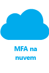
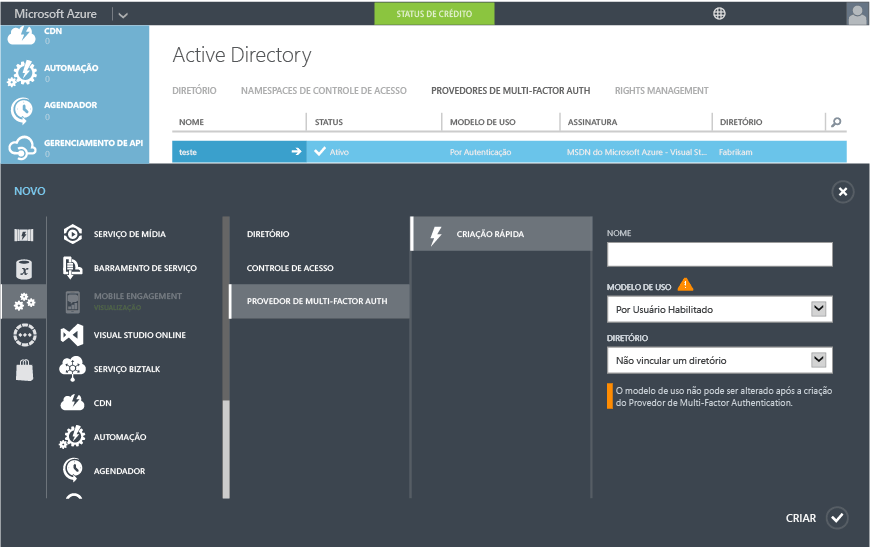
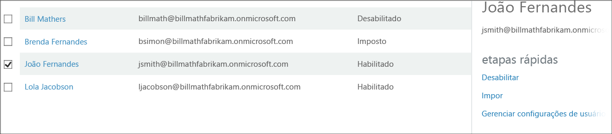

<properties 
	pageTitle="Introdução ao Servidor Azure Multi-Factor Authentication na nuvem" 
	description="Esta é a página do Azure Multi-Factor Authentication que descreve como começar a usar o Azure MFA na nuvem." 
	services="multi-factor-authentication" 
	documentationCenter="" 
	authors="billmath" 
	manager="stevenpo" 
	editor="curtand"/>

<tags 
	ms.service="multi-factor-authentication" 
	ms.workload="identity" 
	ms.tgt_pltfrm="na" 
	ms.devlang="na" 
	ms.topic="get-started-article" 
	ms.date="04/06/2016" 
	ms.author="billmath"/>

# Introdução ao Servidor Azure Multi-Factor Authentication na nuvem

Agora que definimos que estamos usando a autenticação multifator na nuvem, vamos começar! Começar a usar o Servidor Azure Multi-Factor Authentication está a apenas alguns cliques. Observe que, se estiver usando o Multi-Factor Authentication para Office 365 ou Multi-Factor Authentication para Administradores do Azure, você poderá pular para a etapa 3.

1. [Fazer uma assinatura do Azure](https://azure.microsoft.com/pricing/free-trial/)
	- Se você ainda não tiver uma assinatura do Azure, será necessário fazer uma. Se você estiver apenas começando a usar o Azure MFA, use uma assinatura de avaliação.
2. [Criar um Provedor do Multi-Factor Auth](#creating-an-azure-multi-factor-auth-provider) ou [atribuir licenças a usuários](#assigning-an-azure-ad-premium-or-enterprise-mobility-license-to-users)
	- Em seguida, será necessário fazer o seguinte: Crie um Provedor do Azure Multi-Factor Auth e o atribua a seu diretório ou atribua licenças a seus usuários. As licenças estão disponíveis para os usuários que tenham o Azure MFA, o Azure AD Premium ou o EMS. O Azure Multi-Factor Authentication está incluído no Azure Active Directory Premium. Também está incluído no Enterprise Mobility Suite. Se você possui licenças suficientes, não precisa criar um provedor de autenticação. 
3. [Ativar o Multi-Factor Authentication para seus usuários](#turn-on-multi-factor-authentication-for-users)
	- Habilite o Azure MFA para seus usuários por meio do Office 365 ou portal do Azure. 
4. [Enviar um email aos usuários finais para notificá-los sobre o MFA](#send-email-to-end-users)
	- Depois que um usuário tiver ativado a autenticação multifator para a conta, é recomendável enviar a ele um email notificando-o sobre isso. O usuário será solicitado a concluir o processo na próxima vez que se conectar, de modo que o email permita que ele saiba o que esperar. 

## Criando um Provedor do Azure Multi-Factor Auth
A autenticação multifator está disponível por padrão para administradores globais que tenham usuários do Azure Active Directory e do Office 365. No entanto, se desejar aproveitar os recursos avançados, você deverá adquirir a versão completa do Azure MFA.

Um Provedor do Azure Multi-Factor Auth é usado para aproveitar as vantagens dos recursos fornecidos pela versão completa do Azure MFA. Ele é para usuários que não tenham licenças por meio do Azure MFA, do Azure AD Premium ou do EMS. O Azure MFA, o Azure AD Premium e o EMS incluem a versão completa do Azure MFA por padrão. Se você tiver licenças, não precisará de um Provedor do Azure Multi-Factor Auth. As etapas a seguir mostram como criar um Provedor do Azure Multi-Factor Auth.

### Para criar um Provedor do Multi-Factor Auth
--------------------------------------------------------------------------------

1. Faça logon no portal do Azure como um Administrador.
2. À esquerda, selecione Active Directory.
3. Na parte superior da página Active Directory, selecione Provedores do Multi-Factor Authentication. Na parte inferior, clique em **Novo**.
4. Em Serviços de Aplicativos, selecione Provedores de Autenticação Multifator e selecione Criação Rápida.
5. Preencha os campos a seguir e clique em Criar.
	1. Nome – o nome do Provedor de Autenticação Multifator.
	2. Modelo de uso: o modelo de uso do Provedor do Multi-Factor Authentication.
		- Por Autenticação: modelo de compra que cobra por autenticação. Normalmente usado para cenários que usam o Azure Multi-Factor Authentication em um aplicativo voltado para o consumidor.
		- Por Usuário Habilitado: o modelo de compra que cobra por usuário habilitado. Normalmente usado para acesso de funcionários a aplicativos como o Office 365.
	2. Diretório: o locatário do Active Directory do Azure ao qual o Provedor do Multi-Factor Authentication está associado. Esteja ciente do seguinte:
		- Não é necessário um diretório do AD do Azure para criar um Provedor do Multi-Factor Auth. Caso planeje usar somente o SDK ou o Servidor Azure Multi-Factor Authentication, basta deixar a caixa desmarcada.
		- O Provedor do Multi-Factor Auth precisa estar associado a um diretório do Azure AD para aproveitar os recursos avançados.
		- O Azure AD Connect, o AAD Sync ou o DirSync são apenas um requisito se você estiver sincronizando o ambiente do Active Directory local com um diretório do AD do Azure. Se você usar apenas um diretório do AD do Azure que não esteja sincronizado, a sincronização não será necessária.
		

5. Depois de clicar em Criar, o Provedor do Multi-Factor Authentication será criado e você verá uma mensagem que informa: Provedor do Multi-Factor Authentication criado com êxito. Clique em OK.

	 
## Atribuindo uma licença do Azure MFA, do Azure AD Premium ou do Enterprise Mobility aos usuários

Se você tiver comprado licenças do Azure MFA, do Azure AD Premium ou do Enterprise Mobility Suite, não precisará criar um provedor Multi-Factor Auth. Você precisa simplesmente atribuir as licenças para seus usuários e então poderá começar a ativá-las para o MFA.

### Para atribuir uma licença do Azure MFA, do Azure AD Premium ou do Enterprise Mobility Suite
--------------------------------------------------------------------------------

1. Entre no Portal do Azure como Administrador.
2. Selecione **Active Directory** à esquerda.
3. Na página do Active Directory, clique duas vezes no diretório que tenha os usuários que você deseja habilitar.
4. Na parte superior da página do diretório, selecione **Licenças**.
5. Na página de licenças, selecione Azure Multi-Factor Authentication, Active Directory Premium ou Enterprise Mobility Suite e clique em Atribuir. 
6. Na caixa de diálogo, selecione os usuários ou os grupos para os quais você deseja atribuir licenças e clique no ícone de marca de seleção para salvar as alterações.

## Ativar o Multi-Factor Authentication para os usuários

As contas de usuário no Azure Multi-Factor Authentication apresentam os três estados distintos a seguir:

Estado | Descrição |Aplicativos que não usam navegador afetados| Observações 
:-------------: | :-------------: |:-------------: |:-------------: |
Desabilitado | O estado padrão para um novo usuário não inscrito no Multi-Factor Authentication.|Não|O usuário não está usando a autenticação multifator.
Habilitado |O usuário foi inscrito no Multi-Factor Authentication.|Não. Eles continuarão a trabalhar até o processo ser concluído.|O usuário está habilitado, mas não concluiu o processo de registro. Eles serão solicitados a concluir o processo na próxima vez que se conectarem.
Imposto|O usuário foi inscrito e concluiu o processo de registro para usar o Multi-Factor Authentication.|Sim. Os aplicativos exigem senhas de aplicativo. | O usuário pode ou não ter concluído o registro. Se tiver concluído o processo de registro, significa que ele está usando a autenticação multifator. Caso contrário, o usuário será solicitado a concluir o processo na próxima vez que se conectar

Use o procedimento a seguir para habilitar o MFA para os usuários.

### Para ativar o Multi-Factor Authentication
--------------------------------------------------------------------------------
1.  Entre no Portal do Azure como Administrador.
2.  À esquerda, clique no Active Directory.
3.  Em Diretório, clique no diretório do usuário que deseja habilitar.
4.  Na parte superior, clique em Usuários.
5.  Na parte inferior da página, clique em Gerenciar Multi-Factor Auth.
6.  Localize o usuário que deseja habilitar para o Multi-Factor Authentication. Talvez seja necessário alterar o modo de exibição na parte superior. Verifique se o status é desabilitado e marque a caixa ao lado de seu nome.
7.  À direita, clique em Habilitar. Clique em Habilitar o Multi-Factor Auth.
8.  Após habilitar seus usuários, recomendamos a notificação por email. Ele também deve informá-los de como eles podem usar seus aplicativos sem navegador para evitar o bloqueio.

Para alterar o estado usando o Windows PowerShell, você pode usar o que se segue. É possível alterar `$st.State` para ser igual a um dos estados mencionados.

		$st = New-Object -TypeName Microsoft.Online.Administration.StrongAuthenticationRequirement
		$st.RelyingParty = "*"
		$st.State = “Enabled”
		$sta = @($st)
		Set-MsolUser -UserPrincipalName bsimon@contoso.com -StrongAuthenticationRequirements $sta

## Enviar email aos usuários finais

Depois de habilitar seus usuários, envie um email informando que eles precisam fornecer suas informações de contato. A seguir, um modelo de email que pode ser usado. Ele inclui um link para um vídeo que os usuários podem assistir.

		Subject: ACTION REQUIRED: Your password for Outlook and other apps needs updated

		Body:

		For added security, we have enabled multi-factor authentication for your account. 

		Action Required: You will need to complete the enrollment steps below to make your account secure with multi-factor authentication.  

		What to expect once MFA is enabled:

		Multi-factor authentication requires a password that you know and a phone that you have in order to sign into browser applications and to access Office 365, Azure portals.

		For Office 365 non-browser applications such as outlook, lync, a mail client on your mobile device etc, a special password called an app password is required instead of your account password to sign in. App passwords are different than your account password, and are generated during the multi-factor authentication set up process. 

		Please follow these enrollment steps to avoid interruption of your Office 365 service:

			1.  Sign in to the Office 365 Portal at http://portal.microsoftonline.com.
			2.  Follow the instructions to set up your preferred multi-factor authentication method when signing into Office 365 using a web browser. 
			3.  Create one app password for each device.
			4.  Enter the same app password in all applicable apps on that device e.g. Outlook, Mail client, Lync, Word, Powerpoint, Excel, CRM etc. 
			5.  Update your Office client applications or other mobile applications to use an app password.

		You can visit http://aka.ms/mfasetup to create app passwords or change your MFA Setting.  Please bookmark this.

		NOTE: Before entering an app password, you will need to clear the sign-in information (delete sign-in info), restart the application, and sign in with the username and app password. Follow the steps documented: http://technet.microsoft.com/library/dn270518.aspx#apppassword.

		Watch a video showing these steps at http://g.microsoftonline.com/1AX00en/175.

		Best Regards,
		Your Administrator

## Próximas etapas
Agora que você tem de configurar a autenticação multifator na nuvem, poderá configurar e instalar sua implantação. Veja [Configuração do Azure Multi-Factor Authentication.](multi-factor-authentication-whats-next.md)

<!---HONumber=AcomDC_0413_2016-->