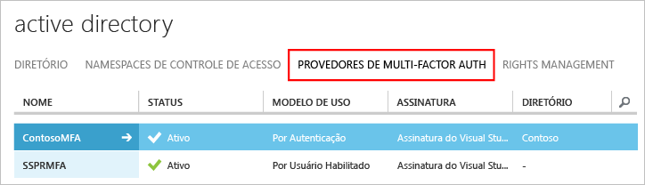

# Introdução ao Servidor Azure Multi-Factor Authentication

Agora que determinamos que o Servidor de Autenticação Multifator local será utilizado, vamos continuar. Esta página aborda uma nova instalação do servidor e sua configuração com o Active Directory local. Se você já tiver o servidor MFA instalado e quiser atualizar, consulte [Atualizar para o servidor de Autenticação Multifator do Azure mais recente](multi-factor-authentication-server-upgrade.md). Se você estiver procurando informações sobre como instalar apenas o serviço Web, confira [Implantar o serviço Web de aplicativo móvel do Servidor de Autenticação Multifator](multi-factor-authentication-get-started-server-webservice.md).
 

## Baixar o Servidor Azure Multi-Factor Authentication
Há duas maneiras diferentes de baixar o Servidor Azure Multi-Factor Authentication. Ambas são feitas por meio do portal do Azure. A primeira é por meio do gerenciamento do Provedor de Autenticação Multifator diretamente. A segunda é através de configurações de serviço. A segunda opção exige um Provedor de Autenticação Multifator ou uma licença do Azure MFA, do Azure AD Premium ou do Enterprise Mobility Suite.

> [!Important]
> Essas duas opções parecem semelhantes, mas é importante saber qual delas usar. Se os usuários tiverem as licenças que vêm com o MFA (MFA do Azure, Azure AD Premium ou Enterprise Mobility + Security), não crie um Provedor de Autenticação Multifator para acessar o servidor de download. Em vez disso, use a opção 2 para baixar o servidor na página de configurações do serviço. 

### Opção 1: baixar o Servidor da Autenticação Multifator do Azure do portal clássico do Azure

Use essa opção de download se você já tiver um Provedor de Autenticação Multifator porque você paga por MFA por usuário habilitado ou por autenticação. 

1. Entre no [portal clássico do Azure](https://manage.windowsazure.com) como um administrador.
2. Selecione **Active Directory**à esquerda.
3. Na página do Active Directory, clique em **Provedores de autenticação multifator**
    
4. Na parte inferior, clique em **Gerenciar**. Uma nova página é aberta.
5. Clique em **Downloads**.
6. Clique no link **Download** acima de **Gerar Credenciais de Ativação**.
   
7. Salve o download.

### Opção 2: baixar o Servidor da Autenticação Multifator do Azure por meio das configurações do serviço

Use essa opção de download se você tiver licenças Enterprise Mobility Suite, Azure AD Premium ou Enterprise Cloud Suite. 

1. Entre no [portal clássico do Azure](https://manage.windowsazure.com) como um administrador.
2. Selecione **Active Directory**à esquerda.
3. Clique duas vezes em sua instância do AD do Azure.
4. Na parte superior, clique em **Configurar**
5. Vá para a seção **autenticação multifator** e selecione **Gerenciar configurações do serviço**
6. Na página das configurações de serviços, na parte inferior da tela, clique em **Ir para o portal**. Uma nova página é aberta.
   
7. Clique em **Downloads.**
8. Clique no link **Download** acima de **Gerar Credenciais de Ativação**.
    
9. Salve o download.

## Instalar e configurar o Servidor Azure Multi-Factor Authentication
Agora que já baixou o servidor, você pode instalá-lo e configurá-lo.  Certifique-se de que o servidor em que você está instalando atenda aos seguintes requisitos:

| Requisitos do Servidor Azure Multi-Factor Authentication | Descrição |
|:--- |:--- |
| Hardware |<li>200 MB de espaço em disco rígido</li><li>processador compatível com x32 ou x64</li><li>1 GB ou mais de RAM</li> |
| Software |<li>Windows Server 2008 ou superior se o host for um sistema operacional de servidor</li><li>Windows Server 7 ou superior se o host for um sistema operacional cliente</li><li>Microsoft .NET 4.0 Framework</li><li>IIS 7.0 ou superior se estiver instalando o portal do usuário ou o SDK do serviço Web</li> |

### Requisitos de firewall do Servidor Azure Multi-Factor Authentication
- - -
Cada servidor MFA deve ser capaz de se comunicar na porta 443 de saída para os seguintes endereços:

* https://pfd.phonefactor.net
* https://pfd2.phonefactor.net
* https://css.phonefactor.net

Se os firewalls de saída forem restritos na porta 443, abra os seguintes intervalos de endereços IP:

| Subrede de IP | Máscara de rede | Intervalo IP |
|:--- |:--- |:--- |
| 134.170.116.0/25 |255.255.255.128 |134.170.116.1 – 134.170.116.126 |
| 134.170.165.0/25 |255.255.255.128 |134.170.165.1 – 134.170.165.126 |
| 70.37.154.128/25 |255.255.255.128 |70.37.154.129 – 70.37.154.254 |

Se você não estiver usando o recurso de Confirmação de Eventos e os usuários não estiverem usando aplicativos móveis para verificar com dispositivos na rede corporativa, só precisará dos seguintes intervalos:

| Subrede de IP | Máscara de rede | Intervalo IP |
|:--- |:--- |:--- |
| 134.170.116.72/29 |255.255.255.248 |134.170.116.72 – 134.170.116.79 |
| 134.170.165.72/29 |255.255.255.248 |134.170.165.72 – 134.170.165.79 |
| 70.37.154.200/29 |255.255.255.248 |70.37.154.201 – 70.37.154.206 |

### Para instalar e configurar o Servidor Azure Multi-Factor Authentication

As etapas seguem uma instalação expressa com o assistente de configuração. Se você não vir o assistente ou quiser executá-lo novamente, selecione-o no menu **Ferramentas** no servidor.

1. Clique duas vezes no arquivo executável. 
2. Na tela Selecionar Pasta de Instalação, certifique-se de que a pasta esteja correta e clique em **Avançar**.
3. Quando a instalação for concluída, clique em **Concluir**.  Isso inicia o assistente de configuração.
4. Na tela de boas-vindas do assistente de configuração, marque **Ignorar o uso do Assistente de configuração de autenticação** e clique em **Avançar**.  O assistente fecha e o servidor é iniciado.
    
5. De volta à página de onde baixamos o servidor, clique no botão **Gerar Credenciais de Ativação** . Copie essas informações no Servidor Azure MFA nas caixas fornecidas e clique em **Ativar**.

## Importar usuários do Active Directory
Agora que o servidor está instalado e configurado, você pode importar usuários rapidamente para o Servidor Azure MFA.

1. No Servidor Azure MFA, à esquerda, selecione **Usuários**.
2. Na parte inferior, selecione **Importar do Active Directory**.
3. Agora, você pode procurar por usuários individuais ou buscar no diretório do AD UOs que tenham usuários.  Nesse caso, nós especificaremos o UO de usuários.
4. Realce todos os usuários à direita e clique em **Importar**.  Você deve receber uma mensagem informando que obteve êxito.  Feche a janela de importação.

## Enviar um email aos usuários
Agora que você importou os usuários para o Servidor MFA, envie um email para informá-los de que eles foram inscritos na verificação em duas etapas.

O email a ser enviado deve ser determinado pelo modo como você configurou seus usuários para a verificação em duas etapas. Por exemplo, se você pôde importar os números de telefone do diretório da empresa, o email deve incluir os números de telefone padrão para que os usuários saibam o que esperar. Se você não importar os números de telefone, ou os usuários usarão o aplicativo móvel, envie um email que os direciona à conclusão do registro da conta. Inclua um hiperlink para o Portal de usuário da Autenticação Multifator do Azure no email.

O conteúdo do email vai variar de acordo com o método de autenticação que foi definido para o usuário (ligação telefônica, SMS ou aplicativo móvel).  Por exemplo, se o usuário tiver que usar um PIN quando for se autenticar, o email informará qual PIN inicial foi definido para ele.  Os usuários são solicitados a mudar o PIN na primeira autenticação.

### Configurar o email e os modelos de email
Clique no ícone de email à esquerda para definir as configurações para enviar esses emails. Nesta página você pode inserir as informações SMTP do seu servidor de email e enviar um email marcando a caixa de seleção **Enviar emails aos usuários**.

Na guia Conteúdo do Email, você verá os diversos modelos de email disponíveis para sua escolha. Dependendo de como você configurou os usuários para usar a autenticação de dois fatores, é possível escolher o modelo mais adequado para as suas necessidades.

## Como o Servidor Azure Multi-Factor Authentication lida com os dados do usuário
Quando você usa o servidor MFA (Multi-Factor Authentication) local, os dados do usuário são armazenados nos servidores locais. Nenhum dado de usuário persistente é armazenado na nuvem. Quando o usuário executa uma autenticação de dois fatores, o servidor MFA envia dados para o serviço de nuvem do Azure MFA para realizar a autenticação. Quando essas solicitações de autenticação são enviadas ao serviço de nuvem, os campos a seguir são enviados na solicitação e nos logs para que eles fiquem disponíveis em relatórios de uso/autenticação do cliente. Alguns dos campos são opcionais; portanto, podem ser habilitados ou desabilitados no servidor Multi-Factor Authentication. A comunicação do servidor MFA para o serviço de nuvem MFA usa saída SSL/TLS pela porta 443. Esses campos são:

* ID exclusiva: nome de usuário ou ID interna do servidor MFA
* Nome e sobrenome (opcional)
* Endereço de email (opcional)
* Número de telefone - ao fazer uma chamada de voz ou SMS de autenticação
* Token de dispositivo: ao fazer autenticação de aplicativos móveis
* Modo de autenticação
* Resultado da autenticação
* Nome do servidor MFA
* Servidor IP MFA
* Cliente IP: se disponível

Além dos campos acima, o resultado da autenticação (êxito/negação) e o motivo de uma possível recusa também são armazenados com os dados de autenticação e ficam disponíveis por meio de relatórios de autenticação/uso.

## Próximas etapas

- Instale e configure o [Portal do Usuário](multi-factor-authentication-get-started-portal.md) para o autoatendimento.

- Instale e configure o Servidor de MFA do Azure com o [Serviço de Federação do Active Directory](multi-factor-authentication-get-started-adfs.md), [Autenticação RADIUS](multi-factor-authentication-get-started-server-radius.md) ou [Autenticação LDAP](multi-factor-authentication-get-started-server-ldap.md).

- Instale e configure o [Gateway de Área de Trabalho Remota e o Servidor de Autenticação Multifator do Azure usando RADIUS](multi-factor-authentication-get-started-server-rdg.md). 

- [Implante o serviço Web do aplicativo móvel do Servidor de Autenticação Multifator do Azure](multi-factor-authentication-get-started-server-webservice.md).

- [Cenários avançados com a Autenticação Multifator do Azure e VPNs de terceiros](multi-factor-authentication-advanced-vpn-configurations.md).

