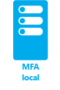
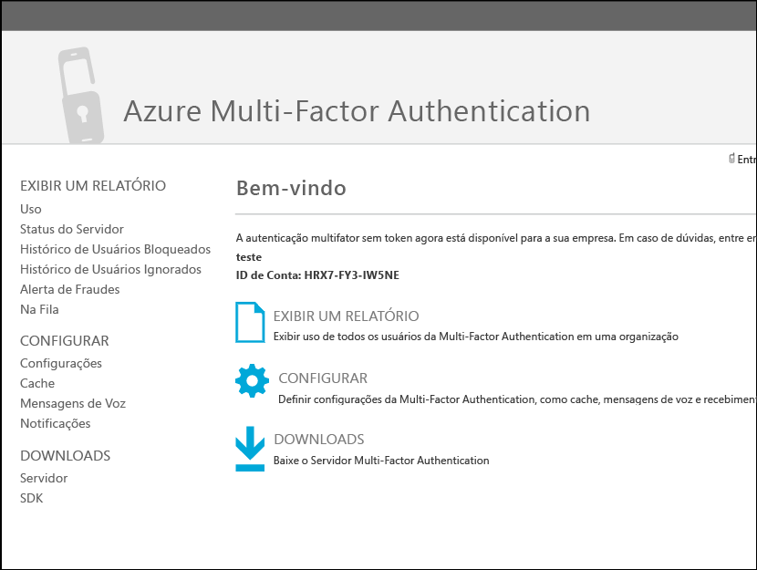
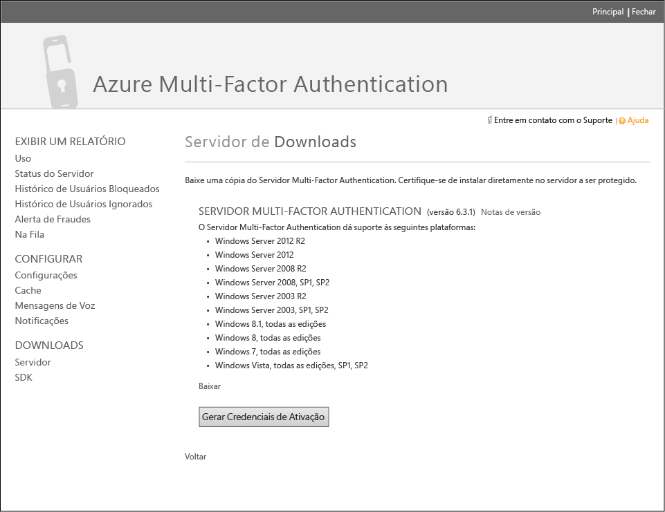
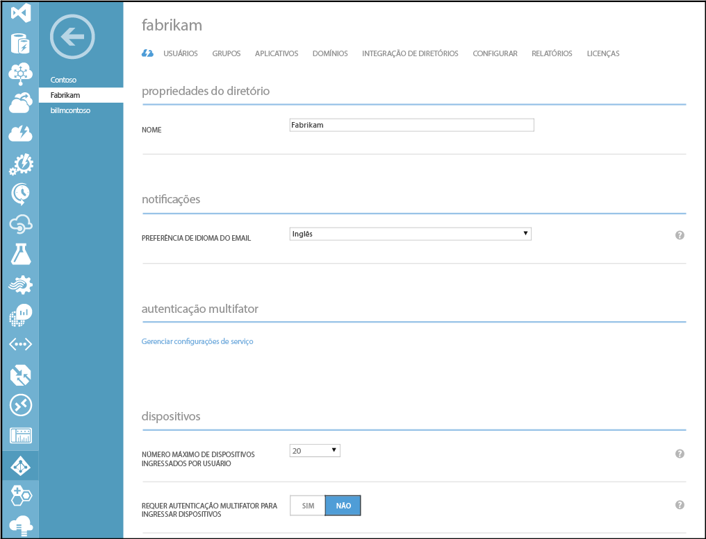
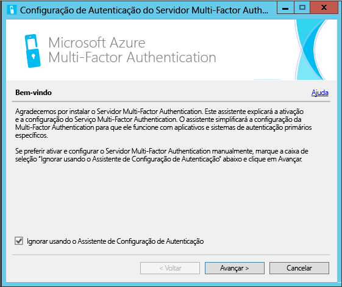
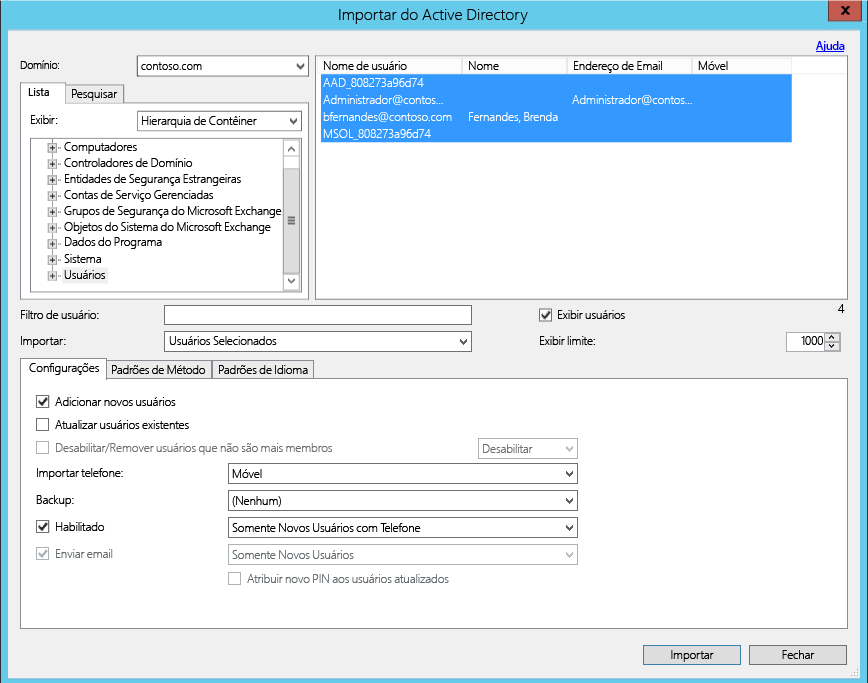
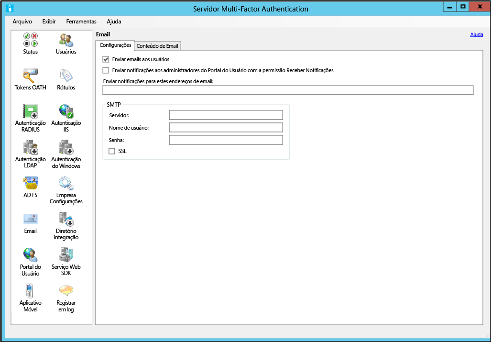
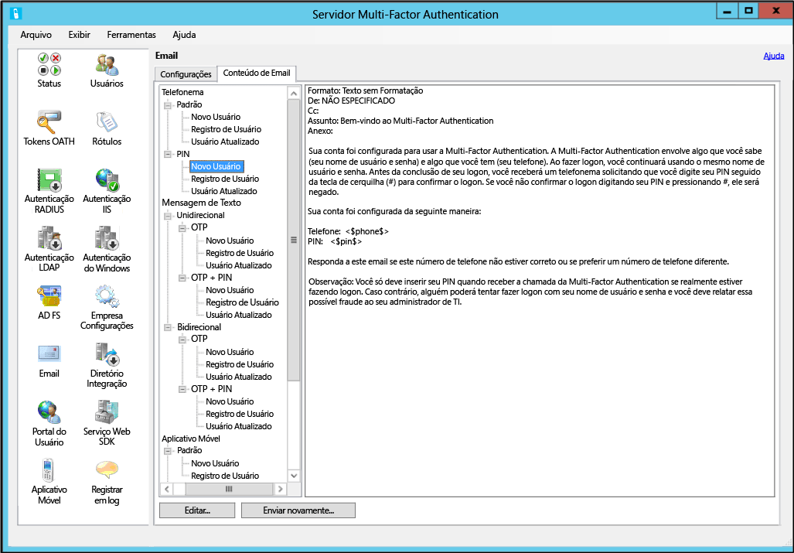

<properties 
	pageTitle="Introdução ao Servidor Azure Multi-Factor Authentication" 
	description="Esta é a página de autenticação do Azure Multi-Factor Authentication que descreve como começar com o Servidor Azure MFA." 
	services="multi-factor-authentication"
	keywords="servidor de autenticação, página de ativação de aplicativo de autenticação multifator do azure, download de servidor de autenticação" 
	documentationCenter="" 
	authors="billmath" 
	manager="stevenpo" 
	editor="curtand"/>

<tags 
	ms.service="multi-factor-authentication" 
	ms.workload="identity" 
	ms.tgt_pltfrm="na" 
	ms.devlang="na" 
	ms.topic="get-started-article" 
	ms.date="02/16/2016" 
	ms.author="billmath"/>

# Introdução ao Servidor Azure Multi-Factor Authentication

Agora que determinamos se a autenticação multifator local será utilizada ou não, vamos continuar. Esta página aborda uma nova instalação do servidor e sua configuração com o Active Directory local. Se você já tiver o servidor Phonefactor instalado e quiser saber como fazer isso, veja [Atualizando para o Servidor Azure Multi-Factor](multi-factor-authentication-get-started-server-upgrade.md) ou, se estiver procurando informações sobre como instalar apenas o serviço Web, confira [Implantando o Serviço Web do Aplicativo Móvel do Azure Multi-Factor Authentication](multi-factor-authentication-get-started-server-webservice.md).

## Baixar o Servidor Azure Multi-Factor Authentication

Há duas maneiras diferentes de baixar o Servidor Azure Multi-Factor Authentication. Ambas são feitas por meio do portal do Azure. A primeira é por meio do gerenciamento do Provedor de Autenticação Multifator diretamente. A segunda é através de configurações de serviço. A segunda opção requer um Provedor de Autenticação Multifator ou uma licença do Azure MFA, do Azure AD Premium ou do Enterprise Mobility Suite.

### Para baixar o Servidor Azure Multi-Factor Authentication
--------------------------------------------------------------------------------

1. Entre no Portal do Azure como Administrador.
2. Selecione Active Directory à esquerda.
3. Na parte superior da página do Active Directory, clique em **Provedores de autenticação multifator**
4. Na parte inferior, clique em **Gerenciar**
5. Isso abrirá uma nova página. Clique em **Downloads**.
6. Acima de **Gerar Credenciais de Ativação**, clique em **Baixar**.
7. Salve o download.

### Para baixar o Servidor do Azure Multi-Factor Authentication por meio das configurações de serviço

1. Entre no Portal do Azure como Administrador.
2. À esquerda, selecione Active Directory.
3. Clique duas vezes em sua instância do AD do Azure.
4. Na parte superior, clique em **Configurar** 
5. Em autenticação multifator, selecione **Gerenciar configurações de serviço**
6. Na página das configurações de serviços, na parte inferior da tela, clique em **Ir para o portal**. 
7. Isso abrirá uma nova página. Clique em **Downloads.**
8. Acima de **Gerar Credenciais de Ativação**, clique em **Baixar.**
9. Salve o download.

## Instalar e configurar o Servidor Azure Multi-Factor Authentication
Agora que já baixou o servidor, você pode instalá-lo e configurá-lo. Certifique-se de que o servidor em que você está instalando atenda aos seguintes requisitos:

Requisitos do Servidor Azure Multi-Factor Authentication|Descrição|
:------------- | :------------- | 
Hardware|<li>200 MB de espaço em disco</li><li>processador com capacidade de x32 ou x64</li><li> 1 GB de RAM ou mais</li>
Software|<li>Windows Server 2003 ou posterior, se o host for um sistema operacional de servidor</li><li>Windows Vista ou posterior, se o host for um sistema operacional cliente</li><li>Microsoft .NET 2.0 Framework</li><li>IIS 6.0 ou superior se estiver instalando o portal do usuário ou o SDK de serviço Web</li>

### Requisitos de firewall do Servidor Azure Multi-Factor Authentication
--------------------------------------------------------------------------------
Cada servidor MFA deve ser capaz de se comunicar na porta 443 de saída para o seguinte:

- https://pfd.phonefactor.net
- https://pfd2.phonefactor.net
- https://css.phonefactor.net

Se os firewalls de saída forem restritos na porta 443, os seguintes intervalos de endereços IP precisarão ser abertos:

Subrede de IP|Máscara de rede|Intervalo IP
:------------- | :------------- | :------------- |
134\.170.116.0/25|255\.255.255.128|134\.170.116.1 – 134.170.116.126
134\.170.165.0/25|255\.255.255.128|134\.170.165.1 – 134.170.165.126
70\.37.154.128/25|255\.255.255.128|70\.37.154.129 – 70.37.154.254

Se você não estiver usando recursos de Confirmação de Eventos do Azure Multi-Factor Authentication e se os usuários não estiverem se autenticando com os aplicativos móveis de autenticação multifator em dispositivos na rede corporativa, os intervalos de IP podem ser reduzidos ao seguinte:

Subrede de IP|Máscara de rede|Intervalo IP
:------------- | :------------- | :------------- |
134\.170.116.72/29|255\.255.255.248|134\.170.116.72 – 134.170.116.79
134\.170.165.72/29|255\.255.255.248|134\.170.165.72 – 134.170.165.79
70\.37.154.200/29|255\.255.255.248|70\.37.154.201 – 70.37.154.206

### Para instalar e configurar o Servidor Azure Multi-Factor Authentication
--------------------------------------------------------------------------------

1. Clique duas vezes no arquivo executável. Isso iniciará a instalação.
2. Na tela Selecionar Pasta de Instalação, certifique-se de que a pasta esteja correta e clique em Avançar.
3. Quando a instalação for concluída, clique em Concluir. Isso abre o assistente de configuração.
4. Na tela de boas-vindas do Assistente de Configuração, marque **Ignorar o uso do Assistente de configuração de autenticação** e clique em **avançar**. Isso fecha o assistente e inicia o servidor.

5. De volta à página de onde baixamos o servidor, clique no botão **Gerar Credenciais de Ativação**. Copie essas informações no Servidor Azure MFA nas caixas fornecidas e clique em **Ativar**.

As etapas acima mostram uma instalação expressa com o assistente de configuração. Você pode executar novamente o assistente de autenticação, selecionando-o no menu Ferramentas no servidor.

##Importar usuários do Active Directory

Agora que o servidor está instalado e configurado, você pode importar usuários rapidamente para o Servidor Azure MFA.

### Para importar usuários do Active Directory
--------------------------------------------------------------------------------

1. No Servidor Azure MFA, à esquerda, selecione **Usuários**.
2. Na parte inferior, selecione **Importar do Active Directory**.
3. Agora, você pode procurar por usuários individuais ou buscar no diretório do AD UOs que tenham usuários. Nesse caso, nós especificaremos o UO de usuários.
4. Realce todos os usuários à direita e clique em **Importar**. Você deve receber uma mensagem informando que obteve êxito. Feche a janela de importação.

## Enviar um email aos usuários
Agora que você importou os usuários no servidor Azure Multi-Factor Authentication, é aconselhável enviar aos usuários um email informando que eles foram inscritos em uma autenticação multifator.

Com o Servidor Azure Multi-Factor Authentication, há várias maneiras de configurar os usuários para usar a autenticação multifator. Por exemplo, se você souber os números de telefone dos usuários ou puder importar os números de telefone do diretório das respectivas empresas no Servidor Azure Multi-Factor Authentication, o email permitirá que os usuários saibam que eles foram configurados para usar o Azure Multi-Factor Authentication, fornece algumas instruções sobre como usar o Azure Multi-Factor Authentication e informa o usuário o número de telefone em que ele receberá a autenticação.

O conteúdo do email vai variar de acordo com o método de autenticação que foi definido para o usuário (por exemplo, ligação telefônica, SMS, aplicativo móvel). Por exemplo, se o usuário tiver que usar um PIN quando for se autenticar, o email informará qual PIN inicial foi definido para ele. Normalmente, os usuários são solicitados a mudar o PIN na primeira autenticação.

Se os números de telefone dos usuários não foram configurados ou importados no Servidor Azure Multi-Factor Authentication, ou os usuários foram pré-configurados para usar o aplicativo móvel para autenticação, você poderá enviar a eles um email que os permita saber que eles foram configurados para usar o Azure Multi-Factor Authentication e que os direcionará para concluir o registro da conta por meio do Portal do Usuário do Azure Multi-Factor Authentication. Será incluído um hiperlink em que o usuário clicará para acessar o Portal do Usuário. Quando o usuário clicar no hiperlink, o navegador da Web será aberto e o levará para o Portal do Usuário do Azure Multi-Factor Authentication da respectiva empresa.

### Configurando o email e os modelos de email

Ao clicar no ícone de email, à esquerda, você poderá definir as configurações para enviar esses emails. Aqui também você pode inserir as informações SMTP do seu servidor de email e enviar um email universal marcando a caixa de seleção Enviar emails aos usuários.

Na guia, Conteúdo do Email, você verá todos os diversos modelos de email disponíveis para sua escolha. Assim, dependendo de como você configurou os usuários para usar a autenticação multifator, é possível escolher o modelo mais adequado para as suas necessidades.

## Como o Servidor Azure Multi-Factor Authentication lida com os dados do usuário

Quando você usa o servidor MFA (Multi-Factor Authentication) local, os dados do usuário são armazenados nos servidores locais. Nenhum dado de usuário persistente é armazenado na nuvem. Quando o usuário executa a autenticação de dois fatores, o servidor MFA envia dados para o serviço de nuvem do Azure MFA para realizar a autenticação. Quando essas solicitações de autenticação são enviadas ao serviço de nuvem, os campos a seguir são enviados na solicitação e nos logs para que eles fiquem disponíveis em relatórios de uso/autenticação do cliente. Alguns dos campos são opcionais; portanto, podem ser habilitados ou desabilitados no servidor Multi-Factor Authentication. A comunicação do servidor MFA para o serviço de nuvem MFA usa saída SSL/TLS pela porta 443. Esses campos são:

- ID exclusiva: nome de usuário ou ID interna do servidor MFA
- Nome e sobrenome: opcional
- Endereço de email: opcional
- Número de telefone: ao fazer uma chamada de voz ou SMS de autenticação
- Token de dispositivo: ao fazer autenticação de aplicativos móveis
- Modo de autenticação 
- Resultado da autenticação 
- Nome do servidor MFA 
- Servidor IP MFA 
- Cliente IP: se disponível

Além dos campos acima, o resultado da autenticação (êxito/negação) e o motivo de uma possível recusa também são armazenados com os dados de autenticação e ficam disponíveis por meio de relatórios de autenticação/uso.

## Configurações avançadas do Servidor Azure Multi-Factor Authentication
Para obter informações adicionais sobre a configuração avançada e informações de configuração, use a tabela abaixo.

Método|Descrição
:------------- | :------------- | 
[Portal do Usuário](multi-factor-authentication-get-started-portal.md)| Informações sobre instalação e como configurar o Portal do usuário, incluindo implantação e autoatendimento do usuário.
[Serviço de Federação do Active Directory](multi-factor-authentication-get-started-adfs.md)|Informações sobre como configurar o Azure Multi-Factor Authentication com o AD FS.
[Autenticação RADIUS](multi-factor-authentication-get-started-server-radius.md)| Informações sobre instalação e como configurar o Servidor Azure MFA com o RADIUS.
[Autenticação IIS](multi-factor-authentication-get-started-server-iis.md)|Informações sobre instalação e como configurar o Servidor Azure MFA com o IIS.
[Autenticação do Windows](multi-factor-authentication-get-started-server-windows.md)| Informações sobre instalação e como configurar o Servidor Azure MFA com a Autenticação do Windows.
[Autenticação LDAP](multi-factor-authentication-get-started-server-ldap.md)|Informações sobre instalação e como configurar o Servidor Azure MFA com a Autenticação LDAP.
[Gateway de Área de Trabalho Remota e Servidor Azure Multi-Factor Authentication usando RADIUS](multi-factor-authentication-get-started-server-rdg.md)| Informações sobre instalação e como configurar o Servidor Azure MFA com o Gateway de Área de Trabalho Remota usando RADIUS.
[Sincronizar com o Active Directory do Windows Server](multi-factor-authentication-get-started-server-dirint.md)|Informações sobre instalação e como configurar a sincronização entre o Active Directory e o Servidor Azure MFA.
[Implantando o Serviço Web do aplicativo móvel do Servidor Azure Multi-Factor Authentication](multi-factor-authentication-get-started-server-webservice.md)|Informações sobre instalação e como configurar o serviço Web do Servidor Azure MFA.

<!---HONumber=AcomDC_0218_2016-->