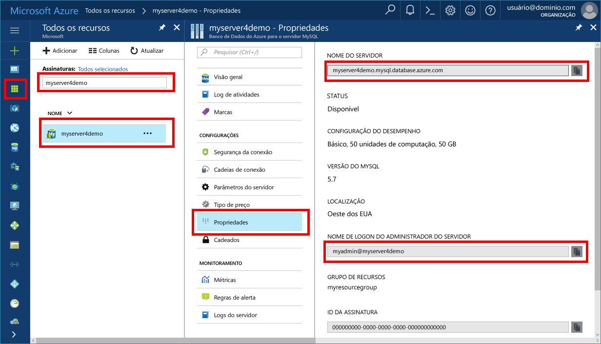

# <a name="azure-database-for-mysql-use-connectorc-to-connect-and-query-data"></a>Banco de Dados do Azure para MySQL: usar o Conector/C++ para conectar e consultar dados
Este início rápido demonstra como conectar um Banco de Dados do Azure para MySQL usando um aplicativo C++. Ele mostra como usar instruções SQL para consultar, inserir, atualizar e excluir dados no banco de dados. As etapas neste artigo pressupõem que você está familiarizado com o desenvolvimento usando o C# e começou a trabalhar recentemente com o Banco de Dados do Azure para MySQL.

## <a name="prerequisites"></a>Pré-requisitos
Este guia de início rápido usa os recursos criados em um destes guias como ponto de partida:
- [Criar um Banco de Dados do Azure para servidor MySQL usando o portal do Azure](./quickstart-create-mysql-server-database-using-azure-portal.md)
- [Criar um Banco de Dados do Azure para servidor MySQL usando a CLI do Azure](./quickstart-create-mysql-server-database-using-azure-cli.md)

Você também precisará:
- Instalar o [.NET Framework](https://www.microsoft.com/net/download)
- Instalar o [Visual Studio](https://www.visualstudio.com/downloads/)
- Instalar o [Conector MySQL/C++](https://dev.mysql.com/downloads/connector/cpp/) 
- Instalar [Boost](http://www.boost.org/)

## <a name="install-visual-studio-and-net"></a>Instalar o Visual Studio e o .NET
As etapas nesta seção pressupõem que você esteja familiarizado com desenvolvimento usando o .NET.

### <a name="windows"></a>**Windows**
1. Instale a Comunidade do Visual Studio 2017, que é um IDE completo, extensível e gratuito para criar aplicativos modernos para Android, iOS, Windows, bem como aplicativos da Web e do banco de dados, e serviços de nuvem. Você pode instalar o .NET Framework completo ou apenas o .NET Core. Os trechos de código no Início rápido funcionam com qualquer um. Se você já tiver o Visual Studio instalado em seu computador, ignore as duas etapas a seguir.
   - Baixe o [instalador do Visual Studio 2017](https://www.visualstudio.com/thank-you-downloading-visual-studio/?sku=Community&rel=15). 
   - Execute o instalador e siga os prompts de instalação para concluir a instalação.

### <a name="configure-visual-studio"></a>**Configurar o Visual Studio**
1. No Visual Studio, propriedade do projeto > propriedades da configuração > C/C++ > vinculador > geral > diretórios adicionais da biblioteca, adicione o diretório lib\opt (ou seja, C:\Program Files (x86)\MySQL\MySQL Connector C++ 1.1.9\lib\opt) do conector do c++.
2. No Visual Studio, propriedade do projeto > propriedades da configuração > C/C++ > geral > diretórios adicionais de inclusão
   - Adicione o diretório include/ do conector do c++ (ou seja, C:\Program Files (x86)\MySQL\MySQL Connector C++ 1.1.9\include\)
   - Adicione o diretório-raiz da biblioteca Boost (ou seja, C:\boost_1_64_0\)
3. No Visual Studio, propriedade do projeto > propriedades da configuração > C/C++ > vinculador > Entrada > Dependências Adicionais, adicione mysqlcppconn.lib ao campo de texto
4. Copie mysqlcppconn.dll na pasta da biblioteca do conector do c + + na etapa 3 para o mesmo diretório do executável do aplicativo ou adicione-o à variável de ambiente para que seu aplicativo possa localizá-lo.

## <a name="get-connection-information"></a>Obter informações de conexão
Obtenha as informações de conexão necessárias para se conectar ao Banco de Dados do Azure para MySQL. Você precisa das credenciais de logon e do nome do servidor totalmente qualificado.

1. Faça logon no [Portal do Azure](https://portal.azure.com/).
2. No menu à esquerda no Portal do Azure, clique em **Todos os recursos** e pesquise pelo servidor que você criou, como **myserver4demo**.
3. Clique no nome do servidor.
4. Selecione a página **Propriedades** do servidor. Anote o **Nome do servidor** e o **Nome de logon de administrador do servidor**.
 
5. Se você se esquecer das informações de logon do servidor, navegue até a página **Visão Geral** para exibir o nome de logon do Administrador do servidor e, se necessário, redefinir a senha.

## <a name="connect-create-table-and-insert-data"></a>Conectar-se, criar tabela e inserir dados
Use o código a seguir para se conectar e carregar os dados usando instruções SQL **CREATE TABLE** e **INSERT INTO**. O código usa a classe sql::Driver com o método connect() para estabelecer uma conexão com o MySQL. Em seguida, o código usa os métodos createStatement() e execute() para executar os comandos do banco de dados. 

Substitua os parâmetros Host, DBName, User e Password pelos valores que você especificou quando criou o servidor e o banco de dados. 

```c++
#include <stdlib.h>
#include <iostream>
#include "stdafx.h"

#include "mysql_connection.h"
#include <cppconn/driver.h>
#include <cppconn/exception.h>
#include <cppconn/prepared_statement.h>
using namespace std;

int main()
{
    sql::Driver *driver;
    sql::Connection *con;
    sql::Statement *stmt;
    sql::PreparedStatement *pstmt;

    try
    {
        driver = get_driver_instance();
        //for demonstration only. never save password in the code!
        con = driver>connect("tcp://myserver4demo.mysql.database.azure.com:3306/quickstartdb", "myadmin@myserver4demo", "server_admin_password");
    }
    catch (sql::SQLException e)
    {
        cout << "Could not connect to database. Error message: " << e.what() << endl;
        system("pause");
        exit(1);
    }

    stmt = con>createStatement();
    stmt>execute("DROP TABLE IF EXISTS inventory");
    cout << "Finished dropping table (if existed)" << endl;
    stmt>execute("CREATE TABLE inventory (id serial PRIMARY KEY, name VARCHAR(50), quantity INTEGER);");
    cout << "Finished creating table" << endl;
    delete stmt;

    pstmt = con>prepareStatement("INSERT INTO inventory(name, quantity) VALUES(?,?)");
    pstmt>setString(1, "banana");
    pstmt>setInt(2, 150);
    pstmt>execute();
    cout << "One row inserted." << endl;

    pstmt>setString(1, "orange");
    pstmt>setInt(2, 154);
    pstmt>execute();
    cout << "One row inserted." << endl;

    pstmt>setString(1, "apple");
    pstmt>setInt(2, 100);
    pstmt>execute();
    cout << "One row inserted." << endl;
    
    delete pstmt;   
    delete con;
    system("pause");
    return 0;

```

## <a name="read-data"></a>Ler dados

Use o código a seguir para conectar-se e ler os dados usando uma instrução SQL **SELECT**. O código usa a classe sql::Driver com o método connect() para estabelecer uma conexão com o MySQL. Em seguida, o código usa os métodos prepareStatement() e executeQuery() para executar os comandos de seleção. Finalmente, o código usa next() para prosseguir com os registros nos resultados. Depois, o código usa getInt() e getString() para analisar os valores no registro.

Substitua os parâmetros Host, DBName, User e Password pelos valores que você especificou quando criou o servidor e o banco de dados. 

```csharp
#include <stdlib.h>
#include <iostream>
#include "stdafx.h"

#include "mysql_connection.h"
#include <cppconn/driver.h>
#include <cppconn/exception.h>
#include <cppconn/resultset.h>
#include <cppconn/prepared_statement.h>
using namespace std;

int main()
{
    sql::Driver *driver;
    sql::Connection *con;
    sql::PreparedStatement *pstmt;
    sql::ResultSet *result;

    try
    {
        driver = get_driver_instance();
        //for demonstration only. never save password in the code!
        con = driver>connect("tcp://myserver4demo.mysql.database.azure.com:3306/quickstartdb", "myadmin@myserver4demo", "server_admin_password");
    }
    catch (sql::SQLException e)
    {
        cout << "Could not connect to database. Error message: " << e.what() << endl;
        system("pause");
        exit(1);
    }   

//  select  
    pstmt = con>prepareStatement("SELECT * FROM inventory;");
    result = pstmt>executeQuery();  
    
    while (result>next())
        printf("Reading from table=(%d, %s, %d)\n", result>getInt(1), result>getString(2).c_str(), result>getInt(3));   
    
    delete result;
    delete pstmt;   
    delete con;
    system("pause");
    return 0;
}
```

## <a name="update-data"></a>Atualizar dados
Use o código a seguir para conectar-se e ler os dados usando uma instrução SQL **UPDATE**. O código usa a classe sql::Driver com o método connect() para estabelecer uma conexão com o MySQL. Então, o código usa os métodos prepareStatement() e executeQuery() para executar os comandos de atualização. 

Substitua os parâmetros Host, DBName, User e Password pelos valores que você especificou quando criou o servidor e o banco de dados. 

```csharp
#include <stdlib.h>
#include <iostream>
#include "stdafx.h"

#include "mysql_connection.h"
#include <cppconn/driver.h>
#include <cppconn/exception.h>
#include <cppconn/prepared_statement.h>
using namespace std;

int main()
{
    sql::Driver *driver;
    sql::Connection *con;
    sql::PreparedStatement *pstmt;

    try
    {
        driver = get_driver_instance();
        //for demonstration only. never save password in the code!
        con = driver>connect("tcp://myserver4demo.mysql.database.azure.com:3306/quickstartdb", "myadmin@myserver4demo", "server_admin_password");
    }
    catch (sql::SQLException e)
    {
        cout << "Could not connect to database. Error message: " << e.what() << endl;
        system("pause");
        exit(1);
    }   

    //update
    pstmt = con>prepareStatement("UPDATE inventory SET quantity = ? WHERE name = ?");
    pstmt>setInt(1, 200);
    pstmt>setString(2, "banana");
    pstmt>executeQuery();
    printf("Row updated\n");
    
    delete con;
    delete pstmt;
    system("pause");
    return 0;
}
```


## <a name="delete-data"></a>Excluir dados
Use o código a seguir para conectar-se e ler os dados usando uma instrução SQL **DELETE**. O código usa a classe sql::Driver com o método connect() para estabelecer uma conexão com o MySQL. Então, o código usa os métodos prepareStatement() e executeQuery() para executar os comandos de exclusão.

Substitua os parâmetros Host, DBName, User e Password pelos valores que você especificou quando criou o servidor e o banco de dados. 

```csharp
#include <stdlib.h>
#include <iostream>
#include "stdafx.h"

#include "mysql_connection.h"
#include <cppconn/driver.h>
#include <cppconn/exception.h>
#include <cppconn/resultset.h>
#include <cppconn/prepared_statement.h>
using namespace std;

int main()
{
    sql::Driver *driver;
    sql::Connection *con;
    sql::PreparedStatement *pstmt;
    sql::ResultSet *result;

    try
    {
        driver = get_driver_instance();
        //for demonstration only. never save password in the code!
        con = driver>connect("tcp://myserver4demo.mysql.database.azure.com:3306/quickstartdb", "myadmin@myserver4demo", "server_admin_password");
    }
    catch (sql::SQLException e)
    {
        cout << "Could not connect to database. Error message: " << e.what() << endl;
        system("pause");
        exit(1);
    }
        
    //delete
    pstmt = con>prepareStatement("DELETE FROM inventory WHERE name = ?");
    pstmt>setString(1, "orange");
    result = pstmt>executeQuery();
    printf("Row deleted\n");    
    
    delete pstmt;
    delete con;
    delete result;
    system("pause");
    return 0;
}
```

## <a name="next-steps"></a>Próximas etapas
> [!div class="nextstepaction"]
> [Migrar seu banco de dados MySQL para o Banco de Dados do Azure para MySQL usando despejo e restauração](concepts-migrate-dump-restore.md)

