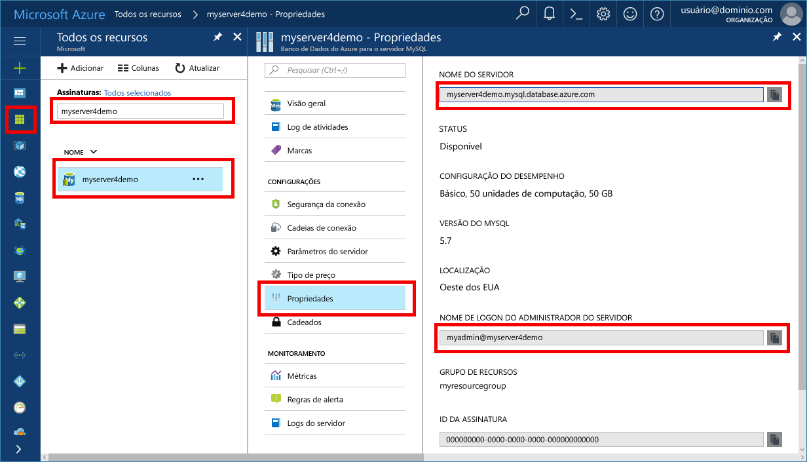

# <a name="azure-database-for-mysql-use-net-c-to-connect-and-query-data"></a>Banco de Dados do Azure para MySQL: usar .NET (C#) para se conectar e consultar dados
Este guia de início rápido demonstra como se conectar a um Banco de Dados do Azure para MySQL usando um aplicativo C#. Ele mostra como usar instruções SQL para consultar, inserir, atualizar e excluir dados no banco de dados. As etapas neste artigo pressupõem que você esteja familiarizado com o desenvolvimento usando C# e começou recentemente a trabalhar com o Banco de Dados do Azure para MySQL.

## <a name="prerequisites"></a>Pré-requisitos
Este guia de início rápido usa os recursos criados em um destes guias como ponto de partida:
- [Criar um Banco de Dados do Azure para servidor MySQL usando o portal do Azure](./quickstart-create-mysql-server-database-using-azure-portal.md)
- [Criar um Banco de Dados do Azure para servidor MySQL usando a CLI do Azure](./quickstart-create-mysql-server-database-using-azure-cli.md)

Você também precisará:
- Instalar o [.NET](https://www.microsoft.com/net/download). Executar as etapas no artigo vinculado para instalar o .NET especificamente para sua plataforma (Windows, Ubuntu Linux ou macOS). 
- Instalar o [Visual Studio](https://www.visualstudio.com/downloads/).
- Instalar o [Driver ODBC para MySQL](https://dev.mysql.com/downloads/connector/odbc/).

## <a name="get-connection-information"></a>Obter informações de conexão
Obtenha as informações de conexão necessárias para se conectar ao Banco de Dados do Azure para MySQL. Você precisa das credenciais de logon e do nome do servidor totalmente qualificado.

1. Faça logon no [Portal do Azure](https://portal.azure.com/).
2. No menu à esquerda no Portal do Azure, clique em **Todos os recursos** e pesquise pelo servidor que você criou, como **myserver4demo**.
3. Clique no nome do servidor.
4. Selecione a página **Propriedades** do servidor. Anote o **Nome do servidor** e o **Nome de logon de administrador do servidor**.
 
5. Se você se esquecer das informações de logon do servidor, navegue até a página **Visão Geral** para exibir o nome de logon do Administrador do servidor e, se necessário, redefinir a senha.

## <a name="connect-create-table-and-insert-data"></a>Conectar-se, criar tabela e inserir dados
Use o código a seguir para se conectar e carregar os dados usando instruções SQL **CREATE TABLE** e **INSERT INTO**. O código usa a classe ODBC com o método [Open()](https://msdn.microsoft.com/en-us/library/system.data.odbc.odbcconnection.open(v=vs.110).aspx) para estabelecer uma conexão com o MySQL. Em seguida, o código usa o método [CreateCommand()](https://msdn.microsoft.com/en-us/library/system.data.odbc.odbcconnection.createcommand(v=vs.110).aspx), define a propriedade CommandText e chama o método [ExecuteNonQuery ()](https://msdn.microsoft.com/en-us/library/system.data.odbc.odbccommand.executenonquery(v=vs.110).aspx) para executar os comandos do banco de dados. 

Substitua os parâmetros Host, DBName, User e Password pelos valores que você especificou quando criou o servidor e o banco de dados. 

```csharp
using System;
using System.Collections.Generic;
using System.Linq;
using System.Text;
using System.Threading.Tasks;
using MySql.Data;
using System.Data.Odbc;

namespace driver
{
    class MySQLCreate
    {
        static void Main(string[] args)
        {
            var conn = new OdbcConnection("DRIVER={MySQL ODBC 5.3 unicode Driver}; Server=myserver4demo.mysql.database.azure.com; Port=3306;" +
            " Database=quickstartdb; Uid=myadmin@myserver4demo; Pwd=server_admin_password; sslverify=0; Option=3;MULTI_STATEMENTS=1");

            Console.Out.WriteLine("Opening connection");
            conn.Open();

            var command = conn.CreateCommand();
            command.CommandText = "DROP TABLE IF EXISTS inventory;";
            command.ExecuteNonQuery();
            Console.Out.WriteLine("Finished dropping table (if existed)");

            command.CommandText = "CREATE TABLE inventory (id serial PRIMARY KEY, name VARCHAR(50), quantity INTEGER);";
            command.ExecuteNonQuery();
            Console.Out.WriteLine("Finished creating table");

            command.CommandText =
                String.Format(
                    @"INSERT INTO inventory (name, quantity) VALUES ({0}, {1});
                    INSERT INTO inventory (name, quantity) VALUES ({2}, {3});
                    INSERT INTO inventory (name, quantity) VALUES ({4}, {5});",
                    "\'banana\'", 150,
                    "\'orange\'", 154,
                    "\'apple\'", 100
                    );

            int nRows = command.ExecuteNonQuery();
            Console.Out.WriteLine(String.Format("Number of rows inserted={0}", nRows));

            Console.Out.WriteLine("Closing connection");
            conn.Close();

            Console.WriteLine("Press RETURN to exit");
            Console.ReadLine();
        }

    }
}

```

## <a name="read-data"></a>Ler dados

Use o código a seguir para conectar-se e ler os dados usando uma instrução SQL **SELECT**. O código usa a classe ODBC com o método [Open()](https://msdn.microsoft.com/en-us/library/system.data.odbc.odbcconnection.open(v=vs.110).aspx) para estabelecer uma conexão com o MySQL. Em seguida, o código usa o método [CreateCommand()](https://msdn.microsoft.com/en-us/library/system.data.odbc.odbcconnection.createcommand(v=vs.110).aspx) e o método [ExecuteReader ()](https://msdn.microsoft.com/en-us/library/system.data.odbc.odbccommand.executereader(v=vs.110).aspx) para executar os comandos de banco de dados. Em seguida, o código usa [Read](https://msdn.microsoft.com/en-us/library/system.data.odbc.odbcdatareader.read(v=vs.110).aspx) para acessar os registros nos resultados. Em seguida, o código usa GetInt32 e GetString para analisar os valores do registro.

Substitua os parâmetros Host, DBName, User e Password pelos valores que você especificou quando criou o servidor e o banco de dados. 

```csharp
using System;
using System.Collections.Generic;
using System.Linq;
using System.Text;
using System.Threading.Tasks;
using MySql.Data;
using System.Data.Odbc;


namespace driver
{
    class MySQLRead
    {

        static void Main(string[] args)
        {
            var conn = new OdbcConnection("DRIVER={MySQL ODBC 5.3 unicode Driver}; Server=myserver4demo.mysql.database.azure.com; Port=3306;" +
            " Database=quickstartdb; Uid=myadmin@myserver4demo; Pwd=server_admin_password; sslverify=0; Option=3;MULTI_STATEMENTS=1");

            Console.Out.WriteLine("Opening connection");
            conn.Open();

            var command = conn.CreateCommand();
            command.CommandText = "SELECT * FROM inventory;";

            var reader = command.ExecuteReader();
            while (reader.Read())
            {
                Console.WriteLine(
                    string.Format(
                        "Reading from table=({0}, {1}, {2})",
                        reader.GetInt32(0).ToString(),
                        reader.GetString(1),
                        reader.GetInt32(2).ToString()
                        )
                    );
            }

            Console.Out.WriteLine("Closing connection");
            conn.Close();

            Console.WriteLine("Press RETURN to exit");
            Console.ReadLine();
        }
    }
}


```

## <a name="update-data"></a>Atualizar dados
Use o código a seguir para conectar-se e ler os dados usando uma instrução SQL **UPDATE**. O código usa a classe ODBC com o método [Open()](https://msdn.microsoft.com/en-us/library/system.data.odbc.odbcconnection.open(v=vs.110).aspx) para estabelecer uma conexão com o MySQL. Em seguida, o código usa o método [CreateCommand()](https://msdn.microsoft.com/en-us/library/system.data.odbc.odbcconnection.createcommand(v=vs.110).aspx), define a propriedade CommandText e chama o método [ExecuteNonQuery ()](https://msdn.microsoft.com/en-us/library/system.data.odbc.odbccommand.executenonquery(v=vs.110).aspx) para executar os comandos do banco de dados.

Substitua os parâmetros Host, DBName, User e Password pelos valores que você especificou quando criou o servidor e o banco de dados. 

```csharp
using System;
using System.Collections.Generic;
using System.Linq;
using System.Text;
using System.Threading.Tasks;
using System.Data.Odbc;

namespace driver
{
    class MySQLUpdate
    {
        static void Main(string[] args)
        {
            var conn = new OdbcConnection("DRIVER={MySQL ODBC 5.3 unicode Driver}; Server=myserver4demo.mysql.database.azure.com; Port=3306;" +
            " Database=quickstartdb; Uid=myadmin@myserver4demo; Pwd=server_admin_password; sslverify=0; Option=3;MULTI_STATEMENTS=1");

            Console.Out.WriteLine("Opening connection");
            conn.Open();

            var command = conn.CreateCommand();
            command.CommandText =
            String.Format("UPDATE inventory SET quantity = {0} WHERE name = {1};",
                200,
                "\'banana\'"
                );

            int nRows = command.ExecuteNonQuery();
            Console.Out.WriteLine(String.Format("Number of rows updated={0}", nRows));

            Console.Out.WriteLine("Closing connection");
            conn.Close();

            Console.WriteLine("Press RETURN to exit");
            Console.ReadLine();
        }
    }
}


```


## <a name="delete-data"></a>Excluir dados
Use o código a seguir para conectar-se e excluir os dados usando uma instrução SQL **DELETE**. 

O código usa a classe ODBC com o método [Open()](https://msdn.microsoft.com/en-us/library/system.data.odbc.odbcconnection.open(v=vs.110).aspx) para estabelecer uma conexão com o MySQL. Em seguida, o código usa o método [CreateCommand()](https://msdn.microsoft.com/en-us/library/system.data.odbc.odbcconnection.createcommand(v=vs.110).aspx), define a propriedade CommandText e chama o método [ExecuteNonQuery ()](https://msdn.microsoft.com/en-us/library/system.data.odbc.odbccommand.executenonquery(v=vs.110).aspx) para executar os comandos do banco de dados.

Substitua os parâmetros Host, DBName, User e Password pelos valores que você especificou quando criou o servidor e o banco de dados. 

```csharp
using System;
using System.Collections.Generic;
using System.Linq;
using System.Text;
using System.Threading.Tasks;
using System.Data.Odbc;

namespace driver
{
    class MySQLDelete
    {
        static void Main(string[] args)
        {
            var conn = new OdbcConnection("DRIVER={MySQL ODBC 5.3 unicode Driver}; Server=myserver4demo.mysql.database.azure.com; Port=3306;" +
            " Database=quickstartdb; Uid=myadmin@myserver4demo; Pwd=server_admin_password; sslverify=0; Option=3;MULTI_STATEMENTS=1");

            Console.Out.WriteLine("Opening connection");
            conn.Open();

            var command = conn.CreateCommand();
            command.CommandText =
                String.Format("DELETE FROM inventory WHERE name = {0};",
                    "\'orange\'");
            int nRows = command.ExecuteNonQuery();
            Console.Out.WriteLine(String.Format("Number of rows deleted={0}", nRows));

            Console.Out.WriteLine("Closing connection");
            conn.Close();

            Console.WriteLine("Press RETURN to exit");
            Console.ReadLine();
        }
    }
}

```

## <a name="next-steps"></a>Próximas etapas
> [!div class="nextstepaction"]
> [Migrar seu banco de dados MySQL para o Banco de Dados do Azure para MySQL usando despejo e restauração](concepts-migrate-dump-restore.md)

