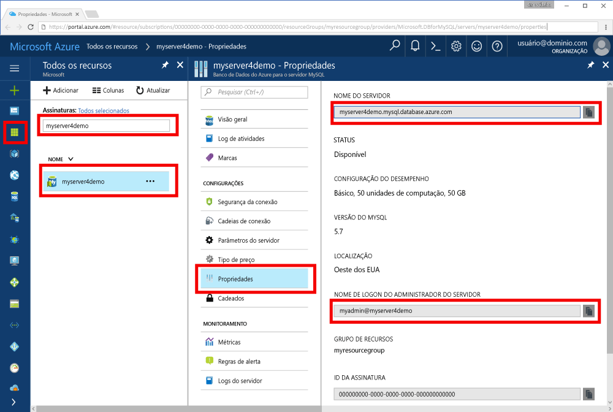

# <a name="azure-database-for-mysql-use-go-language-to-connect-and-query-data"></a>Banco de Dados do Azure para MySQL: usar a linguagem Go para se conectar e consultar dados
Este guia de início rápido mostra como se conectar a um Banco de Dados do Azure para MySQL usando código escrito na linguagem [Go](https://golang.org/) em plataformas Windows, Ubuntu Linux e Apple macOS. Ele mostra como usar instruções SQL para consultar, inserir, atualizar e excluir dados no banco de dados. Esse artigo pressupõe que você está familiarizado com o desenvolvimento usando Go e começou recentemente a trabalhar com o Banco de Dados do Azure para MySQL.

## <a name="prerequisites"></a>pré-requisitos
Este guia de início rápido usa os recursos criados em um destes guias como ponto de partida:
- [Criar um servidor de Banco de Dados do Azure para MySQL usando o portal do Azure](./quickstart-create-mysql-server-database-using-azure-portal.md)
- [Criar um servidor de Banco de Dados do Azure para MySQL usando a CLI do Azure](./quickstart-create-mysql-server-database-using-azure-cli.md)

## <a name="install-go-and-mysql-connector"></a>Instalar o conector MySQL e Go
Instale o [Go](https://golang.org/doc/install) e pelo menos a versão 1.3 do [go-sql-driver para MySQL](https://github.com/go-sql-driver/mysql#installation) em seu próprio computador. Dependendo da sua plataforma, siga as etapas na seção apropriada:

### <a name="windows"></a>Windows
1. [Baixe](https://golang.org/dl/) e instale o Go para Microsoft Windows de acordo com as [instruções de instalação](https://golang.org/doc/install).
2. Inicie o prompt de comando no menu Iniciar.
3. Crie uma pasta para o seu projeto, como. `mkdir  %USERPROFILE%\go\src\mysqlgo`.
4. Altere o diretório na pasta do projeto, como `cd %USERPROFILE%\go\src\mysqlgo`.
5. Defina a variável de ambiente para GOPATH apontar para o diretório de código de origem. `set GOPATH=%USERPROFILE%\go`.
6. Instale o [go-sql-driver para mysql](https://github.com/go-sql-driver/mysql#installation) executando o comando `go get github.com/go-sql-driver/mysql`. A versão 1.3 é a versão mínima necessária.

   Em resumo, instale o Go e execute esses comandos no prompt de comando:
   ```cmd
   mkdir  %USERPROFILE%\go\src\mysqlgo
   cd %USERPROFILE%\go\src\mysqlgo
   set GOPATH=%USERPROFILE%\go
   go get github.com/go-sql-driver/mysql
   ```

### <a name="linux-ubuntu"></a>Linux (Ubuntu)
1. Abra o shell do Bash. 
2. Instale o Go executando `sudo apt-get install golang-go`.
3. Crie uma pasta para o seu projeto em seu diretório inicial, como `mkdir -p ~/go/src/mysqlgo/`.
4. Altere o diretório na pasta, como `cd ~/go/src/mysqlgo/`.
5. Defina a variável de ambiente GOPATH para apontar para um diretório de origem válido, como a pasta atual inicial do diretório do Go. No shell Bash, execute `export GOPATH=~/go` para adicionar o diretório do Go como GOPATH para a sessão atual do shell.
6. Instale o [go-sql-driver para mysql](https://github.com/go-sql-driver/mysql#installation) executando o comando `go get github.com/go-sql-driver/mysql`. A versão 1.3 é a versão mínima necessária.

   Em resumo, execute estes comandos bash:
   ```bash
   sudo apt-get install golang-go
   mkdir -p ~/go/src/mysqlgo/
   cd ~/go/src/mysqlgo/
   export GOPATH=~/go/
   go get github.com/go-sql-driver/mysql
   ```

### <a name="apple-macos"></a>Apple macOS
1. Baixe e instale o Go de acordo com as [instruções de instalação](https://golang.org/doc/install) correspondentes à plataforma. 
2. Abra o shell do Bash.
3. Crie uma pasta para o seu projeto em seu diretório inicial, como `mkdir -p ~/go/src/mysqlgo/`.
4. Altere o diretório na pasta, como `cd ~/go/src/mysqlgo/`.
5. Defina a variável de ambiente GOPATH para apontar para um diretório de origem válido, como a pasta atual inicial do diretório do Go. No shell Bash, execute `export GOPATH=~/go` para adicionar o diretório do Go como GOPATH para a sessão atual do shell.
6. Instale o [go-sql-driver para mysql](https://github.com/go-sql-driver/mysql#installation) executando o comando `go get github.com/go-sql-driver/mysql`. A versão 1.3 é a versão mínima necessária.

   Em resumo, instale o Go e, em seguida, execute esses comandos bash:
   ```bash
   mkdir -p ~/go/src/mysqlgo/
   cd ~/go/src/mysqlgo/
   export GOPATH=~/go/
   go get github.com/go-sql-driver/mysql
   ```

## <a name="get-connection-information"></a>Obter informações de conexão
Obtenha as informações de conexão necessárias para se conectar ao Banco de Dados do Azure para MySQL. Você precisa das credenciais de logon e do nome do servidor totalmente qualificado.

1. Faça logon no [Portal do Azure](https://portal.azure.com/).
2. No menu à esquerda no Portal do Azure, clique em **Todos os recursos** e pesquise pelo servidor que você criou (como **myserver4demo**).
3. Clique no nome do servidor **myserver4demo**.
4. Selecione a página **Propriedades** do servidor e anote o **Nome do servidor** e o **Nome de logon do administrador do servidor**.
 
5. Se você se esquecer das informações de logon do servidor, navegue até a página **Visão Geral** para exibir o nome de logon do Administrador do servidor e, se necessário, redefinir a senha.
   

## <a name="build-and-run-go-code"></a>Compilar e executar o código Go 
1. Para escrever código Golang, você pode usar um editor de texto simples, como o Bloco de Notas no Microsoft Windows, [vi](http://manpages.ubuntu.com/manpages/xenial/man1/nvi.1.html#contenttoc5) ou [Nano](https://www.nano-editor.org/) no Ubuntu ou Editor de Texto no macOS. Se você preferir IDE (Ambiente de Desenvolvimento Integrado) mais avançado, experimente o [Gogland](https://www.jetbrains.com/go/) da Jetbrains, o [Visual Studio Code](https://code.visualstudio.com/) da Microsoft ou o [Atom](https://atom.io/).
2. Cole o código Go das seções abaixo em arquivos de texto e salve-os em sua pasta de projeto com a extensão de arquivo \*.go (como caminho do Windows `%USERPROFILE%\go\src\mysqlgo\createtable.go` ou caminho do Linux `~/go/src/mysqlgo/createtable.go`).
3. Localize as constantes `HOST`, `DATABASE`, `USER` e `PASSWORD` no código e substitua os valores de exemplo com seus próprios valores. 
4. Inicie o prompt de comando ou shell Bash. Altere o diretório na pasta do seu projeto. Por exemplo, no Windows `cd %USERPROFILE%\go\src\mysqlgo\`. No Linux `cd ~/go/src/mysqlgo/`.  Alguns dos editores IDE mencionados oferecem recursos de depuração e tempo de execução sem a necessidade de comandos do shell.
5. Execute o código, digitando o comando `go run createtable.go` para compilar o aplicativo e executá-lo. 
6. Como alternativa, para compilar o código em um aplicativo nativo, `go build createtable.go`, inicie `createtable.exe` para executar o aplicativo.

## <a name="connect-create-table-and-insert-data"></a>Conectar-se, criar tabela e inserir dados
Use o código a seguir para se conectar ao servidor, criar uma tabela e carregar os dados usando uma instrução SQL **INSERT**. 

O código importa três pacotes: o [pacote sql](https://golang.org/pkg/database/sql/), o [go sql driver para mysql](https://github.com/go-sql-driver/mysql#installation) como driver para se comunicar com o Banco de Dados do Azure para MySQL e o [pacote fmt](https://golang.org/pkg/fmt/) para impressão de entrada e saída na linha de comando.

O código chama o método [sql.Open()](http://go-database-sql.org/accessing.html) para se conectar ao Banco de Dados do Azure para MySQL e verifica a conexão usando o método [db.Ping()](https://golang.org/pkg/database/sql/#DB.Ping). Um [identificador de banco de dados](https://golang.org/pkg/database/sql/#DB) é usado em todo o processo, mantendo o pool de conexão para o servidor de banco de dados. O código chama o método [Exec()](https://golang.org/pkg/database/sql/#DB.Exec) várias vezes para executar vários comandos DDL. O código também usa o [Prepare()](http://go-database-sql.org/prepared.html) e Exec() para executar instruções preparadas com parâmetros diferentes para inserir três linhas. A cada ocorrência, um método personalizado checkError() é usado para verificar se ocorreu um erro e pane.

Substitua as constantes `host`, `database`, `user` e `password` pelos seus próprios valores. 

```Go
package main

import (
    "database/sql"
    "fmt"

    _ "github.com/go-sql-driver/mysql"
)

const (
    host     = "myserver4demo.mysql.database.azure.com"
    database = "quickstartdb"
    user     = "myadmin@myserver4demo"
    password = "yourpassword"
)

func checkError(err error) {
    if err != nil {
        panic(err)
    }
}

func main() {

    // Initialize connection string.
    var connectionString = fmt.Sprintf("%s:%s@tcp(%s:3306)/%s?allowNativePasswords=true", user, password, host, database)

    // Initialize connection object.
    db, err := sql.Open("mysql", connectionString)
    checkError(err)
    defer db.Close()

    err = db.Ping()
    checkError(err)
    fmt.Println("Successfully created connection to database.")

    // Drop previous table of same name if one exists.
    _, err = db.Exec("DROP TABLE IF EXISTS inventory;")
    checkError(err)
    fmt.Println("Finished dropping table (if existed).")

    // Create table.
    _, err = db.Exec("CREATE TABLE inventory (id serial PRIMARY KEY, name VARCHAR(50), quantity INTEGER);")
    checkError(err)
    fmt.Println("Finished creating table.")

    // Insert some data into table.
    sqlStatement, err := db.Prepare("INSERT INTO inventory (name, quantity) VALUES (?, ?);")
    res, err := sqlStatement.Exec("banana", 150)
    checkError(err)
    rowCount, err := res.RowsAffected()
    fmt.Printf("Inserted %d row(s) of data.\n", rowCount)

    res, err = sqlStatement.Exec("orange", 154)
    checkError(err)
    rowCount, err = res.RowsAffected()
    fmt.Printf("Inserted %d row(s) of data.\n", rowCount)

    res, err = sqlStatement.Exec("apple", 100)
    checkError(err)
    rowCount, err = res.RowsAffected()
    fmt.Printf("Inserted %d row(s) of data.\n", rowCount)
    fmt.Println("Done.")
}

```

## <a name="read-data"></a>Ler dados
Use o código a seguir para conectar-se e ler os dados usando uma instrução SQL **SELECT**. 

O código importa três pacotes: o [pacote sql](https://golang.org/pkg/database/sql/), o [go sql driver para mysql](https://github.com/go-sql-driver/mysql#installation) como driver para se comunicar com o Banco de Dados do Azure para MySQL e o [pacote fmt](https://golang.org/pkg/fmt/) para impressão de entrada e saída na linha de comando.

O código chama o método [sql.Open()](http://go-database-sql.org/accessing.html) para se conectar ao Banco de Dados do Azure para MySQL e verifica a conexão usando o método [db.Ping()](https://golang.org/pkg/database/sql/#DB.Ping). Um [identificador de banco de dados](https://golang.org/pkg/database/sql/#DB) é usado em todo o processo, mantendo o pool de conexão para o servidor de banco de dados. O código chama o método [Query()](https://golang.org/pkg/database/sql/#DB.Query) para executar o comando select. Em seguida, ele executa [Next()](https://golang.org/pkg/database/sql/#Rows.Next) para iterar por meio do conjunto de resultados e [Scan()](https://golang.org/pkg/database/sql/#Rows.Scan) para analisar os valores de coluna, salvando o valor nas variáveis. A cada ocorrência, um método personalizado checkError() é usado para verificar se ocorreu um erro e pane.

Substitua as constantes `host`, `database`, `user` e `password` pelos seus próprios valores. 

```Go
package main

import (
    "database/sql"
    "fmt"

    _ "github.com/go-sql-driver/mysql"
)

const (
    host     = "myserver4demo.mysql.database.azure.com"
    database = "quickstartdb"
    user     = "myadmin@myserver4demo"
    password = "yourpassword"
)

func checkError(err error) {
    if err != nil {
        panic(err)
    }
}

func main() {

    // Initialize connection string.
    var connectionString = fmt.Sprintf("%s:%s@tcp(%s:3306)/%s?allowNativePasswords=true", user, password, host, database)

    // Initialize connection object.
    db, err := sql.Open("mysql", connectionString)
    checkError(err)
    defer db.Close()

    err = db.Ping()
    checkError(err)
    fmt.Println("Successfully created connection to database.")

    // Variables for printing column data when scanned.
    var (
        id       int
        name     string
        quantity int
    )

    // Read some data from the table.
    rows, err := db.Query("SELECT id, name, quantity from inventory;")
    checkError(err)
    defer rows.Close()
    fmt.Println("Reading data:")
    for rows.Next() {
        err := rows.Scan(&id, &name, &quantity)
        checkError(err)
        fmt.Printf("Data row = (%d, %s, %d)\n", id, name, quantity)
    }
    err = rows.Err()
    checkError(err)
    fmt.Println("Done.")
}
```

## <a name="update-data"></a>Atualizar dados
Use o código a seguir para conectar-se e atualizar os dados usando uma instrução SQL **UPDATE**. 

O código importa três pacotes: o [pacote sql](https://golang.org/pkg/database/sql/), o [go sql driver para mysql](https://github.com/go-sql-driver/mysql#installation) como driver para se comunicar com o Banco de Dados do Azure para MySQL e o [pacote fmt](https://golang.org/pkg/fmt/) para impressão de entrada e saída na linha de comando.

O código chama o método [sql.Open()](http://go-database-sql.org/accessing.html) para se conectar ao Banco de Dados do Azure para MySQL e verifica a conexão usando o método [db.Ping()](https://golang.org/pkg/database/sql/#DB.Ping). Um [identificador de banco de dados](https://golang.org/pkg/database/sql/#DB) é usado em todo o processo, mantendo o pool de conexão para o servidor de banco de dados. O código chama o método [Exec()](https://golang.org/pkg/database/sql/#DB.Exec) para executar o comando update. A cada ocorrência, um método personalizado checkError() é usado para verificar se ocorreu um erro e pane.

Substitua as constantes `host`, `database`, `user` e `password` pelos seus próprios valores. 

```Go
package main

import (
    "database/sql"
    "fmt"

    _ "github.com/go-sql-driver/mysql"
)

const (
    host     = "myserver4demo.mysql.database.azure.com"
    database = "quickstartdb"
    user     = "myadmin@myserver4demo"
    password = "yourpassword"
)

func checkError(err error) {
    if err != nil {
        panic(err)
    }
}

func main() {

    // Initialize connection string.
    var connectionString = fmt.Sprintf("%s:%s@tcp(%s:3306)/%s?allowNativePasswords=true", user, password, host, database)

    // Initialize connection object.
    db, err := sql.Open("mysql", connectionString)
    checkError(err)
    defer db.Close()

    err = db.Ping()
    checkError(err)
    fmt.Println("Successfully created connection to database.")

    // Modify some data in table.
    rows, err := db.Exec("UPDATE inventory SET quantity = ? WHERE name = ?", 200, "banana")
    checkError(err)
    rowCount, err := rows.RowsAffected()
    fmt.Printf("Deleted %d row(s) of data.\n", rowCount)
    fmt.Println("Done.")
}
```

## <a name="delete-data"></a>Excluir dados
Use o código a seguir para conectar-se e remover os dados usando uma instrução SQL **DELETE**. 

O código importa três pacotes: o [pacote sql](https://golang.org/pkg/database/sql/), o [go sql driver para mysql](https://github.com/go-sql-driver/mysql#installation) como driver para se comunicar com o Banco de Dados do Azure para MySQL e o [pacote fmt](https://golang.org/pkg/fmt/) para impressão de entrada e saída na linha de comando.

O código chama o método [sql.Open()](http://go-database-sql.org/accessing.html) para se conectar ao Banco de Dados do Azure para MySQL e verifica a conexão usando o método [db.Ping()](https://golang.org/pkg/database/sql/#DB.Ping). Um [identificador de banco de dados](https://golang.org/pkg/database/sql/#DB) é usado em todo o processo, mantendo o pool de conexão para o servidor de banco de dados. O código chama o método [Exec()](https://golang.org/pkg/database/sql/#DB.Exec) para executar o comando delete. A cada ocorrência, um método personalizado checkError() é usado para verificar se ocorreu um erro e pane.

Substitua as constantes `host`, `database`, `user` e `password` pelos seus próprios valores. 

```Go
package main

import (
    "database/sql"
    "fmt"
    _ "github.com/go-sql-driver/mysql"
)

const (
    host     = "myserver4demo.mysql.database.azure.com"
    database = "quickstartdb"
    user     = "myadmin@myserver4demo"
    password = "yourpassword"
)

func checkError(err error) {
    if err != nil {
        panic(err)
    }
}

func main() {

    // Initialize connection string.
    var connectionString = fmt.Sprintf("%s:%s@tcp(%s:3306)/%s?allowNativePasswords=true", user, password, host, database)

    // Initialize connection object.
    db, err := sql.Open("mysql", connectionString)
    checkError(err)
    defer db.Close()

    err = db.Ping()
    checkError(err)
    fmt.Println("Successfully created connection to database.")

    // Modify some data in table.
    rows, err := db.Exec("DELETE FROM inventory WHERE name = ?", "orange")
    checkError(err)
    rowCount, err := rows.RowsAffected()
    fmt.Printf("Deleted %d row(s) of data.\n", rowCount)
    fmt.Println("Done.")
}
```

## <a name="next-steps"></a>Próximas etapas
> [!div class="nextstepaction"]
> [Migre seu banco de dados usando Exportar e Importar](./concepts-migrate-import-export.md)
