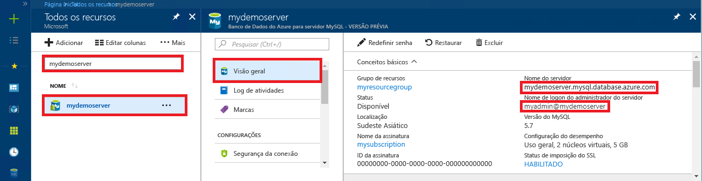

# <a name="azure-database-for-mysql-use-php-to-connect-and-query-data"></a>Banco de Dados do Azure para MySQL: usar PHP para se conectar e consultar dados
Este guia de início rápido demonstra como se conectar a um banco de dados do Azure para MySQL usando aplicativo [PHP](http://php.net/manual/intro-whatis.php). Ele mostra como usar instruções SQL para consultar, inserir, atualizar e excluir dados no banco de dados. Este tópico pressupõe que você está familiarizado com o desenvolvimento usando PHP e começou recentemente a trabalhar com o Banco de Dados do Azure para MySQL.

## <a name="prerequisites"></a>pré-requisitos
Este guia de início rápido usa os recursos criados em um destes guias como ponto de partida:
- [Criar um servidor de Banco de Dados do Azure para MySQL usando o portal do Azure](./quickstart-create-mysql-server-database-using-azure-portal.md)
- [Criar um servidor de Banco de Dados do Azure para MySQL usando a CLI do Azure](./quickstart-create-mysql-server-database-using-azure-cli.md)

## <a name="install-php"></a>Instalar o PHP
Instalar o PHP em seu próprio servidor ou crie um [aplicativo Web](../app-service/app-service-web-overview.md) do Azure que inclua o PHP.

### <a name="macos"></a>MacOS
- Baixar o [PHP 7.1.4 versão](http://php.net/downloads.php).
- Instalar o PHP e consultar o [manual do PHP](http://php.net/manual/install.macosx.php) para outras configurações.

### <a name="linux-ubuntu"></a>Linux (Ubuntu)
- Baixar o [PHP 7.1.4 versão protegida não thread (x64)](http://php.net/downloads.php).
- Instalar o PHP e consultar o [manual do PHP](http://php.net/manual/install.unix.php) para outras configurações.

### <a name="windows"></a>Windows
- Baixar o [PHP 7.1.4 versão protegida não thread (x64)](http://windows.php.net/download#php-7.1).
- Instalar o PHP e consultar o [manual do PHP](http://php.net/manual/install.windows.php) para outras configurações.

## <a name="get-connection-information"></a>Obter informações de conexão
Obtenha as informações de conexão necessárias para se conectar ao Banco de Dados do Azure para MySQL. Você precisa das credenciais de logon e do nome do servidor totalmente qualificado.

1. Faça logon no [Portal do Azure](https://portal.azure.com/).
2. No menu à esquerda no portal do Azure, clique em **Todos os recursos** e pesquise o servidor que você criou (como **mydemoserver**).
3. Clique no nome do servidor.
4. No painel **Visão Geral** do servidor, anote o **Nome do servidor** e **Nome de logon do administrador do servidor**. Se você esquecer sua senha, também poderá redefini-la nesse painel.
 

## <a name="connect-and-create-a-table"></a>Conectar-se e criar uma tabela
Use o código a seguir para se conectar e criar uma tabela usando a instrução SQL **CREATE TABLE**. 

O código usa a classe (mysqli) **Extensão aprimorada MySQL** classe (mysqli) incluída em PHP. Os métodos de chamadas de código [mysqli_init](http://php.net/manual/mysqli.init.php) e [mysqli_real_connect](http://php.net/manual/mysqli.real-connect.php) para se conectar ao MySQL. Em seguida, ele chama o método [mysqli_query](http://php.net/manual/mysqli.query.php) para executar a consulta. Em seguida, ele chama o método [mysqli_close](http://php.net/manual/mysqli.close.php) para fechar a conexão.

Substitua os parâmetros host, username, password e db_name pelos seus próprios valores. 

```php
<?php
$host = 'mydemoserver.mysql.database.azure.com';
$username = 'myadmin@mydemoserver';
$password = 'your_password';
$db_name = 'your_database';

//Establishes the connection
$conn = mysqli_init();
mysqli_real_connect($conn, $host, $username, $password, $db_name, 3306);
if (mysqli_connect_errno($conn)) {
die('Failed to connect to MySQL: '.mysqli_connect_error());
}

// Run the create table query
if (mysqli_query($conn, '
CREATE TABLE Products (
`Id` INT NOT NULL AUTO_INCREMENT ,
`ProductName` VARCHAR(200) NOT NULL ,
`Color` VARCHAR(50) NOT NULL ,
`Price` DOUBLE NOT NULL ,
PRIMARY KEY (`Id`)
);
')) {
printf("Table created\n");
}

//Close the connection
mysqli_close($conn);
?>
```

## <a name="insert-data"></a>Inserir dados
Use o código a seguir para se conectar e inserir dados usando uma instrução SQL **INSERT**.

O código usa a classe (mysqli) **Extensão aprimorada MySQL** classe (mysqli) incluída em PHP. O código usa o método [mysqli_prepare](http://php.net/manual/mysqli.prepare.php) para criar um instrução insert preparada, associa parâmetros a cada valor de coluna inserido usando o método [mysqli_stmt_bind_param](http://php.net/manual/mysqli-stmt.bind-param.php). O código executa a instrução usando o método [mysqli_stmt_execute](http://php.net/manual/mysqli-stmt.execute.php) e depois fecha a instrução usando o método [mysqli_stmt_close](http://php.net/manual/mysqli-stmt.close.php).

Substitua os parâmetros host, username, password e db_name pelos seus próprios valores. 

```php
<?php
$host = 'mydemoserver.mysql.database.azure.com';
$username = 'myadmin@mydemoserver';
$password = 'your_password';
$db_name = 'your_database';

//Establishes the connection
$conn = mysqli_init();
mysqli_real_connect($conn, $host, $username, $password, $db_name, 3306);
if (mysqli_connect_errno($conn)) {
die('Failed to connect to MySQL: '.mysqli_connect_error());
}

//Create an Insert prepared statement and run it
$product_name = 'BrandNewProduct';
$product_color = 'Blue';
$product_price = 15.5;
if ($stmt = mysqli_prepare($conn, "INSERT INTO Products (ProductName, Color, Price) VALUES (?, ?, ?)")) {
mysqli_stmt_bind_param($stmt, 'ssd', $product_name, $product_color, $product_price);
mysqli_stmt_execute($stmt);
printf("Insert: Affected %d rows\n", mysqli_stmt_affected_rows($stmt));
mysqli_stmt_close($stmt);
}

// Close the connection
mysqli_close($conn);
?>
```

## <a name="read-data"></a>Ler dados
Use o código a seguir para conectar-se e ler os dados usando uma instrução SQL **SELECT**.  O código usa a classe (mysqli) **Extensão aprimorada MySQL** classe (mysqli) incluída em PHP. O código usa o método [mysqli_query](http://php.net/manual/mysqli.query.php) para executar a consulta sql e o método [mysqli_fetch_assoc](http://php.net/manual/mysqli-result.fetch-assoc.php) para buscar as linhas resultantes.

Substitua os parâmetros host, username, password e db_name pelos seus próprios valores. 

```php
<?php
$host = 'mydemoserver.mysql.database.azure.com';
$username = 'myadmin@mydemoserver';
$password = 'your_password';
$db_name = 'your_database';

//Establishes the connection
$conn = mysqli_init();
mysqli_real_connect($conn, $host, $username, $password, $db_name, 3306);
if (mysqli_connect_errno($conn)) {
die('Failed to connect to MySQL: '.mysqli_connect_error());
}

//Run the Select query
printf("Reading data from table: \n");
$res = mysqli_query($conn, 'SELECT * FROM Products');
while ($row = mysqli_fetch_assoc($res)) {
var_dump($row);
}

//Close the connection
mysqli_close($conn);
?>
```

## <a name="update-data"></a>Atualizar dados
Use o código a seguir para conectar-se e atualizar os dados usando uma instrução SQL **UPDATE**.

O código usa a classe (mysqli) **Extensão aprimorada MySQL** classe (mysqli) incluída em PHP. O código usa o método [mysqli_prepare](http://php.net/manual/mysqli.prepare.php) para criar uma instrução update preparada e associa os parâmetros de cada valor de coluna atualizada usando o método [mysqli_stmt_bind_param](http://php.net/manual/mysqli-stmt.bind-param.php). O código executa a instrução usando o método [mysqli_stmt_execute](http://php.net/manual/mysqli-stmt.execute.php) e depois fecha a instrução usando o método [mysqli_stmt_close](http://php.net/manual/mysqli-stmt.close.php).

Substitua os parâmetros host, username, password e db_name pelos seus próprios valores. 

```php
<?php
$host = 'mydemoserver.mysql.database.azure.com';
$username = 'myadmin@mydemoserver';
$password = 'your_password';
$db_name = 'your_database';

//Establishes the connection
$conn = mysqli_init();
mysqli_real_connect($conn, $host, $username, $password, $db_name, 3306);
if (mysqli_connect_errno($conn)) {
die('Failed to connect to MySQL: '.mysqli_connect_error());
}

//Run the Update statement
$product_name = 'BrandNewProduct';
$new_product_price = 15.1;
if ($stmt = mysqli_prepare($conn, "UPDATE Products SET Price = ? WHERE ProductName = ?")) {
mysqli_stmt_bind_param($stmt, 'ds', $new_product_price, $product_name);
mysqli_stmt_execute($stmt);
printf("Update: Affected %d rows\n", mysqli_stmt_affected_rows($stmt));

//Close the connection
mysqli_stmt_close($stmt);
}

mysqli_close($conn);
?>
```


## <a name="delete-data"></a>Excluir dados
Use o código a seguir para conectar-se e ler os dados usando uma instrução SQL **DELETE**. 

O código usa a classe (mysqli) **Extensão aprimorada MySQL** classe (mysqli) incluída em PHP. O código usa o método [mysqli_prepare](http://php.net/manual/mysqli.prepare.php) para criar uma instrução delete preparada e associa os parâmetros da cláusula where na instrução usando o método [mysqli_stmt_bind_param](http://php.net/manual/mysqli-stmt.bind-param.php). O código executa a instrução usando o método [mysqli_stmt_execute](http://php.net/manual/mysqli-stmt.execute.php) e depois fecha a instrução usando o método [mysqli_stmt_close](http://php.net/manual/mysqli-stmt.close.php).

Substitua os parâmetros host, username, password e db_name pelos seus próprios valores. 

```php
<?php
$host = 'mydemoserver.mysql.database.azure.com';
$username = 'myadmin@mydemoserver';
$password = 'your_password';
$db_name = 'your_database';

//Establishes the connection
$conn = mysqli_init();
mysqli_real_connect($conn, $host, $username, $password, $db_name, 3306);
if (mysqli_connect_errno($conn)) {
die('Failed to connect to MySQL: '.mysqli_connect_error());
}

//Run the Delete statement
$product_name = 'BrandNewProduct';
if ($stmt = mysqli_prepare($conn, "DELETE FROM Products WHERE ProductName = ?")) {
mysqli_stmt_bind_param($stmt, 's', $product_name);
mysqli_stmt_execute($stmt);
printf("Delete: Affected %d rows\n", mysqli_stmt_affected_rows($stmt));
mysqli_stmt_close($stmt);
}

//Close the connection
mysqli_close($conn);
?>
```

## <a name="next-steps"></a>Próximas etapas
> [!div class="nextstepaction"]
> [Conectar-se ao Banco de Dados do Azure para MySQL via SSL](howto-configure-ssl.md)
