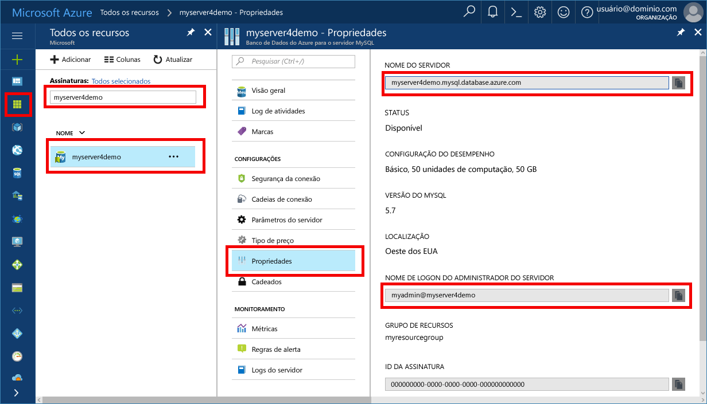

# <a name="azure-database-for-mysql-use-python-to-connect-and-query-data"></a>Banco de Dados do Azure para MySQL: usar Python para se conectar e consultar dados
Este guia de início rápido demonstra como usar [Python](https://python.org) para se conectar a um Banco de Dados do Azure para MySQL. Ele usa instruções SQL para consultar, inserir, atualizar e excluir dados no banco de dados de plataformas do Windows, Ubuntu Linux e Mac OS. Este tópico pressupõe que você está familiarizado com o desenvolvimento usando Python e começou recentemente a trabalhar com o Banco de Dados do Azure para MySQL.

## <a name="prerequisites"></a>Pré-requisitos
Este guia de início rápido usa os recursos criados em um destes guias como ponto de partida:
- [Criar um Banco de Dados do Azure para servidor MySQL usando o portal do Azure](./quickstart-create-mysql-server-database-using-azure-portal.md)
- [Criar um Banco de Dados do Azure para servidor MySQL usando a CLI do Azure](./quickstart-create-mysql-server-database-using-azure-cli.md)

## <a name="install-python-and-the-mysql-connector"></a>Instalar o conector MySQL e Python
Instalar [Python](https://www.python.org/downloads/) e o [conector MySQL do Python](https://dev.mysql.com/downloads/connector/python/) em seu próprio computador. Dependendo da sua plataforma, siga as etapas na seção apropriada:

### <a name="windows"></a>Windows
1. Baixe e instale o Python 2.7 em [python.org](https://www.python.org/downloads/windows/). 
2. Verifique a instalação do Python abrindo o prompt de comando. Execute o comando `C:\python27\python.exe -V` usando a alternância V maiúscula para ver o número de versão.
3. Instalar o conector Python para MySQL em [mysql.com](https://dev.mysql.com/downloads/connector/python/) correspondente à sua versão do Python.

### <a name="linux-ubuntu"></a>Linux (Ubuntu)
1. No Linux (Ubuntu), o Python normalmente é instalado como parte da instalação padrão.
2. Verifique a instalação do Python abrindo o shell de busca. Execute o comando `python -V` usando a alternância V maiúscula para ver o número de versão.
3. Verifique a instalação de PIP executando o comando `pip show pip -V` para ver o número de versão. 
4. PIP pode ser incluído em algumas versões do Python. Se o PIP não estiver instalado, você pode instalar o pacote [PIP] (https://pip.pypa.io/en/stable/installing/), executando o comando `sudo apt-get install python-pip`.
5. Atualize o PIP para a versão mais recente, executando o comando `pip install -U pip`.
6. Instale o conector do MySQL para Python e suas dependências usando o comando PIP:

   ```bash
   sudo pip install mysql-connector-python-rf
   ```
 
### <a name="macos"></a>MacOS
1. No Mac OS, o Python normalmente é instalado como parte da instalação padrão do sistema operacional.
2. Verifique a instalação do Python abrindo o shell de busca. Execute o comando `python -V` usando a alternância V maiúscula para ver o número de versão.
3. Verifique a instalação de PIP executando o comando `pip show pip -V` para ver o número de versão.
4. PIP pode ser incluído em algumas versões do Python. Se o PIP não estiver instalado, você pode instalar o pacote do [PIP](https://pip.pypa.io/en/stable/installing/).
5. Atualize o PIP para a versão mais recente, executando o comando `pip install -U pip`.
6. Instale o conector do MySQL para Python e suas dependências usando o comando PIP:

   ```bash
   pip install mysql-connector-python-rf
   ```

## <a name="get-connection-information"></a>Obter informações de conexão
Obtenha as informações de conexão necessárias para se conectar ao Banco de Dados do Azure para MySQL. Você precisa das credenciais de logon e do nome do servidor totalmente qualificado.

1. Faça logon no [Portal do Azure](https://portal.azure.com/).
2. No menu à esquerda no Portal do Azure, clique em **Todos os recursos** e pesquise pelo servidor que você criou, como **myserver4demo**.
3. Clique no nome do servidor **myserver4demo**.
4. Selecione a página **Propriedades** do servidor. Anote o **Nome do servidor** e o **Nome de logon de administrador do servidor**.
 
5. Se você se esquecer das informações de logon do servidor, navegue até a página **Visão Geral** para exibir o nome de logon do Administrador do servidor e, se necessário, redefinir a senha.
   

## <a name="run-python-code"></a>Executar código Python
- Cole o código em um arquivo de texto e salve o arquivo em uma pasta de projeto com extensão de arquivo .py (como C:\pythonmysql\createtable.py ou /home/username/pythonmysql/createtable.py).
- Para executar o código, inicie o prompt de comando ou o shell Bash. Altere o diretório para a pasta do projeto `cd pythonmysql`. Em seguida, digite o comando python seguido pelo nome do arquivo `python createtable.py` para executar o aplicativo. No sistema operacional Windows, se python.exe não for encontrado, pode ser necessário fornecer o caminho completo para o executável ou adicionar o caminho do Python à variável de ambiente path. `C:\python27\python.exe createtable.py`

## <a name="connect-create-table-and-insert-data"></a>Conectar-se, criar tabela e inserir dados
Use o código a seguir para se conectar ao servidor, criar uma tabela e carregar os dados usando uma instrução SQL **INSERT**. 

No código, a biblioteca de mysql.connector é importada. A função [connect()](https://dev.mysql.com/doc/connector-python/en/connector-python-api-mysql-connector-connect.html) é usada para se conectar ao Banco de Dados do Azure para MySQL usando os [argumentos de conexão](https://dev.mysql.com/doc/connector-python/en/connector-python-connectargs.html) na coleção de configuração. O código usa um cursor na conexão e o método [cursor.execute()](https://dev.mysql.com/doc/connector-python/en/connector-python-api-mysqlcursor-execute.html) executa a consulta SQL no banco de dados MySQL. 

Substitua os parâmetros `host`, `user`, `password` e `database` com os valores que você especificou quando criou o servidor e o banco de dados.

```Python
import mysql.connector
from mysql.connector import errorcode

# Obtain connection string information from the portal
config = {
  'host':'myserver4demo.mysql.database.azure.com',
  'user':'myadmin@myserver4demo',
  'password':'yourpassword',
  'database':'quickstartdb'
}

# Construct connection string
try:
   conn = mysql.connector.connect(**config)
   print("Connection established")
except mysql.connector.Error as err:
  if err.errno == errorcode.ER_ACCESS_DENIED_ERROR:
    print("Something is wrong with the user name or password")
  elif err.errno == errorcode.ER_BAD_DB_ERROR:
    print("Database does not exist")
  else:
    print(err)
else:
  cursor = conn.cursor()

  # Drop previous table of same name if one exists
  cursor.execute("DROP TABLE IF EXISTS inventory;")
  print("Finished dropping table (if existed).")

  # Create table
  cursor.execute("CREATE TABLE inventory (id serial PRIMARY KEY, name VARCHAR(50), quantity INTEGER);")
  print("Finished creating table.")

  # Insert some data into table
  cursor.execute("INSERT INTO inventory (name, quantity) VALUES (%s, %s);", ("banana", 150))
  print("Inserted",cursor.rowcount,"row(s) of data.")
  cursor.execute("INSERT INTO inventory (name, quantity) VALUES (%s, %s);", ("orange", 154))
  print("Inserted",cursor.rowcount,"row(s) of data.")
  cursor.execute("INSERT INTO inventory (name, quantity) VALUES (%s, %s);", ("apple", 100))
  print("Inserted",cursor.rowcount,"row(s) of data.")

  # Cleanup
  conn.commit()
  cursor.close()
  conn.close()
  print("Done.")
```

## <a name="read-data"></a>Ler dados
Use o código a seguir para conectar-se e ler os dados usando uma instrução SQL **SELECT**. 

No código, a biblioteca de mysql.connector é importada. A função [connect()](https://dev.mysql.com/doc/connector-python/en/connector-python-api-mysql-connector-connect.html) é usada para se conectar ao Banco de Dados do Azure para MySQL usando os [argumentos de conexão](https://dev.mysql.com/doc/connector-python/en/connector-python-connectargs.html) na coleção de configuração. O código usa um cursor na conexão e o método [cursor.execute()](https://dev.mysql.com/doc/connector-python/en/connector-python-api-mysqlcursor-execute.html) executa a instrução SQL no banco de dados MySQL. As linhas de dados são lidas usando o método [fetchall()](https://dev.mysql.com/doc/connector-python/en/connector-python-api-mysqlcursor-fetchall.html). O conjunto de resultados é mantido em uma linha da coleção e um iterador for é usado para executar um loop nas linhas.

Substitua os parâmetros `host`, `user`, `password` e `database` com os valores que você especificou quando criou o servidor e o banco de dados.

```Python
import mysql.connector
from mysql.connector import errorcode

# Obtain connection string information from the portal
config = {
  'host':'myserver4demo.mysql.database.azure.com',
  'user':'myadmin@myserver4demo',
  'password':'yourpassword',
  'database':'quickstartdb'
}

# Construct connection string
try:
   conn = mysql.connector.connect(**config)
   print("Connection established")
except mysql.connector.Error as err:
  if err.errno == errorcode.ER_ACCESS_DENIED_ERROR:
    print("Something is wrong with the user name or password")
  elif err.errno == errorcode.ER_BAD_DB_ERROR:
    print("Database does not exist")
  else:
    print(err)
else:
  cursor = conn.cursor()

  # Read data
  cursor.execute("SELECT * FROM inventory;")
  rows = cursor.fetchall()
  print("Read",cursor.rowcount,"row(s) of data.")

  # Print all rows
  for row in rows:
    print("Data row = (%s, %s, %s)" %(str(row[0]), str(row[1]), str(row[2])))

  # Cleanup
  conn.commit()
  cursor.close()
  conn.close()
  print("Done.")
```

## <a name="update-data"></a>Atualizar dados
Use o código a seguir para conectar-se e atualizar os dados usando uma instrução SQL **UPDATE**. 

No código, a biblioteca de mysql.connector é importada.  A função [connect()](https://dev.mysql.com/doc/connector-python/en/connector-python-api-mysql-connector-connect.html) é usada para se conectar ao Banco de Dados do Azure para MySQL usando os [argumentos de conexão](https://dev.mysql.com/doc/connector-python/en/connector-python-connectargs.html) na coleção de configuração. O código usa um cursor na conexão e o método [cursor.execute()](https://dev.mysql.com/doc/connector-python/en/connector-python-api-mysqlcursor-execute.html) executa a instrução SQL no banco de dados MySQL. 

Substitua os parâmetros `host`, `user`, `password` e `database` com os valores que você especificou quando criou o servidor e o banco de dados.

```Python
import mysql.connector
from mysql.connector import errorcode

# Obtain connection string information from the portal
config = {
  'host':'myserver4demo.mysql.database.azure.com',
  'user':'myadmin@myserver4demo',
  'password':'yourpassword',
  'database':'quickstartdb'
}

# Construct connection string
try:
   conn = mysql.connector.connect(**config)
   print("Connection established")
except mysql.connector.Error as err:
  if err.errno == errorcode.ER_ACCESS_DENIED_ERROR:
    print("Something is wrong with the user name or password")
  elif err.errno == errorcode.ER_BAD_DB_ERROR:
    print("Database does not exist")
  else:
    print(err)
else:
  cursor = conn.cursor()

  # Update a data row in the table
  cursor.execute("UPDATE inventory SET quantity = %s WHERE name = %s;", (200, "banana"))
  print("Updated",cursor.rowcount,"row(s) of data.")

  # Cleanup
  conn.commit()
  cursor.close()
  conn.close()
  print("Done.")
```

## <a name="delete-data"></a>Excluir dados
Use o código a seguir para conectar-se e remover os dados usando uma instrução SQL **DELETE**. 

No código, a biblioteca de mysql.connector é importada.  A função [connect()](https://dev.mysql.com/doc/connector-python/en/connector-python-api-mysql-connector-connect.html) é usada para se conectar ao Banco de Dados do Azure para MySQL usando os [argumentos de conexão](https://dev.mysql.com/doc/connector-python/en/connector-python-connectargs.html) na coleção de configuração. O código usa um cursor na conexão e o método [cursor.execute()](https://dev.mysql.com/doc/connector-python/en/connector-python-api-mysqlcursor-execute.html) executa a consulta SQL no banco de dados MySQL. 

Substitua os parâmetros `host`, `user`, `password` e `database` com os valores que você especificou quando criou o servidor e o banco de dados.

```Python
import mysql.connector
from mysql.connector import errorcode

# Obtain connection string information from the portal
config = {
  'host':'myserver4demo.mysql.database.azure.com',
  'user':'myadmin@myserver4demo',
  'password':'yourpassword',
  'database':'quickstartdb'
}

# Construct connection string
try:
   conn = mysql.connector.connect(**config)
   print("Connection established.")
except mysql.connector.Error as err:
  if err.errno == errorcode.ER_ACCESS_DENIED_ERROR:
    print("Something is wrong with the user name or password.")
  elif err.errno == errorcode.ER_BAD_DB_ERROR:
    print("Database does not exist.")
  else:
    print(err)
else:
  cursor = conn.cursor()

  # Delete a data row in the table
  cursor.execute("DELETE FROM inventory WHERE name=%(param1)s;", {'param1':"orange"})
  print("Deleted",cursor.rowcount,"row(s) of data.")

  # Cleanup
  conn.commit()
  cursor.close()
  conn.close()
  print("Done.")
```

## <a name="next-steps"></a>Próximas etapas
> [!div class="nextstepaction"]
> [Migre seu banco de dados usando Exportar e Importar](./concepts-migrate-import-export.md)
