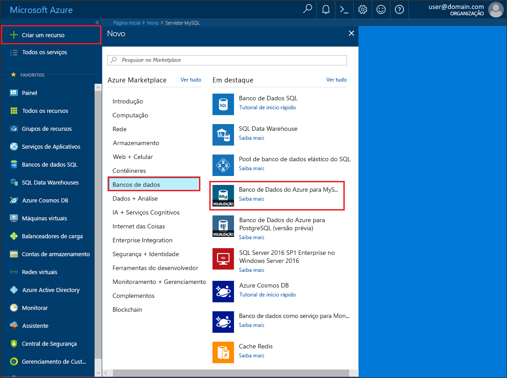
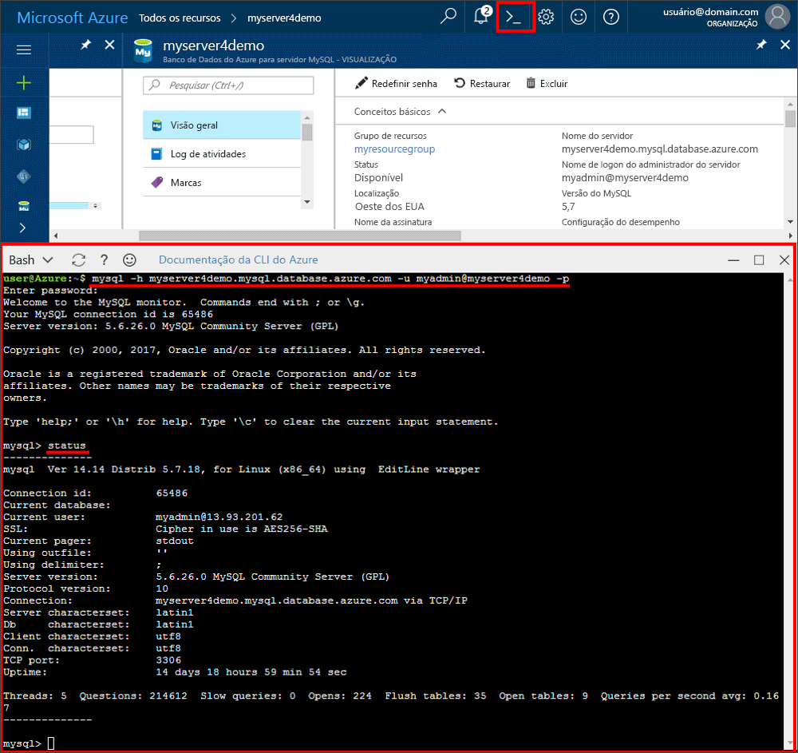

# <a name="create-an-azure-database-for-mysql-server-using-azure-portal"></a>Criar um servidor de Banco de Dados do Azure para MySQL usando o portal do Azure

Este artigo o orienta a usar o portal do Azure para criar rapidamente um servidor de Banco de Dados do Azure para MySQL de exemplo em aproximadamente cinco minutos. 

Se você não tiver uma assinatura do Azure, crie uma conta [gratuita](https://azure.microsoft.com/free/) antes de começar.

## <a name="log-in-to-azure"></a>Fazer logon no Azure
Primeiro, abra seu navegador da Web e navegue até o [portal do Microsoft Azure](https://portal.azure.com/). Insira suas credenciais para fazer logon no portal. A exibição padrão é o painel de serviço.


## <a name="create-azure-database-for-mysql-server"></a>Criar um servidor de Banco de Dados do Azure para MySQL

1. Navegue até **Bancos de dados** > **MySQL**. Se você não encontrar o Servidor do Banco de Dados do Azure para MySQL na categoria **Bancos de Dados**, clique em **Ver todos** para mostrar todos os serviços de banco de dados disponíveis. Você também pode digitar **MySQL** na caixa de pesquisa para localizar rapidamente o serviço.


2. Clique no ícone **MySQL** e depois em **Criar**.
Em nosso exemplo, preencha a página do Banco de Dados do Azure para MySQL com as seguintes informações:

| **Campo de Formulário** | **Descrição do Campo** |
|----------------|-----------------------|
| *Nome do servidor* | mysqlserver4demo (o nome do servidor é globalmente exclusivo) |
| *Assinatura* | MySQLaaS (selecione na lista suspensa) |
| *Grupo de recursos* | myresource (crie um grupo de recursos ou use um existente) |
| *Logon de administrador do servidor* | myadmin (nome da conta do administrador de configuração) |
| *Senha* | configurar senha da conta do administrador |
| *Confirmar senha* | confirmar senha da conta do administrador |
| *Localidade* | Europa Setentrional (escolha entre **Europa Setentrional** e **Oeste dos EUA**) |
| *Versão* | 5.6 (escolha a versão do servidor MySQL) |
| *Configurar o desempenho* | Básico (escolha **Nível de desempenho**, **Unidades de Computação**, **Armazenamento** e, em seguida, clique em **OK**) |


Depois de alguns minutos, o servidor do Banco de Dados do Azure para MySQL será provisionado e estará em execução. Na barra de ferramentas, clique no botão **Notificações** (ícone de sino) para monitorar o processo de implantação.

> [!TIP]
> Recomendamos que coloque os serviços do Azure na mesma região e selecione o local mais próximo de você. Além disso, marque a opção **Fixar no painel** para permitir o controle fácil de suas implantações.

## <a name="configure-the-firewall"></a>Configurar o firewall
Antes de conectar-se pela primeira vez ao Banco de Dados do Azure para MySQL no cliente, configure o firewall e adicione o endereço IP da rede pública do cliente (ou intervalo de endereços IP) à lista de permissões.

1. Clique em seu servidor recém-criado e depois clique em **Configurações**.
  

2. Na seção **GERAL**, clique em **configurações do Firewall**. Clique em **Adicionar Meu IP** para adicionar o endereço IP do computador local ou para configurar um intervalo de endereços IP. Lembre-se de clicar em **Salvar** depois de criar as regras.
  

## <a name="get-connection-information"></a>Obter informações de conexão
Obtenha o nome de domínio totalmente qualificado para o servidor do Azure MySQL no portal do Azure. Use o nome de domínio totalmente qualificado para se conectar ao servidor usando a ferramenta de linha de comando **mysql.exe**.

1.    No [portal do Azure](https://portal.azure.com/), clique em **Todos os recursos** no menu à esquerda e clique no servidor de Banco de Dados do Azure para MySQL.

2.    Clique em **Propriedades**. Anote **NOME DO SERVIDOR** e **LOGON DE ADMINISTRADOR DO SERVIDOR**.
Neste exemplo, o nome do servidor é *mysql4doc.database.windows.net* e o logon de administrador do servidor é *mysqladmin@mysql4doc*.

## <a name="connect-to-the-server-using-mysqlexe-command-line-tool"></a>Conectar-se ao servidor usando a ferramenta de linha de comando mysqlexe
É possível criar vários bancos de dados em um servidor MySQL. Não há nenhum limite para o número de bancos de dados que podem ser criados, mas vários bancos de dados compartilham os mesmos recursos de servidor.  Para conectar-se ao servidor usando a ferramenta de linha de comando **mysql.exe**, abra o **Azure Cloud Shell** no portal e insira o seguinte:

1. Conecte-se ao servidor usando a ferramenta de linha de comando **mysql**:
```dos
 mysql -h mysqlserver4demo.database.windows.net -u myadmin@mysqlserver4demo -p
```

2. Exibir o status do servidor:
```dos
 mysql> status
```
  

> [!TIP]
> Para obter informações sobre outros comandos, consulte [Manual de Referência do MySQL 5.6 – Capítulo 4.5.1](https://dev.mysql.com/doc/refman/5.6/en/mysql.html).

## <a name="connect-to-the-server-using-the-mysql-workbench-gui-tool"></a>Conectar-se ao servidor usando a ferramenta GUI do MySQL Workbench
1.    Inicie o aplicativo MySQL Workbench no computador cliente. É possível baixar e instalar o MySQL Workbench [aqui](https://dev.mysql.com/downloads/workbench/).

2.    Na caixa de diálogo **Configurar Nova Conexão**, insira as seguintes informações na guia **Parâmetros**:

| **Parâmetros** | **Descrição** |
|----------------|-----------------|
|    *Nome da Conexão* | especifique um nome para essa conexão (isso pode ser qualquer coisa) |
| *Método de Conexão* | escolha o Padrão (TCP/IP) |
| *Nome do host* | mycliserver.database.windows.net (NOME DO SERVIDOR que você anotou anteriormente) |
| *Porta* | 3306 |
| *Nome de Usuário* | myadmin@mycliserver(LOGON DE ADMINISTRADOR DO SERVIDOR que você anotou anteriormente) |
| *Senha* | você pode armazenar a senha da conta do administrador no cofre |


3.    Clique em **Testar Conexão** para testar se todos os parâmetros estiverem configurados corretamente.

4.    Agora, é possível clicar na conexão recém-criada para se conectar ao servidor com êxito.

> O SSL é imposto por padrão no servidor que requer configuração adicional para se conectar com êxito. Consulte [Configurar conectividade SSL em seu aplicativo para se conectar com segurança ao Banco de Dados do Azure para MySQL](./howto-configure-ssl.md).  Caso queira desabilitar o SSL para esse início rápido, você pode ir até "Segurança de conexão" no portal para desabilitar a imposição de SSL.

## <a name="clean-up-resources"></a>Limpar recursos

Se não precisar desses recursos para outro início rápido/tutorial, você poderá excluí-los ao fazer o seguinte:

1. No menu à esquerda no portal do Azure, clique em **Grupos de recursos** e depois em **myresource**. 
2. Em sua página de grupo de recursos, clique em **Excluir**, digite **myresource** na caixa de texto e clique **Excluir**.

## <a name="next-steps"></a>Próximas etapas

> [!div class="nextstepaction"]
> [Criar seu primeiro Banco de Dados do Azure para o banco de dados do MySQL](./tutorial-design-database-using-portal.md)


