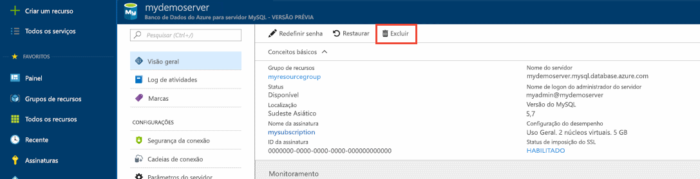

# <a name="create-an-azure-database-for-mysql-server-by-using-the-azure-portal"></a>Criar um servidor de Banco de Dados do Azure para MySQL usando o portal do Azure
O Banco de Dados do Azure para MySQL é um serviço gerenciado usado para executar, gerenciar e dimensionar Bancos de Dados MySQL altamente disponíveis na nuvem. Este Guia de Início Rápido mostra como criar um Banco de Dados do Azure para o servidor MySQL em aproximadamente cinco minutos usando o portal do Azure.  

Caso você não tenha uma assinatura do Azure, crie uma [conta gratuita do Azure](https://azure.microsoft.com/free/) antes de começar.

## <a name="sign-in-to-azure"></a>Entrar no Azure
Abra seu navegador da Web e vá para o [portal do Azure](https://portal.azure.com/). Insira suas credenciais para entrar no portal. A exibição padrão é o painel de serviço.

## <a name="create-an-azure-database-for-mysql-server"></a>Criar um servidor de Banco de Dados do Azure para MySQL
Crie um Banco de Dados do Azure para o servidor MySQL com um conjunto definido de recursos de [computação e armazenamento](./concepts-compute-unit-and-storage.md). Crie o serviço dentro de um [Grupo de recursos do Azure](../azure-resource-manager/resource-group-overview.md).

Siga estas etapas para criar um Banco de Dados do Azure para o servidor MySQL:

1. Selecione o botão **Novo** (+) no canto superior esquerdo do portal.

2. Selecione **Bancos de Dados** > **Banco de Dados do Azure para MySQL**. Você também pode digitar **MySQL** na caixa de pesquisa para localizar o serviço.

    

4. Preencha o formulário de detalhes do novo servidor com as seguintes informações, conforme mostrado na imagem anterior:

    **Configuração** | **Valor sugerido** | **Descrição do campo** 
    ---|---|---
    Nome do servidor | Nome de servidor exclusivo | Escolha um nome exclusivo que identifica o Banco de Dados do Azure para o servidor MySQL. Por exemplo, myserver4demo. O nome de domínio *mysql.database.azure.com* é acrescentado ao nome do servidor fornecido. O nome do servidor pode conter apenas letras minúsculas, números e o caractere de hífen (-). Ele deve conter de 3 a 63 caracteres.
    Assinatura | Sua assinatura | Selecione a assinatura do Azure que você deseja usar para o servidor. Se você tem várias assinaturas, escolha a assinatura na qual recebe a cobrança do recurso.
    Grupo de recursos | myresourcegroup | Forneça um novo nome de um grupo de recursos ou um existente.
    Logon de administrador do servidor | myadmin | Uma conta de logon a ser usada ao se conectar ao servidor. O nome de logon do administrador não pode ser **azure_superusuário**, **admin**, **administrador**, **raiz**, **convidado** ou **público**.
    Senha | *Sua escolha* | Forneça uma nova senha para a conta do administrador do servidor. Ela deve conter de 8 a 128 caracteres. A senha deve conter caracteres de três das seguintes categorias: letras maiúsculas, letras minúsculas, números (0-9) e caracteres não alfanuméricos (!, $, #, % e assim por diante).
    Confirmar senha | *Sua escolha*| Confirme a senha da conta do administrador.
    Local | *A região mais próxima de seus usuários*| Escolha o local mais próximo para os usuários ou para outros aplicativos do Azure.
    Versão | *A versão mais recente*| A versão mais recente (a menos que você tenha requisitos específicos que exijam uma outra versão).
    Tipo de preço  | **Básico**, **50 Unidades de Computação** **50 GB** | Escolha a camada de serviço e o nível de desempenho do novo banco de dados. Escolha a **camada Básico** na guia na parte superior. Selecione a extremidade esquerda do controle deslizante **Unidades de Computação** para ajustar o valor para a quantidade mínima disponível para este Guia de Início Rápido. Selecione **OK** para salvar a seleção do tipo de preço. Para obter mais informações, veja a captura de tela a seguir.
    Fixar no painel | Verificação | Verifique isso para permitir o acompanhamento fácil do servidor na página do painel frontal do portal do Azure.

    > [!IMPORTANT]
    > O logon de administrador do servidor e a senha especificada aqui são necessários para fazer logon no servidor e em seus bancos de dados posteriormente neste Guia de início rápido. Lembre-se ou registre essas informações para o uso posterior.
    > 

    

4.  Selecione **Criar** para provisionar o servidor. O provisionamento pode levar até 20 minutos.
   
5.  Selecione **Notificações** na barra de ferramentas (ícone de sino) para monitorar o processo de implantação.

## <a name="configure-a-server-level-firewall-rule"></a>Configurar uma regra de firewall no nível de servidor

O serviço do Banco de Dados do Azure para MySQL cria um firewall no nível do servidor. Ele impede que os aplicativos e ferramentas externos se conectem ao servidor e aos bancos de dados no servidor, a menos que uma regra de firewall seja criada para abrir o firewall para endereços IP específicos. 

1.   Após a conclusão da implantação, localize o servidor. Se necessário, você pode pesquisar. Por exemplo, selecione **Todos os Recursos** no menu à esquerda. Digite o nome do servidor, como o exemplo **myserver4demo**, para procurar o servidor recém-criado. Selecione o nome do servidor na lista de resultados da pesquisa. A página **Visão geral** do servidor é aberta e oferece outras opções de configuração.

2. Na página do servidor, selecione **Segurança da conexão**.

3.  No cabeçalho **Regras de firewall**, selecione a caixa de texto em branco na coluna **Nome da Regra** para começar a criar a regra de firewall. 

   

   Para este Guia de Início Rápido, vamos permitir todos os endereços IP no servidor preenchendo as caixas em cada coluna com os seguintes valores:

   Nome da regra | IP Inicial | IP Final 
   ---|---|---
   AllowAllIps |  0.0.0.0 | 255.255.255.255
   
   Não é seguro permitir todos os endereços IP. Este exemplo é fornecido para manter a simplicidade, mas em um cenário do mundo real, você precisará conhecer os intervalos de endereços IP exatos a serem adicionados aos aplicativos e usuários. 

4. Na barra de ferramentas superior da página **Segurança da conexão**, selecione **Salvar**. Antes de prosseguir, aguarde até que a notificação seja exibida, informando que a atualização foi concluída com êxito. 

   > [!NOTE]
   > As conexões ao Banco de Dados do Azure para MySQL se comunicam pela porta 3306. Se estiver tentando se conectar em uma rede corporativa, talvez o tráfego de saída pela porta 3306 não seja permitido. Se esse for o caso, você não poderá se conectar ao seu servidor enquanto o departamento de TI não abrir a porta 3306.
   > 

## <a name="get-the-connection-information"></a>Obter informações de conexão
Para conectar o servidor de banco de dados, você precisa do nome do servidor completo e as credenciais de entrada do administrador. Talvez você tenha anotado esses valores anteriormente no artigo do Guia de início rápido. Caso contrário, você pode encontrar facilmente o nome do servidor e as informações de entrada na página **Visão Geral** ou na página **Propriedades do servidor** no portal do Azure.

Para encontrá-los, execute as seguintes etapas: 

1. Abra a página **Visão geral** do servidor. Anote o **Nome do servidor** e o **Nome de logon de administrador do servidor**. 

2. Passe o cursor sobre cada campo e o ícone de cópia aparecerá à direita do texto. Selecione o ícone de cópia conforme necessário para copiar os valores.

Neste exemplo, o nome do servidor é **myserver4demo.mysql.database.azure.com** e o logon de administrador do servidor é  **myadmin@myserver4demo** .

## <a name="connect-to-mysql-by-using-the-mysql-command-line-tool"></a>Conectar-se ao MySQL usando a ferramenta de linha de comando mysql
Há vários aplicativos que você pode usar para conectar o servidor Banco de Dados do Azure para MySQL. 

Primeiro, usaremos a ferramenta de linha de comando [mysql](https://dev.mysql.com/doc/refman/5.7/en/mysql.html) para ilustrar como se conectar ao servidor. Você também pode usar um navegador da Web e o Azure Cloud Shell, conforme descrito aqui, sem precisar instalar nenhum software adicional. Se você tiver o utilitário mysql instalado localmente, poderá também se conectar através dele.

1. Inicie o Azure Cloud Shell pelo ícone de terminal (**>_**) no canto superior direito do portal do Azure.

2.  O Azure Cloud Shell é aberto no navegador, no qual você pode digitar comandos do shell Bash.

    

3. No prompt do Cloud Shell, conecte-se ao Banco de Dados do Azure para servidor MySQL digitando a linha de comando mysql.

    Para conectar-se a um Banco de Dados do Azure para servidor MySQL com o utilitário mysql, use o seguinte formato:

    ```bash
    mysql --host <fully qualified servername> --user <serveradminlogin@servername> -p
    ```

    Por exemplo, o comando abaixo faz a conexão com nosso servidor de exemplo:

    ```azurecli-interactive
    mysql --host myserver4demo.mysql.database.azure.com --user myadmin@myserver4demo -p
    ```

    parâmetro mysql |Valor sugerido|Descrição
    ---|---|---
    --host | *Nome do servidor* | O valor do nome do servidor usado anteriormente na criação do Banco de Dados do Azure para o servidor MySQL. Nosso servidor de exemplo é **myserver4demo.mysql.database.azure.com**. Use o nome de domínio totalmente qualificado (**\*.mysql.database.azure.com**) conforme mostrado no exemplo. Caso não se lembre do nome do servidor, siga as etapas da seção anterior para obter as informações de conexão. 
    --user | *Nome de logon do administrador do servidor* |O nome de usuário de logon do administrador do servidor fornecido ao criar o Banco de Dados do Azure para o servidor MySQL anteriormente. Caso não se lembre do nome de usuário, siga as etapas da seção anterior para obter as informações de conexão. O formato é *username@servername*.
    -p | *Aguarde até a solicitação* |Quando solicitado, forneça a mesma senha fornecida quando você criou o servidor. Observe que os caracteres da senha digitados não são mostrados no prompt do Bash quando você os digita. Depois de inserir a senha, selecione **Enter**.

   Uma vez conectado, o utilitário mysql exibe um prompt `mysql>` para você digitar comandos. 

   Confira este exemplo de saída de mysql:

    ```bash
    Welcome to the MySQL monitor.  Commands end with ; or \g.
    Your MySQL connection id is 65505
    Server version: 5.6.26.0 MySQL Community Server (GPL)
    
    Copyright (c) 2000, 2017, Oracle and/or its affiliates. All rights reserved.
    
    Oracle is a registered trademark of Oracle Corporation and/or its
    affiliates. Other names may be trademarks of their respective
    owners.

    Type 'help;' or '\h' for help. Type '\c' to clear the current input statement.
    
    mysql>
    ```
    > [!TIP]
    > Se o firewall não estiver configurado para permitir o endereço IP do Azure Cloud Shell, o seguinte erro ocorrerá:
    >
    > ERRO 2003 (28000): o cliente com o endereço IP 123.456.789.0 não tem permissão para acessar o servidor.
    >
    > Para resolver o erro, verifique se a configuração do servidor corresponde às etapas na seção “Configurar uma regra de firewall de nível de servidor” do artigo.

4. Para garantir que a conexão está funcionando, exiba o status do servidor digitando `status` no prompt mysql>.

    ```sql
    status
    ```

   > [!TIP]
   > Para saber mais sobre outros comandos, veja [Manual de Referência do MySQL 5.7 – Capítulo 4.5.1](https://dev.mysql.com/doc/refman/5.7/en/mysql.html).

5.  Crie um banco de dados em branco no prompt **mysql>** digitando o seguinte comando:
    ```sql
    CREATE DATABASE quickstartdb;
    ```
    O comando pode levar alguns minutos para ser concluído. 

    Dentro de um banco de dados do Azure para o servidor MySQL, você pode criar um ou mais bancos de dados. Você pode optar por criar um banco de dados por servidor para utilizar todos os recursos ou criar vários bancos de dados para compartilhar os recursos. Não há nenhum limite para o número de bancos de dados que você pode criar, mas vários bancos de dados compartilham os mesmos recursos de servidor. 

6. Liste os bancos de dados no prompt **mysql>** digitando o seguinte comando:

    ```sql
    SHOW DATABASES;
    ```

7.  Digite `\q` e, em seguida, selecione a tecla **Enter** para sair da ferramenta mysql. Quando terminar, você poderá fechar o Azure Cloud Shell.

Agora, você conectou o Banco de Dados do Azure para servidor MySQL e criou um banco de dados do usuário em branco. Continue na próxima seção para ver um exercício semelhante. O próximo exercício conecta-se ao mesmo servidor usando outra ferramenta comum, o MySQL Workbench.

## <a name="connect-to-the-server-by-using-the-mysql-workbench-gui-tool"></a>Conectar-se ao servidor usando a ferramenta GUI do MySQL Workbench
Para se conectar ao servidor usando a ferramenta de interface gráfica do usuário MySQL Workbench, execute as seguintes etapas:

1.  Abra o aplicativo MySQL Workbench no computador cliente. Você pode baixar e instalar o MySQL Workbench em [Baixar MySQL Workbench](https://dev.mysql.com/downloads/workbench/).

2. Crie uma nova conexão. Clique no ícone de sinal de adição (+) ao lado do título **Conexões MySQL**.

3. Na caixa de diálogo **Configurar Nova Conexão**, insira as informações de conexão de servidor na guia **Parâmetros**. Os valores de espaço reservado são mostrados como um exemplo. Substitua o Nome de Host, o Nome de Usuário e a Senha por seus próprios valores.

    

    |Configuração |Valor sugerido|Descrição do campo|
    |---|---|---|
     Nome da conexão | Conexão de demonstração | Um rótulo para essa conexão. |
    Método de conexão | Padrão (TCP/IP) | Padrão (TCP/IP) é suficiente. |
    Nome do host | *Nome do servidor* | O valor do nome do servidor usado ao criar o Banco de Dados do Azure para o servidor MySQL anteriormente. Nosso servidor de exemplo é **myserver4demo.mysql.database.azure.com**. Use o nome de domínio totalmente qualificado (**\*.mysql.database.azure.com**) conforme mostrado no exemplo. Caso não se lembre do nome do servidor, siga as etapas da seção anterior para obter as informações de conexão.|
     Porta | 3306 | A porta a ser usada ao se conectar ao Banco de Dados do Azure para servidor MySQL. |
    Nome de Usuário |  *Nome de logon do administrador do servidor* | A informação de logon do administrador do servidor fornecido ao criar o Banco de Dados do Azure para o servidor MySQL anteriormente. Nosso nome de usuário de exemplo é **myadmin@myserver4demo**. Caso não se lembre do nome de usuário, siga as etapas da seção anterior para obter as informações de conexão. O formato é *username@servername*.
    Senha | *Sua senha* | Selecione o botão **Armazenar no Cofre...** para salvar a senha. |

4. Selecione **Testar Conectividade** para testar se todos os parâmetros estão configurados corretamente. Em seguida, selecione **OK** para salvar a conexão. 

    > [!NOTE]
    > O SSL é imposto por padrão no servidor e requer configuração adicional para se conectar com êxito. Para saber mais, veja [Configurar conectividade SSL em seu aplicativo para se conectar com segurança ao Banco de Dados do Azure para MySQL](./howto-configure-ssl.md). Para desabilitar o SSL para este Guia de Início Rápido, vá para o portal do Azure. Selecione a página Segurança de conexão para desabilitar o botão de alternância de conexão **Impor SSL**.

## <a name="clean-up-resources"></a>Limpar recursos
Limpe os recursos criados no Guia de início rápido de duas maneiras. Você pode excluir o [grupo de recursos do Azure](../azure-resource-manager/resource-group-overview.md), que inclui todos os recursos no grupo de recursos. Se desejar manter os outros recursos intactos, exclua apenas um recurso de servidor.

> [!TIP]
> Outros Guias de Início Rápido na coleção aproveitam este Guia de Início Rápido. Se você pretende continuar trabalhando com Guias de início rápido, não limpe os recursos criados neste Guia de início rápido. Se você não planeja continuar, use as seguintes etapas para excluir todos os recursos criados com esse Guia de Início Rápido.
>

Para excluir o grupo de recursos inteiro, incluindo o servidor criado recentemente, siga as seguintes etapas:

1.  Encontre o grupo de recursos no portal do Azure. No menu à esquerda, selecione **Grupos de recursos**e selecione o nome do seu grupo de recursos (como o nosso exemplo, **myresourcegroup**).

2.  Na página do grupo de recursos, selecione **Excluir**. Em seguida, digite o nome do grupo de recursos, como o nosso exemplo **myresourcegroup**, na caixa para confirmar a exclusão e selecione **Excluir**.

Para excluir apenas o servidor criado recentemente, execute as seguintes etapas:

1.  Encontre seu servidor no portal do Azure, se já não estiver com ele aberto. No menu à esquerda no portal do Azure, selecione **Todos os recursos**. Em seguida, procure o servidor que você criou.

2.  Na página **Visão Geral**, selecione **Excluir**. 

    

3.  Confirme o nome do servidor que deseja excluir e exiba sob ele os bancos de dados que são afetados. Digite o nome do servidor na caixa (como nosso exemplo **myserver4demo**). Selecione **Excluir**.

## <a name="next-steps"></a>Próximas etapas

> [!div class="nextstepaction"]
> [Criar seu primeiro Banco de Dados do Azure para o banco de dados do MySQL](./tutorial-design-database-using-portal.md)

