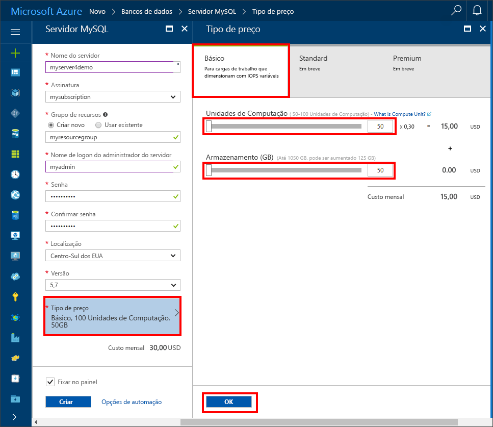

# <a name="design-your-first-azure-database-for-mysql-database"></a>Projetar seu primeiro Banco de Dados do Azure para o banco de dados MySQL

O Banco de Dados do Azure para MySQL é um serviço gerenciado que permite executar, gerenciar e dimensionar bancos de dados altamente disponíveis do MySQL na nuvem. Usando o Portal do Azure, você pode gerenciar facilmente seu servidor e projetar um banco de dados.

Neste tutorial, você usará o Portal do Azure para aprender a:

> [!div class="checklist"]
> * Criar um Banco de Dados do Azure para MySQL
> * Configurar o firewall do servidor
> * Use a [ferramenta de linha de comando do mysql](https://dev.mysql.com/doc/refman/5.6/en/mysql.html) para criar um banco de dados
> * Carregar dados de exemplo
> * Consultar dados
> * Atualizar dados
> * Restaurar dados

## <a name="log-in-to-the-azure-portal"></a>Faça logon no Portal do Azure
Abra seu navegador da Web favorito e visite o [Portal do Microsoft Azure](https://portal.azure.com/). Insira suas credenciais para fazer logon no portal. A exibição padrão é o painel de serviço.

## <a name="create-an-azure-database-for-mysql-server"></a>Criar um Banco de Dados do Azure para o servidor MySQL
Um Banco de Dados do Azure para o servidor MySQL é criado com um conjunto definido de recursos de [computação e armazenamento](./concepts-compute-unit-and-storage.md). O servidor é criado dentro de um [Grupo de recursos do Azure](https://docs.microsoft.com/en-us/azure/azure-resource-manager/resource-group-overview).

1.    Navegue até **Bancos de dados** -> **MySQL**. Se você não encontrar o Servidor MySQL na categoria **Bancos de Dados**, clique em **Ver todos** para mostrar todos os serviços de banco de dados disponíveis. Você também pode digitar **MySQL** na caixa de pesquisa para localizar rapidamente o serviço.


2.    Clique em **MySQL** e depois em **Criar**.

Em nosso exemplo, preencha o formulário do Banco de Dados do Azure para MySQL com as seguintes informações:

| **Campo de Formulário** | **Descrição do Campo** |
|----------------|-----------------------|
| *Nome do servidor* | mysqlserver4demo (o nome do servidor é globalmente exclusivo) |
| *Assinatura* | MySQLaaS (selecione na lista suspensa) |
| *Grupo de recursos* | myresource (crie um grupo de recursos ou use um existente) |
| *Logon de administrador do servidor* | myadmin (nome de conta do administrador de configuração) |
| *Senha* | configurar senha da conta do administrador |
| *Confirmar senha* | confirmar senha da conta do administrador |
| *Localidade* | Europa Setentrional (escolha entre **Europa Setentrional** e **Oeste dos EUA**) |
| *Versão* | 5.6 (escolha a versão do servidor MySQL) |
| *Configurar o desempenho* | Básico (escolha **Nível de desempenho**, **Unidades de Computação**, **Armazenamento** e, em seguida, clique em **OK**) |

Em seguida, clique em **Criar**. Em um ou dois minutos, você terá um novo Banco de Dados para servidor MySQL em execução na nuvem. Na barra de ferramentas, clique no botão **Notificações** para monitorar o processo de implantação.

> [!TIP]
> Recomendamos que você coloque os serviços do Azure na mesma região e selecione o local mais próximo de você. Além disso, marque a opção **Fixar no painel** para permitir o controle fácil de suas implantações.



## <a name="configure-firewall"></a>Configurar o firewall
Os Banco de Dados do Azure para MySQL são protegidos por um firewall. Por padrão, todas as conexões com o servidor e com os bancos de dados dentro do servidor são rejeitadas. Antes de conectar-se pela primeira vez ao Banco de Dados do Azure para MySQL no cliente, configure o firewall e adicione o endereço IP da rede pública do cliente (ou intervalo de endereços IP) à lista de permissões.

1.    Clique em seu servidor recém-criado e depois clique em **Segurança de conexão**.


2.    Você pode **Adicionar Meu IP** ou configurar regras de firewall aqui. Lembre-se de clicar em **Salvar** depois de criar as regras.

Agora você pode se conectar ao servidor usando a ferramenta de linha de comando do mysql ou a ferramenta de GUI do MySQL Workbench.

> O Banco de Dados do Azure para servidor MySQL se comunica pela porta 3306. Se você estiver tentando conectar-se a partir de uma rede corporativa, o tráfego de saída pela porta 3306 poderá não ser permitido pelo firewall de sua rede. Se isso acontecer, você não conseguirá se conectar ao servidor do Azure MySQL, a menos que o departamento de TI abra a porta 3306.

## <a name="get-connection-information"></a>Obter informações de conexão
Obtenha o nome de servidor totalmente qualificado para o servidor do Azure MySQL no Portal do Azure. Use o nome de servidor totalmente qualificado para se conectar ao seu servidor usando a ferramenta de linha de comando do MySQL.

1.    No [Portal do Azure](https://portal.azure.com/), clique em **Todos os recursos** no menu à esquerda e clique em seu Banco de Dados do Azure para servidor MySQL.

2.    Clique em **Propriedades**. Anote **NOME DO SERVIDOR** e **LOGON DE ADMINISTRADOR DO SERVIDOR**.


Neste exemplo, o nome do servidor é *mysql4doc.database.windows.net* e o logon de administrador do servidor é *mysqladmin@mysql4doc*.

## <a name="connect-to-the-server-using-mysql"></a>Conectar-se ao servidor usando mysql
Use a [ferramenta de linha de comando do mysql](https://dev.mysql.com/doc/refman/5.6/en/mysql.html) para estabelecer uma conexão com seu Banco de Dados do Azure para servidor MySQL. Neste exemplo, o comando é:
```cmd
mysql -h mysqlserver4demo.database.windows.net -u myadmin@mysqlserver4demo -p
```

## <a name="create-a-blank-database"></a>Criar um banco de dados vazio
Quando você estiver conectado ao servidor, crie um banco de dados em branco com o qual trabalhar.
```sql
CREATE DATABASE mysampledb;
```

No prompt, execute o seguinte comando para mudar a conexão para esse banco de dados recém-criado:
```sql
USE mysampledb;
```

## <a name="create-tables-in-the-database"></a>Criar tabelas no banco de dados
Agora que você sabe como se conectar ao Banco de Dados do Azure para banco de dados MySQL, podemos falar sobre como concluir algumas tarefas básicas.

Primeiro, criamos uma tabela e a carregamos com alguns dados. Vamos criar uma tabela que armazena informações de inventário.
```sql
CREATE TABLE inventory (
    id serial PRIMARY KEY, 
    name VARCHAR(50), 
    quantity INTEGER
);
```

## <a name="load-data-into-the-tables"></a>Carregar dados nas tabelas
Agora que temos uma tabela, podemos inserir alguns dados nela. Na janela do prompt de comando aberta, execute a consulta a seguir para inserir algumas linhas de dados.
```sql
INSERT INTO inventory (id, name, quantity) VALUES (1, 'banana', 150); 
INSERT INTO inventory (id, name, quantity) VALUES (2, 'orange', 154);
```

Agora, você tem duas linhas de dados de exemplo na tabela criada anteriormente.

## <a name="query-and-update-the-data-in-the-tables"></a>Consultar e atualizar os dados nas tabelas
Execute a seguinte consulta para recuperar as informações da tabela do banco de dados.
```sql
SELECT * FROM inventory;
```

Também é possível atualizar os dados nas tabelas.
```sql
UPDATE inventory SET quantity = 200 WHERE name = 'banana';
```

A linha é atualizada à medida que você recupera os dados.
```sql
SELECT * FROM inventory;
```

## <a name="restore-a-database-to-a-previous-point-in-time"></a>Restaurar um banco de dados em um ponto anterior no tempo
Imagine que você excluiu acidentalmente essa tabela. Isso é algo que você não pode se recuperar facilmente. O Banco de Dados do Azure para MySQL permite que você volte até qualquer ponto no tempo, até os últimos 35 dias, e restaure esse ponto no tempo em um novo servidor. Use esse novo servidor para recuperar seus dados excluídos. As etapas a seguir restauram o servidor de exemplo para um ponto anterior à adição da tabela.

1 - Na página do Banco de Dados do Azure para MySQL para o servidor, clique em **Restaurar** na barra de ferramentas. A página **Restaurar** será aberta.


2- Preencha o formulário **Restaurar** com as informações necessárias:

-    Ponto de restauração: selecione um ponto no tempo anterior à alteração do servidor.
-    Servidor de destino: forneça um novo nome de servidor no qual você deseja restaurar.
-    Local: não é possível selecionar a região; por padrão, ela é igual ao servidor de origem.
-    Tipo de preço: não é possível alterar esse valor ao restaurar um servidor. Ele é igual ao servidor de origem.


3- Clique em **OK** para restaurar o servidor [em um ponto no tempo](./howto-restore-server-portal.md) anterior à exclusão das tabelas. A restauração de um servidor para um ponto diferente no tempo cria um novo servidor duplicado como o servidor original a partir do ponto no tempo especificado por você, desde que esteja dentro do período de retenção de sua camada de serviço.

## <a name="next-steps"></a>Próximas etapas

Neste tutorial, você usará o Portal do Azure para aprender a:

> [!div class="checklist"]
> * Criar um Banco de Dados do Azure para MySQL
> * Configurar o firewall do servidor
> * Use a [ferramenta de linha de comando do mysql](https://dev.mysql.com/doc/refman/5.6/en/mysql.html) para criar um banco de dados
> * Carregar dados de exemplo
> * Consultar dados
> * Atualizar dados
> * Restaurar dados

[Criar e gerenciar regras de firewall do Banco de Dados do Azure para MySQL usando o Portal do Azure](./howto-manage-firewall-using-portal.md)

