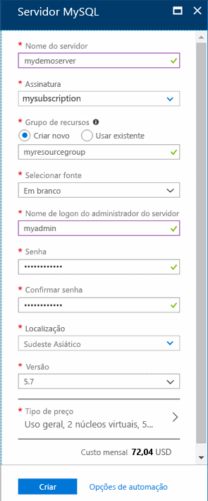
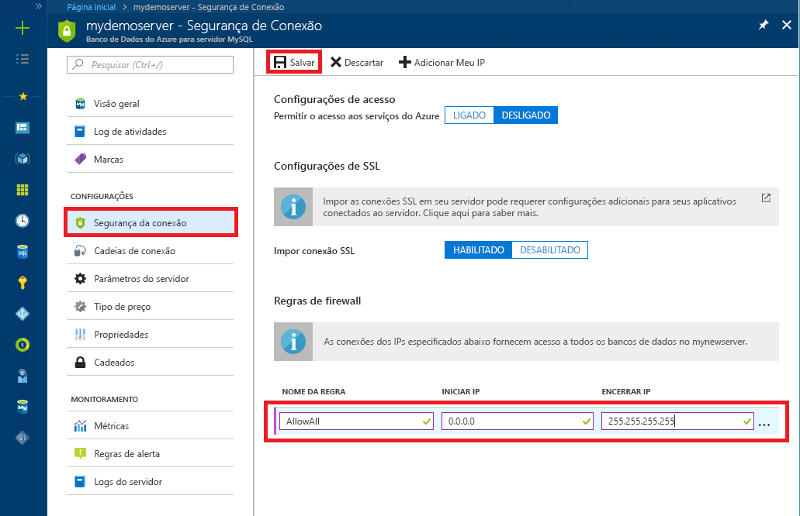

# <a name="tutorial-design-an-azure-database-for-mysql-database-using-the-azure-portal"></a>Tutorial: Criar um Banco de Dados do Azure para banco de dados MySQL usando o Portal do Azure
O Banco de Dados do Azure para MySQL é um serviço gerenciado que permite executar, gerenciar e dimensionar bancos de dados altamente disponíveis do MySQL na nuvem. Usando o Portal do Azure, você pode gerenciar facilmente seu servidor e projetar um banco de dados.

Neste tutorial, você usará o Portal do Azure para aprender a:

> [!div class="checklist"]
> * Criar um Banco de Dados do Azure para MySQL
> * Configurar o firewall do servidor
> * Usar a ferramenta de linha de comando do MySQL para criar um banco de dados
> * Carregar dados de exemplo
> * Consultar dados
> * Atualizar dados
> * Restaurar dados

## <a name="sign-in-to-the-azure-portal"></a>Entrar no Portal do Azure
Abra seu navegador da Web favorito e visite o [portal do Microsoft Azure](https://portal.azure.com/). Insira suas credenciais para entrar no portal. A exibição padrão é o painel de serviço.

## <a name="create-an-azure-database-for-mysql-server"></a>Criar um Banco de Dados do Azure para o servidor MySQL
Um Banco de Dados do Azure para o servidor MySQL é criado com um conjunto definido de recursos de [computação e armazenamento](./concepts-compute-unit-and-storage.md). O servidor é criado dentro de um [Grupo de recursos do Azure](https://docs.microsoft.com/azure/azure-resource-manager/resource-group-overview).

1. Navegue para **Bancos de Dados** > **Banco de Dados do Azure para MySQL**. Se você não encontrar o Servidor MySQL na categoria **Bancos de Dados**, clique em **Ver todos** para mostrar todos os serviços de banco de dados disponíveis. Você também pode digitar **Banco de Dados do Azure para MySQL** na caixa de pesquisa para localizar rapidamente o serviço.
   
   

2. Clique no bloco **Banco de Dados do Azure para MySQL** e, em seguida, clique em **Criar**. Preencha o formulário do Banco de Dados do Azure para MySQL.
   
   

    **Configuração** | **Valor sugerido** | **Descrição do campo** 
    ---|---|---
    Nome do servidor | Nome de servidor exclusivo | Escolha um nome exclusivo que identifica o Banco de Dados do Azure para o servidor MySQL. Por exemplo, mydemoserver. O nome de domínio *.mysql.database.azure.com* é acrescentado ao nome do servidor fornecido. O nome do servidor pode conter apenas letras minúsculas, números e o caractere de hífen (-). Ele deve conter de 3 a 63 caracteres.
    Assinatura | Sua assinatura | Selecione a assinatura do Azure que você deseja usar para o servidor. Se você tem várias assinaturas, escolha a assinatura na qual recebe a cobrança do recurso.
    Grupo de recursos | *myresourcegroup* | Forneça um novo nome de um grupo de recursos ou um existente.    Grupo de recursos|*myresourcegroup*| Um novo nome do grupo de recursos ou um existente de sua assinatura.
    Selecionar a origem | *Em branco* | Selecione *Em branco* para criar um novo servidor do zero. (Selecione *Backup* se você estiver criando um servidor de um backup de replicação geográfica de um Banco de Dados do Azure para servidor MySQL existente).
    Logon de administrador do servidor | myadmin | Uma conta de logon a ser usada ao se conectar ao servidor. O nome de logon do administrador não pode ser **azure_superusuário**, **admin**, **administrador**, **raiz**, **convidado** ou **público**.
    Senha | *Sua escolha* | Forneça uma nova senha para a conta do administrador do servidor. Ela deve conter de 8 a 128 caracteres. A senha deve conter caracteres de três das seguintes categorias: letras maiúsculas, letras minúsculas, números (0-9) e caracteres não alfanuméricos (!, $, #, % e assim por diante).
    Confirmar senha | *Sua escolha*| Confirme a senha da conta do administrador.
    Local padrão | *A região mais próxima de seus usuários*| Escolha o local mais próximo para os usuários ou para outros aplicativos do Azure.
    Versão | *A versão mais recente*| A versão mais recente (a menos que você tenha requisitos específicos que exijam uma outra versão).
    Tipo de preço  | **Uso geral**, **Gen 4**, **2 vCores**, **5 GB**, **7 dias**, **Com redundância geográfica** | As configurações de computação, armazenamento e backup para o novo servidor. Selecione **Tipo de preço**. Em seguida, selecione a guia **Uso Geral**. *Gen 4*, *2 vCores*, *5 GB*, e *7 dias* são os valores padrão para **Geração de Computação**, **vCore**, **Armazenamento** e **Período de Retenção de Backup**. Você pode deixar esses controles deslizantes como estão. Para habilitar os backups do servidor em armazenamento com redundância geográfica, selecione **Redundância Geográfica** das **Opções de Redundância de Backup**. Para salvar a seleção desse tipo de preço, selecione **OK**. A captura de tela a seguir demonstra essas seleções.
    
   

3. Clique em **Criar**. Em um ou dois minutos, um novo Banco de Dados para servidor MySQL estará em execução na nuvem. Na barra de ferramentas, clique no botão **Notificações** para monitorar o processo de implantação.

## <a name="configure-firewall"></a>Configurar o firewall
Os Banco de Dados do Azure para MySQL são protegidos por um firewall. Por padrão, todas as conexões com o servidor e com os bancos de dados dentro do servidor são rejeitadas. Antes de se conectar ao Banco de Dados do Azure para MySQL pela primeira vez, configure o firewall para adicionar o endereço IP (ou o intervalo de endereços IP) da rede pública do computador cliente.

1. Clique em seu servidor recém-criado e depois clique em **Segurança de conexão**.
   
   
2. Você pode **Adicionar Meu IP** ou configurar regras de firewall aqui. Lembre-se de clicar em **Salvar** depois de criar as regras.
Agora você pode se conectar ao servidor usando a ferramenta de linha de comando do MySQL ou a ferramenta de GUI do MySQL Workbench.

> [!TIP]
> O Banco de Dados do Azure para servidor MySQL se comunica pela porta 3306. Se você estiver tentando conectar-se a partir de uma rede corporativa, o tráfego de saída pela porta 3306 poderá não ser permitido pelo firewall de sua rede. Se isto acontecer, você não poderá se conectar ao MySQL Server do Azure, a menos que o departamento de TI abra a porta 3306.

## <a name="get-connection-information"></a>Obter informações de conexão
Obtenha o **Nome do servidor** e o **Nome de logon do administrador do servidor** totalmente qualificados para o Banco de Dados do Azure para MySQL Server no portal do Azure. Use o nome do servidor totalmente qualificado para se conectar ao servidor usando a ferramenta de linha de comando do MySQL. 

1. No [portal do Azure](https://portal.azure.com/), clique em **Todos os recursos** no menu à esquerda, digite o nome e pesquise o Banco de Dados do Azure para MySQL Server. Selecione o nome do servidor para exibir os detalhes.

2. Na página **Visão geral**, anote o **Nome do Servidor** e o **Nome de logon do administrador do servidor**. Clique no botão Copiar ao lado de cada campo para copiar para a área de transferência.
   

Neste exemplo, o nome do servidor é *mydemoserver.mysql.database.azure.com* e o logon de administrador do servidor é *myadmin@mydemoserver*.

## <a name="connect-to-the-server-using-mysql"></a>Conectar-se ao servidor usando mysql
Use a [ferramenta de linha de comando do mysql](https://dev.mysql.com/doc/refman/5.7/en/mysql.html) para estabelecer uma conexão com seu Banco de Dados do Azure para servidor MySQL. Execute a ferramenta de linha de comando do MySQL no Azure Cloud Shell no navegador ou no próprio computador usando as ferramentas do MySQL instaladas localmente. Para iniciar o Azure Cloud Shell, clique no botão `Try It` em um bloco de código deste artigo ou visite o portal do Azure e clique no ícone `>_` na barra de ferramentas superior direita. 

Digite o comando para se conectar:
```azurecli-interactive
mysql -h mydemoserver.mysql.database.azure.com -u myadmin@mydemoserver -p
```

## <a name="create-a-blank-database"></a>Criar um banco de dados vazio
Quando você estiver conectado ao servidor, crie um banco de dados em branco com o qual trabalhar.
```sql
CREATE DATABASE mysampledb;
```

No prompt, execute o seguinte comando para mudar a conexão para esse banco de dados recém-criado:
```sql
USE mysampledb;
```

## <a name="create-tables-in-the-database"></a>Criar tabelas no banco de dados
Agora que você sabe como se conectar ao Banco de Dados do Azure para MySQL, podemos falar sobre como concluir algumas tarefas básicas:

Primeiro, crie uma tabela e carregue-a com alguns dados. Vamos criar uma tabela que armazena informações de inventário.
```sql
CREATE TABLE inventory (
    id serial PRIMARY KEY, 
    name VARCHAR(50), 
    quantity INTEGER
);
```

## <a name="load-data-into-the-tables"></a>Carregar dados nas tabelas
Agora que você tem uma tabela, insira alguns dados nela. Na janela do prompt de comando aberta, execute a consulta a seguir para inserir algumas linhas de dados.
```sql
INSERT INTO inventory (id, name, quantity) VALUES (1, 'banana', 150); 
INSERT INTO inventory (id, name, quantity) VALUES (2, 'orange', 154);
```

Agora, você tem duas linhas de dados de exemplo na tabela criada anteriormente.

## <a name="query-and-update-the-data-in-the-tables"></a>Consultar e atualizar os dados nas tabelas
Execute a seguinte consulta para recuperar as informações da tabela do banco de dados.
```sql
SELECT * FROM inventory;
```

Também é possível atualizar os dados nas tabelas.
```sql
UPDATE inventory SET quantity = 200 WHERE name = 'banana';
```

A linha é atualizada à medida que você recupera os dados.
```sql
SELECT * FROM inventory;
```

## <a name="restore-a-database-to-a-previous-point-in-time"></a>Restaurar um banco de dados em um ponto anterior no tempo
Imagine que você excluiu acidentalmente uma tabela de banco de dados importante e não consegue recuperar os dados com facilidade. O Banco de Dados do Azure para MySQL permite restaurar o servidor para um ponto no tempo, criando uma cópia dos bancos de dados no novo servidor. Use esse novo servidor para recuperar seus dados excluídos. As etapas a seguir restauram o servidor de exemplo para um ponto anterior à adição da tabela.

1. No portal do Azure, localize o Banco de Dados do Azure para MySQL. Na página **Visão Geral**, clique em **Restaurar** na barra de ferramentas. A página Restaurar é aberta.

   

2. Preencha o formulário **Restaurar** com as informações necessárias.
   
   
   
   - **Ponto de restauração**: selecione um ponto no tempo no qual você deseja restaurar, dentro do período listado. Lembre-se de converter o fuso horário local para UTC.
   - **Restaurar em novo servidor**: forneça um novo nome do servidor no qual você deseja restaurar.
   - **Localização**: a região é o mesma do servidor de origem e não pode ser alterada.
   - **Tipo de preço**: o tipo de preço é o mesmo do servidor de origem e não pode ser alterado.
   
3. Clique em **OK** para restaurar o servidor [em um ponto no tempo](./howto-restore-server-portal.md) anterior à exclusão da tabela. A restauração de um servidor cria uma nova cópia do servidor, a partir do ponto no tempo especificado. 

## <a name="next-steps"></a>Próximas etapas
Neste tutorial, você usará o Portal do Azure para aprender a:

> [!div class="checklist"]
> * Criar um Banco de Dados do Azure para MySQL
> * Configurar o firewall do servidor
> * Usar a ferramenta de linha de comando do MySQL para criar um banco de dados
> * Carregar dados de exemplo
> * Consultar dados
> * Atualizar dados
> * Restaurar dados

> [!div class="nextstepaction"]
> [Como conectar aplicativos ao Banco de Dados do Azure para MySQL](./howto-connection-string.md)
