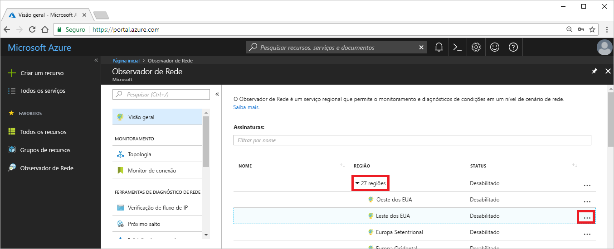

# Tutorial: Diagnosticar um problema de roteamento de rede de máquina virtual usando o portal do Azure

Quando você implanta uma VM (máquina virtual), o Azure cria várias rotas padrão para ela. Você pode criar rotas personalizadas para substituir as rotas padrão do Azure. Às vezes, uma rota personalizada pode fazer com que uma VM não consiga se comunicar com outros recursos. Neste tutorial, você aprenderá como:

> [!div class="checklist"]
> * Criar uma máquina virtual
> * Testar a comunicação com uma URL com a funcionalidade de próximo salto do Observador de Rede
> * Testar a comunicação com um endereço IP
> * Diagnosticar um problema de roteamento e saiba como você pode resolvê-lo

Se preferir, você poderá diagnosticar um problema de roteamento de rede de máquina virtual usando a [CLI do Azure](diagnose-vm-network-routing-problem-cli.md) ou o [Azure PowerShell](diagnose-vm-network-routing-problem-powershell.md).

Se você não tiver uma assinatura do Azure, crie uma [conta gratuita](https://azure.microsoft.com/free/?WT.mc_id=A261C142F) antes de começar.

## Fazer logon no Azure

Faça logon no Portal do Azure em https://portal.azure.com.

## Criar uma máquina virtual

1. Selecione **+ Criar um recurso** localizado no canto superior esquerdo do Portal do Azure.
2. Selecione **Computação** e, em seguida, selecione **Windows Server 2016 Datacenter** ou **VM Ubuntu Server 17.10**.
3. Insira, ou selecione, as informações a seguir, aceite os padrões para as configurações restantes e, em seguida, selecione **OK**:

    |Configuração|Valor|
    |---|---|
    |NOME|myVm|
    |Nome de usuário| Insira um nome de usuário de sua escolha.|
    |Senha| Insira uma senha de sua escolha. A senha deve ter no mínimo 12 caracteres e atender a [requisitos de complexidade definidos](../virtual-machines/windows/faq.md?toc=%2fazure%2fnetwork-watcher%2ftoc.json#what-are-the-password-requirements-when-creating-a-vm).|
    |Assinatura| Selecione sua assinatura.|
    |Grupo de recursos| Selecione **Criar novo** e insira **myResourceGroup**.|
    |Local padrão| Selecione **Leste dos EUA**|

4. Selecione um tamanho para a VM e selecione **Selecionar**.
5. Em **Configurações**, aceite todos os padrões e selecione **OK**.
6. Em **Criar** do **Resumo**, selecione **Criar** para iniciar a implantação da VM. A VM demora alguns minutos para implantar. Aguarde até que a VM conclua a implantação antes de continuar com as etapas restantes.

## Testar comunicação de rede

Para testar a comunicação de rede com o Observador de Rede, primeiro habilite um observador de rede em pelo menos uma região do Azure e, em seguida, use a funcionalidade de próximo salto seguinte do Observador de Rede para testar a comunicação.

### Habilitar o observador de rede

Se você já tiver um observador de rede habilitado em pelo menos uma região, vá para [Usar próximo salto](#use-next-hop).

1. No portal, selecione **Todos os serviços**. Na **caixa Filtro**, insira *Observador de Rede*. Quando o **Observador de Rede** for exibido nos resultados, selecione-o.
2. Selecione **Regiões** para expandi-la e, em seguida, selecione **...** à direita de **Leste dos EUA**, conforme mostrado na seguinte imagem:

    

3. Selecione **Habilitar o Observador de Rede**.

### Usar próximo salto

O Azure cria automaticamente as rotas para destinos padrão. Você pode criar rotas personalizadas que substituem as rotas padrão. Às vezes, as rotas personalizadas podem causar falha na comunicação. Use a funcionalidade de próximo salto do Observador de Rede para determinar qual rota o Azure está usando para encaminhar o tráfego.

1. No portal do Azure, selecione **Próximo salto**, em **Observador de Rede**.
2. Selecione sua assinatura, Selecione sua assinatura, insira ou selecione os seguintes valores e, em seguida, selecione **Próximo salto**, conforme mostrado na seguinte imagem:

    |Configuração                  |Valor                                                   |
    |---------                |---------                                               |
    | Grupo de recursos          | Selecionar myResourceGroup                                 |
    | Máquina virtual         | Selecionar myVm                                            |
    | interface de rede       | myvm – o nome do adaptador de rede pode ser diferente.   |
    | Endereço IP de origem       | 10.0.0.4                                               |
    | Endereço IP de destino  | 13.107.21.200 – Um dos endereços de www.bing.com. |

    

    Após alguns segundos, o resultado informa que o tipo de próximo salto é **Internet** e que a **ID da tabela de rota** é **Rota do Sistema**. Esse resultado permite que você saiba que há uma rota do sistema válida para o destino.

3. Altere o **Endereço IP de destino** para *172.31.0.100* e selecione **Próximo salto** novamente. O resultado retornado informa que **Nenhum** é o **Tipo do próximo salto** e que a **ID da tabela de rota** também é **Rota do Sistema**. Esse resultado permite que você saiba que, embora haja uma rota do sistema válida para o destino, não há nenhum próximo salto para encaminhar o tráfego para o destino.

## Exibir detalhes de uma rota

1. Para analisar o roteamento mais detalhadamente, examine as rotas efetivas para o adaptador de rede. Na caixa de pesquisa na parte superior do portal, insira *myvm* (ou qualquer que seja o nome do adaptador de rede verificado). Quando **myvm** for exibida nos resultados da pesquisa, selecione-a.
2. Selecione **Rotas em vigor** em **SUPORTE + SOLUÇÃO DE PROBLEMAS**, conforme mostrado na seguinte imagem:

    

    Quando você executou o teste usando 13.107.21.200 em [Usar próximo salto](#use-next-hop), a rota com o prefixo de endereço 0.0.0.0/0 foi usada para encaminhar o tráfego para o endereço, pois nenhuma outra rota inclui o endereço. Por padrão, todos os endereços não especificados dentro do prefixo de endereço de outra rota são encaminhados para a Internet.

    No entanto, quando você executou o teste usando 172.31.0.100, o resultado informou que não houve nenhum tipo de próximo salto. Como você pode ver na imagem anterior, que embora haja uma rota padrão para o prefixo 172.16.0.0/12, que inclui o endereço 172.31.0.100, o **TIPO DE PRÓXIMO SALTO** é **Nenhum**. O Azure cria uma rota padrão para 172.16.0.0/12, mas não especifica um tipo de próximo salto até que haja um motivo. Se, por exemplo, você adicionou o intervalo de endereços 172.16.0.0/12 ao espaço de endereço da rede virtual, o Azure alterará o **TIPO DE PRÓXIMO SALTO** para **Rede virtual** da rota. Em seguida, uma verificação mostra a **Rede virtual** como o **TIPO DE PRÓXIMO SALTO**.

## Limpar recursos

Quando não for mais necessário, exclua o grupo de recursos e todos os recursos que ele contém:

1. Insira *myResourceGroup* na caixa **Pesquisar** na parte superior do portal. Quando aparecer **myResourceGroup** nos resultados da pesquisa, selecione-o.
2. Selecione **Excluir grupo de recursos**.
3. Insira *myResourceGroup* para **DIGITAR O NOME DO GRUPO DE RECURSOS:** e selecione **Excluir**.

## Próximas etapas

Neste tutorial, você criou uma VM e o roteamento de rede diagnosticado da VM. Você aprendeu que o Azure cria várias rotas padrão e testou o roteamento para dois destinos diferentes. Saiba mais sobre o [roteamento no Azure](../virtual-network/virtual-networks-udr-overview.md?toc=%2fazure%2fnetwork-watcher%2ftoc.json) e como [criar rotas personalizadas](../virtual-network/manage-route-table.md?toc=%2fazure%2fnetwork-watcher%2ftoc.json#create-a-route).

Para conexões de VM de saída, determine também a latência, o tráfego de rede permitido e negado entre a VM e um ponto de extremidade e a rota usada para um ponto de extremidade, usando a funcionalidade [solução de problemas de conexão](network-watcher-connectivity-portal.md) do Observador de Rede. Saiba como você pode monitorar a comunicação entre uma VM e um ponto de extremidade, como um endereço IP ou uma URL, ao longo do tempo usando a funcionalidade de monitor de conexão do Observador de Rede.

> [!div class="nextstepaction"]
> [Monitorar uma conexão de rede](connection-monitor.md)