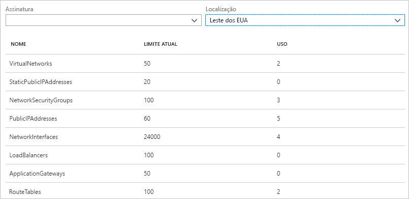
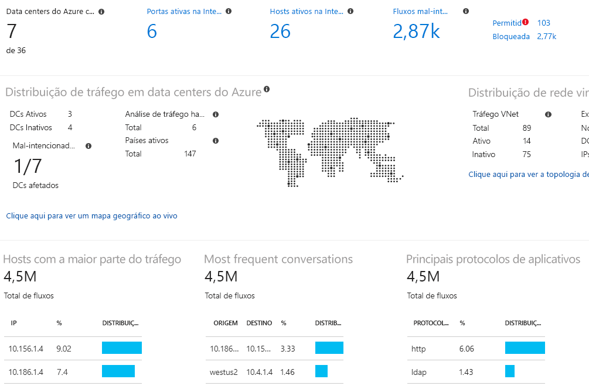

# O que é o Observador de Rede do Azure?

Observador de Rede do Azure fornece ferramentas para monitorar, diagnosticar, exibir métricas e ativar ou desativar os logs de recursos em uma rede virtual do Azure.

## Monitoramento

### Monitorar a comunicação entre uma máquina virtual e um ponto de extremidade

Os pontos de extremidade podem ser outra máquina virtual (VM), um nome de domínio totalmente qualificado (FQDN), um identificador de recurso uniforme (URI) ou endereço IPv4. O recurso do *monitor de conexão* monitora a comunicação em um intervalo regular e informa sobre alterações de topologia de rede entre a VM e o ponto de extremidade, latência e acessibilidade. Por exemplo, você pode ter um servidor de web VM que se comunica com uma VM do servidor de banco de dados. Alguém na sua organização talvez, desconhecido para você, aplica uma regra personalizada de segurança de rede ou rota para o servidor web ou servidor de banco de dados VM ou sub-rede.

Se um ponto de extremidade ficar inacessível, solucionar problemas de conexão informará o motivo. Possíveis motivos são um problema de resolução de nome DNS, a CPU, memória ou firewall com o sistema operacional de uma máquina virtual ou o tipo de salto de uma rota personalizado ou regra de segurança para a VM ou sub-rede de conexão de saída. Saiba mais sobre [as regras de segurança](../virtual-network/security-overview.md?toc=%2fazure%2fnetwork-watcher%2ftoc.json#security-rules) e [encaminhe tipos de salto](../virtual-network/virtual-networks-udr-overview.md?toc=%2fazure%2fnetwork-watcher%2ftoc.json) no Microsoft Azure.

O monitor de Conexão também fornece a latência média, mínima e máxima observada ao longo do tempo. Depois de obter a latência de uma conexão, você pode achar que é capaz de reduzir a latência, movendo os recursos do Azure para diferentes regiões do Microsoft Azure. Saiba mais sobre como determinar [latências relativas entre as regiões do Microsoft Azure e os provedores de serviço de internet](#determine-relative-latencies-between-azure-regions-and-internet-service-providers) e como monitorar a comunicação entre uma máquina virtual e um ponto de extremidade com o [monitor de conexão](connection-monitor.md). Se, em vez disso, você testar uma conexão em um ponto no tempo, em vez de monitorar a conexão ao longo do tempo, como é feito com o monitor de conexão, use o recurso [solucionar problemas de conexão](#connection-troubleshoot).

O Monitor de Desempenho de Rede é uma solução de monitoramento de rede híbrida baseada na nuvem que ajuda a monitorar o desempenho de rede entre vários pontos em sua infraestrutura de rede. Também ajuda a monitorar a conectividade de rede para serviços e pontos de extremidade do aplicativo e a monitorar o desempenho do Azure ExpressRoute. O Monitor de Desempenho de Rede detecta problemas de tráfego de rede, como blackholing, erros de roteamento e problemas que os métodos de monitoramento de rede convencionais não são capazes de detectar. A solução gera alertas e notifica como e quando um limite é ultrapassado para um link de rede. Ela também garante a detecção oportuna de problemas de desempenho de rede e localiza a origem do problema para determinado segmento de rede ou dispositivo. Saiba mais sobre o [monitor de desempenho de rede](../azure-monitor/insights/network-performance-monitor.md?toc=%2fazure%2fnetwork-watcher%2ftoc.json).

### Exibir recursos em uma rede virtual e suas relações

Como os recursos são adicionados a uma rede virtual, podem ser tornar difíceis de entender quais recursos estão em uma rede virtual e como se relacionam entre si. O recurso de *topologia* permite que você gere um diagrama visual dos recursos em uma rede virtual e as relações entre os recursos. A figura a seguir mostra um diagrama de topologia de exemplo de uma rede virtual que tem três sub-redes, duas VMs, interfaces de rede, endereços IP públicos, grupos de segurança de rede, tabelas de rotas e as relações entre os recursos:

Você pode baixar uma versão editável da imagem no formato svg. Saiba mais sobre [exibição de topologia](view-network-topology.md).

## Diagnósticos

### Diagnosticar problemas de filtragem de tráfego de erro para ou de uma VM

Quando você implanta uma máquina virtual, o Microsoft Azure aplica-se a várias regras de segurança padrão para a máquina virtual que permitem ou negam o tráfego de ou para a máquina virtual. Você pode substituir as regras padrão do Azure ou criar regras adicionais. Em algum momento, uma VM pode se tornar incapaz de se comunicar com outros recursos, devido a uma regra de segurança. O recurso *de verificação do fluxo IP* permite que você especifique um endereço IPv4 de origem e de destino, a porta, o protocolo (TCP ou UDP) e a direção do tráfego (entrada ou saída). Verificar o fluxo IP, em seguida, testa a comunicação e informa se a conexão for bem-sucedida ou se falhou. Se a conexão falhar, verifique se o fluxo IP informa qual regra de segurança permitiu ou negou comunicação, para que você possa resolver o problema. Saiba mais sobre a verificação do fluxo de IP concluindo o tutorial [Diagnosticar um problema de filtragem de tráfego de rede de máquina virtual](diagnose-vm-network-traffic-filtering-problem.md).

### Diagnosticar problemas de roteamento de rede de uma VM

Quando você cria uma rede virtual, o Microsoft Azure cria várias rotas de saída padrão para o tráfego de rede. O tráfego de saída de todos os recursos, como máquinas virtuais, implantados em uma rede virtual, são roteados com base nas rotas de padrão do Microsoft Azure. Você pode substituir as regras padrão do Microsoft Azure ou criar regras adicionais. Você pode achar que uma VM não pode se comunicar com outros recursos devido a uma rota específica. O recurso *próximo salto* permite especificar um endereço IPv4 de origem e de destino. Em seguida, o próximo salto testa a comunicação e informa que tipo de próximo salto é usado para rotear o tráfego. Você pode, em seguida, remover, alterar ou adicionar uma rota, para resolver um problema de roteamento. Saiba mais sobre o recurso [próximo salto](diagnose-vm-network-routing-problem.md).

### Diagnosticar de conexão de saída de uma máquina virtual

O recurso *solucionar problemas de conexão* permite que você teste uma conexão entre uma máquina virtual e outra máquina, um FQDN, um URI ou um endereço IPv4. O teste retorna informações semelhantes retornadas ao usar o recurso [monitor de conexão](#connection-monitor), mas testa a conexão em um ponto no tempo, em vez de monitoramento ao longo do tempo, como o monitor de conexão. Saiba mais sobre como solucionar problemas de conexões usando [solucionar problemas de conexão](network-watcher-connectivity-overview.md).

### Capturar pacotes para e de uma máquina virtual

As opções avançadas de filtragem e os controles ajustados, como o recurso de definir o tempo e as limitações de tamanho, fornecem versatilidade. A captura pode ser armazenada no Armazenamento do Microsoft Azure, o disco da máquina virtual, ou ambos. Em seguida, você pode analisar o arquivo de captura usando várias ferramentas de análise de captura de rede padrão. Saiba mais sobre [captura de pacote](network-watcher-packet-capture-overview.md).

### Diagnosticar problemas com conexões e gateway de rede Virtual do Azure

Os gateways de Rede Virtual fornecem conectividade entre os recursos locais e outras redes virtuais. Para garantir que a comunicação não seja quebrada, é essencial monitorar os gateways e suas conexões. O recurso *diagnóstico VPN* oferece a capacidade de diagnosticar conexões e gateways. O diagnóstico VPN diagnostica a integridade do gateway ou conexão de gateway e informa se um gateway e conexões de gateway, estão disponíveis. Se o gateway ou a conexão não estiver disponível, o diagnóstico VPN informa por que, para que você solucione o problema. Saiba mais sobre o diagnóstico de VPN concluindo o tutorial [Diagnosticar um problema de comunicação entre redes](diagnose-communication-problem-between-networks.md).

### Determinar as latências relativas entre regiões do Microsoft Azure e provedores de serviços de internet

Você pode consultar o Observador de Rede para informações de latência entre as regiões do Microsoft Azure e através de fornecedores de serviço de internet. Quando você conhece as latências entre regiões do Microsoft Azure e em provedores de serviços de internet, você pode implantar os recursos do Microsoft Azure para otimizar o tempo de resposta da rede. Saiba mais sobre [latências relativas](view-relative-latencies.md).

### Exibir regras de segurança para um adaptador de rede

As regras de segurança efetivas para uma interface de rede são uma combinação de todas as regras de segurança aplicadas à interface de rede e a sub-rede da interface de rede está em.  O recurso *exibição de grupo de segurança* mostra todas as regras de segurança aplicadas à interface de rede, a sub-rede que interface de rede está e a agregação de ambas. Com uma compreensão dessas regras, são aplicadas a uma interface de rede, você pode adicionar, remover ou alterar as regras, se permitirem ou negar o tráfego que você quer mudar. Saiba mais sobre segurança a [exibição do grupo de segurança](network-watcher-security-group-view-overview.md).

## Métricas

Há [limites](../azure-subscription-service-limits.md?toc=%2fazure%2fnetwork-watcher%2ftoc.json#azure-resource-manager-virtual-networking-limits) para o número de recursos de rede que você pode criar em uma assinatura do Microsoft Azure e região. Se você atender os limites, não será possível criar mais recursos dentro da assinatura ou região. O recurso de *limite de assinatura de rede* fornece um resumo de quantos de cada recurso de rede você implantou em uma assinatura e região qual é o limite para o recurso. A figura a seguir mostra o resultado parcial para recursos de rede implantados na região Leste dos EUA para uma assinatura de exemplo:

As informações são úteis ao planejar implantações futuras de recursos.

## Logs

### Analisar o tráfego de ou para um grupo de segurança de rede

Os grupos de segurança de rede (NSG) permitem ou negam o tráfego de entrada ou saída para uma interface de rede em uma VM. O recurso *log do fluxo NSG* permite que você faça o logon do endereço IP de origem e de destino, a porta, protocolo, e se o tráfego é permitido ou negado por um NSG. Você pode analisar logs usando uma variedade de ferramentas, como o Power BI e o recurso *análise de tráfego*. A análise de tráfego fornece visualizações avançadas dos dados gravados nos logs de fluxo NSG. A imagem a seguir mostra algumas das informações e visualizações que apresenta análise de dados de log do fluxo NSG:

Saiba mais sobre os logs de fluxo de NSG concluindo o tutorial [Registrar o tráfego de rede de uma máquina virtual](network-watcher-nsg-flow-logging-portal.md) e como implementar a [análise de tráfego](traffic-analytics.md).

### Exibir logs de diagnóstico para recursos de rede

Você pode habilitar o log de diagnóstico para recursos de rede do Microsoft Azure, como grupos de segurança de rede, endereços IP públicos, balanceadores de carga, gateways de rede virtual e os gateways de aplicativos. O recurso *logs de diagnóstico* fornece uma única interface para habilitar e desabilitar logs de diagnóstico de recursos de rede para qualquer recurso de rede existente que gera um log de diagnóstico. Você pode exibir os logs de diagnóstico usando ferramentas como o Microsoft Power BI e os logs do Azure Monitor. Para saber mais sobre como analisar os logs de diagnóstico de rede do Azure, confira [Soluções de rede do Azure nos logs do Azure Monitor](../azure-monitor/insights/azure-networking-analytics.md?toc=%2fazure%2fnetwork-watcher%2ftoc.json).

## Habilitação automática do Observador de Rede
Quando você cria ou atualiza uma Rede Virtual do Microsoft Azure em sua assinatura, o Observador de Rede será ativado automaticamente na região da sua rede virtual. Não há impacto em seus recursos ou cobranças associadas para ativar automaticamente o Observador de Rede. Para saber mais, veja [Criação do Observador de Rede](network-watcher-create.md).

## Próximas etapas

Agora, você tem uma visão geral do Observador de Rede do Azure. Para começar a usar o Observador de Rede, diagnostique um problema de comunicação comum para e a partir de uma máquina virtual usando a verificação de fluxo IP. Para saber como, consulte o início rápido [Diagnosticar um problema de filtro de tráfego de rede de máquina virtual](diagnose-vm-network-traffic-filtering-problem.md).
