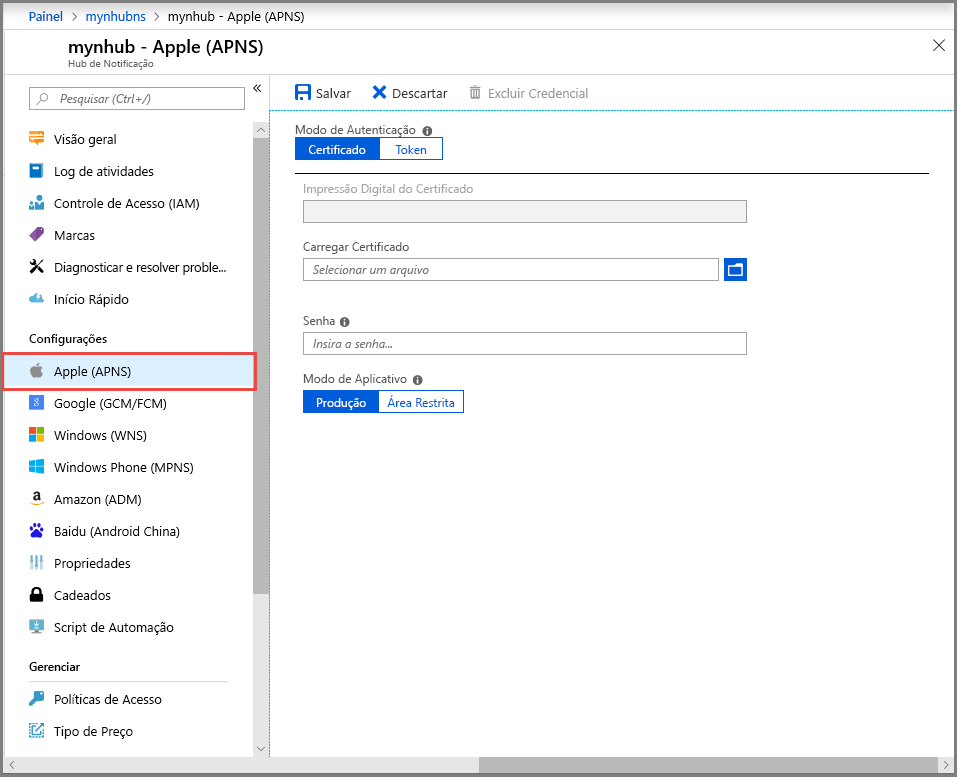
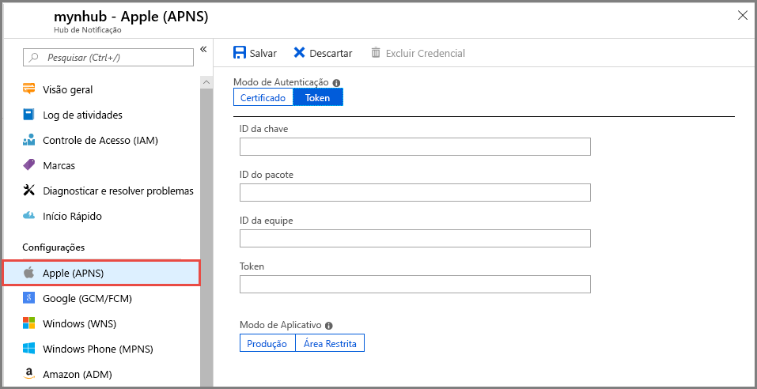

# Definir configurações de serviço de notificação por Push da Apple (APNS) para um hub de notificação no portal do Azure
Este artigo mostra como definir as configurações de serviço de notificação por Push da Apple (APNS) para um hub de notificação do Azure usando o portal do Azure. 

## Pré-requisitos
Se você ainda não criou um hub de notificação, crie um agora. Para obter mais informações, consulte [criar um hub de notificação do Azure no portal do Azure](create-notification-hub-portal.md). 

## Configurar o serviço de notificação por Push da Apple

O procedimento a seguir fornece as etapas para definir as configurações de serviço de notificação por Push da Apple (APNS) para um hub de notificação:

1. No portal do Azure, sobre o **Hub de notificação** página, selecione **Apple (APNS)** no menu à esquerda.

1. Para **modo de autenticação**, selecione **certificado** ou **Token**.

    a. Se você selecionar **certificado**:
   * Selecione o ícone de arquivo e, em seguida, selecione a *. p12* arquivo que você deseja carregar.
   * Digite uma senha.
   * Selecione o modo **Sandbox**. Ou, para enviar notificações por push para usuários que adquiriram seu aplicativo da loja, selecione **produção** modo.

     

   b. Se você selecionar **Token**:

   * Insira os valores para **ID da chave**, **ID do pacote**, **ID da equipe**, e **Token**.
   * Selecione o modo **Sandbox**. Ou, para enviar notificações por push para usuários que adquiriram seu aplicativo da loja, selecione **produção** modo.

     

## Próximas etapas
Para obter um tutorial com instruções passo a passo para enviar notificações para dispositivos iOS, consulte o artigo a seguir: [Notificações por push para dispositivos iOS usando os Hubs de notificação e APNS](notification-hubs-ios-apple-push-notification-apns-get-started.md)
