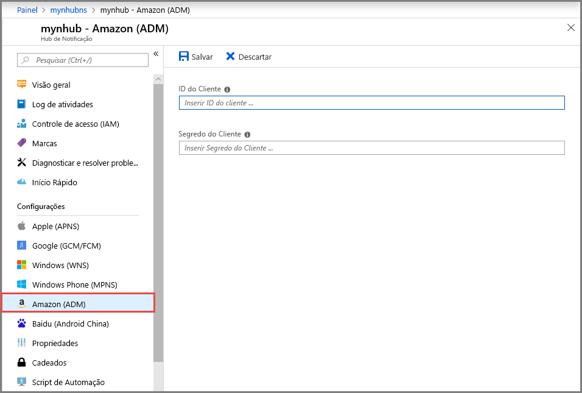

# Configurar notificações por push em um hub de notificação no portal do Azure

Os hubs de notificação do Azure fornecem um mecanismo por push que é fácil de usar e que pode ser dimensionado. Use os Hubs de Notificação para enviar notificações para qualquer plataforma (iOS, Android, Windows, Kindle, Baidu) e de qualquer back-end (nuvem ou local). Para obter mais informações, consulte [O que Hubs de Notificações do Microsoft Azure?](notification-hubs-push-notification-overview.md).

Neste início rápido, você usará as configurações do sistema de notificação de plataforma (PNS) nos Hubs de Notificação para configurar as notificações em várias plataformas. O guia de início rápido mostra as etapas a serem executadas no portal do Azure.

Se você ainda não criou um hub de notificação, crie um agora. Para obter mais informações, consulte [Criar um hub de notificação do Azure no portal do Azure](create-notification-hub-portal.md). 

## Apple Push Notification Service

Para configurar p Apple Push Notification Service (APNS):

1. No portal do Azure, na página **Hub de Notificação** selecione **Apple (APNS)** no menu esquerdo.

1. Para o **Modo de Autenticação**, selecione **Certificado** ou **Token**.

    a. Se você selecionar **Certificado**:
   * Selecione o ícone de arquivo, e em seguida, o arquivo *.p12* que você deseja carregar.
   * Digite uma senha.
   * Selecione o modo **Sandbox**. Ou, para enviar notificação por push aos usuários que compraram seu aplicativo da loja, selecione o modo **Produção**.

     

   b. Se você selecionar **Token**:

   * Insira os valores de **Identificação da chave**, **ID do pacote**, **ID da equipe** e **Token**.
   * Selecione o modo **Sandbox**. Ou, para enviar notificação por push aos usuários que compraram seu aplicativo da loja, selecione o modo **Produção**.

     

Para obter mais informações, confira [Enviar notificações por push para iOS usando os Hubs de Notificação do Microsoft Azure](notification-hubs-ios-apple-push-notification-apns-get-started.md).

## Google Firebase Cloud Messaging

Configurar notificações por push para o Google Firebase Cloud Messaging (FCM):

1. No portal do Azure, na página **Hub de Notificação**, selecione **Google (GCM/FCM)** no menu à esquerda. 
2. Cole a **chave de API** do projeto do FCM salva anteriormente. 
3. Clique em **Salvar**. 

   

Quando você concluir essas etapas, um alerta indica que o hub de notificação foi atualizado com êxito. O botão **Salvar** está desabilitado. 

Para obter mais informações, consulte [Notificação por push para os dispositivos Android usando os Hubs de Notificações do Microsoft Azure e Google FCM](notification-hubs-android-push-notification-google-fcm-get-started.md).

## Serviço de Notificação por Push do Windows

Configurar o Serviço de Notificação por Push do Windows (WNS):

1. No portal do Azure, na página **Hub de Notificação**, selecione **Windows (WNS)** no menu à esquerda.
2. Insira valores para **SID do Pacote** e **Chave de Segurança**.
3. Clique em **Salvar**.

   

Para obter mais informações, consulte [Enviar notificações para aplicativos UWP usando os Hubs de Notificações do Microsoft Azure](notification-hubs-windows-store-dotnet-get-started-wns-push-notification.md).

## Serviço de Notificação por push da Microsoft para Windows Phone

Configurar o Serviço de Notificação por push da Microsoft (MPNS) para Windows Phone: 

1. No portal do Azure, na página **Hub de Notificação**, selecione **Windows Phone (MPNS)** no menu à esquerda.
1. Habilitar notificações por push autenticadas ou não autenticadas:

    a. Para habilitar as notificações por push não autenticadas, selecione **Habilitar envio por push não autenticado** > **Salvar**.

      

   b. Habilite as notificações por push autenticadas:
      * Na barra de ferramentas, selecione **Carregar Certificado**.
      * Selecione o ícone de arquivo e selecione o arquivo de certificado.
      * Insira a senha para o certificado.
      * Selecione **OK**.
      * Na página **Windows Phone (MPNS)**, selecione **Salvar**.

Para obter mais informações, consulte [Enviar notificações por push Windows Phone usando Hubs de Notificação](notification-hubs-windows-mobile-push-notifications-mpns.md).
      
## Amazon Device Messaging

Para configurar notificações por push para o Amazon Device Messaging (ADM):

1. No portal do Azure, na página **Hub de Notificação**, selecione **Amazon (ADM)** no menu à esquerda.
2. Insira valores para **ID do Cliente** e **Segredo do Cliente**.
3. Clique em **Salvar**.
    
   

Para obter mais informações, veja [Introdução ao Hubs de Notificações dos aplicativos Kindle](notification-hubs-kindle-amazon-adm-push-notification.md).

## Baidu (Android China)

Configurar notificações por push para Baidu:

1. No portal do Azure, na página **Hub de Notificação**, selecione **Baidu (Android China)** no menu à esquerda. 
2. Insira a **chave de API** obtida do console do Baidu no projeto de push da nuvem Baidu. 
3. Insira a **chave secreta** obtida do console do Baidu no projeto de push da nuvem Baidu. 
4. Clique em **Salvar**. 

    

Quando você concluir essas etapas, um alerta indica que o hub de notificação foi atualizado com êxito. O botão **Salvar** está desabilitado. 

Para obter mais informações, consulte [Introdução aos Hubs de Notificações usando Baidu](notification-hubs-baidu-china-android-notifications-get-started.md).

## Próximas etapas
Neste Início Rápido, você aprendeu a configurar as definições de sistema de notificação da plataforma para um hub de notificação no portal do Azure. 

Para saber mais sobre como enviar notificações por push para várias plataformas, consulte estes tutoriais:

- [Notificação por push para os dispositivos iOS usando os Hubs de Notificações e APNS](notification-hubs-ios-apple-push-notification-apns-get-started.md)
- [Notificação por push para os dispositivos Android usando os Hubs de Notificações do Microsoft Azure e Google FCM](notification-hubs-android-push-notification-google-fcm-get-started.md)
- [Enviar notificações por push para um aplicativo UWP em um dispositivo Windows](notification-hubs-windows-store-dotnet-get-started-wns-push-notification.md)
- [Notificações por push para um aplicativo Windows Phone 8 usando o MPNS](notification-hubs-windows-mobile-push-notifications-mpns.md)
- [Notificações por push para um aplicativo do Kindle](notification-hubs-kindle-amazon-adm-push-notification.md)
- [Notificações por push usando os Hubs de Notificação e o push da nuvem Baidu](notification-hubs-baidu-china-android-notifications-get-started.md)
