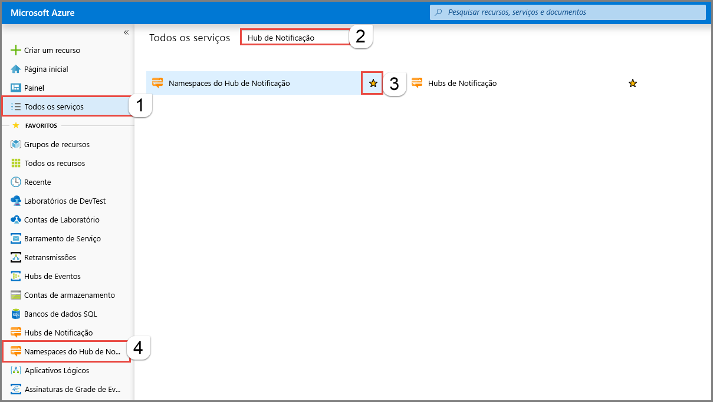
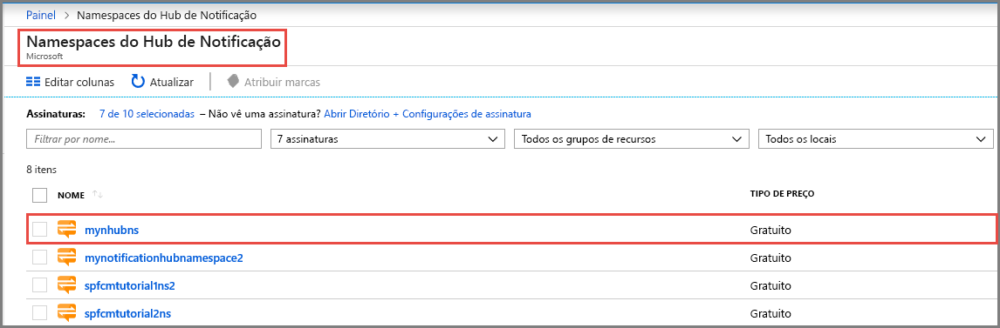
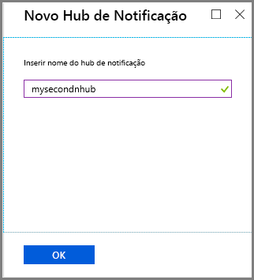
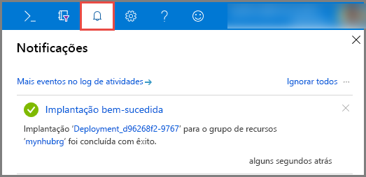
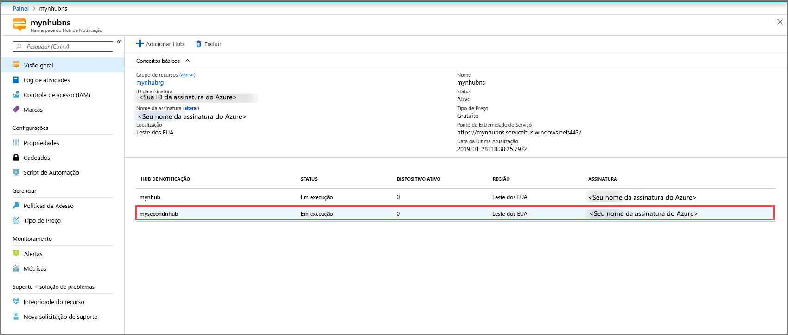
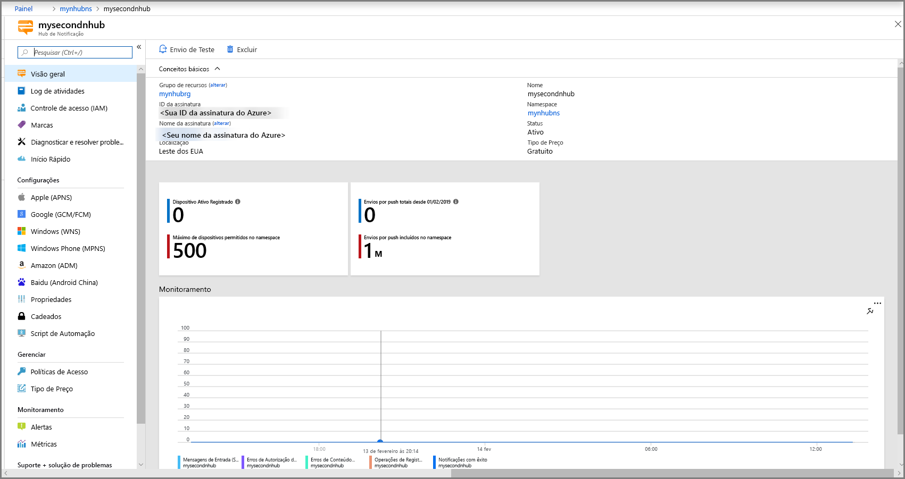

# Criar um hub de notificação do Azure no portal do Azure 
Os Hubs de Notificação do Azure fornecem um mecanismo de push expansível e fácil de usar que permite que você envie notificações para qualquer plataforma (iOS, Android, Windows, Kindle, Baidu etc.) de qualquer back-end (nuvem ou local). Para obter mais informações sobre o serviço, confira [O que são os Hubs de Notificação do Azure?](notification-hubs-push-notification-overview.md).

Neste Início Rápido, você criará um hub de notificação no portal do Azure. A primeira seção fornece etapas para criar um namespace dos Hubs de Notificação e um hub nesse namespace. A segunda seção fornece etapas para criar um hub de notificação em um namespace existente dos Hubs de Notificação. 

## Criar um namespace e um hub de notificação
Nesta seção, você criará um namespace e um hub no namespace. 

[!INCLUDE [notification-hubs-portal-create-new-hub](../../includes/notification-hubs-portal-create-new-hub.md)]

## Criar um hub de notificação em um namespace existente
Nesta seção, você criará um hub de notificação em um namespace existente. 

1. Entre no [Portal do Azure](https://portal.azure.com).
2. Selecione **Todos os serviços** no menu esquerdo, pesquise **Hub de Notificação**, selecione **estrela** (`*`) ao lado dos **Namespaces do Hub de Notificação** para adicioná-lo à seção **FAVORITOS** no menu esquerdo. Selecione **Namespaces do Hub de Notificação**. 

      
3. Na página **Namespaces do Hub de Notificação**, selecione o namespace na lista. 

      
1. Na página **Namespace do Hub de Notificação**, selecione **Adicionar Hub** na barra de ferramentas. 

      
4. Na página **Novo Hub de Notificação**, insira um nome para o hub de notificação e selecione **OK**.

      
4. Selecione **Notificações** (ícone de sino) na parte superior para ver o status da implantação do novo hub. Selecione **X** no canto direito para fechar a janela de notificação. 

      
5. Atualize a página da Web **Namespaces do Hub de Notificação** para ver o novo hub na lista. 

      
6. Selecione o **hub de notificação** para ver a home page dele. 

      

## Próximas etapas
Neste Início Rápido, você criou um hub de notificação. Para saber como definir o hub com as configurações do PNS (Sistema de Notificação de Plataforma), confira [Definir um hub de notificação com as configurações do PNS](configure-notification-hub-portal-pns-settings.md). 