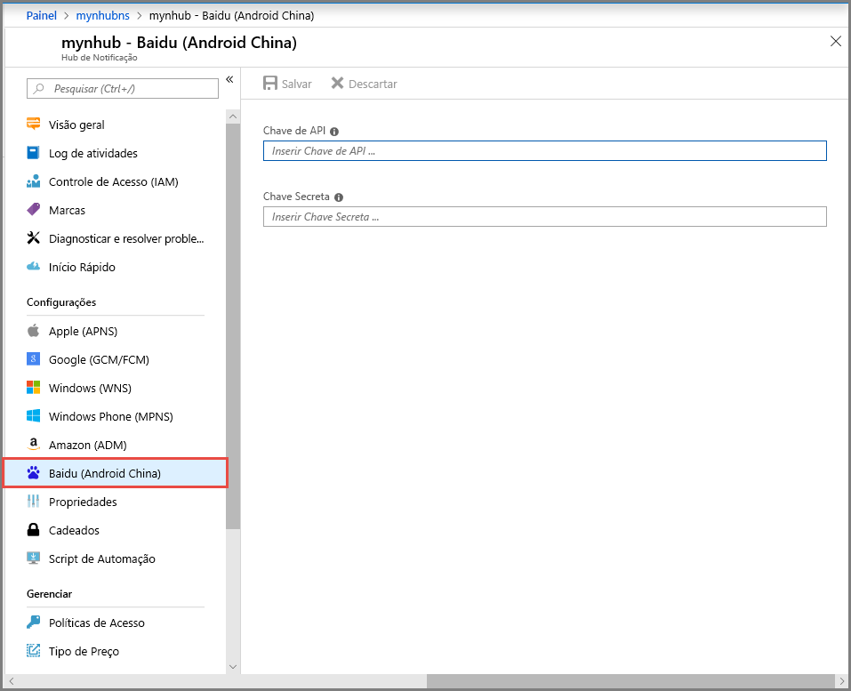

# <a name="get-started-with-notification-hubs-using-baidu"></a>Introdução aos Hubs de Notificação usando o Baidu
[!INCLUDE [notification-hubs-selector-get-started](../../includes/notification-hubs-selector-get-started.md)]

O envio de nuvem Baidu é um serviço na nuvem chinês que você pode usar para enviar notificações por push para dispositivos móveis. 

Como o Google Play e o FCM (Firebase Cloud Messaging) não estão disponíveis na China, é necessário usar lojas de aplicativos diferentes e serviços de envio por push. O Baidu é um deles e atualmente usado pelo Hub de Notificação.

## <a name="prerequisites"></a>Pré-requisitos
Este tutorial exige:

* SDK do Android (supondo que você use o Android Studio), que pode ser baixado no <a href="http://go.microsoft.com/fwlink/?LinkId=389797">site do Android</a>
* [SDK do Android Push do Baidu]

> [!NOTE]
> Para concluir este tutorial, você precisa ter uma conta ativa do Azure. Se você não tiver uma conta, poderá criar uma conta de avaliação gratuita em apenas alguns minutos. Para obter detalhes, consulte [Avaliação gratuita do Azure](https://azure.microsoft.com/pricing/free-trial/?WT.mc_id=A0E0E5C02&amp;returnurl=http%3A%2F%2Fazure.microsoft.com%2Fen-us%2Fdocumentation%2Farticles%2Fnotification-hubs-baidu-get-started%2F).
> 
> 

## <a name="create-a-baidu-account"></a>Criar uma conta de Baidu
Para usar o Baidu, você deve ter uma conta do Baidu. Se você já tiver uma, faça logon no [portal do Baidu] e vá para a próxima etapa. Caso contrário, veja as instruções abaixo sobre como criar uma conta do Baidu.  

1. Vá para o [portal do Baidu] e clique no link **登录** (**Login**). Clique em **立即注册** (**Registrar Agora**) para iniciar o processo de registro de conta.
   
    

2. Insira os detalhes necessários – telefone/endereço de email, senha e código de verificação – e clique em 注册 (**Inscrever-se**).
   
    

3. Você receberá um email no endereço de email inserido com um link para ativar sua conta do Baidu.
   
    

4. Faça logon em sua conta de email, abra o email de ativação do Baidu e clique no link de ativação para ativar sua conta do Baidu.
   
    

Depois de ativar uma conta do Baidu, faça logon no [portal do Baidu].

## <a name="create-a-baidu-cloud-push-project"></a>Criar um projeto de envio na nuvem Baidu
Quando você cria um projeto de envio na nuvem Baidu, você recebe sua ID de aplicativo, chave API e a chave secreta.

1. Depois de fazer logon no [portal do Baidu], clique em **更多 >>** (**mais**).
   
    

2. Role para baixo na seção **站长与开发者服务** (**Webmaster e Serviços de Desenvolvedor**) e clique em **百度云推送** (**push da nuvem Baidu**).
   
    

3. Na próxima página, clique em **登录**(**Logon**) no canto superior direito.
   
    

4. Em seguida, clique em **创建应用**(**Criar Aplicativo**) nesta página.

    

5. Na próxima página, clique em 创建新应用 (**Criar Novo Aplicativo**).
   
    

6. Insira um nome de aplicativo e clique em 创建 (**Criar**).
   
    

7. Após a criação bem-sucedida de um projeto de push da nuvem Baidu, você verá uma página com a **ID de Aplicativo**, **Chave de API** e **Chave Secreta**. Anote a chave de API e a chave secreta, que usaremos mais tarde.
   
    

8. Configure o projeto para notificações por push clicando em 创建通知 (**Criar Notificação**) no painel esquerdo.
   
    


## <a name="configure-a-new-notification-hub"></a>Configurar um novo hub de notificação
[!INCLUDE [notification-hubs-portal-create-new-hub](../../includes/notification-hubs-portal-create-new-hub.md)]


&emsp;&emsp;6. No hub de notificação, selecione **Serviços de Notificação** e **Baidu (Android China)**.

&emsp;&emsp;

&emsp;&emsp;7. Role até a seção de configurações de notificação do Baidu. Insira a chave de API e a chave secreta que você obteve do console do Baidu no projeto de envio por push da nuvem Baidu. Em seguida, clique em Salvar.

&emsp;&emsp;

Seu hub de notificação agora está configurado para trabalhar com o Badu. Você também tem as **cadeias de conexão** para registrar seu aplicativo para enviar e receber notificações por push.

Anote `DefaultListenSharedAccessSignature` e `DefaultFullSharedAccessSignature` da janela de informações de conexão de acesso.

## <a name="connect-your-app-to-the-notification-hub"></a>Conectar seu aplicativo ao hub de notificação
1. No Android Studio, crie um novo projeto Android (Arquivo > Novo > Novo Projeto).

    

2.  Insira um Nome de Aplicativo e verifique se a versão do SDK Mínimo Necessário está definida como API 16: Android 4.1. **Verifique também se o nome do pacote (应用包名) é igual ao do Portal de Push de Nuvem do Baidu**

    
    

3.  Clique em Avançar e continue seguindo o assistente até que a janela Criar Atividade seja exibida. Verifique se Atividade Vazia está selecionada e selecione Concluir para criar um novo Aplicativo do Android.

    

4.  Verifique se o Destino da Compilação do Projeto foi definido corretamente.

5.  Em seguida, adicione bibliotecas dos Hubs de Notificação do Azure. No arquivo `Build.Gradle` para o aplicativo, adicione as linhas a seguir à seção dependencies.

    ```javascript
    compile 'com.microsoft.azure:notification-hubs-android-sdk:0.4@aar'
    compile 'com.microsoft.azure:azure-notifications-handler:1.0.1@aar'
    ```

    Adicione o seguinte repositório após a seção dependencies .

    ```javascript
    repositories {
        maven {
            url "http://dl.bintray.com/microsoftazuremobile/SDK"
        }
    }
    ```

    Para evitar o conflito de listas, precisamos adicionar o código a seguir a **Manifest.xml**.

    ```xml
    <manifest package="YOUR.PACKAGE.NAME"
    xmlns:tools="http://schemas.android.com/tools"
    xmlns:android="http://schemas.android.com/apk/res/android">
    ```

    e, na marca `<application/>`:

    ```xml
    <application
        tools:replace="android:allowBackup,icon,theme,label">
    ```

6.  Baixe e descompacte o [SDK do Android Push do Baidu]. Copie o arquivo `pushservice-x.y.z jar` da pasta libs. Em seguida, copie os arquivos `.so` das pastas `src/main/jniLibs` (crie uma nova pasta) do seu aplicativo Android.

    

7. Clique com o botão direito do mouse no arquivo pushservice-x.y.z.jar na pasta libs, clique em Adicionar como Biblioteca para incluir essa biblioteca no projeto.

    

8. Abra o arquivo **AndroidManifest.xml** de seu projeto do Android e adicione as permissões exigidas pelo SDK do Baidu. **Substitua `YOURPACKAGENAME` pelo nome do pacote**.

    ```xml
    <uses-permission android:name="android.permission.INTERNET" />
    <uses-permission android:name="android.permission.READ_PHONE_STATE" />
    <uses-permission android:name="android.permission.ACCESS_NETWORK_STATE" />
    <uses-permission android:name="android.permission.RECEIVE_BOOT_COMPLETED" />
    <uses-permission android:name="android.permission.WRITE_SETTINGS" />
    <uses-permission android:name="android.permission.VIBRATE" />
    <uses-permission android:name="android.permission.WRITE_EXTERNAL_STORAGE" />
    <uses-permission android:name="android.permission.DISABLE_KEYGUARD" />
    <uses-permission android:name="android.permission.ACCESS_COARSE_LOCATION" />
    <uses-permission android:name="android.permission.ACCESS_WIFI_STATE" />
    <uses-permission android:name="android.permission.ACCESS_DOWNLOAD_MANAGER" />
    <uses-permission android:name="android.permission.DOWNLOAD_WITHOUT_NOTIFICATION" />
    <uses-permission android:name="android.permission.EXPAND_STATUS_BAR" />
    !! <uses-permission android:name="baidu.push.permission.WRITE_PUSHINFOPROVIDER.YOURPACKAGENAME" />
    !!<permission android:name="baidu.push.permission.WRITE_PUSHINFOPROVIDER.YOURPACKAGENAME"android:protectionLevel="normal" />

    ```

9. Adicione a seguinte configuração dentro do elemento de aplicativo após o elemento de atividade `.MainActivity`, substituindo *nomedoseuprojeto* (por exemplo, `com.example.BaiduTest`):

    ```xml
    <activity
        android:name="com.baidu.android.pushservice.richmedia.MediaViewActivity"
        android:configChanges="orientation|keyboardHidden"
        android:label="MediaViewActivity" />
    <activity
        android:name="com.baidu.android.pushservice.richmedia.MediaListActivity"
        android:configChanges="orientation|keyboardHidden"
        android:label="MediaListActivity"
        android:launchMode="singleTask" />
 
    <!-- Push application definition message -->
    <receiver android:name=".MyPushMessageReceiver">
        <intent-filter>

            <!-- receive push message-->
            <action android:name="com.baidu.android.pushservice.action.MESSAGE" />
            <!-- receive bind,unbind,fetch,delete.. message-->
            <action android:name="com.baidu.android.pushservice.action.RECEIVE" />
            <action android:name="com.baidu.android.pushservice.action.notification.CLICK" />
        </intent-filter>
    </receiver>

    <receiver
        android:name="com.baidu.android.pushservice.PushServiceReceiver"
        android:process=":bdservice_v1">
        <intent-filter>
            <action android:name="android.intent.action.BOOT_COMPLETED" />
            <action android:name="android.net.conn.CONNECTIVITY_CHANGE" />
            <action android:name="com.baidu.android.pushservice.action.notification.SHOW" />
            <action android:name="com.baidu.android.pushservice.action.media.CLICK" />
            <action android:name="android.intent.action.MEDIA_MOUNTED" />
            <action android:name="android.intent.action.USER_PRESENT" />
            <action android:name="android.intent.action.ACTION_POWER_CONNECTED" />
            <action android:name="android.intent.action.ACTION_POWER_DISCONNECTED" />
        </intent-filter>
    </receiver>

    <receiver
        android:name="com.baidu.android.pushservice.RegistrationReceiver"
        android:process=":bdservice_v1">
        <intent-filter>
            <action android:name="com.baidu.android.pushservice.action.METHOD" />
            <action android:name="com.baidu.android.pushservice.action.BIND_SYNC" />
        </intent-filter>
        <intent-filter>
            <action android:name="android.intent.action.PACKAGE_REMOVED" />

            <data android:scheme="package" />
        </intent-filter>
    </receiver>

    <service
        android:name="com.baidu.android.pushservice.PushService"
        android:exported="true"
        android:process=":bdservice_v1">
        <intent-filter>
            <action android:name="com.baidu.android.pushservice.action.PUSH_SERVICE" />
        </intent-filter>
    </service>

    <service
        android:name="com.baidu.android.pushservice.CommandService"
        android:exported="true" />

    <!-- Adapt the ContentProvider declaration required for the Android N system, and the write permissions include the application package name-->
    <provider
        android:name="com.baidu.android.pushservice.PushInfoProvider"
        android:authorities="com.baidu.push.example.bdpush"
        android:exported="true"
        android:protectionLevel="signature"
        android:writePermission="baidu.push.permission.WRITE_PUSHINFOPROVIDER. yourprojectname  " />

    <!-- API Key of the Baidu application -->
    <meta-data
        android:name="api_key"
        !!   android:value="api_key" />
    </application>
    ```

10. Adicione uma nova classe chamada `ConfigurationSettings.java` ao projeto.

    ```java
    public class ConfigurationSettings {
        public static String API_KEY = "...";
        public static String NotificationHubName = "...";
        public static String NotificationHubConnectionString = "...";
    }
    ```
    
    Defina o valor da cadeia de caracteres `API_KEY` com a API_KEY do Projeto de Nuvem do Baidu.
    
    Defina o valor da cadeia de caracteres `NotificationHubName` com o nome do hub de notificação do [portal do Azure] e então `NotificationHubConnectionString` com `DefaultListenSharedAccessSignature` do [portal do Azure].

11. Abra MainActivity.java e adicione o seguinte ao método onCreate:

    ```java
    PushManager.startWork(this, PushConstants.LOGIN_TYPE_API_KEY,  API_KEY );
    ```

12. Adicione uma nova classe chamada `MyPushMessageReceiver.java` e adicione o seguinte código a ela. É a classe que manipula as notificações por push recebidas do servidor de push do Baidu.

    ```java
    package your.package.name;

    import android.content.Context;
    import android.content.Intent;
    import android.os.AsyncTask;
    import android.text.TextUtils;
    import android.util.Log;

    import com.baidu.android.pushservice.PushMessageReceiver;
    import com.microsoft.windowsazure.messaging.NotificationHub;
    import org.json.JSONException;
    import org.json.JSONObject;

    import java.util.List;

    public class MyPushMessageReceiver extends PushMessageReceiver {

        public static final String TAG = MyPushMessageReceiver.class
                .getSimpleName();
        public static NotificationHub hub = null;
        public static String mChannelId, mUserId;

        @Override
        public void onBind(Context context, int errorCode, String appid,
                        String userId, String channelId, String requestId) {
            String responseString = "onBind errorCode=" + errorCode + " appid="
                    + appid + " userId=" + userId + " channelId=" + channelId
                    + " requestId=" + requestId;
            Log.d(TAG, responseString);

            if (errorCode == 0) {
                // Binding successful
                Log.d(TAG, " Binding successful");
            }
            try {
                if (hub == null) {
                    hub = new NotificationHub(
                            ConfigurationSettings.NotificationHubName,
                            ConfigurationSettings.NotificationHubConnectionString,
                            context);
                    Log.i(TAG, "Notification hub initialized");
                }
            } catch (Exception e) {
                Log.e(TAG, e.getMessage());
            }
            mChannelId = channelId;
            mUserId = userId;

            registerWithNotificationHubs();
        }
        private void registerWithNotificationHubs() {

            new AsyncTask<Void, Void, Void>() {
                @Override
                protected Void doInBackground(Void... params) {
                    try {
                        hub.registerBaidu(mUserId, mChannelId);
                        Log.i(TAG, "Registered with Notification Hub - '"
                                + ConfigurationSettings.NotificationHubName + "'"
                                + " with UserId - '"
                                + mUserId + "' and Channel Id - '"
                                + mChannelId + "'");
                    } catch (Exception e) {
                        Log.e(TAG, e.getMessage());
                    }
                    return null;
                }
            }.execute(null, null, null);
        }

        @Override
        public void onMessage(Context context, String message,
                            String customContentString) {
            String messageString = " onMessage=\"" + message
                    + "\" customContentString=" + customContentString;
            Log.d(TAG, messageString);
            if (!TextUtils.isEmpty(customContentString)) {
                JSONObject customJson = null;
                try {
                    customJson = new JSONObject(customContentString);
                    String myvalue = null;
                    if (!customJson.isNull("mykey")) {
                        myvalue = customJson.getString("mykey");
                    }
                } catch (JSONException e) {
                    e.printStackTrace();
                }
            }

        }

        @Override
        public void onNotificationArrived(Context context, String title, String description, String customContentString) {
            String notifyString = " Notice Arrives onNotificationArrived  title=\"" + title
                    + "\" description=\"" + description + "\" customContent="
                    + customContentString;
            Log.d(TAG, notifyString);
            if (!TextUtils.isEmpty(customContentString)) {
                JSONObject customJson = null;
                try {
                    customJson = new JSONObject(customContentString);
                    String myvalue = null;
                    if (!customJson.isNull("mykey")) {
                        myvalue = customJson.getString("mykey");
                    }
                } catch (JSONException e) {
                    // TODO Auto-generated catch block
                    e.printStackTrace();
                }
            }
        }

        @Override
        public void onNotificationClicked(Context context, String title, String description, String customContentString) {
            String notifyString = " onNotificationClicked title=\"" + title + "\" description=\""
                    + description + "\" customContent=" + customContentString;
            Log.d(TAG, notifyString);
            Intent intent = new Intent(context.getApplicationContext(),MainActivity.class);
            intent.putExtra("title",title);
            intent.putExtra("description",description);
            intent.putExtra("isFromNotify",true);
            intent.addFlags(Intent.FLAG_ACTIVITY_NEW_TASK);
            context.getApplicationContext().startActivity(intent);

        }

        @Override
        public void onSetTags(Context context, int errorCode,
                            List<String> successTags, List<String> failTags, String requestId) {
            String responseString = "onSetTags errorCode=" + errorCode
                    + " successTags=" + successTags + " failTags=" + failTags
                    + " requestId=" + requestId;
            Log.d(TAG, responseString);

        }

        @Override
        public void onDelTags(Context context, int errorCode,
                            List<String> successTags, List<String> failTags, String requestId) {
            String responseString = "onDelTags errorCode=" + errorCode
                    + " successTags=" + successTags + " failTags=" + failTags
                    + " requestId=" + requestId;
            Log.d(TAG, responseString);

        }

        @Override
        public void onListTags(Context context, int errorCode, List<String> tags,
                            String requestId) {
            String responseString = "onListTags errorCode=" + errorCode + " tags="
                    + tags;
            Log.d(TAG, responseString);

        }

        @Override
        public void onUnbind(Context context, int errorCode, String requestId) {
            String responseString = "onUnbind errorCode=" + errorCode
                    + " requestId = " + requestId;
            Log.d(TAG, responseString);

            if (errorCode == 0) {
                // Unbinding is successful
                Log.d(TAG, " Unbinding is successful ");
            }
        }
    }
    ```

## <a name="send-notifications-to-your-app"></a>Enviar notificações para seu aplicativo

Você pode testar rapidamente o recebimento de notificações do [portal do Azure]: use o botão **Enviar** na tela de configuração do hub de notificação conforme mostrado nas telas a seguir:


Notificações por push normalmente são enviadas em um serviço de back-end como Serviços Móveis ou ASP.NET usando uma biblioteca compatível. Se a biblioteca não estiver disponível para seu back-end, você também poderá usar a API REST diretamente para enviar mensagens de notificação.

Para simplificar, este tutorial usa um aplicativo de console como uma demonstração de como enviar uma notificação com o SDK do .NET. Entretanto, recomendamos o tutorial [Usar Hubs de Notificação para enviar notificações por push aos usuários](notification-hubs-aspnet-backend-windows-dotnet-wns-notification.md) como a próxima etapa de envio de notificações de back-end do ASP.NET. 

Veja as diferentes abordagens para enviar notificações:
* **Interface REST**: você pode dar suporte à notificação em qualquer plataforma de back-end usando a [Interface REST](http://msdn.microsoft.com/library/windowsazure/dn223264.aspx).
* **SDK do .NET dos Hubs de Notificações do Microsoft Azure**: no Gerenciador de Pacotes do Nuget para o Visual Studio, execute [Install-Package Microsoft.Azure.NotificationHubs](https://www.nuget.org/packages/Microsoft.Azure.NotificationHubs/).
* **Node.js** : [Como usar os Hubs de Notificação de Node.js](notification-hubs-nodejs-push-notification-tutorial.md).
* **Aplicativos móveis**: para obter um exemplo de como enviar notificações de um back-end dos Aplicativos Móveis do Serviço de Aplicativo do Azure que esteja integrado com Hubs de notificação, confira [Adicionar notificação por push para seu aplicativo móvel](../app-service-mobile/app-service-mobile-windows-store-dotnet-get-started-push.md).
* **Java/PHP**: para obter um exemplo de como enviar notificações usando as APIs REST, confira "Como usar os Hubs de Notificação do Java/PHP" ([Java](notification-hubs-java-push-notification-tutorial.md) | [PHP](notification-hubs-php-push-notification-tutorial.md)).

## <a name="optional-send-notifications-from-a-net-console-app"></a>(Opcional) Enviar notificações de um aplicativo de console do .NET.
Nesta seção, vamos mostrar o envio de uma notificação usando um aplicativo de console do .NET.

1. Crie um novo aplicativo de console do Visual C#:
   
    

2. Na janela do Console do Gerenciador de Pacotes, defina o **Projeto padrão** como o seu novo projeto de aplicativo do console e execute o seguinte comando na janela do console:
   
        Install-Package Microsoft.Azure.NotificationHubs
   
    Essa instrução adiciona uma referência ao SDK dos Hubs de Notificação do Azure usando o <a href="http://www.nuget.org/packages/Microsoft.Azure.NotificationHubs/">pacote NuGet Microsoft.Azure.Notification Hubs</a>.
   
    

3. Abra o arquivo `Program.cs` e adicione o seguinte usando a instrução:
   
    ```csharp
    using Microsoft.Azure.NotificationHubs;
    ```

4. Na sua classe `Program`, adicione o seguinte método e substitua `DefaultFullSharedAccessSignatureSASConnectionString` e `NotificationHubName` pelos valores que você tem.
   
    ```csharp
    private static async void SendNotificationAsync()
    {
        NotificationHubClient hub = NotificationHubClient.CreateClientFromConnectionString("DefaultFullSharedAccessSignatureSASConnectionString", "NotificationHubName");
        string message = "{\"title\":\"((Notification title))\",\"description\":\"Hello from Azure\"}";
        var result = await hub.SendBaiduNativeNotificationAsync(message);
    }
    ```

5. Adicione as seguintes linhas em seu método `Main` :

    ```csharp
    SendNotificationAsync();
    Console.ReadLine();
    ```

## <a name="test-your-app"></a>Testar seu aplicativo

Para testar este aplicativo com um telefone real, basta conectá-lo ao seu computador com um cabo USB. Essa ação carregará seu aplicativo no telefone conectado.

Para testar este aplicativo com o emulador, na barra de ferramentas superior do Android Studio, clique em **Executar** e selecione seu aplicativo: ele inicia o emulador, carrega e executa o aplicativo.

O aplicativo recupera `userId` e `channelId` do serviço de notificação por push do Baidu e é registrado no hub de notificação.

Para enviar uma notificação de teste, você poderá usar a guia de depuração do [portal do Azure]. Se você criar o aplicativo de console do .NET para o Visual Studio, bastará pressionar a tecla F5 no Visual Studio para executar o aplicativo. O aplicativo envia uma notificação que é exibida na área superior da notificação do seu dispositivo ou emulador.

<!-- URLs. -->
[Mobile Services Android SDK]: https://go.microsoft.com/fwLink/?LinkID=280126&clcid=0x409
[SDK do Android Push do Baidu]: http://push.baidu.com/sdk/push_client_sdk_for_android
[portal do Azure]: https://portal.azure.com/
[portal do Baidu]: http://www.baidu.com/
