# Notificações por push com delimitação geográfica com os Hubs de Notificação do Azure e o Bing Spatial Data
> [!NOTE]
> Para concluir este tutorial, você precisa ter uma conta ativa do Azure. Se você não tiver uma conta, poderá criar uma conta de avaliação gratuita em apenas alguns minutos. Para obter detalhes, consulte [Avaliação gratuita do Azure](https://azure.microsoft.com/pricing/free-trial/?WT.mc_id=A0E0E5C02).
> 
> 

Neste tutorial, você aprenderá a enviar notificações por push baseadas na localização com os Hubs de Notificação do Azure e o Bing Spatial Data em um aplicativo da Plataforma Universal do Windows.

## Pré-requisitos
Primeiro, certifique-se de que tem todos os pré-requisitos de software e de serviço:

* [Visual Studio 2015 Atualização 1](https://www.visualstudio.com/downloads/download-visual-studio-vs.aspx) ou posterior (o [Community Edition](https://go.microsoft.com/fwlink/?LinkId=691978&clcid=0x409) também servirá). 
* Versão mais recente do [SDK do Azure](https://azure.microsoft.com/downloads/). 
* [Conta do Centro de Desenvolvimento do Bing Mapas](https://www.bingmapsportal.com/) (você pode criá-la gratuitamente e associá-la à sua conta da Microsoft). 

## Introdução
Vamos começar pela criação do projeto. No Visual Studio, inicie um novo projeto do tipo **Aplicativo em Branco (Universal do Windows)**.

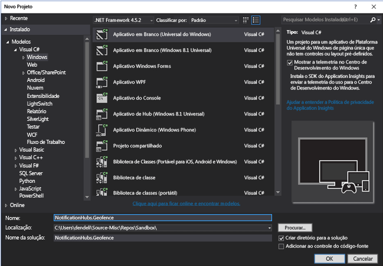

Uma vez concluída a criação do projeto, você deverá ter o agente para o próprio aplicativo. Agora vamos configurar tudo para a infraestrutura de delimitação geográfica. Como vamos usar os serviços do Bing para isso, há um ponto de extremidade de API REST público que permite consultar quadros de local específico:

    http://spatial.virtualearth.net/REST/v1/data/

Você deve especificar os parâmetros a seguir para fazer isso funcionar:

* **ID da Fonte de Dados** e **Nome da Fonte de Dados** – na API do Bing Mapas, as fontes de dados contêm diversos metadados classificados, como locais e horas comerciais de operação. Leia mais sobre isso aqui. 
* **Nome da Entidade** – a entidade que você deseja usar como um ponto de referência para a notificação. 
* **Chave de API do Bing Mapas** – é a chave que você obteve anteriormente quando criou a conta do Centro de Desenvolvimento do Bing.

Vamos fazer uma análise aprofundada da instalação de cada um dos elementos acima.

## Configuração da fonte de dados
Você pode configurar a fonte de dados no Centro de Desenvolvimento do Bing Mapas. Na barra de navegação superior, escolha **Fontes de dados** > **Gerenciar Fontes de Dados**.

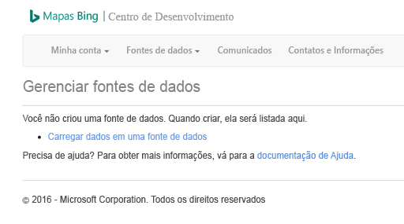

Se você não tiver trabalhado com a API do Bing Mapas antes, provavelmente não haverá fontes de dados presentes e, portanto, é possível criar uma nova ao escolher **Fontes de dados** > **Carregar dados**. Preencha todos os campos obrigatórios:

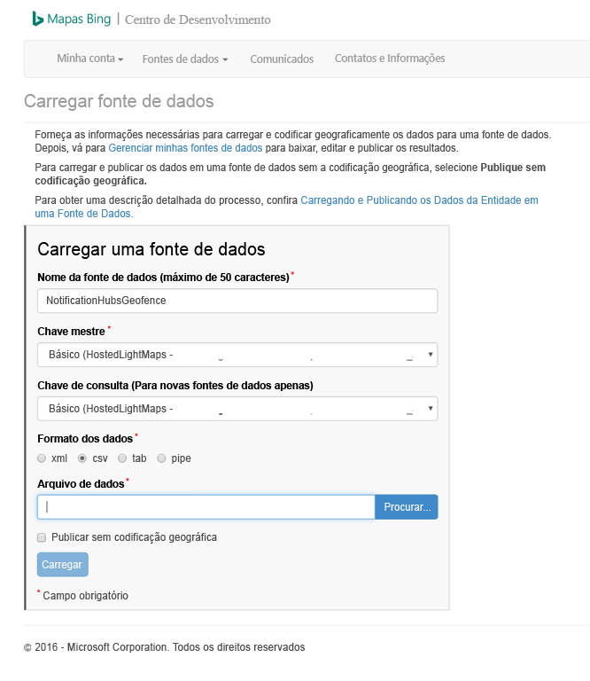

Você deve estar imaginando – o que é o arquivo de dados e o que você deve carregar? Para os fins deste teste, nós usaremos apenas a amostra baseada em pipe que enquadra uma área da orla marítima de São Francisco:

    Bing Spatial Data Services, 1.0, TestBoundaries
    EntityID(Edm.String,primaryKey)|Name(Edm.String)|Longitude(Edm.Double)|Latitude(Edm.Double)|Boundary(Edm.Geography)
    1|SanFranciscoPier|||POLYGON ((-122.389825 37.776598,-122.389438 37.773087,-122.381885 37.771849,-122.382186 37.777022,-122.389825 37.776598))

O texto acima representa esta entidade:

Copie e cole a cadeia de caracteres acima em um novo arquivo, salve-o como **NotificationHubsGeofence.pipe**; carregue-o no Centro de Desenvolvimento do Bing.

> [!NOTE]
> Poderá ser solicitada uma nova chave para a **Chave Mestra**, que é diferente da **Chave de Consulta**. Basta criar uma nova chave por meio do painel e atualizar a página de carregamento da fonte de dados.
> 
> 

Depois que você carregar o arquivo de dados, deverá publicar a fonte de dados. 

Vá para **Gerenciar Fontes de Dados**, exatamente como fizemos acima, localize a fonte de dados na lista e escolha **Publicar** na coluna **Ações**. Em instantes, você deverá ver sua fonte de dados na guia **Fontes de Dados Publicadas** :

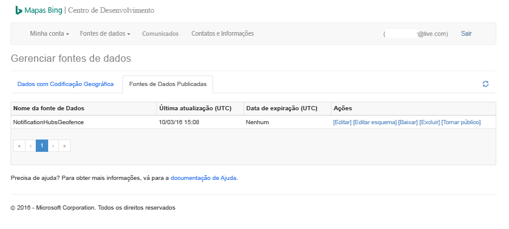

Se você escolher **Editar**, poderá ver rapidamente quais locais introduzimos nela:

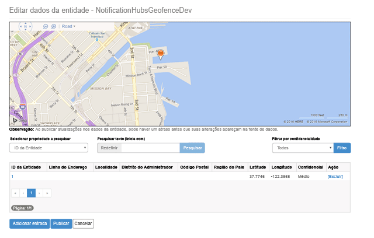

Neste ponto, o portal não mostrará os limites geográficos que criamos. Tudo o que você precisa é de uma confirmação de que o local especificado está na vizinhança certa.

Agora você tem todos os requisitos da fonte de dados. Para obter os detalhes na URL de solicitação para a chamada à API, no Centro de Desenvolvimento do Bing Mapas, escolha **Fontes de dados** e selecione **Informações da Fonte de Dados**.

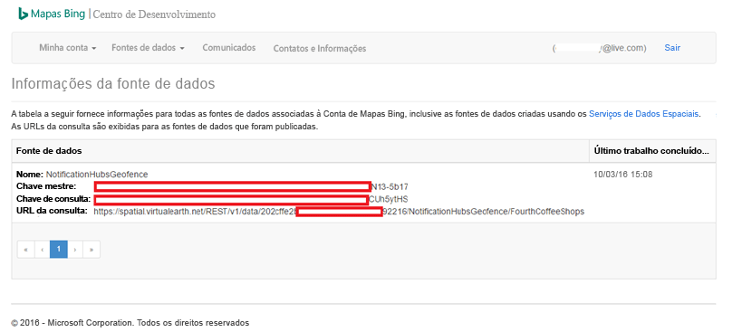

A **URL da Consulta** é o que queremos aqui. Esse é o ponto de extremidade no qual podemos executar consultas para verificar se o dispositivo ainda está dentro dos limites de um local ou não. Para realizar essa verificação, nós simplesmente executamos uma chamada GET na URL de consulta, com os seguintes parâmetros anexados:

    ?spatialFilter=intersects(%27POINT%20LONGITUDE%20LATITUDE)%27)&$format=json&key=QUERY_KEY

Dessa forma, você está especificando um ponto de destino obtido do dispositivo e o Bing Mapas executará automaticamente os cálculos para ver se ele está dentro do limite geográfico. Depois de executar a solicitação por meio de um navegador (ou cURL), você obterá uma resposta JSON padrão:

Essa resposta só acontece quando o ponto está realmente dentro dos limites designados. Caso contrário, você obterá um bucket vazio de **resultados** :

## Configuração do aplicativo UWP
Agora que a fonte de dados está pronta, podemos começar a trabalhar no aplicativo UWP que inicializamos anteriormente.

Primeiro, devemos habilitar os serviços de localização para o nosso aplicativo. Para fazer isso, abra o arquivo `Package.appxmanifest` no **Gerenciador de Soluções**.

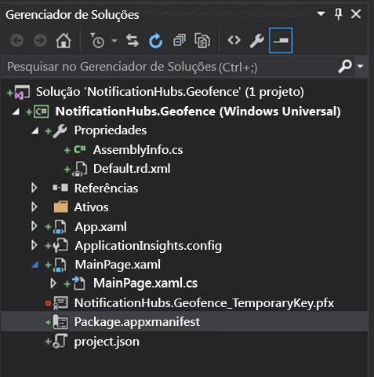

Na guia de propriedades do pacote que acabou de abrir, escolha **Recursos** e selecione **Local**:

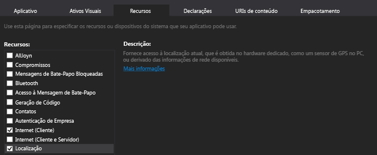

Como o recurso local é declarado, crie uma nova pasta na solução denominada `Core` e adicione um novo arquivo a ela, chamado `LocationHelper.cs`:

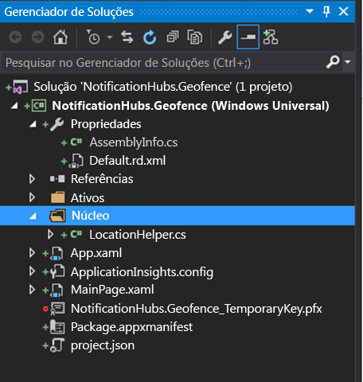

A classe `LocationHelper` em si é bem básica neste ponto – tudo o que ela faz é permitir a obtenção da localização do usuário por meio da API do sistema:

    using System;
    using System.Threading.Tasks;
    using Windows.Devices.Geolocation;

    namespace NotificationHubs.Geofence.Core
    {
        public class LocationHelper
        {
            private static readonly uint AppDesiredAccuracyInMeters = 10;

            public async static Task<Geoposition> GetCurrentLocation()
            {
                var accessStatus = await Geolocator.RequestAccessAsync();
                switch (accessStatus)
                {
                    case GeolocationAccessStatus.Allowed:
                        {
                            Geolocator geolocator = new Geolocator { DesiredAccuracyInMeters = AppDesiredAccuracyInMeters };

                            return await geolocator.GetGeopositionAsync();
                        }
                    default:
                        {
                            return null;
                        }
                }
            }

        }
    }

Você pode ler mais sobre como obter a localização do usuário em aplicativos UWP no [documento do MSDN](https://msdn.microsoft.com/library/windows/apps/mt219698.aspx)oficial.

Para verificar se a aquisição da localização está funcionando, abra o lado do código da página principal (`MainPage.xaml.cs`). Criar um novo manipulador de eventos para o evento `Loaded` no construtor `MainPage`:

    public MainPage()
    {
        this.InitializeComponent();
        this.Loaded += MainPage_Loaded;
    }

A implementação do manipulador de eventos é a seguinte:

    private async void MainPage_Loaded(object sender, RoutedEventArgs e)
    {
        var location = await LocationHelper.GetCurrentLocation();

        if (location != null)
        {
            Debug.WriteLine(string.Concat(location.Coordinate.Longitude,
                " ", location.Coordinate.Latitude));
        }
    }

Observe que declaramos o manipulador como assíncrono porque `GetCurrentLocation` é aguardável e, portanto, exige ser executado em um contexto assíncrono. Além disso, como sob determinadas circunstâncias podemos terminar com uma localização nula (por exemplo, os serviços de localização estão desabilitados ou o aplicativo não teve permissões para acessar a localização), precisamos garantir que ele seja adequadamente manipulado com uma verificação de nulo.

Execute o aplicativo. Permita o acesso de localização:

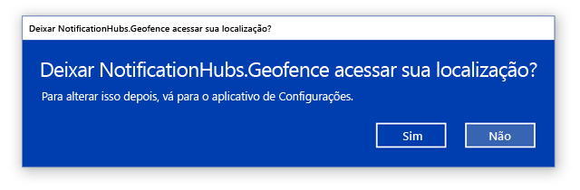

Assim que o aplicativo for iniciado, você deverá ser capaz de ver as coordenadas na janela **Saída** :

Agora você sabe que a aquisição de localização funciona – fique à vontade para remover o manipulador de eventos de teste carregado porque nós não o utilizarem mais.

A próxima etapa é capturar as alterações de localização. Para isso, vamos voltar para a classe `LocationHelper` e adicionar o manipulador de eventos para `PositionChanged`:

    geolocator.PositionChanged += Geolocator_PositionChanged;

A implementação mostrará as coordenadas de localização na janela **Saída** :

    private static async void Geolocator_PositionChanged(Geolocator sender, PositionChangedEventArgs args)
    {
        await CoreApplication.MainView.CoreWindow.Dispatcher.RunAsync(CoreDispatcherPriority.Normal, () =>
        {
            Debug.WriteLine(string.Concat(args.Position.Coordinate.Longitude, " ", args.Position.Coordinate.Latitude));
        });
    }

## Configuração do back-end
Baixe o [exemplo de back-end .NET do GitHub](https://github.com/Azure/azure-notificationhubs-samples/tree/master/dotnet/NotifyUsers). Quando o download for concluído, abra a pasta `NotifyUsers` e depois o arquivo `NotifyUsers.sln`.

Defina o projeto `AppBackend` como o **Projeto de Inicialização** e inicie-o.

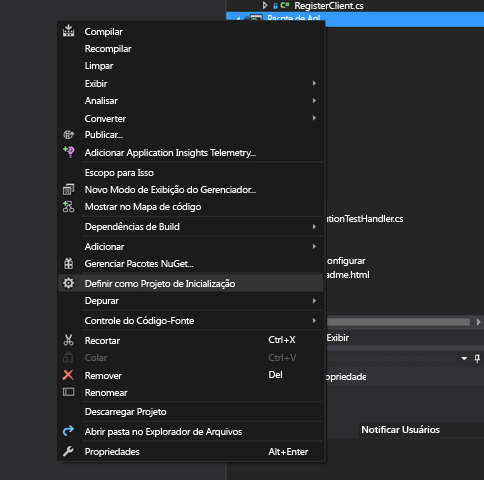

O projeto já está configurado para enviar notificações por push para dispositivos de destino e, portanto, precisamos fazer somente duas coisas – trocar a cadeia de conexão correta para o hub de notificação e adicionar identificação de limite para enviar a notificação somente quando o usuário estiver dentro do limite geográfico.

Para configurar a cadeia de conexão, abra `Notifications.cs` na pasta `Models`. A função `NotificationHubClient.CreateClientFromConnectionString` deve conter as informações sobre o hub de notificação que você pode obter no [Portal do Azure](https://portal.azure.com) (examine a folha **Políticas de Acesso** em **Configurações**). Salve o arquivo de configuração atualizado.

Agora precisamos criar um modelo para o resultado da API do Bing Mapas. A maneira mais fácil de fazer isso é abrir a pasta `Models` e escolha **Adicionar** > **Classe**. Nomeie-o `GeofenceBoundary.cs`. Quando tiver terminado, copie o JSON da resposta da API que abordamos na primeira seção e, no Visual Studio, use **Editar** > **Colar Especial** > **Colar JSON como Classes**. 

Dessa forma, garantimos que o objeto será desserializado exatamente como foi pretendido. O conjunto de classes resultante deve ter esta aparência:

    namespace AppBackend.Models
    {
        public class Rootobject
        {
            public D d { get; set; }
        }

        public class D
        {
            public string __copyright { get; set; }
            public Result[] results { get; set; }
        }

        public class Result
        {
            public __Metadata __metadata { get; set; }
            public string EntityID { get; set; }
            public string Name { get; set; }
            public float Longitude { get; set; }
            public float Latitude { get; set; }
            public string Boundary { get; set; }
            public string Confidence { get; set; }
            public string Locality { get; set; }
            public string AddressLine { get; set; }
            public string AdminDistrict { get; set; }
            public string CountryRegion { get; set; }
            public string PostalCode { get; set; }
        }

        public class __Metadata
        {
            public string uri { get; set; }
        }
    }

Em seguida, abra `Controllers` > `NotificationsController.cs`. É necessário ajustar a chamada Post para levar em consideração a latitude e a longitude do destino. Para isso, basta adicionar duas cadeias de caracteres à assinatura da função – `latitude` e `longitude`.

    public async Task<HttpResponseMessage> Post(string pns, [FromBody]string message, string to_tag, string latitude, string longitude)

Crie uma nova classe no projeto chamado `ApiHelper.cs` – nós a usaremos para a conexão com o Bing para criarmos pontos de verificação em interseções de limite. Implemente uma função `IsPointWithinBounds` , desta forma:

    public class ApiHelper
    {
        public static readonly string ApiEndpoint = "{YOUR_QUERY_ENDPOINT}?spatialFilter=intersects(%27POINT%20({0}%20{1})%27)&$format=json&key={2}";
        public static readonly string ApiKey = "{YOUR_API_KEY}";

        public static bool IsPointWithinBounds(string longitude,string latitude)
        {
            var json = new WebClient().DownloadString(string.Format(ApiEndpoint, longitude, latitude, ApiKey));
            var result = JsonConvert.DeserializeObject<Rootobject>(json);
            if (result.d.results != null && result.d.results.Count() > 0)
            {
                return true;
            }
            else
            {
                return false;
            }
        }
    }

> [!NOTE]
> Substitua o ponto de extremidade de API pela URL de consulta obtida anteriormente do Centro de Desenvolvimento do Bing (o mesmo se aplica à chave de API). 
> 
> 

Se houver resultados para a consulta, isso significa que o ponto especificado está nos limites da delimitação geográfica e, portanto, retornamos `true`. Se não houver nenhum resultado, o Bing está dizendo que o ponto está fora do quadro de pesquisa e, portanto, retornamos `false`.

Novamente em `NotificationsController.cs`, crie uma verificação logo antes da instrução switch:

    if (ApiHelper.IsPointWithinBounds(longitude, latitude))
    {
        switch (pns.ToLower())
        {
            case "wns":
                //// Windows 8.1 / Windows Phone 8.1
                var toast = @"<toast><visual><binding template=""ToastText01""><text id=""1"">" +
                            "From " + user + ": " + message + "</text></binding></visual></toast>";
                outcome = await Notifications.Instance.Hub.SendWindowsNativeNotificationAsync(toast, userTag);

                // Windows 10 specific Action Center support
                toast = @"<toast><visual><binding template=""ToastGeneric""><text id=""1"">" +
                            "From " + user + ": " + message + "</text></binding></visual></toast>";
                outcome = await Notifications.Instance.Hub.SendWindowsNativeNotificationAsync(toast, userTag);

                break;
        }
    }

Dessa forma, a notificação só será enviada quando o ponto estiver dentro dos limites.

## Teste de notificações por push no aplicativo UWP
Voltando ao aplicativo UWP, agora devemos conseguir testar as notificações. Na classe `LocationHelper`, crie uma nova função – `SendLocationToBackend`:

    public static async Task SendLocationToBackend(string pns, string userTag, string message, string latitude, string longitude)
    {
        var POST_URL = "http://localhost:8741/api/notifications?pns=" +
            pns + "&to_tag=" + userTag + "&latitude=" + latitude + "&longitude=" + longitude;

        using (var httpClient = new HttpClient())
        {
            try
            {
                await httpClient.PostAsync(POST_URL, new StringContent("\"" + message + "\"",
                    System.Text.Encoding.UTF8, "application/json"));
            }
            catch (Exception ex)
            {
                Debug.WriteLine(ex.Message);
            }
        }
    }

> [!NOTE]
> Troque o `POST_URL` para a localização do aplicativo Web implantado que criamos na seção anterior. Por enquanto, é possível executá-lo localmente, mas à medida que você trabalhar na implantação de uma versão pública, precisará hospedá-lo em um provedor externo.
> 
> 

Agora vamos registrar o aplicativo UWP para notificações por push. No Visual Studio, escolha **Projeto** > **Loja** > **Associar aplicativo à loja**.

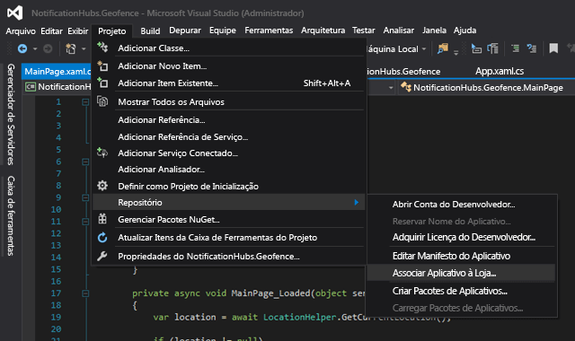

Depois que você entrar em sua conta de desenvolvedor, selecione um aplicativo existente ou crie um novo e associe o pacote a ele. 

Vá para o Centro de Desenvolvimento e abra o aplicativo que você acabou de criar. Escolha **Serviços** > **Notificações por Push** > **Site do Live Services**.

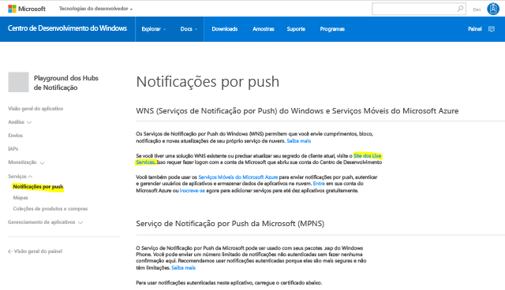

No site, anote o **Segredo do Aplicativo** e o **SID do Pacote**. Você precisará deles no Portal do Azure – abra seu hub de notificação, escolha **Configurações** > **Serviços de Notificação** > **Windows (WNS)** e insira as informações nos campos obrigatórios.

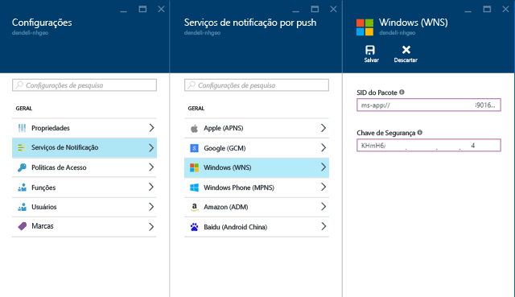

Escolha **Salvar**.

Abra **Referências** no **Gerenciador de Soluções** e selecione **Gerenciar Pacotes NuGet**. Precisaremos adicionar uma referência à **biblioteca gerenciada do Barramento de Serviço do Microsoft Azure** – basta procurar `WindowsAzure.Messaging.Managed` e adicioná-lo ao seu projeto.

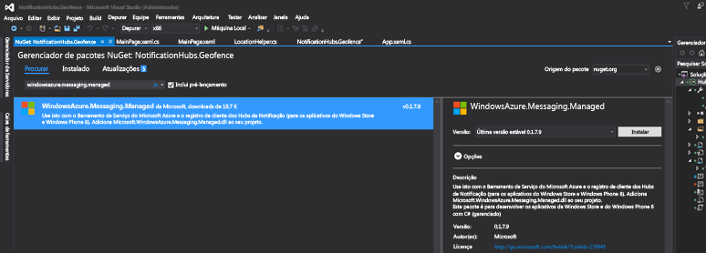

Para fins de teste, podemos criar o manipulador de eventos `MainPage_Loaded` novamente e adicionar este trecho de código a ele:

    var channel = await PushNotificationChannelManager.CreatePushNotificationChannelForApplicationAsync();

    var hub = new NotificationHub("HUB_NAME", "HUB_LISTEN_CONNECTION_STRING");
    var result = await hub.RegisterNativeAsync(channel.Uri);

    // Displays the registration ID so you know it was successful
    if (result.RegistrationId != null)
    {
        Debug.WriteLine("Reg successful.");
    }

O trecho acima registra o aplicativo no hub de notificação. Você está pronto! 

Em `LocationHelper`, no manipulador `Geolocator_PositionChanged`, você pode adicionar uma parte do código de teste que irá impor a colocação da localização dentro do limite geográfico:

    await LocationHelper.SendLocationToBackend("wns", "TEST_USER", "TEST", "37.7746", "-122.3858");

Como não estamos passando as coordenadas reais (que podem não estar nos limites no momento) e como estamos usando valores predefinidos de teste, veremos uma notificação sobre atualização:

## O que vem a seguir?
Existem algumas etapas que talvez você precise seguir além das anteriores para garantir que a solução esteja pronta para produção.

Primeiro, talvez seja necessário garantir que os limites geográficos sejam dinâmicos. Isso exigirá algum trabalho extra com a API do Bing para poder carregar novos limites na fonte de dados existente. Consulte a [documentação da API do Bing Spatial Data Services](https://msdn.microsoft.com/library/ff701734.aspx) para obter mais detalhes sobre o assunto.

Segundo, como você está trabalhando para garantir que a entrega seja feita aos participantes certos, talvez você queira usar a [marcação](notification-hubs-tags-segment-push-message.md)para tê-los como destino.

A solução mostrada acima descreve um cenário em que você pode ter uma ampla variedade de plataformas de destino e, portanto, não limitamos a delimitação geográfica a recursos específicos do sistema. Dito isso, a Plataforma Universal do Windows oferece recursos para [detectar delimitações geográficas prontas](https://msdn.microsoft.com/windows/uwp/maps-and-location/set-up-a-geofence).

Para obter mais detalhes sobre os recursos de Hubs de Notificação, confira nosso [portal de documentação](https://azure.microsoft.com/documentation/services/notification-hubs/).

