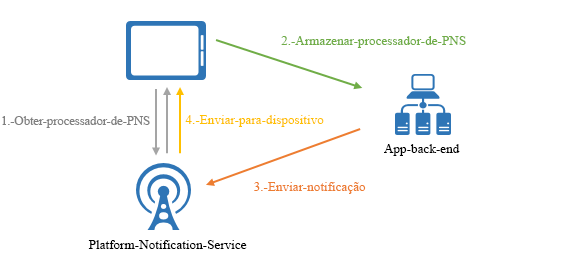
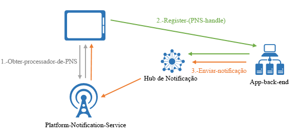

# O que são Hubs de Notificação do Azure?

Os Hubs de Notificação do Azure fornecem um mecanismo de push expansível e fácil de usar que permite que você envie notificações para qualquer plataforma (iOS, Android, Windows, Kindle, Baidu etc.) de qualquer back-end (nuvem ou local). Os Hubs de Notificação funcionam bem tanto para cenários empresariais quanto para cenários de consumidor. Aqui estão alguns exemplos de cenários:

- Para enviar notificações sobre as novidades para milhões de pessoas com baixa latência.
- Para enviar cupons baseados na localização para segmentos de usuários interessados.
- Para enviar notificações de eventos para usuários ou grupos em aplicativos de mídia/esportes/finanças/jogos.
- Para enviar por push conteúdos promocionais para aplicativos com o objetivo de atrair e vender para os clientes.
- Para notificar os usuários sobre eventos corporativos, como novas mensagens e itens de trabalho.
- Para enviar códigos para Autenticação Multifator.

## O que são notificações por push?

As notificações por push são uma forma de comunicação do aplicativo para o usuário na qual os usuários de aplicativos móveis recebem notificações sobre determinadas informações desejadas, geralmente em uma caixa de diálogo ou pop-up em um dispositivo móvel. Geralmente, os usuários podem optar por exibir ou ignorar a mensagem; ao optar por exibir a mensagem, ela será aberta no aplicativo móvel que enviou a notificação. Algumas notificações são silenciosas – entregues em segundo plano para o aplicativo para que ele as processe em segundo plano e decida o que fazer.

As notificações por push são fundamentais para os aplicativos direcionados ao consumidor no aumento da interação e do uso do aplicativo e para os aplicativos empresariais na comunicação de informações atualizadas da empresa. É a melhor forma de comunicação de aplicativos para o usuário, porque oferece baixo consumo de bateria para dispositivos móveis, é flexível para os remetentes das notificações e permanece disponível mesmo quando os aplicativos correspondentes não estiverem ativos.

Saiba mais sobre as notificações por push em algumas plataformas populares, consulte os tópicos a seguir:

- [Android](https://developer.android.com/guide/topics/ui/notifiers/notifications.html)
- [iOS](https://developer.apple.com/notifications/)
- [Windows](https://msdn.microsoft.com/library/windows/apps/hh779725.aspx)

## Como as notificações por push funcionam?

As notificações por push são fornecidas por meio de infraestruturas específicas à plataforma chamadas de *Sistemas de Notificação de Plataforma* (PNS). Eles oferecem funcionalidades de push barebone para enviar mensagens para um dispositivo com um identificador fornecido e não contam com interfaces comuns. Para enviar uma notificação para todos os clientes entre as versões iOS, Android e Windows de um aplicativo, o desenvolvedor deve trabalhar com APNS (Apple Push Notification Service), FCM (Firebase Cloud Messaging) e WNS (serviço de notificação do Windows) separadamente.

Em um alto nível, é assim que o push funciona:

1. Um aplicativo decide que deseja receber notificações, então entra em contato com o PNS da plataforma de destino em que o aplicativo está sendo executado e solicita um identificador push único e temporário. O tipo de identificador depende do sistema (por exemplo, o WNS usa URIs, enquanto o APNS usa tokens).
2. O aplicativo cliente armazena esse identificador no back-end do aplicativo ou provedor.
3. Para enviar uma notificação por push, o back-end do aplicativo entra em contato com o PNS usando o identificador para selecionar um aplicativo cliente específico.
4. O PNS encaminha a notificação para o dispositivo especificado pelo identificador.

## Os desafios de notificações por push

Os PNSes são eficientes. No entanto, ainda há muito trabalho para o desenvolvedor do aplicativo para implementar até cenários comuns de notificação por push, como a transmissão de notificações por push a usuários segmentados.

As notificações por push requerem uma infraestrutura complexa que não está relacionada à lógica de negócios principal do aplicativo. Alguns dos desafios de infraestrutura são:

- **Dependência de plataforma**
  - O back-end requer uma lógica dependente de plataforma complexa e difícil de manter para enviar notificações para dispositivos em várias plataformas, já que os PNSs não estão unificados.
- **Escala**
  - De acordo com as diretrizes de PNS, os tokens de dispositivo deverão ser atualizados sempre que o aplicativo for iniciado. O back-end lida com uma grande quantidade de tráfego e acesso ao banco de dados apenas para manter os tokens atualizados. Quando o número de dispositivos aumenta para centenas, milhares ou milhões, o custo da criação e manutenção dessa infraestrutura é enorme.
  - A maioria dos PNS não dá suporte à transmissão para vários dispositivos. Uma transmissão simples para um milhão de dispositivos resulta em um milhão de chamadas para o PNS. Escalar essa quantidade de tráfego com latência mínima é uma tarefa difícil.
- **Roteamento**
  - Embora os PNS forneçam uma maneira de enviar mensagens para dispositivos, a maioria das notificações de aplicativos são destinadas a usuários ou grupos de interesse. O back-end deve manter um registro para associar os dispositivos com grupos de interesse, usuários, propriedades, etc. Essa sobrecarga aumenta o tempo total de colocação no mercado e os custos de manutenção de um aplicativo.

## Por que usar Hubs de Notificação do Azure?

Os Hubs de Notificação eliminam todas as complexidades associadas a enviar notificações por push por sua conta de seu aplicativo de back-end. Sua infraestrutura de notificação por push multiplataforma e dimensionável reduz os códigos de push e simplifica o seu back-end. Com os Hubs de Notificação, os dispositivos são responsáveis somente por registrar os identificadores de PNS com o hub, enquanto o back-end envia mensagens para os usuários ou grupos de interesse, como mostra a figura a seguir:

Os Hubs de Notificação são o seu mecanismo por push pronto para uso com as seguintes vantagens:

- **Plataformas cruzadas**
  - Suporte para todas as plataformas de push principais, incluindo iOS, Android, Windows e Kindle e Baidu.
  - Uma interface comum para enviar notificações por push para todas as plataformas em formatos específicos de plataforma ou independentes da plataforma, sem trabalho específico da plataforma.
  - Gerenciamento de identificador de dispositivo em um só local.
- **Back-ends cruzados**
  - Em nuvem ou local
  - .NET, Node.js, Java, etc.
- **Conjunto avançado de padrões de entrega**
  - Transmitir para uma ou várias plataformas: é possível fazer transmissões instantâneas para milhões de dispositivos de diversas plataformas com uma única chamada à API.
  - Enviar por push para o dispositivo: é possível enviar notificações para dispositivos individuais.
  - Enviar por push para um usuário: recursos de marcações e modelos ajudam você a acessar todos os dispositivos multiplataforma de um usuário.
  - Enviar notificação por push para o segmento com marcações dinâmicas: o recurso de marcações ajuda você a segmentar dispositivos e enviar notificações por push a eles de acordo com as suas necessidades, esteja você enviando para um segmento ou uma expressão de segmentos (por exemplo, ativo E reside em Seattle, NÃO novo usuário). Em vez de ficar limitado a opções de publicação/assinatura, você pode atualizar as marcações de dispositivo em qualquer lugar e a qualquer momento.
  - Notificações por push localizadas: recurso de modelo que ajuda você a alcançar uma localização sem afetar o código de back-end.
  - Notificações por push silenciosas: é possível habilitar o padrão push e pull enviando notificações silenciosas para dispositivos e disparando-os para concluir determinadas ações ou pulls.
  - Notificações por push agendadas: é possível agendar o envio de notificações a qualquer momento.
  - Notificações por push diretas: é possível ignorar o registro de dispositivos com o serviço dos Hubs de Notificação e distribuir em lote por push diretamente para uma lista de identificadores de dispositivos.
  - Notificações por push personalizadas: as variáveis de envio por push a dispositivo ajudam você a enviar notificações por push personalizadas específicas para o dispositivo com pares de valor-chave personalizados.
- **Telemetria avançada**
  - A telemetria geral de push, dispositivo, erro e operação está disponível no portal do Azure e programaticamente.
  - A telemetria por mensagem controla cada notificação por push da sua chamada de solicitação inicial para o serviço de Hubs de Notificações que obteve êxito no envio em lote.
  - Os comentários do Sistema de Notificação de Plataforma comunicam todos os comentários dos sistemas de notificação de plataforma para ajudar na depuração.
- **Escalabilidade**
  - Envie mensagens rápidas para milhões de dispositivos sem fragmentação de dispositivo ou rearquitetura.
- **Segurança**
  - Segredo de acesso compartilhado (SAS) ou autenticação federada.

## Próximas etapas

Introdução à criação e ao uso de um hub de notificação, seguindo o [Tutorial: Enviar notificações por push para aplicativos móveis](notification-hubs-android-push-notification-google-fcm-get-started.md).

[0]: ./media/notification-hubs-overview/registration-diagram.png
[1]: ./media/notification-hubs-overview/notification-hub-diagram.png

[How customers are using Notification Hubs]: https://azure.microsoft.com/services/notification-hubs
[Notification Hubs tutorials and guides]: https://azure.microsoft.com/documentation/services/notification-hubs
[iOS]: https://azure.microsoft.com/documentation/articles/notification-hubs-ios-get-started
[Android]: https://azure.microsoft.com/documentation/articles/notification-hubs-android-get-started
[Windows Universal]: https://azure.microsoft.com/documentation/articles/notification-hubs-windows-store-dotnet-get-started
[Windows Phone]: https://azure.microsoft.com/documentation/articles/notification-hubs-windows-phone-get-started
[Kindle]: https://azure.microsoft.com/documentation/articles/notification-hubs-kindle-get-started
[Xamarin.iOS]: https://azure.microsoft.com/documentation/articles/partner-xamarin-notification-hubs-ios-get-started
[Xamarin.Android]: https://azure.microsoft.com/documentation/articles/partner-xamarin-notification-hubs-android-get-started
[Microsoft.WindowsAzure.Messaging.NotificationHub]: https://msdn.microsoft.com/library/microsoft.windowsazure.messaging.notificationhub.aspx
[Microsoft.ServiceBus.Notifications]: https://msdn.microsoft.com/library/microsoft.servicebus.notifications.aspx
[App Service Mobile Apps]: https://azure.microsoft.com/documentation/articles/app-service-mobile-value-prop/
[templates]: notification-hubs-templates-cross-platform-push-messages.md
[Azure portal]: https://portal.azure.com
[tags]: (https://msdn.microsoft.com/library/azure/dn530749.aspx)
