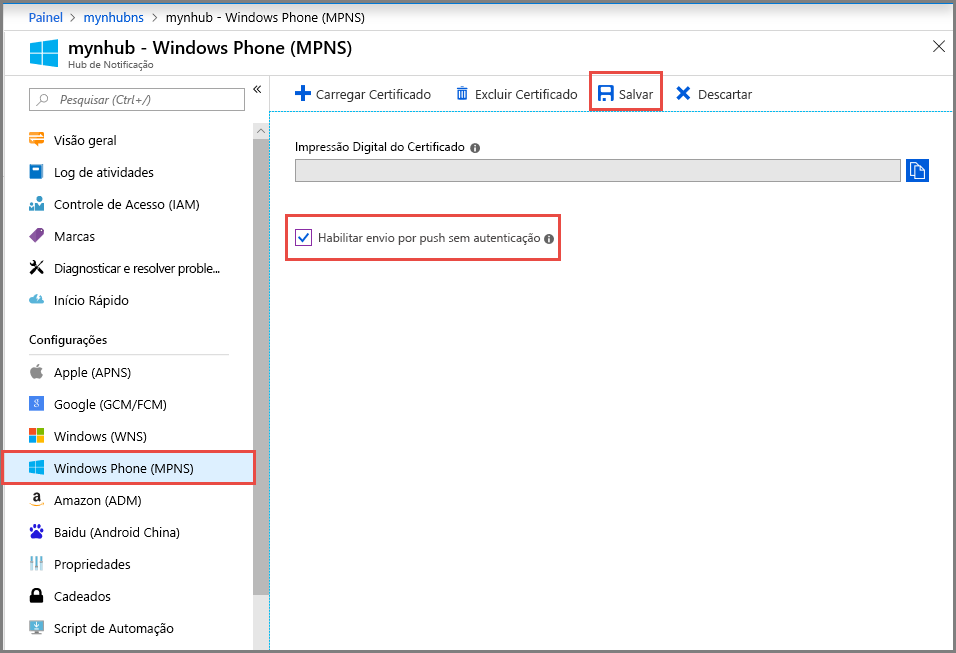

# Tutorial: Enviar notificações para aplicativos do Windows Phone usando Hubs de Notificação do Azure
[!INCLUDE [notification-hubs-selector-get-started](../../includes/notification-hubs-selector-get-started.md)]

Este tutorial mostra como usar os Hubs de Notificação do Azure para enviar notificações por push a aplicativos Silverlight do Windows Phone 8 ou Windows Phone 8.1. Se você estiver visando o Windows Phone 8.1 (sem Silverlight), confira a versão [Windows Universal](notification-hubs-windows-store-dotnet-get-started-wns-push-notification.md) deste tutorial.

Neste tutorial, você cria um aplicativo Windows Phone 8 em branco que recebe notificações por push usando o MPNS (Serviço de Notificação por Push da Microsoft). Após criar o aplicativo, você usará seu hub de notificação para transmitir notificações por push a todos os dispositivos que executam seu aplicativo.

> [!NOTE]
> O SDK do Windows Phone para Hubs de Notificação não oferecem suporte ao uso do WNS (Serviço de Notificação por Push do Windows) com aplicativos Silverlight para Windows Phone 8.1. Para usar o WNS (em vez de MPNS) com aplicativos Silverlight para Windows Phone 8.1, siga o [tutorial Hubs de Notificação - Silverlight para Windows Phone], que usa APIs REST.

Neste tutorial, você aprenderá como: 

> [!div class="checklist"]
> * Criar um hub de notificação
> * Criar um aplicativo do Windows Phone
> * Enviar uma notificação de teste 

## pré-requisitos

- **Assinatura do Azure**. Se você não tiver uma assinatura do Azure, crie uma conta [gratuita](https://azure.microsoft.com/free/) antes de começar.
- [O Visual Studio 2015 Express com componentes de desenvolvimento móvel](https://www.visualstudio.com/vs/older-downloads/)

A conclusão deste tutorial é um pré-requisito para todos os outros tutoriais sobre Hubs de Notificação para aplicativos Windows Phone 8.

## Criar seu Hub de Notificação
[!INCLUDE [notification-hubs-portal-create-new-hub](../../includes/notification-hubs-portal-create-new-hub.md)]

### Definir as configurações do Windows Phone (MPNS)
1. Selecione **Windows Phone (MPNS)** em **CONFIGURAÇÕES DE NOTIFICAÇÃO**.
2. Selecione **Habilitar o envio de autenticação**.
3. Selecione **Salvar** na barra de ferramentas.

    

    O hub foi criado e configurado para enviar a notificação não autenticada para o Windows Phone.

    > [!NOTE]
    > Este tutorial usa MPNS no modo não autenticado. O modo não autenticado MPNS é fornecido com restrições nas notificações que você pode enviar para cada canal. Os Hubs de Notificação dão suporte ao [modo autenticado do MPNS](http://msdn.microsoft.com/library/windowsphone/develop/ff941099.aspx) , permitindo que você carregue seu certificado.

## Criar um aplicativo do Windows Phone
Nesta seção, você deve criar um aplicativo do Windows Phone que se registra com o hub de notificação. 

1. No Visual Studio, crie um novo aplicativo de console do Windows Phone 8. 
   
    ![Aplicativo do Visual Studio - Novo Projeto - Windows Phone][13]
   
    No Visual Studio 2013 Atualização 2 ou posterior, você cria um aplicativo do Windows Phone Silverlight.
   
    ![Visual Studio - Novo Projeto - Aplicativo em branco - Windows Phone Silverlight][11]
2. No Visual Studio, clique com o botão direito do mouse na solução e clique em **Gerenciar Pacotes NuGet**.
3. Procure `WindowsAzure.Messaging.Managed` , clique em **Instalar**e aceite os termos de uso.
   
    ![Visual Studio - Gerenciador de Pacotes do NuGet][20]
4. Abra o arquivo App.xaml.cs e adicione as seguintes instruções de `using` :
   
        using Microsoft.Phone.Notification;
        using Microsoft.WindowsAzure.Messaging;
5. Adicione o código a seguir à parte superior do método **Application_Launching** no App.xaml.cs:
   
        private void Application_Launching(object sender, LaunchingEventArgs e)
        {

            var channel = HttpNotificationChannel.Find("MyPushChannel");
            if (channel == null)
            {
                channel = new HttpNotificationChannel("MyPushChannel");
                channel.Open();
                channel.BindToShellToast();
            }
       
            channel.ChannelUriUpdated += new EventHandler<NotificationChannelUriEventArgs>(async (o, args) =>
            {
                var hub = new NotificationHub("<hub name>", "<connection string>");
                var result = await hub.RegisterNativeAsync(args.ChannelUri.ToString());
       
                System.Windows.Deployment.Current.Dispatcher.BeginInvoke(() =>
                {
                    MessageBox.Show("Registration :" + result.RegistrationId, "Registered", MessageBoxButton.OK);
                });
            });
        }
   
   > [!NOTE]
   > O valor **MyPushChannel** é um índice que é usado para pesquisar um canal existente na coleção [HttpNotificationChannel](https://msdn.microsoft.com/library/windows/apps/microsoft.phone.notification.httpnotificationchannel.aspx) . Se não houver uma, crie uma nova entrada com esse nome.
   > 
   > 
   
    Insira o nome de seu hub e a cadeia de conexão chamada **DefaultListenSharedAccessSignature** que você anotou na seção anterior.
    Esse código recupera no MPNS o URI do canal para o aplicativo e registra esse URI do canal no hub de notificação. Isso também garante que o URI do canal seja registrado em seu hub de notificação toda vez que o aplicativo é iniciado.
   
   > [!NOTE]
   > Este tutorial envia uma notificação do sistema ao dispositivo. Ao enviar uma notificação de bloco, você deve chamar o método **BindToShellTile** no canal. Para oferecer suporte às notificações em bloco e do sistema, chame ambos **BindToShellTile** e **BindToShellToast**.
   > 
   > 
6. No Gerenciador de Soluções, expanda **Propriedades**, abra o arquivo `WMAppManifest.xml`, clique na guia **Recursos** e verifique se a funcionalidade **ID_CAP_PUSH_NOTIFICATION** está marcada. Agora, seu o aplicativo pode receber notificações por push. 
   
    ![Visual Studio - Recursos de aplicativo do Windows Phone][14]    
7. Pressione a tecla `F5` para executar o aplicativo.
   
    Uma mensagem de registro é exibida no aplicativo.
8. Feche o aplicativo ou alterne para a home page. 
   
   > [!NOTE]
   > Para receber uma notificação do sistema por push, o aplicativo não deve estar em execução em primeiro plano.

## Enviar uma notificação de teste 

1. No portal do Azure, alterne para a guia de visão geral.
2. Selecionar **Envio de teste**.

    
3. Na janela **Envio de teste**, siga estas etapas:

    1. Para **Plataformas**, selecione **Windows Phone**. 
    2. Para **Tipo de notificação**, selecione **Notificação do sistema**. 
    3. Selecione **Enviar**
    4. Consulte o **Resultado** na lista na parte inferior da janela. 

            
4. No emulador do Windows Phone ou no Windows Phone, confirme que você vê a mensagem de notificação. 

    

## Próximas etapas
Neste exemplo simples, você transmitiu notificações por push a todos os seus dispositivos Windows Phone 8. Vá para o tutorial a seguir para saber como enviar notificações por push a dispositivos específicos:

> [!div class="nextstepaction"]
>[Notificações por push para especificar dispositivos](notification-hubs-windows-phone-push-xplat-segmented-mpns-notification.md)

<!-- Images. -->
[6]: ./media/notification-hubs-windows-phone-get-started/notification-hub-create-console-app.png
[7]: ./media/notification-hubs-windows-phone-get-started/notification-hub-create-from-portal.png
[8]: ./media/notification-hubs-windows-phone-get-started/notification-hub-create-from-portal2.png
[9]: ./media/notification-hubs-windows-phone-get-started/notification-hub-select-from-portal.png
[10]: ./media/notification-hubs-windows-phone-get-started/notification-hub-select-from-portal2.png
[11]: ./media/notification-hubs-windows-phone-get-started/notification-hub-create-wp-silverlight-app.png
[12]: ./media/notification-hubs-windows-phone-get-started/notification-hub-connection-strings.png

[13]: ./media/notification-hubs-windows-phone-get-started/notification-hub-create-wp-app.png
[14]: ./media/notification-hubs-windows-phone-get-started/mobile-app-enable-push-wp8.png
[15]: ./media/notification-hubs-windows-phone-get-started/notification-hub-pushauth.png
[20]: ./media/notification-hubs-windows-phone-get-started/notification-hub-windows-universal-app-install-package.png
[213]: ./media/notification-hubs-windows-phone-get-started/notification-hub-create-console-app.png

<!-- URLs. -->
[Notification Hubs Guidance]: http://msdn.microsoft.com/library/jj927170.aspx
[MPNS authenticated mode]: http://msdn.microsoft.com/library/windowsphone/develop/ff941099(v=vs.105).aspx
[Use Notification Hubs to push notifications to users]: notification-hubs-aspnet-backend-windows-dotnet-wns-notification.md
[Use Notification Hubs to send breaking news]: notification-hubs-windows-phone-push-xplat-segmented-mpns-notification.md
[toast catalog]: http://msdn.microsoft.com/library/windowsphone/develop/jj662938(v=vs.105).aspx
[tile catalog]: http://msdn.microsoft.com/library/windowsphone/develop/hh202948(v=vs.105).aspx
[tutorial Hubs de Notificação - Silverlight para Windows Phone]: https://github.com/Azure/azure-notificationhubs-samples/tree/master/PushToSLPhoneApp

