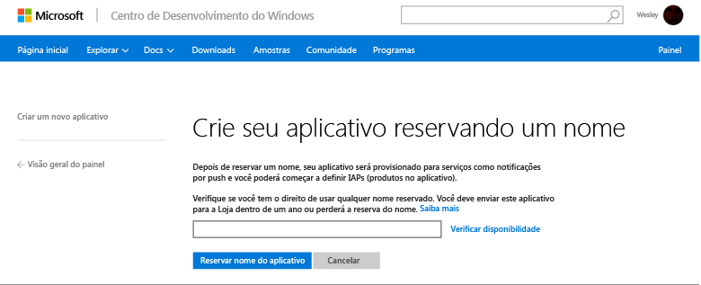
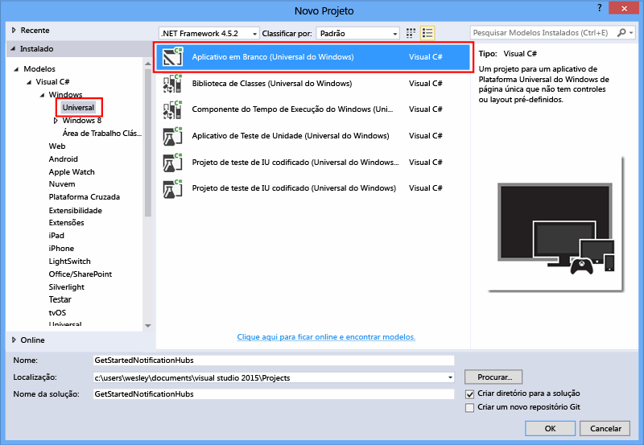
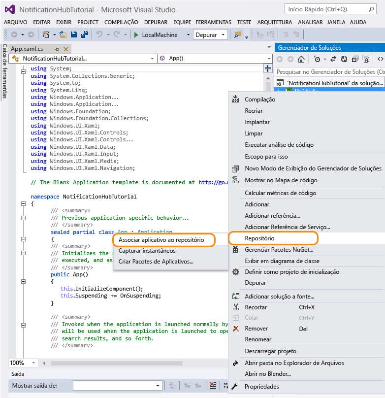
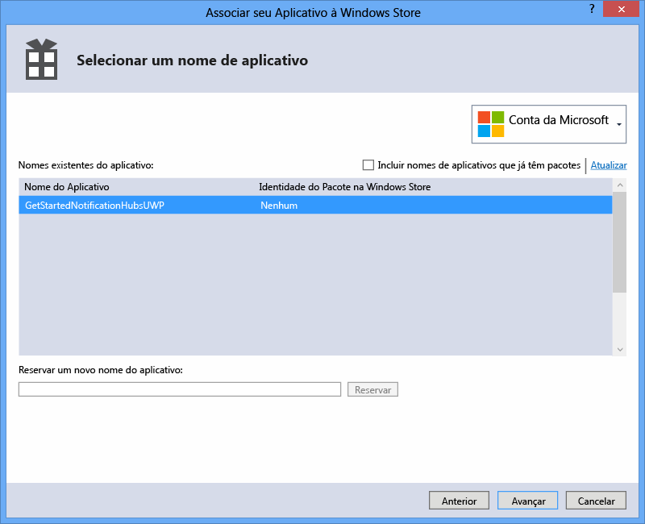
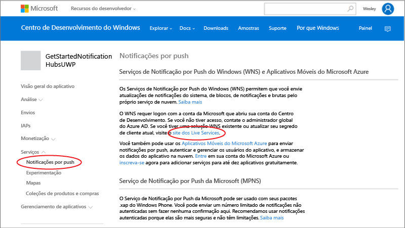
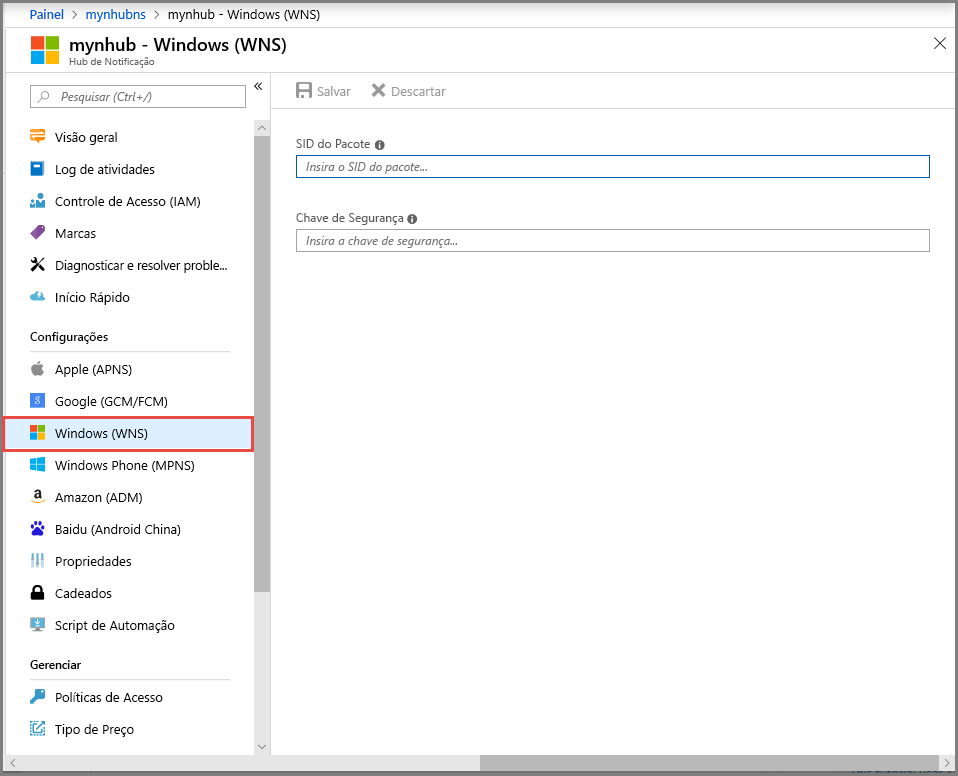

<properties
	pageTitle="Introdução aos Hubs de Notificação do Azure para Aplicativos da Plataforma Universal do Windows | Microsoft Azure"
	description="Neste tutorial, você aprenderá a usar os Hubs de Notificação do Azure para enviar notificações por push a um aplicativo da Plataforma Universal do Windows."
	services="notification-hubs"
	documentationCenter="windows"
	authors="wesmc7777"
	manager="erikre"
	editor="erikre"/>

<tags
	ms.service="notification-hubs"
	ms.workload="mobile"
	ms.tgt_pltfrm="mobile-windows"
	ms.devlang="dotnet"
	ms.topic="hero-article"
	ms.date="07/21/2016"
	ms.author="wesmc"/>

# Introdução aos Hubs de Notificação para aplicativos da Plataforma Universal do Windows

[AZURE.INCLUDE [notification-hubs-selector-get-started](../../includes/notification-hubs-selector-get-started.md)]

##Visão geral

Este tutorial mostra como usar os Hubs de Notificação do Azure para enviar notificações por push para um aplicativo da Plataforma Universal do Windows (UWP).

Neste tutorial, você cria um aplicativo da Windows Store em branco que recebe notificações por push usando o serviço WNS (Notificação por Push do Windows). Ao finalizar, você poderá usar seu hub de notificação para transmitir notificações por push a todos os dispositivos que executam seu aplicativo.

## Antes de começar

[AZURE.INCLUDE [notification-hubs-hero-slug](../../includes/notification-hubs-hero-slug.md)]

O código completo para este tutorial pode ser encontrado no GitHub [aqui](https://github.com/Azure/azure-notificationhubs-samples/tree/master/dotnet/GetStartedWindowsUniversal).

##Pré-requisitos

Este tutorial exige o seguinte:

+ [Microsoft Visual Studio Community 2015](https://www.visualstudio.com/products/visual-studio-community-vs) ou posterior

+ [Ferramentas de Desenvolvimento de Aplicativos Universais do Windows instaladas](https://msdn.microsoft.com/windows/uwp/get-started/get-set-up)

+ Uma conta ativa do Azure  Se não tiver uma conta, você poderá criar uma conta de avaliação gratuita em apenas alguns minutos. Para obter detalhes, consulte [Avaliação gratuita do Azure](https://azure.microsoft.com/pricing/free-trial/?WT.mc_id=A0E0E5C02&amp;returnurl=http%3A%2F%2Fazure.microsoft.com%2Fpt-BR%2Fdocumentation%2Farticles%2Fnotification-hubs-windows-store-dotnet-get-started%2F).

+ Uma conta ativa da Windows Store

A conclusão deste tutorial é um pré-requisito para todos os outros tutoriais sobre Hubs de Notificação para aplicativos da Plataforma Universal do Windows.

##Registrar seu aplicativo para a Windows Store

Para enviar notificações por push para aplicativos da UWP, você deve associar seu aplicativo com a Windows Store. Em seguida, você deve configurar seu Hub de Notificação para se integrar com o WNS.

1. Se você não tiver registrado seu aplicativo, navegue até o [Centro de Desenvolvimento do Windows](https://dev.windows.com/overview), entre com sua conta da Microsoft e clique em **Criar um novo aplicativo**.

2. Digite um nome para seu aplicativo e clique em **Reservar nome do aplicativo**.

   	

   	Isso cria um novo registro da Windows Store para seu aplicativo.

3. No Visual Studio, crie um novo projeto de Aplicativos da Loja no Visual C# usando o modelo **Aplicativo em Branco** e clique em **OK**.

   	

4. Aceite os padrões para as versões mínima e de destino da plataforma.

5. No Gerenciador de Soluções, clique com o botão direito no projeto do aplicativo da Windows Store, clique em **Armazenar** e, em seguida, clique em **Aplicativo associado à Store...**.

   	

   	O assistente **Associar seu aplicativo à Windows Store** é exibido.

6. No assistente, clique em **Entrar** e entre com sua conta da Microsoft.

7. Clique no aplicativo que você registrou na etapa 2, clique em **Avançar** e, em seguida, clique em **Associar**.

   	

   	Isso adiciona as informações de registro necessárias da Windows Store para o manifesto do aplicativo.

8. De volta à página do [Centro de Desenvolvimento do Windows](http://go.microsoft.com/fwlink/p/?LinkID=266582) para seu novo aplicativo, clique em **Serviços**, **Notificações por push** e clique em **Site do Live Services** em **WNS (Serviços de Notificação por Push do Windows) e Aplicativos Móveis do Microsoft Azure**.

   	

9. Na página de registro do seu aplicativo, anote a senha do **Segredo do Aplicativo** e o **Identificador de segurança (SID) do pacote** localizado nas configurações da plataforma **Windows Store**.

   	

 	> [AZURE.WARNING]
	O segredo do aplicativo e o SID do pacote são credenciais de segurança importantes. Não compartilhe esses valores com ninguém nem os distribua com seu aplicativo.

##Configurar seu Hub de Notificação

[AZURE.INCLUDE [notification-hubs-portal-create-new-hub](../../includes/notification-hubs-portal-create-new-hub.md)]

<ol start="7">
<li>
Selecione a opção <b>Serviços de Notificação</b> e a opção <b>Windows (WNS)</b>. Em seguida, insira a senha do <b>Segredo do aplicativo</b> no campo <b>Chave de Segurança</b> campo. Insira o valor do <b>SID do Pacote</b> obtido do WNS na seção anterior e clique em <b>Salvar</b>.

</li>
</ol>

&emsp;&emsp;

O hub de notificação agora está configurado para trabalhar com o WNS e você tem as cadeias de conexão para registrar seu aplicativo e enviar notificações.

##Conectar seu aplicativo ao hub de notificação

1. No Visual Studio, clique com o botão direito do mouse na solução e clique em **Gerenciar Pacotes NuGet**.

	Isso exibe a caixa de diálogo **Gerenciar Pacotes NuGet**.

2. Pesquise `WindowsAzure.Messaging.Managed` e clique em **Instalar** e aceite os termos de uso.

	![][20]

	Isso baixará, instalará, e adicionará uma referência à biblioteca de Mensagens do Azure para Windows usando o <a href="http://nuget.org/packages/WindowsAzure.Messaging.Managed/">pacote NuGet WindowsAzure.Messaging.Managed</a>.

3. Abra o arquivo de projeto App.xaml.cs e adicione as instruções `using` a seguir.

        using Windows.Networking.PushNotifications;
        using Microsoft.WindowsAzure.Messaging;
		using Windows.UI.Popups;

4. Além disso, no App.xaml.cs, adicione a seguinte definição do método **InitNotificationsAsync** para a classe **Aplicativo**:

	    private async void InitNotificationsAsync()
        {
            var channel = await PushNotificationChannelManager.CreatePushNotificationChannelForApplicationAsync();

            var hub = new NotificationHub("< your hub name>", "<Your DefaultListenSharedAccessSignature connection string>");
			var result = await hub.RegisterNativeAsync(channel.Uri);

            // Displays the registration ID so you know it was successful
            if (result.RegistrationId != null)
            {
                var dialog = new MessageDialog("Registration successful: " + result.RegistrationId);
                dialog.Commands.Add(new UICommand("OK"));
                await dialog.ShowAsync();
            }

        }

    Esse código recupera no WNS o URI do canal para o aplicativo e registra esse URI do canal no hub de notificação.

    >[AZURE.NOTE] Substitua o espaço reservado “nome do seu hub” pelo nome do hub de notificação que aparece no Portal do Azure. Além disso, substitua o espaço reservado da cadeia de conexão com a cadeia de conexão chamada **DefaultListenSharedAccessSignature** que você obteve na página **Políticas de Acesso** do seu Hub de Notificação em uma seção anterior.

5. Na parte superior do manipulador de eventos **OnLaunched** no App.xaml.cs, adicione a seguinte chamada para o novo método **InitNotificationsAsync**:

        InitNotificationsAsync();

    Isso garante que o URI do canal seja registrado em seu hub de notificação toda vez que o aplicativo for iniciado.

6. Pressione a tecla **F5** para executar o aplicativo. Uma caixa de diálogo pop-up que contém a chave do Registro é exibida.

   	![][19]

Seu aplicativo agora está pronto para receber notificações do sistema.

##Enviar notificações 

Você pode testar rapidamente o recebimento de notificações em seu aplicativo ao enviar notificações no [Portal do Azure](https://portal.azure.com/) usando o botão **Envio de Teste** no hub de notificação, como mostrado na tela abaixo.

Notificações por push normalmente são enviadas em um serviço de back-end como Serviços Móveis ou ASP.NET usando uma biblioteca compatível. Você também pode usar a API REST diretamente para enviar mensagens de notificação se uma biblioteca não está disponível para o back-end.

Neste tutorial, optamos pela simplicidade e só demonstraremos os testes do aplicativo cliente enviando notificações usando o SDK do .NET para hubs de notificação em um aplicativo de console em vez de um serviço de back-end. Recomendamos o tutorial [Usar Hubs de Notificação para enviar notificações por push aos usuários] como a próxima etapa de envio de notificações de back-end do ASP.NET. No entanto, as abordagens a seguir podem ser usadas para o envio de notificações:

* **Interface REST**: você pode dar suporte à notificação em qualquer plataforma de back-end usando a [interface REST](http://msdn.microsoft.com/library/windowsazure/dn223264.aspx).

* **SDK do .NET dos Hubs de Notificações do Microsoft Azure**: no Gerenciador de Pacotes do Nuget para o Visual Studio, execute [Install-Package Microsoft.Azure.NotificationHubs](https://www.nuget.org/packages/Microsoft.Azure.NotificationHubs/).

* **Node.js**: [Como usar os Hubs de Notificação de Node.js](notification-hubs-nodejs-push-notification-tutorial.md).

* **Aplicativos Móveis do Azure**: para obter um exemplo de como enviar notificações de um Aplicativo Móvel do Azure integrado com Hubs de Notificação, confira [Adicionar notificação por push a Aplicativos Móveis](../app-service-mobile/app-service-mobile-windows-store-dotnet-get-started-push.md).

* **Java/PHP**: para obter um exemplo de como enviar notificações usando as APIs REST, confira "Como usar os Hubs de Notificação do Java/PHP" ([Java](notification-hubs-java-push-notification-tutorial.md) | [PHP](notification-hubs-php-push-notification-tutorial.md)).

## (Opcional) Enviar notificações de um aplicativo de console

Para enviar notificações usando um aplicativo de console .NET, siga estas etapas.

1. Clique com o botão direito do mouse na solução, selecione **Adicionar** e **Novo Projeto...** e, em **Visual C#**, clique em **Windows**, **Aplicativo do Console** e em **OK**.

   	![][13]

	Isso adiciona um novo aplicativo de console do Visual C# à solução. Você também pode fazer isso em uma solução separada.

2. No Visual Studio, clique em **Ferramentas**, em **Gerenciador de Pacotes NuGet** e em **Console do Gerenciador de Pacotes**.

	Isso exibe o Console do Gerenciador de Pacotes no Visual Studio.

3. Na janela do Console do Gerenciador de Pacotes, defina o **Projeto padrão** como o seu novo projeto de aplicativo do console e execute o seguinte comando na janela do console:

        Install-Package Microsoft.Azure.NotificationHubs

	Isso adiciona uma referência ao SDK dos Hubs de Notificação do Azure usando o <a href="http://www.nuget.org/packages/Microsoft.Azure.NotificationHubs/">pacote NuGet Microsoft.Azure.Notification Hubs</a>.

	

4. Abra o arquivo Program.cs e adicione a seguinte instrução `using`:

        using Microsoft.Azure.NotificationHubs;

5. Na classe **Programa**, adicione o seguinte método:

        private static async void SendNotificationAsync()
        {
            NotificationHubClient hub = NotificationHubClient
				.CreateClientFromConnectionString("<connection string with full access>", "<hub name>");
            var toast = @"<toast><visual><binding template=""ToastText01""><text id=""1"">Hello from a .NET App!</text></binding></visual></toast>";
            await hub.SendWindowsNativeNotificationAsync(toast);
        }

   	Substitua o espaço reservado “nome do hub” pelo nome do hub de notificação que aparece no Portal do Azure. Além disso, substitua o espaço reservado da cadeia de conexão com a cadeia de conexão chamada **DefaultFullSharedAccessSignature** que você obteve na página **Políticas de Acesso** do seu Hub de Notificação na seção chamada “Configurar seu hub de notificação”.

	>[AZURE.NOTE]Verifique se você está usando a cadeia de conexão com o acesso **Completo** e não com o acesso **Escuta**. A cadeia de acesso de escuta não tem permissões para enviar notificações.

6. Adicione as seguintes linhas no método **Main**:

         SendNotificationAsync();
		 Console.ReadLine();

7. No Visual Studio, clique com o botão direito do mouse no projeto do aplicativo do console e clique em **Definir como Projeto de Inicialização** para defini-lo como o projeto de inicialização. Pressione a tecla **F5** para executar o aplicativo de console.

   	![][14]

	Você receberá uma notificação do sistema em todos os dispositivos registrados. Clique ou toque no banner de notificação do sistema carrega o aplicativo.

Você pode encontrar todas as cargas suportadas nos tópicos do [catálogo de notificações do sistema], no [catálogo de blocos] e na [visão geral de emblema] no MSDN.

##Próximas etapas

Neste exemplo simples, você envia notificações para todos os seus dispositivos Windows usando o portal ou um aplicativo de console. Recomendamos o tutorial [Usar os Hubs de Notificação para enviar notificações por push aos usuários] como a próxima etapa. Ele mostra como enviar notificações de um back-end do ASP.NET usando marcas para direcionar usuários específicos.

Se desejar segmentar os usuários por grupos de interesse, você poderá ler [Usar Hubs de Notificação para enviar notícias mais recentes].

Para obter mais informações gerais sobre os Hubs de Notificação, confira [Diretrizes dos Hubs de Notificação](notification-hubs-push-notification-overview.md).

<!-- Images. -->
[13]: ./media/notification-hubs-windows-store-dotnet-get-started/notification-hub-create-console-app.png
[14]: ./media/notification-hubs-windows-store-dotnet-get-started/notification-hub-windows-toast.png
[19]: ./media/notification-hubs-windows-store-dotnet-get-started/notification-hub-windows-reg.png
[20]: ./media/notification-hubs-windows-store-dotnet-get-started/notification-hub-windows-universal-app-install-package.png

<!-- URLs. -->

[Usar Hubs de Notificação para enviar notificações por push aos usuários]: notification-hubs-aspnet-backend-windows-dotnet-notify-users.md
[Usar os Hubs de Notificação para enviar notificações por push aos usuários]: notification-hubs-aspnet-backend-windows-dotnet-notify-users.md
[Usar Hubs de Notificação para enviar notícias mais recentes]: notification-hubs-windows-store-dotnet-send-breaking-news.md

[catálogo de notificações do sistema]: http://msdn.microsoft.com/library/windows/apps/hh761494.aspx
[catálogo de blocos]: http://msdn.microsoft.com/library/windows/apps/hh761491.aspx
[visão geral de emblema]: http://msdn.microsoft.com/library/windows/apps/hh779719.aspx

<!---HONumber=AcomDC_0727_2016-->