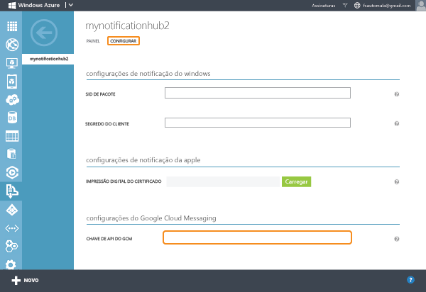
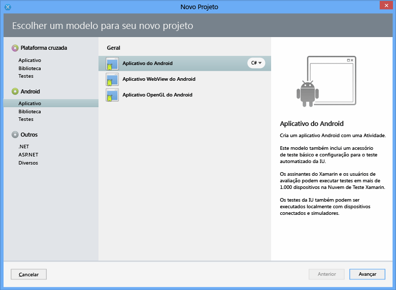
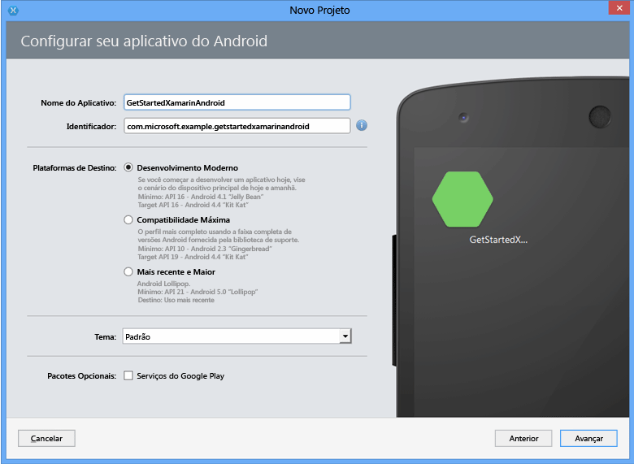
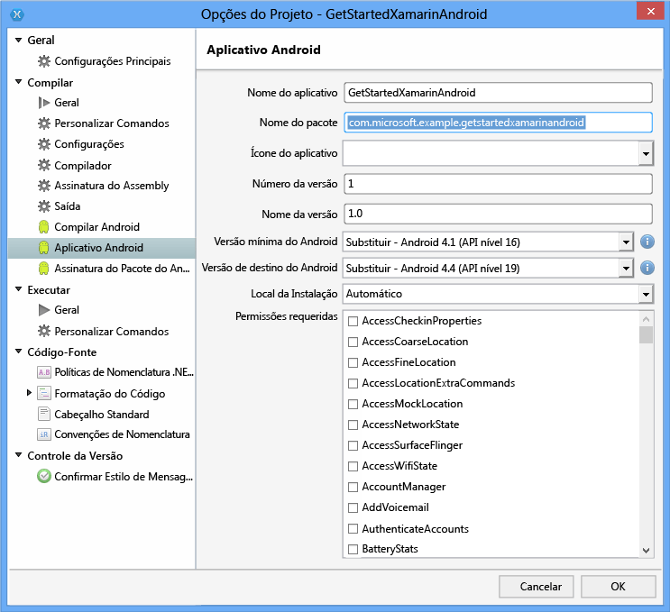

<properties
	pageTitle="Introdução aos Hubs de Notificação para aplicativos Xamarin.Android | Microsoft Azure"
	description="Neste tutorial, você aprende a usar os Hubs de Notificação do Azure para enviar notificações por push a um aplicativo Xamarin Android."
	authors="wesmc7777"
	manager="dwrede"
	editor=""
	services="notification-hubs"
	documentationCenter="xamarin"/>

<tags
	ms.service="notification-hubs"
	ms.workload="mobile"
	ms.tgt_pltfrm="mobile-xamarin-android"
	ms.devlang="dotnet"
	ms.topic="hero-article"
	ms.date="11/17/2015"
	ms.author="wesmc"/>

# Introdução aos Hubs de Notificação com o Xamarin para Android

[AZURE.INCLUDE [notification-hubs-selector-get-started](../../includes/notification-hubs-selector-get-started.md)]

##Visão geral

Este tutorial mostra como usar os Hubs de Notificação do Azure para enviar notificações por push para um aplicativo Xamarin.Android. Você criará um aplicativo Xamarin.Android em branco que recebe notificações por push usando o GCM(Google Cloud Messaging). Ao finalizar, você poderá usar seu hub de notificação para transmitir notificações por push a todos os dispositivos que executam seu aplicativo. O código concluído está disponível na amostra do [aplicativo NotificationHubs][GitHub].

Este tutorial demonstra o cenário de transmissão simples usando Hubs de Notificação.

## Antes de começar

[AZURE.INCLUDE [notification-hubs-hero-slug](../../includes/notification-hubs-hero-slug.md)]

O código concluído neste tutorial pode ser encontrado no GitHub [aqui](https://github.com/Azure/azure-notificationhubs-samples/tree/master/dotnet/Xamarin/GetStartedXamarinAndroid).

##Pré-requisitos

Este tutorial exige o seguinte:

+ [Xamarin.Android]
+ Conta ativa do Google
+ [Componente dos Serviços Móveis do Azure]
+ [Componente de mensagens do Azure]
+ [Componente de mensagens de nuvem do Google]

A conclusão deste tutorial é um pré-requisito para todos os outros tutoriais sobre Hubs de Notificação para aplicativos Xamarin.Android.

> [AZURE.IMPORTANT]Para concluir este tutorial, você precisa ter uma conta ativa do Azure. Se você não tiver uma conta, poderá criar uma conta de avaliação gratuita em apenas alguns minutos. Para obter detalhes, consulte [Avaliação gratuita do Azure](http://azure.microsoft.com/pricing/free-trial/?WT.mc_id=A9C9624B5&amp;returnurl=http%3A%2F%2Fazure.microsoft.com%2Fpt-BR%2Fdocumentation%2Farticles%2Fpartner-xamarin-notification-hubs-android-get-started%2F).

##Habilitar o sistema de mensagens em nuvem do Google

[AZURE.INCLUDE [mobile-services-enable-Google-cloud-messaging](../../includes/mobile-services-enable-google-cloud-messaging.md)]

##Configurar seu Hub de Notificação

[AZURE.INCLUDE [notification-hubs-portal-create-new-hub](../../includes/notification-hubs-portal-create-new-hub.md)]

<ol start="7">
<li>
Clique na guia <b>Configurar</b> na parte superior, digite o valor de <b>Chave da API</b> que você obteve na etapa anterior e clique em <b>Salvar</b>.

</li>
</ol>
&emsp;&emsp;

Agora, o seu hub de notificação está configurado para funcionar com o GCM e você tem as cadeias de conexão ao registrar seu aplicativo para receber notificações e enviar notificações por push.

##Conectar seu aplicativo ao hub de notificação

###Criar um novo projeto

1. No Xamarin Studio, clique em **Nova Solução**, clique em **Aplicativo Android** e clique em **Avançar**.

   	

2. Insira o **Nome do Aplicativo** e o **Identificador**. Clique nas **Plataformas de Destino** às quais você deseja dar suporte e clique em **Avançar** e em **Criar**.

   	

	Isso cria um novo projeto Android.

2. Abra as propriedades do projeto clicando com o botão direito do mouse em seu novo projeto no modo de exibição Solução e escolha **Opções**. Selecione o item **Aplicativo Android** na seção **Compilação**.

	Certifique-se de que a primeira letra de seu **nome do pacote** esteja em minúscula.

	> [AZURE.IMPORTANT]A primeira letra do nome do pacote deve estar em minúscula. Caso contrário, você receberá erros de manifesto do aplicativo ao registrar **BroadcastReceiver** e **IntentFilter** para as notificações por push abaixo.

   	

3. Opcionalmente, defina a **Versão mínima do Android** como outro Nível de API.

4. Opcionalmente, defina a **Versão de destino do Android** para a outra versão de API que você gostaria de ter como destino (deve ser API nível 8 ou superior).

Clique em **OK** e feche a caixa de diálogo Opções do Projeto.

###Adicionar os componentes necessários ao seu projeto

O cliente de mensagens de nuvem do Google disponível na loja de componentes Xamarin simplifica o processo de oferecer suporte de notificações por push no Xamarin.Android.

1. Clique com o botão direito do mouse na pasta Componentes no aplicativo Xamarin.Android e escolha **Obter Mais Componentes**.

2. Pesquise o componente **Mensagens do Azure** e adicione-o ao projeto.

3. Pesquise o componente **Cliente de Mensagens de Nuvem do Azure** e adicione-o ao projeto.

###Configurar hubs de notificação em seu projeto

1. Colete as informações a seguir para o aplicativo Android e o hub de notificação:

	- **GoogleProjectNumber**: obtenha o valor de Número do Projeto da visão geral do seu aplicativo no Google Developer Portal. Você anotou este valor anteriormente quando criou o aplicativo no portal.
	- **Cadeia de conexão de escuta**: no painel do portal do Azure, clique em **Exibir cadeias de conexão**. Copiar a sequência de conexão *DefaultListenSharedAccessSignature* para esse valor.
	- **Nome do hub**: este é o nome do seu hub no portal do Azure. Por exemplo, *mynotificationhub2*.

	Crie uma classe **Constants.cs** para seu projeto de Xamarin e defina os valores de constantes a seguir na classe. Substitua os espaços reservados pelos seus valores.

		public static class Constants
		{
			public const string SenderID = "<GoogleProjectNumber>"; // Google API Project Number
			public const string ListenConnectionString = "<Listen connection string>";
			public const string NotificationHubName = "<hub name>";
		}

2. Adicionar as seguintes instruções à **MainActivity.cs**:

		using Android.Util;
		using Gcm.Client;

3. Adicione uma variável de instância à classe `MainActivity` que será usada para mostrar uma caixa de diálogo de alerta quando o aplicativo estiver em execução:

		public static MainActivity instance;

3. Criar o seguinte método na classe **MainActivity**:

		private void RegisterWithGCM()
		{
			// Check to ensure everything's set up right
			GcmClient.CheckDevice(this);
			GcmClient.CheckManifest(this);

			// Register for push notifications
			Log.Info("MainActivity", "Registering...");
			GcmClient.Register(this, Constants.SenderID);
		}

4. No método `OnCreate` de **MainActivity.cs**, inicialize a variável `instance` e adicione uma chamada para `RegisterWithGCM`:

		protected override void OnCreate (Bundle bundle)
		{
			instance = this;

			base.OnCreate (bundle);

			// Set your view from the "main" layout resource
			SetContentView (Resource.Layout.Main);

			// Get your button from the layout resource,
			// and attach an event to it
			Button button = FindViewById<Button> (Resource.Id.myButton);

			RegisterWithGCM();
		}

4. Crie uma nova classe, **MyBroadcastReceiver**.

	> [AZURE.NOTE]Mostraremos a criação de uma classe **BroadcastReceiver** desde o início. No entanto, uma alternativa rápida para criar manualmente o **MyBroadcastReceiver.cs** é consultar o arquivo **GcmService.cs** encontrado na amostra do projeto Xamarin.Android incluído com os [Exemplos do NotificationHubs][GitHub] . Duplicar o **GcmService.cs** e alterar os nomes de classe pode ser uma ótima maneira de começar.

5. Adicione as instruções using a seguir a **MyBroadcastReceiver.cs** (para se referir ao componente e ao assembly adicionados anteriormente):

		using System.Collections.Generic;
		using System.Text;
		using Android.App;
		using Android.Content;
		using Android.Util;
		using Gcm.Client;
		using WindowsAzure.Messaging;

5. Em **MyBroadcastReceiver.cs**, adicione as seguintes solicitações de permissão entre as instruções **using** e a declaração de **namespace**:

		[assembly: Permission(Name = "@PACKAGE_NAME@.permission.C2D_MESSAGE")]
		[assembly: UsesPermission(Name = "@PACKAGE_NAME@.permission.C2D_MESSAGE")]
		[assembly: UsesPermission(Name = "com.google.android.c2dm.permission.RECEIVE")]

		//GET_ACCOUNTS is needed only for Android versions 4.0.3 and below
		[assembly: UsesPermission(Name = "android.permission.GET_ACCOUNTS")]
		[assembly: UsesPermission(Name = "android.permission.INTERNET")]
		[assembly: UsesPermission(Name = "android.permission.WAKE_LOCK")]

6. Em **MyBroadcastReceiver.cs**, altere a classe **MyBroadcastReceiver** para corresponder ao seguinte:

    	[BroadcastReceiver(Permission=Gcm.Client.Constants.PERMISSION_GCM_INTENTS)]
        [IntentFilter(new string[] { Gcm.Client.Constants.INTENT_FROM_GCM_MESSAGE },
			Categories = new string[] { "@PACKAGE_NAME@" })]
        [IntentFilter(new string[] { Gcm.Client.Constants.INTENT_FROM_GCM_REGISTRATION_CALLBACK },
			Categories = new string[] { "@PACKAGE_NAME@" })]
        [IntentFilter(new string[] { Gcm.Client.Constants.INTENT_FROM_GCM_LIBRARY_RETRY },
			Categories = new string[] { "@PACKAGE_NAME@" })]
        public class MyBroadcastReceiver : GcmBroadcastReceiverBase<PushHandlerService>
        {
            public static string[] SENDER_IDS = new string[] { Constants.SenderID };

            public const string TAG = "MyBroadcastReceiver-GCM";
        }

7. Adicione outra classe a **MyBroadcastReceiver.cs** chamada **PushHandlerService**, que deriva de **GcmServiceBase**. Certifique-se de aplicar o atributo **Service** à classe:

    	[Service] // Must use the service tag
    	public class PushHandlerService : GcmServiceBase
    	{
        	public static string RegistrationID { get; private set; }
        	private NotificationHub Hub { get; set; }

        	public PushHandlerService() : base(Constants.SenderID)
       		{
            	Log.Info(MyBroadcastReceiver.TAG, "PushHandlerService() constructor");
        	}
    	}

8. **GcmServiceBase** implementa métodos **OnRegistered()**, **OnUnRegistered()**, **OnMessage()**, **OnRecoverableError()** e **OnError()**. Nossa classe de implementação **PushHandlerService** deve substituir esses métodos e esses métodos serão acionados em resposta à interação com o hub de notificação.

9. Substitua o método **OnRegistered()** em **PushHandlerService** usando o seguinte código:

		protected override void OnRegistered(Context context, string registrationId)
		{
			Log.Verbose(MyBroadcastReceiver.TAG, "GCM Registered: " + registrationId);
			RegistrationID = registrationId;

			createNotification("PushHandlerService-GCM Registered...",
								"The device has been Registered!");

			Hub = new NotificationHub(Constants.NotificationHubName, Constants.ListenConnectionString,
										context);
			try
			{
				Hub.UnregisterAll(registrationId);
			}
			catch (Exception ex)
			{
				Log.Error(MyBroadcastReceiver.TAG, ex.Message);
			}

			//var tags = new List<string>() { "falcons" }; // create tags if you want
			var tags = new List<string>() {};

			try
			{
				var hubRegistration = Hub.Register(registrationId, tags.ToArray());
			}
			catch (Exception ex)
			{
				Log.Error(MyBroadcastReceiver.TAG, ex.Message);
			}
		}

	> [AZURE.NOTE]No código **OnRegistered()** acima, você deve observar a capacidade de especificar marcas para se registrar em canais de mensagens específicos.

10. Substitua o método **OnMessage** em **PushHandlerService** usando o seguinte código:

		protected override void OnMessage(Context context, Intent intent)
		{
			Log.Info(MyBroadcastReceiver.TAG, "GCM Message Received!");

			var msg = new StringBuilder();

			if (intent != null && intent.Extras != null)
			{
				foreach (var key in intent.Extras.KeySet())
					msg.AppendLine(key + "=" + intent.Extras.Get(key).ToString());
			}

			string messageText = intent.Extras.GetString("message");
			if (!string.IsNullOrEmpty (messageText))
			{
				createNotification ("New hub message!", messageText);
			}
			else
			{
				createNotification ("Unknown message details", msg.ToString ());
			}
		}

11. Adicione os métodos **createNotification** e **dialogNotify** ao **PushHandlerService** para notificar os usuários quando a notificação for recebida.

	>[AZURE.NOTE]O design de notificação no Android versão 5.0 e posterior teve uma mudança significativa das versões anteriores. Se você testar isso no Android 5.0 ou posterior, o aplicativo precisará estar em execução para receber a notificação. Para obter mais informações, consulte [Notificações do Android](http://go.microsoft.com/fwlink/?LinkId=615880).

        void createNotification(string title, string desc)
        {
            //Create notification
            var notificationManager = GetSystemService(Context.NotificationService) as NotificationManager;

            //Create an intent to show UI
            var uiIntent = new Intent(this, typeof(MainActivity));

            //Create the notification
            var notification = new Notification(Android.Resource.Drawable.SymActionEmail, title);

            //Auto-cancel will remove the notification once the user touches it
            notification.Flags = NotificationFlags.AutoCancel;

            //Set the notification info
            //we use the pending intent, passing our ui intent over, which will get called
            //when the notification is tapped.
            notification.SetLatestEventInfo(this, title, desc, PendingIntent.GetActivity(this, 0, uiIntent, 0));

            //Show the notification
            notificationManager.Notify(1, notification);
			dialogNotify (title, desc);
        }

		protected void dialogNotify(String title, String message)
		{

			MainActivity.instance.RunOnUiThread(() => {
				AlertDialog.Builder dlg = new AlertDialog.Builder(MainActivity.instance);
				AlertDialog alert = dlg.Create();
				alert.SetTitle(title);
				alert.SetButton("Ok", delegate {
					alert.Dismiss();
				});
				alert.SetMessage(message);
				alert.Show();
			});
		}

12. Substitua os membros abstratos **OnUnRegistered()**, **OnRecoverableError()** e **OnError()** para que seu código seja compilado:

		protected override void OnUnRegistered(Context context, string registrationId)
		{
			Log.Verbose(MyBroadcastReceiver.TAG, "GCM Unregistered: " + registrationId);

			createNotification("GCM Unregistered...", "The device has been unregistered!");
		}

		protected override bool OnRecoverableError(Context context, string errorId)
		{
			Log.Warn(MyBroadcastReceiver.TAG, "Recoverable Error: " + errorId);

			return base.OnRecoverableError (context, errorId);
		}

		protected override void OnError(Context context, string errorId)
		{
			Log.Error(MyBroadcastReceiver.TAG, "GCM Error: " + errorId);
		}

##Executar o aplicativo no emulador

Se você executar o aplicativo no emulador, certifique-se de usar um Android Virtual Device (AVD) que oferece suporte a APIs do Google.

> [AZURE.IMPORTANT]Para receber as notificações por push, você deve configurar uma conta do Google em seu Dispositivo Virtual Android. (No emulador, navegue até **Configurações** e clique em **Adicionar Conta**). Além disso, certifique-se de que o emulador esteja conectado à Internet.

>[AZURE.NOTE]O design de notificação no Android versão 5.0 e posterior teve uma mudança significativa das versões anteriores. Para saber mais, confira [Notificações do Android](http://go.microsoft.com/fwlink/?LinkId=615880).

1. A partir de **Ferramentas**, clique em **Abrir gerenciador de emulador do Android**, selecione seu dispositivo e, em seguida, clique em **Editar**.

   	![][18]

2. Selecione **APIs do Google**, em **Destino** e clique em **OK**.

   	![][19]

3. Na barra de ferramentas superior, clique em **Executar**e, em seguida, selecione seu aplicativo. Isso iniciará o emulador e executará o aplicativo.

  O aplicativo recupera o *registrationId* do GCM e registrará no Hub de Notificação.

##Enviar notificações de seu back-end

Você pode testar o recebimento de notificações em seu aplicativo ao enviar notificações no portal do Azure usando a guia de depuração no hub de notificação, como mostrado na tela abaixo.

![][30]

Normalmente, as notificações por push são enviadas em um serviço de back-end como os Serviços Móveis ou ASP.NET por meio de uma biblioteca compatível. Você também poderá usar a API REST diretamente para enviar mensagens de notificação se uma biblioteca não estiver disponível para o back-end.

Veja a seguir uma lista de outros tutoriais que talvez você queira examinar para o envio de notificações:

- ASP.NET: confira [Usar os Hubs de Notificação para enviar notificações por push aos usuários].
- SDK do Java para Hubs de Notificação do Azure: confia [Como usar os Hubs de Notificação do Java](notification-hubs-java-backend-how-to.md) para enviar notificações do Java. Isso foi testado no Eclipse para desenvolvimento no Android.
- PHP: confira [Como usar Hubs de Notificação do PHP](notification-hubs-php-backend-how-to.md).

Nas próximas subseções do tutorial, você envia notificações usando um aplicativo de console .NET e um serviço móvel por meio de um script de nó.

####(Opcional) Enviar notificações usando um aplicativo .NET

Nesta seção, enviaremos as notificações usando um aplicativo de console .NET

1. Crie um novo aplicativo de console do Visual C#:

   	![][20]

2. No Visual Studio, clique em **Ferramentas**, em **Gerenciador de Pacotes do NuGet** e em **Console do Gerenciador de Pacotes**.

	Isso exibe o Console do Gerenciador de Pacotes no Visual Studio.

3. Na janela do Console do Gerenciador de Pacotes, defina o **Projeto padrão** como o seu novo projeto de aplicativo do console e execute o seguinte comando na janela do console:

        Install-Package Microsoft.Azure.NotificationHubs

	Isso adiciona uma referência ao SDK dos Hubs de Notificação do Azure usando o <a href="http://www.nuget.org/packages/Microsoft.Azure.NotificationHubs/">pacote NuGet Microsoft.Azure.Notification Hubs</a>.

	

4. Abra o arquivo Program.cs e adicione a seguinte instrução `using`:

        using Microsoft.Azure.NotificationHubs;

5. Em sua classe `Program`, adicione o seguinte método: Atualize o texto de espaço reservado com sua cadeia de conexão do *DefaultFullSharedAccessSignature* e o nome do hub no portal do Azure.

        private static async void SendNotificationAsync()
        {
            NotificationHubClient hub = NotificationHubClient.CreateClientFromConnectionString("<connection string with full access>", "<hub name>");
            await hub.SendGcmNativeNotificationAsync("{ "data" : {"message":"Hello from Azure!"}}");
        }

6. Adicione as seguintes linhas ao método **Main**:

         SendNotificationAsync();
		 Console.ReadLine();

7. Pressione a tecla F5 para executar o aplicativo. Você deve receber uma notificação no aplicativo.

   	![][21]

####(Opcional) Enviar notificações usando um serviço móvel

1. Acompanhe [Introdução aos Serviços Móveis].

1. Entre no [portal do Azure] e selecione seu serviço móvel.

2. Selecione a guia **Agendador** na parte superior.

   	![][22]

3. Crie um novo trabalho agendado, insira um nome e selecione **Sob demanda**.

   	![][23]

4. Quando o trabalho for criado, clique no nome do trabalho. Em seguida, clique na guia **Script** na barra superior.

5. Insira o script a seguir em sua função de Agendador. Certifique-se de substituir os espaços reservados pelo nome de seu hub de notificação e pela cadeia de conexão para a *DefaultFullSharedAccessSignature* que você obteve anteriormente. Clique em **Salvar**.

        var azure = require('azure');
		var notificationHubService = azure.createNotificationHubService('<hub name>', '<connection string>');
		notificationHubService.gcm.send(null,'{"data":{"message" : "Hello from Mobile Services!"}}',
    	  function (error)
    	  {
        	if (!error) {
               console.warn("Notification successful");
            }
            else
            {
              console.warn("Notification failed" + error);
            }
          }
	    );

6. Clique em **Executar uma vez** na barra inferior. Você deve receber uma notificação do sistema.

##Próximas etapas

Neste exemplo simples, você envia notificações para todos os seus dispositivos Android. Para selecionar usuários de destino específicos, consulte o tutorial [Usar Hubs de Notificação para enviar notificações por push aos usuários]. Se desejar segmentar os usuários por grupos de interesse, você poderá ler [Usar Hubs de Notificação para enviar notícias mais recentes]. Saiba mais sobre como usar Hubs de Notificação em [Diretrizes dos Hubs de Notificação] e em [Instruções sobre Hubs de Notificação para Android].

<!-- Anchors. -->
[Enable Google Cloud Messaging]: #register
[Configure your Notification Hub]: #configure-hub
[Connecting your app to the Notification Hub]: #connecting-app
[Run your app with the emulator]: #run-app
[Send notifications from your back-end]: #send
[Next steps]: #next-steps

<!-- Images. -->

[11]: ./media/partner-xamarin-notification-hubs-android-get-started/notification-hub-configure-android.png

[13]: ./media/partner-xamarin-notification-hubs-android-get-started/notification-hub-create-xamarin-android-app1.png
[15]: ./media/partner-xamarin-notification-hubs-android-get-started/notification-hub-create-xamarin-android-app3.png

[18]: ./media/partner-xamarin-notification-hubs-android-get-started/notification-hub-create-android-app7.png
[19]: ./media/partner-xamarin-notification-hubs-android-get-started/notification-hub-create-android-app8.png

[20]: ./media/partner-xamarin-notification-hubs-android-get-started/notification-hub-create-console-app.png
[21]: ./media/partner-xamarin-notification-hubs-android-get-started/notification-hub-android-toast.png
[22]: ./media/partner-xamarin-notification-hubs-android-get-started/notification-hub-scheduler1.png
[23]: ./media/partner-xamarin-notification-hubs-android-get-started/notification-hub-scheduler2.png

[30]: ./media/partner-xamarin-notification-hubs-android-get-started/notification-hubs-debug-hub-gcm.png

<!-- URLs. -->
[Submit an app page]: http://go.microsoft.com/fwlink/p/?LinkID=266582
[My Applications]: http://go.microsoft.com/fwlink/p/?LinkId=262039
[Live SDK for Windows]: http://go.microsoft.com/fwlink/p/?LinkId=262253
[Introdução aos Serviços Móveis]: /develop/mobile/tutorials/get-started-xamarin-android/#create-new-service
[JavaScript and HTML]: /develop/mobile/tutorials/get-started-with-push-js

[portal do Azure]: https://manage.windowsazure.com/
[wns object]: http://go.microsoft.com/fwlink/p/?LinkId=260591
[Diretrizes dos Hubs de Notificação]: http://msdn.microsoft.com/library/jj927170.aspx
[Instruções sobre Hubs de Notificação para Android]: http://msdn.microsoft.com/library/dn282661.aspx

[Usar Hubs de Notificação para enviar notificações por push aos usuários]: /manage/services/notification-hubs/notify-users-aspnet
[Usar os Hubs de Notificação para enviar notificações por push aos usuários]: /manage/services/notification-hubs/notify-users-aspnet
[Usar Hubs de Notificação para enviar notícias mais recentes]: /manage/services/notification-hubs/breaking-news-dotnet
[GCMClient Component page]: http://components.xamarin.com/view/GCMClient
[Xamarin.NotificationHub GitHub page]: https://github.com/SaschaDittmann/Xamarin.NotificationHub
[GitHub]: http://go.microsoft.com/fwlink/p/?LinkId=331329
[Xamarin.Android]: http://xamarin.com/download/
[Componente dos Serviços Móveis do Azure]: http://components.xamarin.com/view/azure-mobile-services/
[Componente de mensagens de nuvem do Google]: http://components.xamarin.com/view/GCMClient/
[Componente de mensagens do Azure]: http://components.xamarin.com/view/azure-messaging

<!---HONumber=AcomDC_1203_2015-->