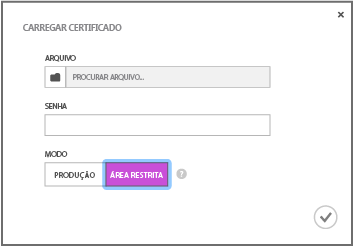

<properties
	pageTitle="Introdução aos Hubs de Notificação para aplicativos Xamarin iOS | Microsoft Azure"
	description="Neste tutorial, você aprende a usar os Hubs de Notificação do Azure para enviar notificações por push a um aplicativo Xamarin iOS."
	services="notification-hubs"
	documentationCenter="xamarin"
	authors="ysxu"
	manager="dwrede"
	editor=""/>

<tags
	ms.service="notification-hubs"
	ms.workload="mobile"
	ms.tgt_pltfrm="mobile-xamarin-ios"
	ms.devlang="dotnet"
	ms.topic="hero-article"
	ms.date="10/21/2015"
	ms.author="yuaxu"/>

# Introdução aos Hubs de Notificação

[AZURE.INCLUDE [notification-hubs-selector-get-started](../../includes/notification-hubs-selector-get-started.md)]

##Visão geral

Este tutorial mostra como usar os Hubs de Notificação do Azure para enviar notificações por push para um aplicativo iOS. Neste tutorial, você cria um aplicativo Xamarin.iOS em branco que recebe notificações por push usando o APNs (Serviço de Notificação por Push da Apple). Ao finalizar, você poderá usar seu hub de notificação para transmitir notificações por push a todos os dispositivos que executam seu aplicativo. O código concluído está disponível na amostra do [aplicativo NotificationHubs][GitHub].

Este tutorial demonstra o cenário de transmissão simples usando Hubs de Notificação.

##Pré-requisitos

Este tutorial exige o seguinte:

+ [Xcode 6.0][Install Xcode]
+ Um dispositivo compatível com o iOS 7.0 (ou versão posterior)
+ Associação no Programa de Desenvolvedores de iOS
+ [Xamarin.iOS]
+ [Componente dos Serviços Móveis do Azure]

   >[AZURE.NOTE]Devido aos requisitos de configuração das notificações por push, você deve implantar e testar as notificações por push em um dispositivo compatível com o iOS (iPhone ou iPad) em vez de usar o emulador.

A conclusão deste tutorial é um pré-requisito para todos os outros tutoriais sobre Hubs de Notificação para aplicativos Xamarin.iOS.

> [AZURE.IMPORTANT]Para concluir este tutorial, você precisa ter uma conta ativa do Azure. Se você não tiver uma conta, poderá criar uma conta de avaliação gratuita em apenas alguns minutos. Para obter detalhes, consulte [Avaliação gratuita do Azure](http://azure.microsoft.com/pricing/free-trial/?WT.mc_id=A643EE910&amp;returnurl=http%3A%2F%2Fazure.microsoft.com%2Fpt-BR%2Fdocumentation%2Farticles%2Fpartner-xamarin-notification-hubs-ios-get-started).

[AZURE.INCLUDE [Hubs de notificação habilitam notificações por push da Apple](../../includes/notification-hubs-enable-apple-push-notifications.md)]

##Configurar seu Hub de Notificação

Esta seção mostra a criação de um novo hub de notificação e a configuração da autenticação com APNS usando o certificado push **.p12** que você criou. Se você quiser usar um hub de notificação já criado, ignore a etapa 5.

[AZURE.INCLUDE [notification-hubs-portal-create-new-hub](../../includes/notification-hubs-portal-create-new-hub.md)]

<ol start="7">
<li>

Clique na guia <b>Configurar</b> na parte superior e clique no botão <b>Carregar</b> nas configurações de notificação da Apple para carregar a impressão digital do certificado. Em seguida, selecione o certificado <b>.p12</b> que você exportou anteriormente e a senha do certificado.

Selecione o modo de <b>Área Restrita</b>, pois se trata de desenvolvimento. Use a <b>Produção</b> apenas se quiser enviar notificações por push aos usuários que adquiriram seu aplicativo na loja.

</li>
</ol>
&emsp;&emsp;

&emsp;&emsp;

Seu hub de notificação agora está configurado para funcionar com o APNS e você tem as cadeias de conexão para registrar seu aplicativo e enviar notificações.

##Conectar seu aplicativo ao hub de notificação

#### Criar um novo projeto

1. No Xamarin Studio, crie um novo projeto iOS e selecione o **API Unificada** > modelo **Aplicativo de Modo de Exibição Único**.

   	![][31]

2. Adicione uma referência ao componentes de Mensagens do Azure. No modo de exibição Solução, clique com botão direito do mouse na pasta **Componentes** do seu projeto e escolha **Obter Mais Componentes**. Pesquise o componente **Mensagens do Azure** e adicione o componente ao seu projeto.

3. Em **AppDelegate.cs**, adicione a seguinte instrução using:

    using WindowsAzure.Messaging;

4. Declarar uma instância de **SBNotificationHub**:

		private SBNotificationHub Hub { get; set; }

5. Criar uma classe **Constants.cs** com as seguintes variáveis:

        // Azure app-specific connection string and hub path
        public const string ConnectionString = "<Azure connection string>";
        public const string NotificationHubPath = "<Azure hub path>";

6. Em **AppDelegate.cs** atualize **FinishedLaunching()** para que ele corresponda ao seguinte:

        public override bool FinishedLaunching(UIApplication application, NSDictionary launchOptions)
        {
            UIRemoteNotificationType notificationTypes = UIRemoteNotificationType.Alert |
                UIRemoteNotificationType.Badge | UIRemoteNotificationType.Sound;
            UIApplication.SharedApplication.RegisterForRemoteNotificationTypes(notificationTypes);

            return true;
        }

7. Substituir o método **RegisteredForRemoteNotifications()** em **AppDelegate.cs**:

        public override void RegisteredForRemoteNotifications(UIApplication application, NSData deviceToken)
        {
            Hub = new SBNotificationHub(Constants.ConnectionString, Constants.NotificationHubPath);

            Hub.UnregisterAllAsync (deviceToken, (error) => {
                if (error != null)
                {
                    Console.WriteLine("Error calling Unregister: {0}", error.ToString());
                    return;
                }

                NSSet tags = null; // create tags if you want
                Hub.RegisterNativeAsync(deviceToken, tags, (errorCallback) => {
                    if (errorCallback != null)
                        Console.WriteLine("RegisterNativeAsync error: " + errorCallback.ToString());
                });
            });
        }

8. Substituir o método **ReceivedRemoteNotification()** em **AppDelegate.cs**:

        public override void ReceivedRemoteNotification(UIApplication application, NSDictionary userInfo)
        {
            ProcessNotification(userInfo, false);
        }

9. Criar o seguinte método **ProcessNotification()** em **AppDelegate.cs**:

        void ProcessNotification(NSDictionary options, bool fromFinishedLaunching)
        {
            // Check to see if the dictionary has the aps key.  This is the notification payload you would have sent
            if (null != options && options.ContainsKey(new NSString("aps")))
            {
                //Get the aps dictionary
                NSDictionary aps = options.ObjectForKey(new NSString("aps")) as NSDictionary;

                string alert = string.Empty;

                //Extract the alert text
                // NOTE: If you're using the simple alert by just specifying
                // "  aps:{alert:"alert msg here"}  ", this will work fine.
                // But if you're using a complex alert with Localization keys, etc.,
                // your "alert" object from the aps dictionary will be another NSDictionary.
                // Basically the JSON gets dumped right into a NSDictionary,
                // so keep that in mind.
                if (aps.ContainsKey(new NSString("alert")))
                    alert = (aps [new NSString("alert")] as NSString).ToString();

                //If this came from the ReceivedRemoteNotification while the app was running,
                // we of course need to manually process things like the sound, badge, and alert.
                if (!fromFinishedLaunching)
                {
                    //Manually show an alert
                    if (!string.IsNullOrEmpty(alert))
                    {
                        UIAlertView avAlert = new UIAlertView("Notification", alert, null, "OK", null);
                        avAlert.Show();
                    }
                }
            }
        }

    > [AZURE.NOTE]Você pode optar por substituir **FailedToRegisterForRemoteNotifications()** para lidar com situações como a falta de conexão de rede.

10. Execute o aplicativo em seu dispositivo.

## Enviando notificações

Você pode testar o recebimento de notificações em seu aplicativo ao enviar notificações no portal do Azure usando a guia de depuração no hub de notificação, como mostrado na tela abaixo.

Notificações por push normalmente são enviadas em um serviço de back-end como Serviços Móveis ou ASP.NET usando uma biblioteca compatível. Você também pode usar a API REST diretamente para enviar mensagens de notificação se uma biblioteca não está disponível para o back-end.

Neste tutorial, optamos pela simplicidade e só demonstraremos os testes do aplicativo cliente enviando notificações usando o SDK do .NET para hubs de notificação em um aplicativo de console em vez de um serviço de back-end. Recomendamos o tutorial [Usar Hubs de Notificação para enviar notificações por push aos usuários](notification-hubs-aspnet-backend-ios-notify-users.md) como a próxima etapa de envio de notificações de back-end do ASP.NET. No entanto, as abordagens a seguir podem ser usadas para o envio de notificações:

* **Interface REST**: você pode dar suporte à notificação em qualquer plataforma de back-end usando a [interface REST](http://msdn.microsoft.com/library/windowsazure/dn223264.aspx).

* **SDK dos Hubs de Notificações do Microsoft Azure**: no Gerenciador de Pacotes do Nuget para o Visual Studio, execute [Install-Package Microsoft.Azure.NotificationHubs](https://www.nuget.org/packages/Microsoft.Azure.NotificationHubs/).

* **Node.js**: [Como usar os Hubs de Notificação de Node.js](notification-hubs-nodejs-how-to-use-notification-hubs.md).

* **Serviços Móveis do Azure**: para obter um exemplo de como enviar notificações de um back-end de Serviços Móveis do Azure integrado aos Hubs de Notificação, confira "Introdução às notificações por push nos Serviços Móveis" ([back-end do .NET](../mobile-services/mobile-services-javascript-backend-windows-store-dotnet-get-started-push.md) | [back-end do JavaScript](../mobile-services/mobile-services-javascript-backend-windows-store-dotnet-get-started-push.md)).

* **Java/PHP**: para obter um exemplo de como enviar notificações usando as APIs REST, confira "Como usar os Hubs de Notificação do Java/PHP" ([Java](notification-hubs-java-backend-how-to.md) | [PHP](notification-hubs-php-backend-how-to.md)).

####(Opcional) Enviar notificações de um aplicativo de console do .NET.

Nesta seção, enviaremos as notificações usando um aplicativo de console .NET

1. Crie um novo aplicativo de console do Visual C#:

   	![][213]

2. No Visual Studio, clique em **Ferramentas**, em **Gerenciador de Pacotes do NuGet** e em **Console do Gerenciador de Pacotes**.

	Isso exibe o Console do Gerenciador de Pacotes no Visual Studio.

3. Na janela do Console do Gerenciador de Pacotes, defina o **Projeto padrão** como o seu novo projeto de aplicativo do console e execute o seguinte comando na janela do console:

        Install-Package Microsoft.Azure.NotificationHubs

	Isso adiciona uma referência ao SDK dos Hubs de Notificação do Azure usando o <a href="http://www.nuget.org/packages/Microsoft.Azure.NotificationHubs/">pacote NuGet Microsoft.Azure.Notification Hubs</a>.

	

4. Abra o arquivo Program.cs e adicione a seguinte instrução `using`:

        using Microsoft.Azure.NotificationHubs;

3. Em sua classe `Program`, adicione o seguinte método:

        private static async void SendNotificationAsync()
        {
            NotificationHubClient hub = NotificationHubClient.CreateClientFromConnectionString("<connection string with full access>", "<hub name>");
            var alert = "{"aps":{"alert":"Hello from .NET!"}}";
            await hub.SendAppleNativeNotificationAsync(alert);
        }

4. Adicione as seguintes linhas a seu método `Main`:

         SendNotificationAsync();
		 Console.ReadLine();

5. Pressione a tecla F5 para executar o aplicativo. Você deverá receber um alerta em seu dispositivo. Se estiver usando Wi-Fi, verifique se sua conexão está funcionando.

Você encontrará todas as cargas possíveis no [Guia de Programação Local e de Notificação por Push] da Apple.

####(Opcional) Enviar notificações de um Serviço Móvel

Nesta seção, nós enviaremos notificações usando um serviço móvel por meio de um script de nó.

Para enviar uma notificação usando um serviço móvel, acompanhe [Introdução aos Serviços Móveis] e:

1. Entre no [portal do Azure] e selecione seu serviço móvel.

2. Selecione a guia **Agendador** na parte superior.

   	![][215]

3. Crie um novo trabalho agendado, insira um nome e selecione **Sob demanda**.

   	![][216]

4. Quando o trabalho for criado, clique no nome do trabalho. Em seguida, clique na guia **Script** na barra superior.

5. Insira o script a seguir em sua função de Agendador. Certifique-se de substituir os espaços reservados pelo nome de seu hub de notificação e pela cadeia de conexão para a *DefaultFullSharedAccessSignature* que você obteve anteriormente. Clique em **Salvar**.

		var azure = require('azure');
		var notificationHubService = azure.createNotificationHubService('<Hubname>', '<SAS Full access >');
		notificationHubService.apns.send(
	    	null,
    		{"aps":
        		{
          		"alert": "Hello from Mobile Services!"
        		}
    		},
    		function (error)
    		{
	        	if (!error) {
    	        	console.warn("Notification successful");
        		}
    		}
		);

6. Clique em **Executar uma vez** na barra inferior. Você deverá receber um alerta em seu dispositivo.

##Próximas etapas

Neste exemplo simples, você envia notificações para todos os seus dispositivos iOS. Para selecionar usuários de destino específicos, consulte o tutorial [Usar Hubs de Notificação para enviar notificações por push aos usuários]. Se desejar segmentar os usuários por grupos de interesse, você poderá ler [Usar Hubs de Notificação para enviar notícias mais recentes]. Saiba mais sobre como usar os Hubs de Notificação em [Diretrizes dos Hubs de Notificação] e em [Instruções sobre Hubs de Notificação para iOS].

<!-- Images. -->

[213]: ./media/partner-xamarin-notification-hubs-ios-get-started/notification-hub-create-console-app.png

[215]: ./media/partner-xamarin-notification-hubs-ios-get-started/notification-hub-scheduler1.png
[216]: ./media/partner-xamarin-notification-hubs-ios-get-started/notification-hub-scheduler2.png

[31]: ./media/partner-xamarin-notification-hubs-ios-get-started/notification-hub-create-ios-app.png

<!-- URLs. -->
[Mobile Services iOS SDK]: http://go.microsoft.com/fwLink/?LinkID=266533
[Submit an app page]: http://go.microsoft.com/fwlink/p/?LinkID=266582
[My Applications]: http://go.microsoft.com/fwlink/p/?LinkId=262039
[Live SDK for Windows]: http://go.microsoft.com/fwlink/p/?LinkId=262253

[Introdução aos Serviços Móveis]: /develop/mobile/tutorials/get-started-xamarin-ios
[portal do Azure]: https://manage.windowsazure.com/
[Diretrizes dos Hubs de Notificação]: http://msdn.microsoft.com/library/jj927170.aspx
[Instruções sobre Hubs de Notificação para iOS]: http://msdn.microsoft.com/library/jj927168.aspx
[Install Xcode]: https://go.microsoft.com/fwLink/p/?LinkID=266532
[iOS Provisioning Portal]: http://go.microsoft.com/fwlink/p/?LinkId=272456

[Usar Hubs de Notificação para enviar notificações por push aos usuários]: /manage/services/notification-hubs/notify-users-aspnet
[Usar Hubs de Notificação para enviar notícias mais recentes]: /manage/services/notification-hubs/breaking-news-dotnet

[Guia de Programação Local e de Notificação por Push]: http://developer.apple.com/library/mac/#documentation/NetworkingInternet/Conceptual/RemoteNotificationsPG/Chapters/ApplePushService.html#//apple_ref/doc/uid/TP40008194-CH100-SW1
[Apple Push Notification Service]: http://go.microsoft.com/fwlink/p/?LinkId=272584

[Componente dos Serviços Móveis do Azure]: http://components.xamarin.com/view/azure-mobile-services/
[GitHub]: http://go.microsoft.com/fwlink/p/?LinkId=331329
[Xamarin.iOS]: http://xamarin.com/download
[WindowsAzure.Messaging]: https://github.com/infosupport/WindowsAzure.Messaging.iOS

<!---HONumber=Oct15_HO4-->