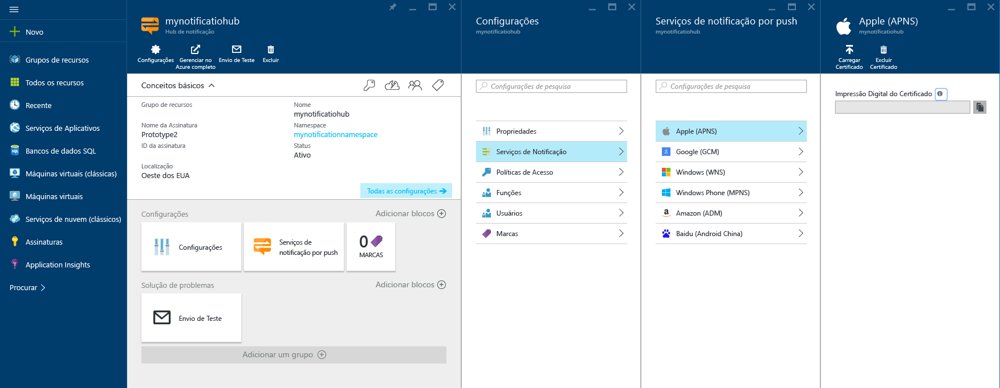
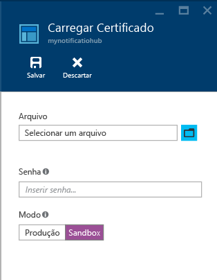
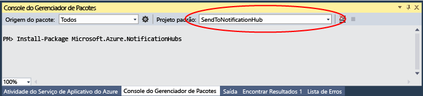

# Notificações por push do iOS com Hubs de Notificação para aplicativos Xamarin

[!INCLUDE [notification-hubs-selector-get-started](../../includes/notification-hubs-selector-get-started.md)]

## Visão geral

> [!IMPORTANT]
> Para concluir este tutorial, você precisa ter uma conta ativa do Azure. Se você não tiver uma conta, poderá criar uma conta de avaliação gratuita em apenas alguns minutos. Para obter detalhes, consulte [Avaliação gratuita do Azure](https://azure.microsoft.com/pricing/free-trial/?WT.mc_id=A643EE910&amp;returnurl=http%3A%2F%2Fazure.microsoft.com%2Fen-us%2Fdocumentation%2Farticles%2Fpartner-xamarin-notification-hubs-ios-get-started).
> 
> 

Este tutorial mostra como usar os Hubs de Notificação do Azure para enviar notificações por push para um aplicativo iOS.
Neste tutorial, você cria um aplicativo Xamarin.iOS em branco que recebe notificações por push usando o [Apple Push Notification Service (APNs)](https://developer.apple.com/library/content/documentation/NetworkingInternet/Conceptual/RemoteNotificationsPG/APNSOverview.html). Ao finalizar, você poderá usar seu hub de notificação para transmitir notificações por push a todos os dispositivos que executam seu aplicativo. O código concluído está disponível na amostra do [aplicativo NotificationHubs][GitHub].

Este tutorial demonstra o cenário de transmissão de mensagens por push simples com Hubs de Notificação.

## Pré-requisitos

Este tutorial exige o seguinte:

* [Xcode 6.0][Install Xcode]
* Um dispositivo compatível com o iOS 7.0 (ou versão posterior)
* Associação no Programa de Desenvolvedores de iOS
* [Xamarin Studio]
  
  > [!NOTE]
  > Devido aos requisitos de configuração das notificações por push do iOS, você deve implantar e testar o aplicativo de exemplo em um dispositivo iOS físico (iPhone ou iPad) em vez do simulador.
  > 
  > 

A conclusão deste tutorial é um pré-requisito para todos os outros tutoriais sobre Hubs de Notificação para aplicativos Xamarin iOS.

[!INCLUDE [Notification Hubs Enable Apple Push Notifications](../../includes/notification-hubs-enable-apple-push-notifications.md)]

## Configurar seu Hub de Notificação

Esta seção mostra a criação de um novo hub de notificação e a configuração da autenticação com APNS usando o certificado push **.p12** que você criou. Se você quiser usar um hub de notificação já criado, ignore a etapa 5.

[!INCLUDE [notification-hubs-portal-create-new-hub](../../includes/notification-hubs-portal-create-new-hub.md)]

<ol start="7">

<li>

Como queremos configurar a conexão APNS, no Portal do Azure, abra as configurações do Hub de Notificação, clique em <b>Serviços de Notificação</b> e clique no item <b>Apple (APNS)</b> na lista. Quando terminar, clique em <b>Carregar Certificado</b> e selecione o certificado <b>.p12</b> exportado anteriormente, bem como a respectiva senha.

Selecione o modo <b>Área Restrita</b>, pois você enviará mensagens por push em um ambiente de desenvolvimento. Use a configuração <b>Produção</b> apenas se quiser enviar notificações por push aos usuários que já adquiriram seu aplicativo na loja.

</li>
</ol>
&emsp;&emsp;

&emsp;&emsp;

Seu hub de notificação agora está configurado para funcionar com o APNS e você tem as cadeias de conexão para registrar seu aplicativo e enviar notificações por push.

## Conectar seu aplicativo ao hub de notificação

#### Criar um novo projeto

1. No Xamarin Studio, crie um novo projeto iOS e selecione o modelo **API Unificada** > **Aplicativo de Modo de Exibição Único**.
   
     ![Xamarin Studio - selecionar o tipo de aplicativo][31]
2. Adicione uma referência ao componentes de Mensagens do Azure. No modo de exibição Solução, clique com botão direito do mouse na pasta **Componentes** do seu projeto e escolha **Obter Mais Componentes**. Pesquise o componente **Mensagens do Azure** e adicione o componente ao seu projeto.
3. Em **AppDelegate.cs**, adicione a seguinte instrução using:
   
        using WindowsAzure.Messaging;
4. Declarar uma instância de **SBNotificationHub**:
   
        private SBNotificationHub Hub { get; set; }
5. Criar uma classe **Constants.cs** com as seguintes variáveis:
   
        // Azure app-specific connection string and hub path
        public const string ConnectionString = "<Azure connection string>";
        public const string NotificationHubPath = "<Azure hub path>";
6. Em **AppDelegate.cs** atualize **FinishedLaunching()** para que ele corresponda ao seguinte:
   
        public override bool FinishedLaunching(UIApplication application, NSDictionary launchOptions)
        {
            if (UIDevice.CurrentDevice.CheckSystemVersion (8, 0)) {
                var pushSettings = UIUserNotificationSettings.GetSettingsForTypes (
                       UIUserNotificationType.Alert | UIUserNotificationType.Badge | UIUserNotificationType.Sound,
                       new NSSet ());
   
                UIApplication.SharedApplication.RegisterUserNotificationSettings (pushSettings);
                UIApplication.SharedApplication.RegisterForRemoteNotifications ();
            } else {
                UIRemoteNotificationType notificationTypes = UIRemoteNotificationType.Alert | UIRemoteNotificationType.Badge | UIRemoteNotificationType.Sound;
                UIApplication.SharedApplication.RegisterForRemoteNotificationTypes (notificationTypes);
            }
   
            return true;
        }
7. Substituir o método **RegisteredForRemoteNotifications()** em **AppDelegate.cs**:
   
        public override void RegisteredForRemoteNotifications(UIApplication application, NSData deviceToken)
        {
            Hub = new SBNotificationHub(Constants.ConnectionString, Constants.NotificationHubPath);
   
            Hub.UnregisterAllAsync (deviceToken, (error) => {
                if (error != null)
                {
                    Console.WriteLine("Error calling Unregister: {0}", error.ToString());
                    return;
                }
   
                NSSet tags = null; // create tags if you want
                Hub.RegisterNativeAsync(deviceToken, tags, (errorCallback) => {
                    if (errorCallback != null)
                        Console.WriteLine("RegisterNativeAsync error: " + errorCallback.ToString());
                });
            });
        }
8. Substituir o método **ReceivedRemoteNotification()** em **AppDelegate.cs**:
   
        public override void ReceivedRemoteNotification(UIApplication application, NSDictionary userInfo)
        {
            ProcessNotification(userInfo, false);
        }
9. Criar o seguinte método **ProcessNotification()** em **AppDelegate.cs**:
   
        void ProcessNotification(NSDictionary options, bool fromFinishedLaunching)
        {
            // Check to see if the dictionary has the aps key.  This is the notification payload you would have sent
            if (null != options && options.ContainsKey(new NSString("aps")))
            {
                //Get the aps dictionary
                NSDictionary aps = options.ObjectForKey(new NSString("aps")) as NSDictionary;
   
                string alert = string.Empty;
   
                //Extract the alert text
                // NOTE: If you're using the simple alert by just specifying
                // "  aps:{alert:"alert msg here"}  ", this will work fine.
                // But if you're using a complex alert with Localization keys, etc.,
                // your "alert" object from the aps dictionary will be another NSDictionary.
                // Basically the JSON gets dumped right into a NSDictionary,
                // so keep that in mind.
                if (aps.ContainsKey(new NSString("alert")))
                    alert = (aps [new NSString("alert")] as NSString).ToString();
   
                //If this came from the ReceivedRemoteNotification while the app was running,
                // we of course need to manually process things like the sound, badge, and alert.
                if (!fromFinishedLaunching)
                {
                    //Manually show an alert
                    if (!string.IsNullOrEmpty(alert))
                    {
                        UIAlertView avAlert = new UIAlertView("Notification", alert, null, "OK", null);
                        avAlert.Show();
                    }
                }
            }
        }
   
   > [!NOTE]
   > Você pode optar por substituir **FailedToRegisterForRemoteNotifications()** para lidar com situações como a falta de conexão de rede. Isso é particularmente importante quando o usuário pode iniciar o aplicativo no modo offline (por exemplo, Avião) e você deseja manipular cenários de envio de mensagens por push específicos para o aplicativo.
   > 
   > 
10. Execute o aplicativo em seu dispositivo.

## Como enviar notificações por push

Você pode testar o recebimento de notificações por push em seu aplicativo enviando notificações pelo [Portal do Azure] por meio do recurso **Testar Enviar** no conjunto de ferramentas **Solução de Problemas**, diretamente na página do hub de notificação, conforme mostrado na tela abaixo.

As notificações por push normalmente são enviadas por meio de um serviço de back-end como Serviços Móveis ou ASP.NET usando uma biblioteca compatível. Você também poderá usar a API REST diretamente para enviar mensagens por push se uma biblioteca não estiver disponível em seu cenário. 

Neste tutorial, optamos pela simplicidade e só demonstraremos os testes do aplicativo cliente enviando notificações usando o SDK do .NET para hubs de notificação em um aplicativo de console em vez de um serviço de back-end. Recomendamos o tutorial [Usar Hubs de Notificação para enviar notificações por push aos usuários](notification-hubs-aspnet-backend-ios-apple-apns-notification.md) como a próxima etapa de envio de notificações de back-end do ASP.NET. No entanto, as abordagens a seguir podem ser usadas para o envio de notificações:

* **Interface REST**: você pode dar suporte à notificação por push em qualquer plataforma de back-end usando a [interface REST](http://msdn.microsoft.com/library/windowsazure/dn223264.aspx).
* **SDK do .NET dos Hubs de Notificações do Microsoft Azure**: no Gerenciador de Pacotes do Nuget para o Visual Studio, execute [Install-Package Microsoft.Azure.NotificationHubs](https://www.nuget.org/packages/Microsoft.Azure.NotificationHubs/).
* **Node.js** : [Como usar os Hubs de Notificação de Node.js](notification-hubs-nodejs-push-notification-tutorial.md).

**Aplicativos móveis**: para obter um exemplo de como enviar notificações de um back-end dos Aplicativos Móveis do Serviço de Aplicativo do Azure que esteja integrado com Hubs de notificação, confira [Adicionar notificação por push para seu aplicativo móvel](../app-service-mobile/app-service-mobile-ios-get-started-push.md).

* **Java/PHP**: para obter um exemplo de como enviar notificações por push usando as APIs REST, confira "Como usar os Hubs de Notificação do Java/PHP" ([Java](notification-hubs-java-push-notification-tutorial.md) | [PHP](notification-hubs-php-push-notification-tutorial.md)).

#### (Opcional) Enviar notificações por push de um Aplicativo de Console do .NET.

Nesta seção, enviaremos as notificações por push usando um aplicativo de console .NET simples Para os fins deste exemplo, vamos mudar para um ambiente de desenvolvimento do Windows que tem o Visual Studio já instalada.

1. No Visual Studio, crie um novo aplicativo de console em Visual C#:
   
       ![Visual Studio - Create a new console application][213]
2. No Visual Studio, clique em **Ferramentas**, em **Gerenciador de Pacotes NuGet** e em **Console do Gerenciador de Pacotes**.
   
    O console do gerenciador de pacotes deve aparecer encaixado na parte inferior de seu espaço de trabalho do Visual Studio.
3. Na janela do Console do Gerenciador de Pacotes, defina o **Projeto padrão** como o seu novo projeto de aplicativo do console e execute o seguinte comando na janela do console:
   
        Install-Package Microsoft.Azure.NotificationHubs
   
    Isso adiciona uma referência ao SDK dos Hubs de Notificação do Azure usando o <a href="http://www.nuget.org/packages/Microsoft.Azure.NotificationHubs/">pacote NuGet Microsoft.Azure.Notification Hubs</a>.
   
    
4. Abra o arquivo `Program.cs` e adicione a seguinte declaração `using`, garantindo que podemos usar classes e funções do Azure em sua classe principal:
   
        using Microsoft.Azure.NotificationHubs;
5. Na classe `Program`, adicione o seguinte método (não se esqueça de substituir a **cadeia de conexão** e o **nome do hub**):
   
        private static async void SendNotificationAsync()
        {
            NotificationHubClient hub = NotificationHubClient.CreateClientFromConnectionString("<connection string with full access>", "<hub name>");
            var alert = "{\"aps\":{\"alert\":\"Hello from .NET!\"}}";
            await hub.SendAppleNativeNotificationAsync(alert);
        }
6. Adicione as seguintes linhas em seu método `Main` :
   
         SendNotificationAsync();
         Console.ReadLine();
7. Pressione a tecla F5 para executar o aplicativo. Em segundos, você verá uma notificação por push em seu dispositivo. Se você estiver usando Wi-Fi ou uma rede de dados de celular, verifique se tem uma conexão de Internet ativa no dispositivo.

Você encontrará todas as cargas possíveis no [Guia de Programação Local e de Notificação por Push]da Apple.

#### (Opcional) Enviar Notificações de um Serviço Móvel

Nesta seção, enviaremos notificações por push usando um serviço móvel por meio de um script de nó.

Para enviar uma notificação usando um serviço móvel, acompanhe [Introdução aos Serviços Móveis]e:

1. Entre no [Portal Clássico do Azure]e selecione o serviço móvel.
2. Selecione a guia **Agendador** na parte superior.
   
       ![Azure Classic Portal - Scheduler][215]
3. Crie um novo trabalho agendado, insira um nome e selecione **Sob demanda**.
   
       ![Azure Classic Portal - Create new job][216]
4. Quando o trabalho for criado, clique no nome do trabalho. Em seguida, clique na guia **Script** na barra superior.
5. Insira o script a seguir em sua função de Agendador. Certifique-se de substituir os espaços reservados pelo nome de seu hub de notificação e pela cadeia de conexão para a *DefaultFullSharedAccessSignature* que você obteve anteriormente. Clique em **Salvar**.
   
        var azure = require('azure');
        var notificationHubService = azure.createNotificationHubService('<Hubname>', '<SAS Full access >');
        notificationHubService.apns.send(
            null,
            {"aps":
                {
                  "alert": "Hello from Mobile Services!"
                }
            },
            function (error)
            {
                if (!error) {
                    console.warn("Notification successful");
                }
            }
        );
6. Clique em **Executar uma vez** na barra inferior. Você deverá receber um alerta em seu dispositivo.

## Próximas etapas

Neste exemplo simples, você envia notificações por push para todos os seus dispositivos iOS. Para selecionar usuários de destino específicos, consulte o tutorial [Usar Hubs de Notificação para enviar notificações por push aos usuários]. Se desejar segmentar os usuários por grupos de interesse, você poderá ler [Usar Hubs de Notificação para enviar notícias mais recentes]. Saiba mais sobre como usar os Hubs de Notificação em [Diretrizes dos Hubs de Notificação] e em [Instruções sobre Hubs de Notificação para iOS].

<!-- Images. -->

[213]: ./media/partner-xamarin-notification-hubs-ios-get-started/notification-hub-create-console-app.png

[215]: ./media/partner-xamarin-notification-hubs-ios-get-started/notification-hub-scheduler1.png
[216]: ./media/partner-xamarin-notification-hubs-ios-get-started/notification-hub-scheduler2.png

[31]: ./media/partner-xamarin-notification-hubs-ios-get-started/notification-hub-create-ios-app.png

<!-- URLs. -->
[Mobile Services iOS SDK]: http://go.microsoft.com/fwLink/?LinkID=266533
[Submit an app page]: http://go.microsoft.com/fwlink/p/?LinkID=266582
[My Applications]: http://go.microsoft.com/fwlink/p/?LinkId=262039
[Live SDK for Windows]: http://go.microsoft.com/fwlink/p/?LinkId=262253

[Introdução aos Serviços Móveis]: /develop/mobile/tutorials/get-started-xamarin-ios
[Portal Clássico do Azure]: https://manage.windowsazure.com/
[Diretrizes dos Hubs de Notificação]: http://msdn.microsoft.com/library/jj927170.aspx
[Instruções sobre Hubs de Notificação para iOS]: http://msdn.microsoft.com/library/jj927168.aspx
[Install Xcode]: https://go.microsoft.com/fwLink/p/?LinkID=266532
[iOS Provisioning Portal]: http://go.microsoft.com/fwlink/p/?LinkId=272456

[Usar Hubs de Notificação para enviar notificações por push aos usuários]: /manage/services/notification-hubs/notify-users-aspnet
[Usar Hubs de Notificação para enviar notícias mais recentes]: /manage/services/notification-hubs/breaking-news-dotnet

[Guia de Programação Local e de Notificação por Push]:https://developer.apple.com/library/content/documentation/NetworkingInternet/Conceptual/RemoteNotificationsPG/HandlingRemoteNotifications.html#//apple_ref/doc/uid/TP40008194-CH6-SW1
[Apple Push Notification Service]: http://go.microsoft.com/fwlink/p/?LinkId=272584

[Azure Mobile Services Component]: http://components.xamarin.com/view/azure-mobile-services/
[GitHub]: http://go.microsoft.com/fwlink/p/?LinkId=331329
[Xamarin Studio]: http://xamarin.com/download
[WindowsAzure.Messaging]: https://github.com/infosupport/WindowsAzure.Messaging.iOS
[Portal do Azure]: https://portal.azure.com

