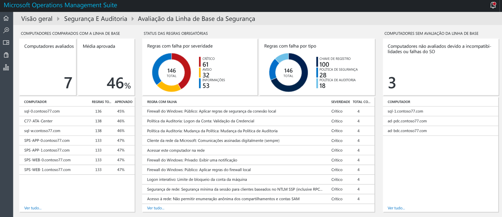
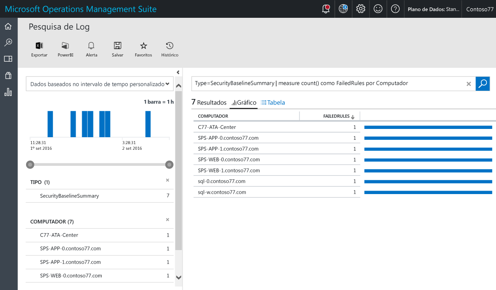
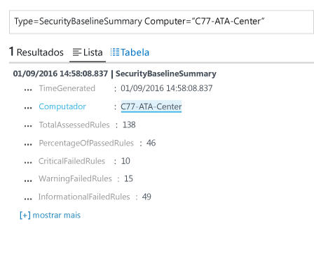

# Avaliação de linha de base na Solução de Auditoria e Segurança do Operations Management Suite
Este documento o ajuda a usar os recursos de avaliação da linha de base da [Solução de Segurança e Auditoria do Operations Management Suite (OMS)](operations-management-suite-overview.md) para acessar o estado de segurança de seus recursos monitorados.

## O que é a Avaliação de Linha de Base?
A Microsoft, juntamente com organizações governamentais e do setor no mundo todo, define uma configuração do Windows que representa implantações de servidor altamente seguras. Essa configuração é um conjunto de chaves do registro, configurações de política de auditoria e configurações de política de segurança, juntamente com os valores recomendados da Microsoft para essas configurações. Esse conjunto de regras é conhecido como linha de base de Segurança. Recursos de avaliação da linha de base de Segurança e Auditoria do OMS podem examinar perfeitamente todos os seus computadores para fins de conformidade. 

Há três tipos de regras:

* **Regras de registro**: verificar se as chaves do registro estão definidas corretamente.
* **Regras de política de auditoria**: regras referentes à política de auditoria.
* **Regras de política de segurança**: regras referentes a permissões do usuário no computador.

> [!NOTE]
> Leia [Usar a Segurança do OMS para avaliar a Linha de Base de Configuração de Segurança](https://blogs.technet.microsoft.com/msoms/2016/08/12/use-oms-security-to-assess-the-security-configuration-baseline/) para obter uma visão geral desse recurso.
> 
> 

## Avaliação de Linha de Base de Segurança
Você pode examinar a avaliação da linha de base de segurança atual para todos os computadores que são monitorados pela Segurança e Auditoria do OMS usando o painel.  Execute as seguintes etapas para acessar o painel de avaliação de linha de base de segurança:

1. No painel principal **Microsoft Operations Management Suite**, clique no bloco **Segurança e Auditoria**.
2. No painel **Segurança e Auditoria**, clique em **Avaliação de Atualização** em **Domínios de Segurança**. O painel **Avaliação de Linha de Base de Segurança** é exibido conforme mostrado na seguinte imagem:
   
    

Este painel é dividido em três áreas principais:

* **Computadores comparados à linha de base**: essa seção fornece um resumo do número de computadores que foram acessados e a porcentagem de computadores que foram aprovados na avaliação. Também fornece os 10 principais computadores e o resultado de porcentagem para a avaliação.
* **Status das Regras Necessárias**: essa seção tem por objetivo promover a conscientização das regras com falha por gravidade e das regras com falha por tipo. Observando o primeiro gráfico, você pode identificar rapidamente se a maioria das regras com falha é crítica ou não. Ele também fornece uma lista das 10 principais regras com falha e sua gravidade. O segundo gráfico mostra o tipo de regra que foi reprovada na avaliação. 
* **Computadores sem a avaliação de linha de base**: essa seção lista os computadores que não foram acessados devido a incompatibilidade do sistema operacional ou falhas. 

### Acessando computadores comparados à linha de base
Idealmente, todos os computadores estão em conformidade com a avaliação da linha de base de segurança. No entanto, é esperado que, em algumas circunstâncias, isso não aconteça. Como parte do processo de gerenciamento de segurança, é importante incluir o exame dos computadores que não foram aprovados em todos os testes de avaliação de segurança. Uma maneira rápida de visualizar isso é marcar a opção **Computadores acessados**, localizada na seção **Computadores comparados à linha de base**. Você deve ver o resultado de pesquisa de log mostrando a lista de computadores, como na seguinte tela:

O resultado da pesquisa é mostrado em formato de tabela, em que a primeira coluna tem o nome do computador e a segunda cor tem o número de regras que foram reprovadas. Para recuperar as informações sobre o tipo de regra com falha, clique no número de regras com falha ao lado do nome do computador. Você verá um resultado semelhante ao que é mostrado na seguinte imagem:

Nesse resultado de pesquisa, há o total de regras acessadas, o número de regras essenciais que falharam, as regras de aviso e as regras de informações com falha.

### Acessando o status das regras necessárias
Depois de obter as informações sobre o número percentual de computadores que foram aprovados na avaliação, convém obter mais informações sobre quais regras estão falhando, de acordo com a gravidade. Essa visualização o ajuda a priorizar quais computadores devem ser abordados primeiro para garantir que estejam em conformidade na próxima avaliação. Passe o mouse sobre a parte Crítica do gráfico, localizada no bloco **Regras com falha por gravidade**, em **Status das regras necessárias**, e clique nela. Você verá um resultado semelhante à seguinte tela:

 

Nesse resultado de log, você verá o tipo de regra de linha de base que falhou, a descrição da regra e a ID CCE (Common Configuration Enumeration) da regra de segurança. Esses atributos devem ser suficientes para executar uma ação corretiva para corrigir o problema no computador de destino.

> [!NOTE]
> Para obter mais informações sobre CCE, acesse o [National Vulnerability Database](https://nvd.nist.gov/cce/index.cfm).
> 
> 

### Acessando computadores sem avaliação de linha de base
O OMS dá suporte ao perfil de linha base do membro do domínio e Controlador de Domínio do Windows Server 2008 R2 até o Windows Server 2012 R2. A linha de base do Windows Server 2016 ainda não é final e será adicionada assim que for publicada. Todos os outros sistemas operacionais examinados por meio da avaliação de linha de base da Segurança e Auditoria do OMS estão na seção **Computadores sem avaliação de linha de base**.

## Consulte também
Neste documento, você aprendeu sobre a avaliação de linha de base da Segurança e Auditoria do OMS. Para saber mais sobre a Segurança do OMS, veja os seguintes artigos:

* [Operations Management Suite (OMS) overview](operations-management-suite-overview.md)
* [Monitorando e respondendo a alertas de segurança na solução de Segurança e Auditoria do Operations Management Suite](oms-security-responding-alerts.md)
* [Monitorando recursos na solução de Segurança e Auditoria do Operations Management Suite](oms-security-monitoring-resources.md)

<!--HONumber=Dec16_HO1-->

