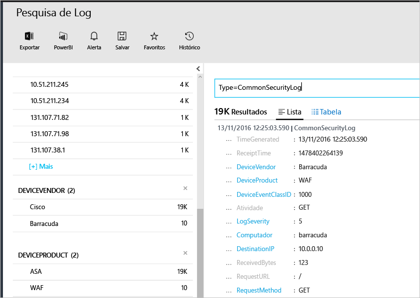

# <a name="connecting-your-security-products-to-the-operations-management-suite-oms-security-and-audit-solution"></a>Conectando seus produtos de segurança à Solução de Segurança e Auditoria do OMS (Operations Management Suite) 
Este documento ajudará você a conectar seus produtos de segurança à Solução de Segurança e Auditoria do OMS. Há suporte para as fontes a seguir:

- Eventos de Formato de Evento Comum (CEF)
- Eventos do Cisco ASA


## <a name="what-is-cef"></a>O que é CEF?
O Formato de Evento Comum (CEF) é um formato padrão da indústria, além das mensagens Syslog, usado por muitos fornecedores de segurança para permitir a interoperabilidade de eventos entre diferentes plataformas. A Solução de Segurança e Auditoria do OMS dá suporte à ingestão de dados usando CEF, o que permite que você conecte seus produtos de segurança com a Segurança do OMS. 

Ao conectar a fonte de dados com o OMS, você poderá tirar vantagem dos recursos a seguir, que fazem parte dessa plataforma:

- Pesquisa e Correlação
- Auditoria
- Alerta
- Inteligência contra ameaças
- Problemas importantes

## <a name="collection-of-security-solution-logs"></a>Coleção de logs da solução de segurança

A Segurança do OMS dá suporte à coleta de logs usando CEF em Syslogs e de logs do [Cisco ASA](https://blogs.technet.microsoft.com/msoms/2016/08/25/add-your-cisco-asa-logs-to-oms-security/). Neste exemplo, a origem (computador que gera os logs) é um computador Linux executando o daemon syslog-ng e o destino é a Segurança do OMS. Para preparar o computador Linux, você precisará executar as seguintes tarefas:

- Baixe o Agente do OMS para Linux, versão 1.2.0-25 ou superior.
- Siga a seção **Guia de Instalação Rápida** [deste artigo](https://github.com/Microsoft/OMS-Agent-for-Linux/blob/master/docs/OMS-Agent-for-Linux.md#steps-to-install-the-oms-agent-for-linux) para instalar e carregar o agente em seu espaço de trabalho.

Normalmente, o agente é instalado em um computador diferente do qual os logs são gerados. O encaminhamento dos logs para o computador agente geralmente exigirá as seguintes etapas:

- Configure o produto/máquina de logs para encaminhar os eventos necessários para o daemon syslog (rsyslog ou syslo-ng) no computador agente.
- Habilite o daemon syslog no computador agente para receber mensagens de um sistema remoto.

No computador agente, os eventos precisam ser enviados do daemon syslog para a porta UDP local 25226. O agente está ouvindo eventos de entrada nessa porta. A seguir está um exemplo de configuração para o envio de todos os eventos do sistema local para o agente (você pode modificar a configuração para se ajustar às suas configurações locais):

1. Abra a janela do terminal e vá para o diretório */etc/syslog-ng/* 
2. Crie um novo arquivo *security-config-omsagent.conf* e adicione o seguinte conteúdo: OMS_facility = local4
    
    filter f_local4_oms { facility(local4); };

    destination security_oms { tcp("127.0.0.1" port(25226)); };

    log { source(src); filter(f_local4_oms); destination(security_oms); };
    
3. Baixe o arquivo *security_events.conf* e coloque-o em */etc/opt/microsoft/omsagent/conf/omsagent.d/* no computador agente do OMS.
4. Digite o comando abaixo para reiniciar o daemon syslog:  *For syslog-ng run:*
    
    ```
    sudo service rsyslog restart
    ```

    *For rsyslog run:*
    
    ```
    /etc/init.d/syslog-ng restart
    ```
5. Digite o comando abaixo para reiniciar o Agente OMS:

    *For syslog-ng run:*
    
    ```
    sudo service omsagent restart
    ```

    *For rsyslog run:*
    
    ```
    systemctl restart omsagent
    ```
6. Digite o comando abaixo e examine o resultado para confirmar que não há erros no log do Agente do OMS:

    ```    
    tail /var/opt/microsoft/omsagent/log/omsagent.log
    ```

## <a name="reviewing-collected-security-events"></a>Revisando os eventos de segurança coletados

Após terminar configuração, o evento de segurança começará a ser processado pela Segurança do OMS. Para visualizar esses eventos, abra a Pesquisa de Log, digite o comando *Type=CommonSecurityLog* no campo de pesquisa e pressione ENTER. O exemplo a seguir mostra o resultado desse comando. Observe que, nesse caso, a Segurança do OMS já incluiu logs de segurança de vários fornecedores:
   


Você pode refinar a pesquisa para um único fornecedor, por exemplo, para visualizar logs Cisco online, digite: *Type=CommonSecurityLog DeviceVendor=Cisco*. "CommonSecurityLog" tem campos predefinidos para qualquer cabeçalho CEF, incluindo as extensões básicas, sendo que qualquer outra extensão, seja "Extensão Personalizada" ou não, será inserida no campo "AdditionalExtensions". Você pode usar o recurso de Campos Personalizados para obter campos dedicados. 

### <a name="accessing-computers-missing-baseline-assessment"></a>Acessando computadores sem avaliação de linha de base
O OMS dá suporte ao perfil de linha de base de membro do domínio do Windows Server 2008 R2 até o Windows Server 2012 R2. A linha de base do Windows Server 2016 ainda não é final e será adicionada assim que for publicada. Todos os outros sistemas operacionais examinados por meio da avaliação de linha de base da Segurança e Auditoria do OMS estão na seção **Computadores sem avaliação de linha de base**.

## <a name="see-also"></a>Consulte também
Neste documento, você aprendeu como conectar sua solução CEF ao OMS. Para saber mais sobre a Segurança do OMS, veja os seguintes artigos:

* [Operations Management Suite (OMS) overview](operations-management-suite-overview.md)
* [Monitorando e respondendo a alertas de segurança na solução de Segurança e Auditoria do Operations Management Suite](oms-security-responding-alerts.md)
* [Monitorando recursos na solução de Segurança e Auditoria do Operations Management Suite](oms-security-monitoring-resources.md)


