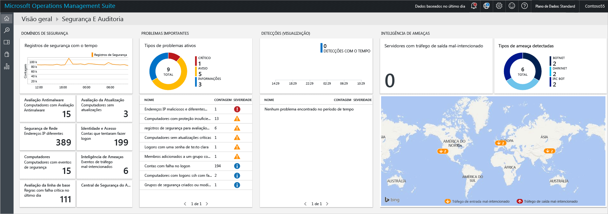
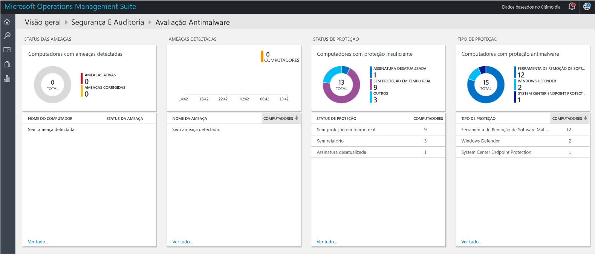
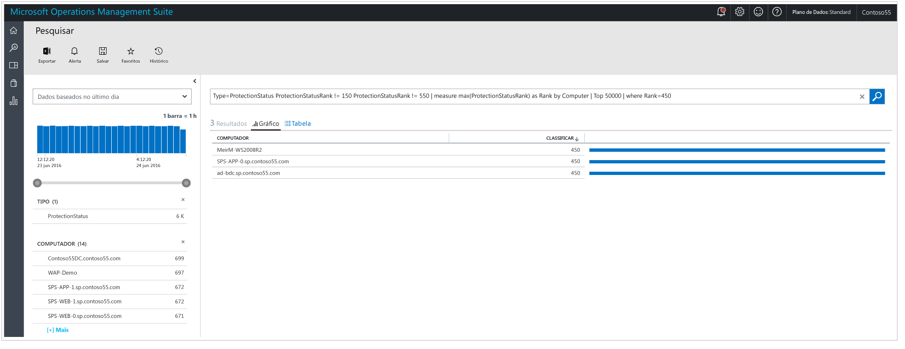
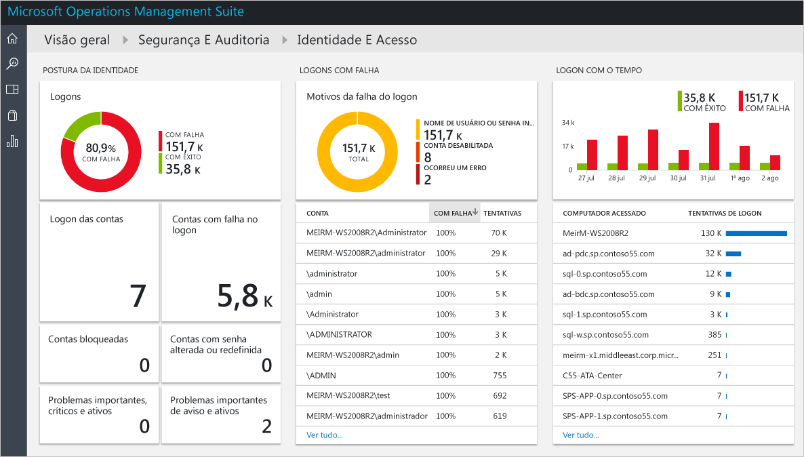
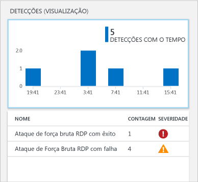
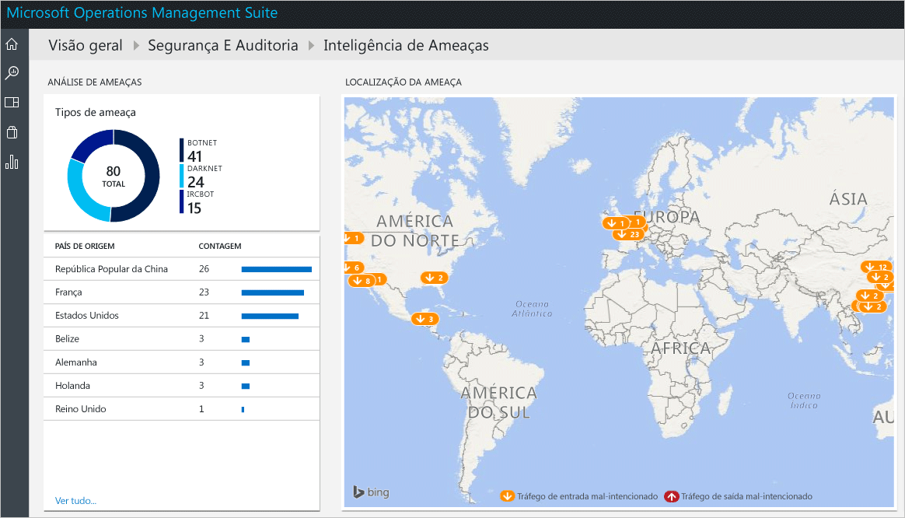

# Introdução à solução de Segurança e Auditoria do Operations Management Suite
Este documento o ajuda a se familiarizar rapidamente com as funcionalidades da solução de Auditoria e Segurança do OMS (Operations Management Suite) explicando cada uma das opções.

## O que é o OMS?
O OMS (Microsoft Operations Management Suite) é a solução de gerenciamento de TI baseada em nuvem da Microsoft que ajuda a gerenciar e proteger sua infraestrutura local e de nuvem. Para obter mais informações sobre o OMS, leia o artigo [Operations Management Suite](https://technet.microsoft.com/library/mt484091.aspx).

## Painel Segurança e Auditoria do OMS
A solução de Segurança e Auditoria do OMS fornece uma exibição abrangente da postura de segurança de TI de sua organização com consultas de pesquisa internas para problemas importantes que exigem atenção. O painel **Segurança e Auditoria** é a tela inicial para tudo relacionado à segurança no OMS. Ela fornece uma análise de alto nível do estado de segurança de seus computadores. Também inclui a capacidade de exibir todos os eventos das últimas 24 horas, dos últimos sete dias ou de qualquer outro intervalo de tempo personalizado. Para acessar o painel **Segurança e Auditoria**, siga estas etapas:

1. No painel principal **Microsoft Operations Management Suite**, clique no bloco **Configurações** à esquerda.
2. Na folha **Configurações**, em **Soluções**, clique na opção **Segurança e Auditoria**.
3. O painel **Segurança e Auditoria** é exibido:
   
    

Se você estiver acessando esse painel pela primeira vez e não tiver dispositivos monitorados pelo OMS, os blocos não serão populados com os dados obtidos do agente. Depois de instalar o agente, poderá demorar para que eles sejam populados e, portanto, o que é visto inicialmente pode ter alguns dados ausentes, já que eles ainda estão sendo carregados para a nuvem.  Nesse caso, é normal ver alguns blocos sem informações tangíveis. Leia [Conectar computadores com Windows diretamente ao OMS](https://technet.microsoft.com/library/mt484108.aspx) para obter mais informações sobre como instalar o agente do OMS em um sistema Windows e [Conectar computadores com Linux ao OMS](https://technet.microsoft.com/library/mt622052.aspx) para obter mais informações sobre como executar essa tarefa em um sistema Linux.

> [!NOTE]
> O agente coleta as informações com base nos eventos atuais que são habilitados, por exemplo, nome do computador, nome de usuário e endereço IP. No entanto, nenhum documento/arquivo, nome de banco de dados ou dado privado será coletado.   
> 
> 

as soluções são uma coleção de regras de lógica, de visualização e de aquisição de dados que abordam os principais desafios dos clientes. Segurança e Auditoria é uma solução; outras podem ser adicionadas separadamente. Leia o artigo [Adicionar soluções](https://technet.microsoft.com/library/mt674635.aspx) para obter mais informações sobre como adicionar uma nova solução.

O painel Auditoria e Segurança do OMS é organizado em quatro categorias principais:

* **Domínios de segurança**: nessa área, você poderá explorar ainda mais os registros de segurança ao longo do tempo, acessar a avaliação de malware, atualizar as informações de avaliação, segurança de rede, identidade e acesso, computadores com eventos de segurança e ter acesso rapidamente ao painel da Central de Segurança do Azure.
* **Problemas importantes**: essa opção permitirá que você identifique rapidamente o número de problemas ativos e sua severidade.
* **Detecções (visualização)**: o habilita a identificar padrões de ataque visualizando alertas de segurança à medida que eles ocorrem em relação a seus recursos.
* **Inteligência contra ameaças**: permite que você identifique padrões de ataque visualizando o número total de servidores com tráfego IP de saída mal-intencionado, o tipo de ameaça mal-intencionada e um mapa que mostra a origem desses IPs. 
* **Consultas comuns de segurança**: essa opção fornece uma lista das consultas de segurança mais comuns que você pode usar para monitorar seu ambiente. Quando você clica em uma dessas consultas, ela abre a folha **Pesquisa** com os resultados da consulta.

> [!NOTE]
> para obter mais informações sobre como o OMS mantém seus dados seguros, leia Como o OMS protege seus dados.
> 
> 

## Domínios de segurança
Ao monitorar os recursos, é importante conseguir acessar rapidamente o estado atual de seu ambiente. No entanto, também é importante ter a capacidade de acompanhar os eventos que ocorreram no passado que podem levar a uma compreensão melhor do que está acontecendo em seu ambiente em determinado momento. 

> [!NOTE]
> A retenção de dados ocorre de acordo com o plano de preços do OMS. Para obter mais informações, visite a página de preços do [Microsoft Operations Management Suite](https://www.microsoft.com/server-cloud/operations-management-suite/pricing.aspx) .
> 
> 

Os cenários de investigação forense e de resposta a incidentes aproveitarão diretamente os resultados disponíveis no bloco **Registros de Segurança ao longo do Tempo** .

Quando você clicar neste bloco, a folha **Pesquisa** será aberta, mostrando um resultado da consulta para **Eventos de Segurança** (Type=SecurityEvents) com dados baseados nos últimos sete dias, conforme mostrado abaixo:

[!include[log-analytics-log-search-nextgeneration](../../includes/log-analytics-log-search-nextgeneration.md)]

O resultado da pesquisa é dividido em dois painéis: o painel esquerdo fornece uma divisão do número de eventos de segurança encontrados, os computadores nos quais esses eventos foram encontrados, o número de contas que foram descobertas nesses computadores e os tipos de atividades. O painel direito fornece os resultados totais e uma exibição cronológica dos eventos de segurança com o nome e a atividade de evento do computador. Também é possível clicar em **Mostrar Mais** para exibir mais detalhes sobre esse evento, tais como os dados do evento, a ID do evento e a origem do evento.

> [!NOTE]
> Para obter mais informações sobre a consulta de pesquisa do OMS, leia a [referência de pesquisa do OMS](https://technet.microsoft.com/library/mt450427.aspx).
> 
> 

### Avaliação antimalware
Essa opção permite que você identifique rapidamente os computadores sem proteção suficiente e os computadores que estão comprometidos por um malware. O status da avaliação de malware e as ameaças detectadas nos servidores monitorados são lidos e, em seguida, os dados são enviados para o serviço do OMS na nuvem para processamento. Os servidores com ameaças detectadas e os servidores sem proteção suficiente são mostrados no painel de avaliação de malware, que pode ser acessado após clicar no bloco **Avaliação Antimalware**. 

Assim como ocorre com qualquer outro bloco dinâmico disponível no Painel do OMS, ao clicar nele, a folha **Pesquisa** será aberta com o resultado da consulta. Para essa opção, se você clicar na opção **Sem Relatório** em **Status de Proteção**, você terá o resultado da consulta que mostra essa única entrada que contém o nome do computador e sua classificação, conforme mostrado abaixo:

> [!NOTE]
> *classificação* é o fornecimento de uma classificação, com a finalidade de refletir o status da proteção (ativado, desativado, atualizado, etc.) e as ameaças encontradas. Ter isso como um número ajuda a fazer agregações.
> 
> 

Se você clicar no nome do computador, você terá a exibição cronológica do status da proteção deste computador. Isso é muito útil para cenários em que você precisa entender se o antimalware foi instalado uma vez e se, em algum momento, foi removido.   

### Avaliação de atualização
Essa opção permite que você determine rapidamente a exposição geral a problemas potenciais de segurança, bem como se essas atualizações são críticas e até que ponto são críticas para seu ambiente. A solução de Segurança e Auditoria do OMS fornece apenas a visualização dessas atualizações; os dados reais são fornecidos pelas [Soluções de Gerenciamento de Atualizações](oms-solution-update-management.md), que é um módulo diferente no OMS. Este é um exemplo das atualizações:

> [!NOTE]
> Para obter mais informações sobre soluções de Gerenciamento de Atualizações, leia [Solução de Gerenciamento de Atualizações no OMS](oms-solution-update-management.md).
> 
> 

### Identidade e Acesso
A identidade deve ser o plano de controle de sua empresa e a proteção de sua identidade deve ser sua prioridade. Embora, no passado, existiam perímetros em torno das organizações e embora eles fossem um dos principais limites de defesa, hoje em dia, com um número maior de dados e aplicativos sendo movidos para a nuvem, a identidade tornou-se o novo perímetro. 

> [!NOTE]
> atualmente, os dados se baseiam apenas em dados de logon dos Eventos de Segurança (ID do evento 4624). No futuro, os logons do Office 365 e os dados do Azure AD também serão incluídos.
> 
> 

Ao monitorar suas atividades de identidade, você poderá agir de forma proativa antes que um incidente local ocorra ou agir de forma reativa para interromper uma tentativa de ataque. O painel **Identidade e Acesso** fornece uma visão geral do estado de identidade, incluindo o número de tentativas de logon com falha, a conta do usuário que foi usada durante as tentativas, as contas que foram bloqueadas, as contas com alteração ou redefinição de senha e o número atual de contas que estão registradas. 

Ao clicar no bloco **Identidade e Acesso**, você verá o seguinte painel:

As informações disponíveis neste painel podem ajudá-lo imediatamente a identificar uma atividade suspeita potencial. Por exemplo, há 338 tentativas de fazer logon como **Administrador** e 100% dessas tentativas falharam. Isso pode ser causado por um ataque de força bruta nessa conta. Se você clicar nessa conta, obterá mais informações que podem ajudá-lo a determinar o recurso de destino desse ataque potencial:

O relatório detalhado fornece informações importantes sobre esse evento, incluindo: o computador de destino, o tipo de logon (nesse caso, Logon de rede), a atividade (nesse caso, o evento 4625) e uma linha do tempo abrangente de cada tentativa. 

### Computadores
Este bloco pode ser usado para acessar todos os computadores que têm eventos de segurança de forma ativa. Ao clicar neste bloco, você verá a lista de computadores com eventos de segurança e o número de eventos em cada computador:

Você pode continuar a investigação clicando em cada computador e examinar os eventos de segurança sinalizados.

### Inteligência contra ameaças

Ao usar a opção Inteligência contra Ameaças disponível na Segurança e Auditoria do OMS, os administradores de TI podem identificar as ameaças à segurança no ambiente, por exemplo, identificar se determinado computador faz parte de um botnet. Os computadores podem se tornar nós em um botnet quando os invasores instalam de forma ilícita malware que se conecta secretamente esse computador ao comando e controle. Ela também pode identificar ameaças potenciais recebidas de canais de comunicação underground, como darknet. Saiba mais sobre o Threat Intelligence lendo o artigo [Monitorando e respondendo a alertas de segurança na solução de Segurança e Auditoria do Operations Management Suite](oms-security-responding-alerts.md).

Em alguns cenários, você pode observar um potencial IP mal-intencionado que foi acessado de um computador monitorado:

Este e outros alertas na mesma categoria são gerados via Segurança do OMS, aproveitando a [Inteligência contra Ameaças da Microsoft](https://youtu.be/O4WtxgUrDc8). Os dados de Inteligência contra Ameaças são coletados pela Microsoft e também adquiridos dos principais provedores de inteligência contra ameaças. Esses dados são atualizados com frequência e adaptados para ameaças ágeis. Devido à sua natureza, ele deve ser combinado com outras fontes de informações de segurança durante a [investigação](https://blogs.technet.microsoft.com/msoms/2016/12/08/investigating-suspicious-activity-in-a-hybrid-cloud-with-oms-security/) de um alerta de segurança. 

### Avaliação de linha de base

A Microsoft, juntamente com organizações governamentais e do setor no mundo todo, define uma configuração do Windows que representa implantações de servidor altamente seguras. Essa configuração é um conjunto de chaves do registro, configurações de política de auditoria e configurações de política de segurança, juntamente com os valores recomendados da Microsoft para essas configurações. Esse conjunto de regras é conhecido como linha de base de Segurança. Leia [Avaliação de Linha de Base na Solução de Auditoria e Segurança do Operations Management Suite](oms-security-baseline.md) para saber mais informações sobre esta opção.

### Central de Segurança do Azure
Basicamente, este bloco é um atalho para acessar o painel da Central de Segurança do Azure. Leia [Introdução à Central de Segurança do Azure](../security-center/security-center-get-started.md) para obter mais informações sobre essa solução.

## Problemas importantes
O objetivo principal deste grupo de opções é fornecer uma visão geral dos problemas que você tem em seu ambiente, categorizando-os em Crítico, Aviso e Informativo. O bloco do tipo de problema Ativo é uma visualização desses problemas, mas não permite explorar mais detalhes sobre eles; para isso, você precisa usar a parte inferior deste bloco que tem o nome do problema (NOME), a quantidade de objetos fizeram isso acontecer (CONTAGEM) e o nível em que ele se mostra crítico (SEVERIDADE).

Você pode ver que esses problemas já foram abordados em diferentes áreas do grupo **Domínios de Segurança** , o que reforça o objetivo dessa exibição: visualizar os problemas mais importantes em seu ambiente em um único lugar.

## Detecções (visualização)
O objetivo principal dessa opção é permitir que a TI identifique rapidamente as ameaças potenciais em seu ambiente e a gravidade da ameaça.

Essa opção também pode ser usada durante uma [investigação de resposta a incidentes](https://blogs.msdn.microsoft.com/azuresecurity/2016/11/30/investigating-suspicious-activity-in-a-hybrid-cloud-with-oms-security/) para realizar a avaliação e obter mais informações sobre o ataque.

> [!NOTE]
> Para obter mais informações sobre como usar o OMS para resposta a incidentes, assista a este vídeo: [Como utilizar a Central de Segurança do Azure e o Microsoft Operations Management Suite para uma resposta a incidentes](https://channel9.msdn.com/Blogs/Taste-of-Premier/ToP1703).
> 
> 

## Inteligência contra ameaças
A nova seção de inteligência contra ameaças da solução de Segurança e Auditoria visualiza os possíveis padrões de ataque de várias maneiras: o número total de servidores com tráfego IP de saída mal-intencionado, o tipo de ameaça mal-intencionada e um mapa que mostra a origem desses IPs. É possível interagir com o mapa e clicar nos IPs para obter mais informações.

As tachinhas amarelas no mapa indicam o tráfego de entrada dos IPs mal-intencionados. Não é incomum que os servidores expostos à Internet observem um tráfego de entrada mal-intencionado, mas recomenda-se examinar essas tentativas para certificar-se de que nenhuma delas foi bem-sucedida. Esses indicadores são baseados nos logs do IIS, no WireData e nos logs do Firewall do Windows.  

## Consultas comuns de segurança
A lista de consultas comuns de segurança disponível pode ser útil para acessar rapidamente informações do recurso e personalizá-las de acordo com as necessidades de seu ambiente. Essas consultas comuns são:

* Todas as Atividades de Segurança
* Atividades de Segurança no computador “computer01.contoso.com” (substituir pelo nome de seu computador)
* Atividades de Segurança no computador “computer01.contoso.com” em relação à conta “Administrador” (substituir pelos nomes de seu computador e sua conta)
* Atividade de Logon por Computador
* Contas que encerraram o antimalware da Microsoft em qualquer computador
* Computadores em que o processo de antimalware da Microsoft foi encerrado
* Computadores em que “hash.exe” foi executado (substituir pelo nome de outro processo)
* Todos os nomes de Processos que foram executados
* Atividade de Logon por Conta
* Contas que se conectaram remotamente no computador “computer01.contoso.com” (substituir pelo nome de seu computador)

## Consulte também
Neste documento, apresentamos a você a solução de Segurança e Auditoria do OMS. Para saber mais sobre a Segurança do OMS, veja os seguintes artigos:

* [Operations Management Suite (OMS) overview](operations-management-suite-overview.md)
* [Monitorando e respondendo a alertas de segurança na solução de Segurança e Auditoria do Operations Management Suite](oms-security-responding-alerts.md)
* [Monitorando recursos na solução de Segurança e Auditoria do Operations Management Suite](oms-security-monitoring-resources.md)

