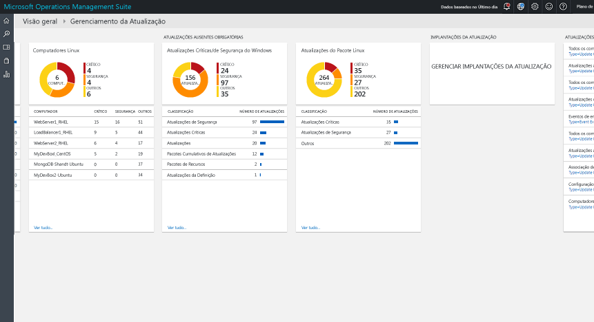
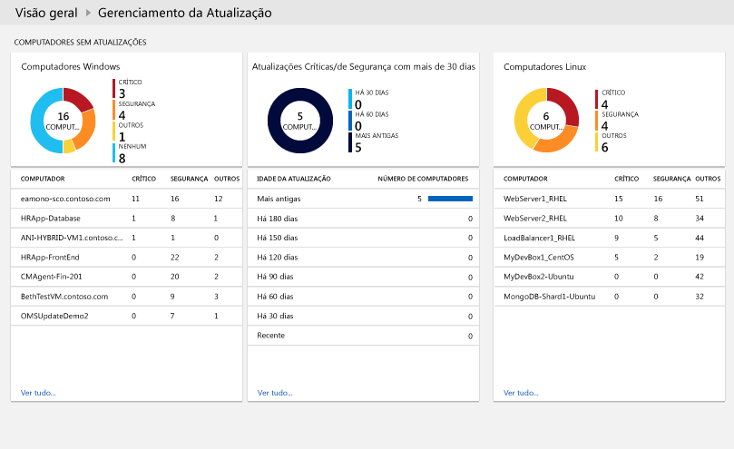
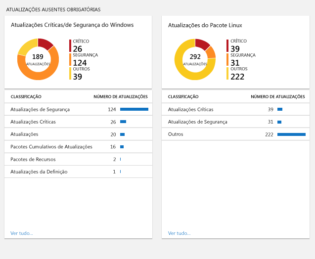
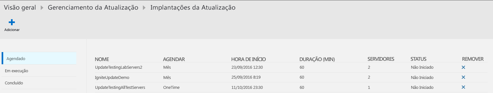
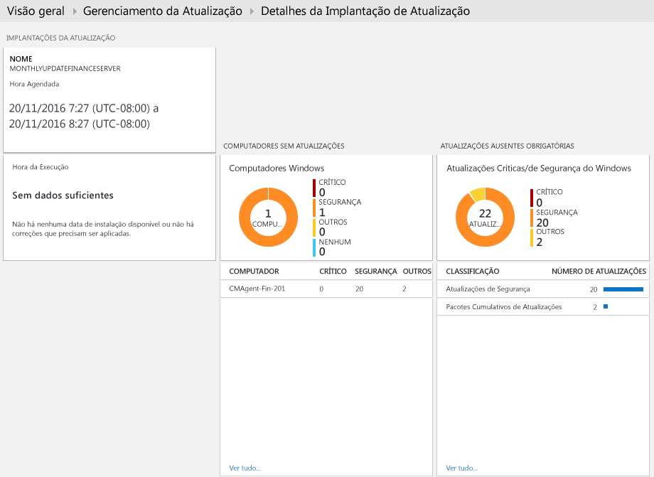
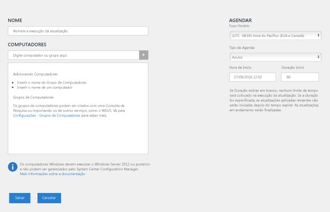
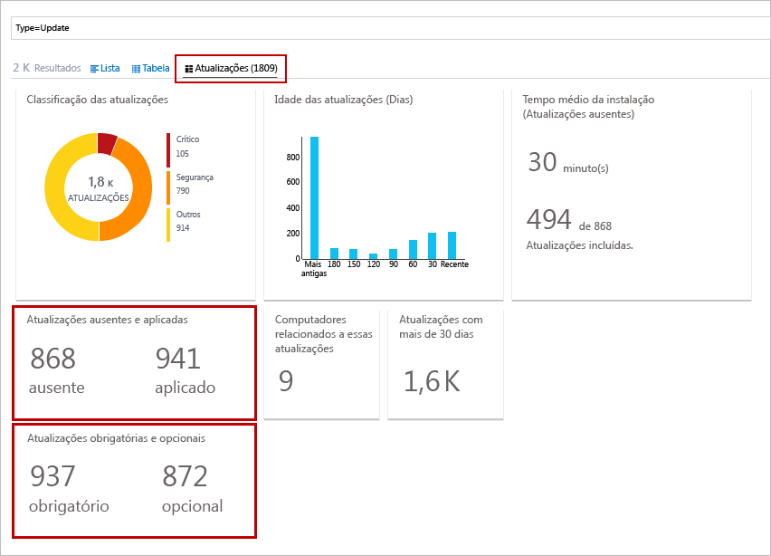
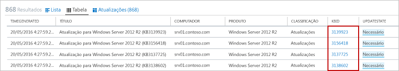
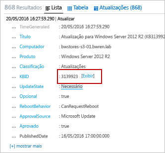

# Solução Gerenciamento de Atualizações no OMS
A solução Gerenciamento de Atualizações no OMS permite que você gerencie atualizações para os computadores Windows e Linux.  Você pode avaliar o status de atualizações disponíveis em todos os computadores de agente e iniciar rapidamente o processo de instalação das atualizações necessárias para os servidores. 

## Pré-requisitos
* A solução só dá suporte a executar avaliações de atualização no Windows Server 2008 e superior, e a atualizar implantações no Windows Server 2012 e superior.  Não há suporte para as opções de instalação Server Core e Nano Server.
* Não há suporte para sistemas operacionais clientes do Windows.  
* Os agentes do Windows devem ser configurados para se comunicar com um servidor WSUS (Windows Server Update Services) ou ter acesso ao Microsoft Update.  
  
  > [!NOTE]
  > O agente do Windows não pode ser gerenciado simultaneamente pelo System Center Configuration Manager.  
  > 
  > 
* Os agentes do Linux devem ter acesso a um repositório de atualização.  O agente do OMS para Linux pode ser baixado do [GitHub](https://github.com/microsoft/oms-agent-for-linux). 

## Configuração
Execute as etapas a seguir para adicionar a solução de gerenciamento de atualizações para seu espaço de trabalho do OMS e adicionar agentes do Linux. Os agentes do Windows são adicionados automaticamente sem nenhuma configuração adicional.

> [!NOTE]
> Se você habilitar essa solução, qualquer computador Windows conectado ao seu espaço de trabalho do OMS será automaticamente configurado como um Hybrid Runbook Worker para oferecer suporte a runbooks incluídos nessa solução.  No entanto, ele não estará registrado com nenhum grupo Hybrid Worker que você já tenha definido em sua Conta de automação.  Ele pode ser adicionado a um grupo Hybrid Runbook Worker na sua Conta de automação para dar suporte a runbooks de automação enquanto você estiver usando a mesma conta para a solução e para a associação de grupo do Hybrid Runbook Worker.  Essa funcionalidade foi adicionada à versão 7.2.12024.0 do Hybrid Runbook Worker.   

1. Adicione a solução de Gerenciamento de Atualizações ao seu espaço de trabalho do OMS usando o processo descrito em [Adicionar soluções do OMS](../log-analytics/log-analytics-add-solutions.md) da Galeria de Soluções.  
2. No portal do OMS, selecione **Configurações** e **Fontes Conectadas**.  Observe a **ID do Espaço de Trabalho** e a **Chave Primária** ou a **Chave Secundária**.
3. Execute as etapas a seguir para cada computador Linux.
   
   a.    Instale a versão mais recente do Agente do OMS para Linux ao executar os comandos a seguir.  Substitua <Workspace ID> pela ID do espaço de trabalho e <Key> pela Chave Primária ou pela Chave Secundária.
   
        cd ~
        wget https://github.com/Microsoft/OMS-Agent-for-Linux/releases/download/v1.2.0-75/omsagent-1.2.0-75.universal.x64.sh  
        sudo bash omsagent-1.2.0-75.universal.x64.sh --upgrade -w <Workspace ID> -s <Key>

   b. Para remover o agente, execute o comando a seguir.
   
        sudo bash omsagent-1.2.0-75.universal.x64.sh --purge

## Pacotes de gerenciamento
Se o grupo de gerenciamento do System Center Operations Manager estiver conectado ao seu espaço de trabalho do OMS, os pacotes de gerenciamento a seguir serão instalados no Operations Manager quando você adicionar essa solução. Não é necessária nenhuma configuração nem a manutenção desses pacotes de gerenciamento. 

* Microsoft System Center Advisor Update Assessment Intelligence Pack (Microsoft.IntelligencePacks.UpdateAssessment)
* Microsoft.IntelligencePack.UpdateAssessment.Configuration (Microsoft.IntelligencePack.UpdateAssessment.Configuration)
* MP de Implantação de Atualizações

Para saber mais sobre como os pacotes de gerenciamento da solução são atualizados, veja [Conectar o Operations Manager ao Log Analytics](../log-analytics/log-analytics-om-agents.md).

## Coleta de dados
### Agentes com suporte
A tabela a seguir descreve as fontes conectadas que têm suporte dessa solução.

| Fonte Conectada | Suportado | Descrição |
| --- | --- | --- |
| Agentes do Windows |Sim |A solução coleta informações sobre atualizações do sistema de agentes do Windows e inicia a instalação de atualizações necessárias. |
| Agentes do Linux |Sim |A solução coleta informações sobre atualizações do sistema de agentes do Linux. |
| Grupo de gerenciamento do Operations Manager |Sim |A solução coleta informações sobre atualizações do sistema de agentes em um grupo de gerenciamento conectados. Uma conexão direta do agente do Operations Manager ao Log Analytics não é necessária. Os dados são encaminhados do grupo de gerenciamento para o repositório do OMS. |
| Conta de Armazenamento do Azure |Não |O armazenamento do Azure não inclui informações sobre atualizações do sistema. |

### Frequência de coleta
Para cada computador gerenciado do Windows, uma verificação é executada duas vezes por dia.  Quando uma atualização é instalada, suas informações são atualizadas em 15 minutos.  

Para cada computador Linux gerenciado, uma verificação é executada a cada três horas.  

## Usando a solução
Ao adicionar a solução de Gerenciamento de Atualizações ao seu espaço de trabalho do OMS, o bloco **Gerenciamento de Atualizações** será adicionado ao painel do OMS. Esse bloco exibe a contagem e a representação gráfica do número de computadores em seu ambiente no momento que exigem atualizações do sistema.  
  

## Exibição de Avaliações de Atualização
Clique no bloco **Gerenciamento de Atualizações** para abrir o painel **Gerenciamento de Atualizações**. O painel inclui as colunas na tabela a seguir. Cada coluna lista os dez principais itens que correspondem aos critérios da coluna para o escopo e o intervalo de tempo especificados. É possível executar uma pesquisa de log que retorna todos os registros clicando em **Ver todos** na parte inferior da coluna ou clicando no cabeçalho de coluna.

| Coluna | Descrição |
| --- | --- |
| **Computadores Sem Atualizações** | |
| Atualizações Críticas ou de Segurança |Lista os dez principais computadores com atualizações ausentes, classificados pelo número de atualizações ausentes. Clique no nome do computador para executar uma pesquisa de log retornando que todos os registros para o computador de atualização. |
| Atualizações Críticas ou de Segurança com mais de 30 dias |Identifica o número de computadores que têm atualizações críticas ou de segurança ausentes, agrupados pelo tempo desde a publicação da atualização. Clique em uma das entradas para executar uma pesquisa de log retornando todas as atualizações críticas e ausentes. |
| **Atualizações Ausentes Necessárias** | |
| Atualizações Críticas ou de Segurança |Lista as classificações de atualizações ausentes nos computadores pelo número de computadores com atualizações ausentes na categoria. Clique em uma classificação para executar uma pesquisa de log retornando todos os registros de atualização para classificação. |
| **Implantações de Atualização** | |
| Implantações de Atualização |O número de implantações de atualização agendadas e a duração até a próxima execução agendada.  Clique no bloco para exibir as agendas, atualmente em execução, e as atualizações concluídas ou para agendar uma nova implantação. |

   
   
 
   
 
   

## Instalação de atualizações
Depois de avaliar atualizações para todos os computadores com Windows em seu ambiente, você pode ter as necessárias atualizações instaladas, criando uma *Implantação de Atualizações*.  Uma Implantação de Atualizações é uma instalação agendada de atualizações necessárias para um ou mais computadores Windows.  Você especifica a data e hora para a implantação, além de um computador ou um grupo de computadores que devem ser incluídos.  

As atualizações são instaladas por runbooks na Automação do Azure.  Você não consegue exibir esses runbooks e eles não exigem nenhuma configuração.  Quando uma Implantação de Atualizações é criada, ela cria uma agenda em que inicia um runbook de atualização mestre no momento especificado para os computadores incluídos.  Esse runbook mestre inicia um runbook filho em cada agente do Windows que executa a instalação de atualizações necessárias.  

As máquinas virtuais criadas por meio das imagens do RHEL (Red Hat Enterprise Linux) sob demanda disponíveis no Azure Marketplace são registradas para acessar a [RHUI (Infraestrutura de Atualização do Red Hat)](../virtual-machines/virtual-machines-linux-update-infrastructure-redhat.md) implantada no Azure.  Qualquer distribuição do Linux deve ser atualizada nos repositórios de distribuição de arquivo online seguindo os métodos com suporte.  

### Exibição de implantações de atualização
Clique no bloco **Implantação de Atualização** para exibir a lista das Implantações de Atualizações existentes.  Elas são agrupadas por status – **Agendadas**, **Em Execução** e **Concluídas**.      

As propriedades exibidas para cada Implantação de Atualizações são descritas na tabela a seguir.

| Propriedade | Descrição |
| --- | --- |
| Nome |Nome da Implantação de Atualizações. |
| Agenda |Tipo de agenda.  Atualmente, *OneTime* é o único valor possível. |
| Hora de Início |A data e a hora em que a Implantação de Atualizações está agendada para iniciar. |
| Duração |O número de minutos que a Implantação de Atualização pode ser executada.  Se todas as atualizações não forem instaladas nesse período, as atualizações restantes deverão aguardar até a próxima Implantação de Atualização. |
| Servidores |O número de computadores afetados pela Implantação de Atualizações. |
| Status |O status atual da Implantação de Atualizações.  Os valores possíveis são: -  Não iniciado - Executando - Concluído |

Clique em uma Implantação de Atualizações para exibir a tela de detalhes que inclui as colunas na tabela a seguir.  Essas colunas não estarão preenchidas se a Implantação de Atualizações ainda não tiver sido iniciada. 

| Coluna | Descrição |
| --- | --- |
| **Resultados do Computador** | |
| Concluído com Êxito |Lista o número de computadores na Implantação de Atualizações por status.  Clique em um status para executar uma pesquisa de log que retorna todos os registros de atualização com esse status para a Implantação de Atualizações. |
| Status de Instalação do Computador |Lista os computadores envolvidos na Implantação de Atualizações e a porcentagem de atualizações instaladas com êxito. Clique em uma das entradas para executar uma pesquisa de log retornando todas as atualizações críticas e ausentes. |
| **Resultados da Instância de Atualização** | |
| Status de Instalação da Instância |Lista as classificações de atualizações ausentes nos computadores pelo número de computadores com atualizações ausentes na categoria. Clique em um computador para executar uma pesquisa de log que retorna que todos os registros de atualização do computador. |

   

### Criação de uma Implantação de Atualizações
Crie uma nova Implantação de Atualizações clicando no botão **Adicionar** na parte superior da tela para abrir a página **Nova Implantação de Atualizações**.  Você deve fornecer valores para as propriedades na tabela a seguir.

| Propriedade | Descrição |
| --- | --- |
| Nome |Nome exclusivo para identificar a Implantação de Atualizações. |
| Fuso horário |Fuso horário a ser usado para a hora de início. |
| Hora de Início |Data e hora para iniciar a Implantação de Atualizações. |
| Duração |O número de minutos que a Implantação de Atualização pode ser executada.  Se todas as atualizações não forem instaladas nesse período, as atualizações restantes deverão aguardar até a próxima Implantação de Atualização. |
| Computadores |Nomes de computadores ou grupos para incluir na Implantação de Atualizações.  Selecione uma ou mais entradas na lista suspensa. |

   

### Intervalo de tempo
Por padrão, o escopo dos dados analisados na solução de Gerenciamento de Atualizações é de todos os grupos de gerenciamento conectados, gerados no último dia. 

Para alterar o intervalo de tempo dos dados, selecione **Dados baseados em** na parte superior do painel. Você pode selecionar registros criados ou atualizados dentro dos últimos 7 dias, 1 dia ou 6 horas. Outra opção é selecionar **Personalizado** e especificar um intervalo de datas personalizado.     

## Registros do Log Analytics
A solução de gerenciamento de atualização cria dois tipos de registros no repositório do OMS.

### Registros de atualização
Um registro com um tipo **Update** é criado para cada atualização instalada ou necessária em cada computador. Os registros Update têm as propriedades descritas na tabela a seguir.

| Propriedade | Descrição |
| --- | --- |
| Tipo |*Atualização* |
| SourceSystem |A fonte que aprovou a instalação da atualização. Os valores possíveis são: - Microsoft Update -  Windows Update - SCCM - Servidores Linux (buscados de Gerenciadores de Pacotes) |
| Aprovado |Especifica se a atualização foi aprovada para instalação.  Para os servidores Linux, atualmente isso é opcional, já que a aplicação de patch não é gerenciada pelo OMS. |
| Classificação para o Windows |Classificação da Atualização. Os valores possíveis são: - Aplicativos - Atualizações Críticas - Atualizações de Definição - Feature Packs - Atualizações de Segurança - Service Packs - Pacotes Cumulativos de Atualização - Atualizações |
| Classificação para Linux |Classificação da atualização. Os valores possíveis são: - Atualizações Críticas - Atualizações de Segurança - Outras Atualizações |
| Computador |Nome do computador. |
| InstallTimeAvailable |Especifica se o tempo de instalação está disponível em outros agentes que instalaram a mesma atualização. |
| InstallTimePredictionSeconds |Tempo estimado para instalação em segundos, com base em outros agentes que instalaram a mesma atualização. |
| KBID |ID do artigo da Base de Dados de Conhecimento que descreve a atualização. |
| ManagementGroupName |Nome do grupo de gerenciamento de agentes do SCOM.  Para outros agentes, é o AOI-<workspace ID>. |
| MSRCBulletinID |ID do boletim de segurança da Microsoft que descreve a atualização. |
| MSRCSeverity |Gravidade do boletim de segurança da Microsoft. Os valores possíveis são: - Crítico - Importante - Moderado |
| Opcional |Especifica se a atualização é opcional. |
| Produto |Nome do produto ao qual a atualização se destina.  Clique em **Exibir** para abrir o artigo em um navegador. |
| PackageSeverity |A gravidade da vulnerabilidade corrigida nesta atualização, conforme reportado pelos fornecedores de distribuição do Linux. |
| PublishDate |Data e hora em que a atualização foi instalada. |
| RebootBehavior |Especifica se a atualização forçará uma reinicialização. Os valores possíveis são: - canrequestreboot - neverreboots |
| RevisionNumber |Número de revisão da atualização. |
| SourceComputerId |GUID para identificar exclusivamente o computador. |
| TimeGenerated |Data e hora em que o registro foi atualizado. |
| Title |Título da atualização. |
| UpdateID |GUID para identificar exclusivamente a atualização. |
| UpdateState |Especifica se a atualização está instalada neste computador. Os valores possíveis são: -Instalado - a atualização está instalada neste computador. -Necessário - a atualização não está instalada e é necessário neste computador. |

 
Quando você executa uma pesquisa de log que retorna registros com um tipo **Update**, pode selecionar a exibição **Updates**, que exibe um conjunto de blocos resumindo as atualizações retornadas pela pesquisa. Você pode clicar nas entradas dos blocos **Atualizações ausentes e aplicadas** e **Atualizações obrigatórias e opcionais** para obter um escopo da exibição do conjunto de atualizações. Selecione a exibição **Lista** ou **Tabela** para retornar os registros individuais.  

  

Na exibição **Tabela**, você pode clicar na **KBID** de qualquer registro para abrir um navegador com o artigo da Base de Dados de Conhecimento. Isso permite que você leia rapidamente sobre os detalhes da atualização específica.  

Na exibição **Lista**, clique no link **Exibir** ao lado da KBID para abrir o artigo da Base de Dados de Conhecimento. 

### Registros de UpdateSummary
Um registro com um tipo **UpdateSummary** é criado para cada computador de agente do Windows. Esse registro é atualizado toda vez que o computador é examinado em busca de atualizações. Os registros **UpdateSummary** têm as propriedades descritas na tabela a seguir.

| Propriedade | Descrição |
| --- | --- |
| Tipo |UpdateSummary |
| SourceSystem |OpsManager |
| Computador |Nome do computador. |
| CriticalUpdatesMissing |Número de atualizações críticas ausentes no computador. |
| ManagementGroupName |Nome do grupo de gerenciamento de agentes do SCOM. Para outros agentes, é o AOI-<workspace ID>. |
| NETRuntimeVersion |Versão do tempo de execução .NET instalada no computador. |
| OldestMissingSecurityUpdateBucket |Bucket para categorizar o tempo desde a segurança ausente mais antiga atualização neste computador foi publicado. Os valores possíveis são: - Mais antigos - Há 180 dias - Há 150 dias - Há 120 dias - Há 90 dias - Há 60 dias - Há 30 dias - Recente |
| OldestMissingSecurityUpdateInDays |Número de dias desde que a atualização de segurança ausente mais antiga neste computador foi publicada. |
| OsVersion |Versão do sistema operacional instalado no computador. |
| OtherUpdatesMissing |Número de outras atualizações ausentes no computador. |
| SecurityUpdatesMissing |Número de atualizações de segurança ausentes no computador. |
| SourceComputerId |GUID para identificar exclusivamente o computador. |
| TimeGenerated |Data e hora em que o registro foi atualizado. |
| TotalUpdatesMissing |Número total de atualizações ausentes no computador. |
| WindowsUpdateAgentVersion |Número de versão do agente do Windows Update no computador. |
| WindowsUpdateSetting |Configuração de como o computador instalará as atualizações importantes. Os valores possíveis são: - Desabilitado - Notificar antes da instalação - Instalação agendada |
| WSUSServer |URL do servidor WSUS se o computador estiver configurado para usar um. |

## Pesquisas de log de exemplo
A tabela a seguir fornece pesquisas de log de exemplo para os registros de atualização coletados por essa solução. 

| Consultar | Descrição |
| --- | --- |
| Todos os computadores com atualizações ausentes |Type=Update UpdateState=Needed Optional=false &#124; select Computer,Title,KBID,Classification,UpdateSeverity,PublishedDate |
| Atualizações ausentes no computador “COMPUTADOR01.contoso.com” (substituir pelo nome de seu computador) |Type=Update UpdateState=Needed Optional=false Computer="COMPUTER01.contoso.com" &#124; select Computer,Title,KBID,Product,UpdateSeverity,PublishedDate |
| Todos os computadores com atualizações críticas ou de segurança ausentes |Type=Update UpdateState=Needed Optional=false (Classification="Security Updates" OR Classification="Critical Updates") |
| Atualizações críticas ou de segurança necessárias para computadores em que as atualizações são aplicadas manualmente |Type=Update UpdateState=Needed Optional=false (Classification="Security Updates" OR Classification="Critical Updates") Computer IN {Type=UpdateSummary WindowsUpdateSetting=Manual &#124; Distinct Computer} &#124; Distinct KBID |
| Eventos de erro para computadores sem as atualizações críticas ou de segurança obrigatórias |Type=Event EventLevelName=error Computer IN {Type=Update (Classification="Security Updates" OR Classification="Critical Updates") UpdateState=Needed Optional=false &#124; Distinct Computer} |
| Todos os computadores com pacotes cumulativos de atualização ausentes |Type=Update Optional=false Classification="Update Rollups" UpdateState=Needed &#124; select Computer,Title,KBID,Classification,UpdateSeverity,PublishedDate |
| Atualizações ausentes distintas em todos os computadores |Type=Update UpdateState=Needed Optional=false &#124; Distinct Title |
| Associação de computadores ao WSUS |Type=UpdateSummary &#124; measure count() by WSUSServer |
| Configuração de atualização automática |Type=UpdateSummary &#124; measure count() by WindowsUpdateSetting |
| Computadores com atualizações automáticas desabilitadas |Type=UpdateSummary WindowsUpdateSetting=Manual |
| Lista de todas as máquinas Linux com uma atualização de pacote disponível |Type=Update and OSType=Linux and UpdateState!="Not needed" &#124; measure count() by Computer |
| Lista de todas as máquinas Linux com uma atualização de pacote disponível que trata de vulnerabilidade Crítica ou de Segurança |Type=Update and OSType=Linux and UpdateState!="Not needed" and (Classification="Critical Updates" OR Classification="Security Updates") &#124; measure count() by Computer |
| Lista de todos os pacotes que tenham uma atualização disponível |Type=Update and OSType=Linux and UpdateState!="Not needed" |
| Lista de todos os pacotes que tenham uma atualização disponível para uma vulnerabilidade Crítica ou de Segurança |Type=Update  and OSType=Linux and UpdateState!="Not needed" and (Classification="Critical Updates" OR Classification="Security Updates") |
| Lista de todas as máquinas "Ubuntu" com qualquer atualização disponível |Type=Update and OSType=Linux and OSName = Ubuntu &#124; measure count() by Computer |

## Próximas etapas
* Use Pesquisas de Log no [Log Analytics](../log-analytics/log-analytics-log-searches.md) para exibir dados detalhados das atualizações.
* [Crie seus próprios painéis](../log-analytics/log-analytics-dashboards.md) mostrando a conformidade da atualização dos computadores gerenciados.
* [Crie alertas](../log-analytics/log-analytics-alerts.md) quando atualizações críticas forem detectadas como ausentes de um computador ou quando um computador tiver as atualizações automáticas desabilitadas.  

