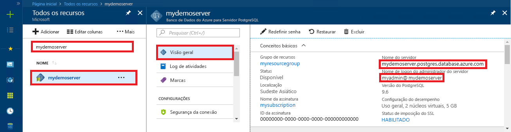

# <a name="azure-database-for-postgresql-use-net-c-to-connect-and-query-data"></a>Banco de dados do Azure para PostgreSQL: usar .NET (C#) para se conectar e consultar dados
Este guia de início rápido demonstra como se conectar a um banco de dados do Azure para PostgreSQL usando aplicativo C#. Ele mostra como usar instruções SQL para consultar, inserir, atualizar e excluir dados no banco de dados. As etapas neste artigo pressupõem que você está familiarizado com o desenvolvimento usando C# e que começou recentemente a trabalhar com o Banco de Dados do Azure para PostgreSQL.

## <a name="prerequisites"></a>Pré-requisitos
Este guia de início rápido usa os recursos criados em um destes guias como ponto de partida:
- [Criar Banco de dados - Portal](quickstart-create-server-database-portal.md)
- [Criar Banco de dados - CLI](quickstart-create-server-database-azure-cli.md)

Você também precisará:
- Instalar o [.NET Framework](https://www.microsoft.com/net/download)
- Instalar o [Visual Studio](https://www.visualstudio.com/downloads/)
- Instalar [Npgsql](http://www.npgsql.org/doc/index.html) 

## <a name="install-visual-studio-and-net"></a>Instalar o Visual Studio e o .NET
As etapas nesta seção pressupõem que você esteja familiarizado com desenvolvimento usando o .NET.

### <a name="windows-net-framework-and-net-core"></a>**Windows .NET Framework e .NET Core**
A Comunidade do Visual Studio 2017 é um IDE completo, extensível, gratuito para a criação de aplicativos modernos para Android, iOS, Windows, bem como aplicativos da Web e de banco de dados, e serviços de nuvem. Você pode instalar o .NET Framework completo ou apenas o .NET Core. Os trechos de código no início rápido funcionam com qualquer um. Se você já tiver o Visual Studio instalado em seu computador, ignore as próximas etapas.

1. Baixe o [instalador do Visual Studio 2017](https://www.visualstudio.com/thank-you-downloading-visual-studio/?sku=Community&rel=15). 
2. Execute o instalador e siga os prompts de instalação para concluir a instalação.

### <a name="mac-os"></a>**Mac OS**
Abra seu terminal e navegue até um diretório no qual você planeja criar o projeto .NET Core. Digite os comandos a seguir para instalar **brew** e **OpenSSL** e **.NET Core**. 

```bash
ruby -e "$(curl -fsSL https://raw.githubusercontent.com/Homebrew/install/master/install)"
brew update
brew install openssl
mkdir -p /usr/local/lib
ln -s /usr/local/opt/openssl/lib/libcrypto.1.0.0.dylib /usr/local/lib/
ln -s /usr/local/opt/openssl/lib/libssl.1.0.0.dylib /usr/local/lib/
```

Instale o .NET Core no macOS. Baixe o [instalador oficial](https://go.microsoft.com/fwlink/?linkid=843444). Esse instalador instalará as ferramentas e as colocará em seu PATH para que você possa executar o dotnet a partir do Console

### <a name="linux-ubuntu"></a>**Linux (Ubuntu)**
Abra seu terminal e navegue até um diretório no qual você planeja criar o projeto .NET Core. Digite os comandos a seguir para instalar o **.NET Core**.

```bash
sudo sh -c 'echo "deb [arch=amd64] https://apt-mo.trafficmanager.net/repos/dotnet-release/ xenial main" > /etc/apt/sources.list.d/dotnetdev.list'
sudo apt-key adv --keyserver hkp://keyserver.ubuntu.com:80 --recv-keys 417A0893
sudo apt-get update
sudo apt-get install dotnet-dev-1.0.1
```

## <a name="install-npgsql-references-into-your-visual-studio-solution"></a>Instalar referências Npgsql referências em sua solução do Visual Studio
Para conectar-se do aplicativo C# ao PostgreSQL, use a biblioteca de ADO.NET de software livre chamada Npgsql. O NuGet ajuda a baixar e gerenciar as referências facilmente.

1. Crie uma nova solução C# ou abra uma existente: 
   - No Visual Studio, crie uma solução clicando no menu Arquivo **Novo** > **Projeto**.
   - Na caixa de diálogo Novo Projeto, expanda **Modelos** > **Visual C#**. 
   - Escolha um modelo apropriado, como **Aplicativo de Console (.NET Core)**.

2. Use o Gerenciador de pacotes do Nuget para instalar Npgsql:
   - Clique no menu **Ferramentas** > **Gerenciador de Pacotes Nuget** > **Console do Gerenciador de Pacotes**.
   - No **Console do Gerenciador de Pacotes**, digite `Install-Package Npgsql`
   - O comando de instalação baixa os Npgsql.dll e os assemblies relacionados e os adiciona como dependências na solução.

## <a name="get-connection-information"></a>Obter informações de conexão
Obtenha as informações de conexão necessárias para se conectar ao Banco de Dados do Azure para PostgreSQL. Você precisa das credenciais de logon e do nome do servidor totalmente qualificado.

1. Faça logon no [Portal do Azure](https://portal.azure.com/).
2. No menu à esquerda no Portal do Azure, clique em **Todos os recursos** e pesquise pelo servidor que você criou, como **mypgserver-20170401**.
3. Clique no nome do servidor **mypgserver-20170401**.
4. Selecione a página **Visão geral** do servidor. Anote o **Nome do servidor** e o **Nome de logon de administrador do servidor**.
 
5. Se você se esquecer das informações de logon do servidor, navegue até a página **Visão Geral** para exibir o nome de logon do Administrador do servidor e, se necessário, redefinir a senha.

## <a name="connect-create-table-and-insert-data"></a>Conectar-se, criar tabela e inserir dados
Use o código a seguir para se conectar e carregar os dados usando instruções SQL **CREATE TABLE** e **INSERT INTO**. O código usa a classe NpgsqlCommand com o método [Open ()](http://www.npgsql.org/api/Npgsql.NpgsqlConnection.html#Npgsql_NpgsqlConnection_Open) para estabelecer uma conexão com o PostgreSQL. Em seguida, o código usa o método [CreateCommand()](http://www.npgsql.org/api/Npgsql.NpgsqlConnection.html#Npgsql_NpgsqlConnection_CreateCommand), define a propriedade CommandText e chama o método [ExecuteNonQuery ()](http://www.npgsql.org/api/Npgsql.NpgsqlCommand.html#Npgsql_NpgsqlCommand_ExecuteNonQuery) para executar os comandos do banco de dados. 

Substitua os parâmetros Host, DBName, User e Password pelos valores que você especificou quando criou o servidor e o banco de dados. 

```csharp
using System;
using System.Collections.Generic;
using System.Linq;
using System.Text;
using System.Threading.Tasks;
using Npgsql;

namespace Driver
{
    public class AzurePostgresCreate
    {
        // Obtain connection string information from the portal
        //
        private static string Host = "mypgserver-20170401.postgres.database.azure.com";
        private static string User = "mylogin@mypgserver-20170401";
        private static string DBname = "mypgsqldb";
        private static string Password = "<server_admin_password>";
        private static string Port = "5432";

        static void Main(string[] args)
        {
            // Build connection string using parameters from portal
            //
            string connString =
                String.Format(
                    "Server={0}; User Id={1}; Database={2}; Port={3}; Password={4}; SSL Mode=Prefer; Trust Server Certificate=true",
                    Host,
                    User,
                    DBname,
                    Port,
                    Password);

            var conn = new NpgsqlConnection(connString);

            Console.Out.WriteLine("Opening connection");
            conn.Open();

            var command = conn.CreateCommand();
            command.CommandText = "DROP TABLE IF EXISTS inventory;";
            command.ExecuteNonQuery();
            Console.Out.WriteLine("Finished dropping table (if existed)");

            command.CommandText = "CREATE TABLE inventory (id serial PRIMARY KEY, name VARCHAR(50), quantity INTEGER);";
            command.ExecuteNonQuery();
            Console.Out.WriteLine("Finished creating table");

            command.CommandText =
                String.Format(
                    @"
                                INSERT INTO inventory (name, quantity) VALUES ({0}, {1});
                                INSERT INTO inventory (name, quantity) VALUES ({2}, {3});
                                INSERT INTO inventory (name, quantity) VALUES ({4}, {5});
                            ",
                    "\'banana\'", 150,
                    "\'orange\'", 154,
                    "\'apple\'", 100
                    );

            int nRows = command.ExecuteNonQuery();
            Console.Out.WriteLine(String.Format("Number of rows inserted={0}", nRows));

            Console.Out.WriteLine("Closing connection");
            conn.Close();

            Console.WriteLine("Press RETURN to exit");
            Console.ReadLine();
        }
    }
}
```

## <a name="read-data"></a>Ler dados
Use o código a seguir para conectar-se e ler os dados usando uma instrução SQL **SELECT**. O código usa a classe NpgsqlCommand com o método [Open ()](http://www.npgsql.org/api/Npgsql.NpgsqlConnection.html#Npgsql_NpgsqlConnection_Open) para estabelecer uma conexão com o PostgreSQL. Em seguida, o código usa o método [CreateCommand()](http://www.npgsql.org/api/Npgsql.NpgsqlConnection.html#Npgsql_NpgsqlConnection_CreateCommand) e o método [ExecuteReader ()](http://www.npgsql.org/api/Npgsql.NpgsqlCommand.html#Npgsql_NpgsqlCommand_ExecuteReader) para executar os comandos de banco de dados. Em seguida, o código usa [Read](http://www.npgsql.org/api/Npgsql.NpgsqlDataReader.html#Npgsql_NpgsqlDataReader_Read) para acessar os registros nos resultados. Em seguida, o código usa [GetInt32()](http://www.npgsql.org/api/Npgsql.NpgsqlDataReader.html#Npgsql_NpgsqlDataReader_GetInt32_System_Int32_) e [GetString()](http://www.npgsql.org/api/Npgsql.NpgsqlDataReader.html#Npgsql_NpgsqlDataReader_GetString_System_Int32_) para analisar os valores do registro.

Substitua os parâmetros Host, DBName, User e Password pelos valores que você especificou quando criou o servidor e o banco de dados. 

```csharp
using System;
using System.Collections.Generic;
using System.Linq;
using System.Text;
using System.Threading.Tasks;
using Npgsql;

namespace Driver
{
    public class AzurePostgresRead
    {
        // Obtain connection string information from the portal
        //
        private static string Host = "mypgserver-20170401.postgres.database.azure.com";
        private static string User = "mylogin@mypgserver-20170401";
        private static string DBname = "mypgsqldb";
        private static string Password = "<server_admin_password>";
        private static string Port = "5432";

        static void Main(string[] args)
        {
            // Build connection string using parameters from portal
            //
            string connString =
                String.Format(
                    "Server={0}; User Id={1}; Database={2}; Port={3}; Password={4};",
                    Host,
                    User,
                    DBname,
                    Port,
                    Password);

            var conn = new NpgsqlConnection(connString);

            Console.Out.WriteLine("Opening connection");
            conn.Open();

            var command = conn.CreateCommand();
            command.CommandText = "SELECT * FROM inventory;";

            var reader = command.ExecuteReader();
            while (reader.Read())
            {
                Console.WriteLine(
                    string.Format(
                        "Reading from table=({0}, {1}, {2})",
                        reader.GetInt32(0).ToString(),
                        reader.GetString(1),
                        reader.GetInt32(2).ToString()
                        )
                    );
            }

            Console.Out.WriteLine("Closing connection");
            conn.Close();

            Console.WriteLine("Press RETURN to exit");
            Console.ReadLine();
        }
    }
}
```


## <a name="update-data"></a>Atualizar dados
Use o código a seguir para conectar-se e ler os dados usando uma instrução SQL **UPDATE**. O código usa a classe NpgsqlCommand com o método [Open ()](http://www.npgsql.org/api/Npgsql.NpgsqlConnection.html#Npgsql_NpgsqlConnection_Open) para estabelecer uma conexão com o PostgreSQL. Em seguida, o código usa o método [CreateCommand()](http://www.npgsql.org/api/Npgsql.NpgsqlConnection.html#Npgsql_NpgsqlConnection_CreateCommand), define a propriedade CommandText e chama o método [ExecuteNonQuery ()](http://www.npgsql.org/api/Npgsql.NpgsqlCommand.html#Npgsql_NpgsqlCommand_ExecuteNonQuery) para executar os comandos do banco de dados.

Substitua os parâmetros Host, DBName, User e Password pelos valores que você especificou quando criou o servidor e o banco de dados. 

```csharp
using System;
using System.Collections.Generic;
using System.Linq;
using System.Text;
using System.Threading.Tasks;
using Npgsql;

namespace Driver
{
    public class AzurePostgresUpdate
    {
        // Obtain connection string information from the portal
        //
        private static string Host = "mypgserver-20170401.postgres.database.azure.com";
        private static string User = "mylogin@mypgserver-20170401";
        private static string DBname = "mypgsqldb";
        private static string Password = "<server_admin_password>";
        private static string Port = "5432";

        static void Main(string[] args)
        {
            // Build connection string using parameters from portal
            //
            string connString =
                String.Format(
                    "Server={0}; User Id={1}; Database={2}; Port={3}; Password={4};",
                    Host,
                    User,
                    DBname,
                    Port,
                    Password);

            var conn = new NpgsqlConnection(connString);

            Console.Out.WriteLine("Opening connection");
            conn.Open();

            var command = conn.CreateCommand();
            command.CommandText =
            String.Format("UPDATE inventory SET quantity = {0} WHERE name = {1};",
                200,
                "\'banana\'"
                );

            int nRows = command.ExecuteNonQuery();
            Console.Out.WriteLine(String.Format("Number of rows updated={0}", nRows));

            Console.Out.WriteLine("Closing connection");
            conn.Close();

            Console.WriteLine("Press RETURN to exit");
            Console.ReadLine();
        }
    }
}
```


## <a name="delete-data"></a>Excluir dados
Use o código a seguir para conectar-se e ler os dados usando uma instrução SQL **DELETE**. 

 O código usa a classe NpgsqlCommand com o método [Open ()](http://www.npgsql.org/api/Npgsql.NpgsqlConnection.html#Npgsql_NpgsqlConnection_Open) para estabelecer uma conexão com o PostgreSQL. Em seguida, o código usa o método [CreateCommand()](http://www.npgsql.org/api/Npgsql.NpgsqlConnection.html#Npgsql_NpgsqlConnection_CreateCommand), define a propriedade CommandText e chama o método [ExecuteNonQuery ()](http://www.npgsql.org/api/Npgsql.NpgsqlCommand.html#Npgsql_NpgsqlCommand_ExecuteNonQuery) para executar os comandos do banco de dados.

Substitua os parâmetros Host, DBName, User e Password pelos valores que você especificou quando criou o servidor e o banco de dados. 

```csharp
using System;
using System.Collections.Generic;
using System.Linq;
using System.Text;
using System.Threading.Tasks;
using Npgsql;

namespace Driver
{
    public class AzurePostgresDelete
    {
        // Obtain connection string information from the portal
        //
        private static string Host = "mypgserver-20170401.postgres.database.azure.com";
        private static string User = "mylogin@mypgserver-20170401";
        private static string DBname = "mypgsqldb";
        private static string Password = "<server_admin_password>";
        private static string Port = "5432";

        static void Main(string[] args)
        {
            // Build connection string using parameters from portal
            //
            string connString =
                String.Format(
                    "Server={0}; User Id={1}; Database={2}; Port={3}; Password={4};",
                    Host,
                    User,
                    DBname,
                    Port,
                    Password);

            var conn = new NpgsqlConnection(connString);

            Console.Out.WriteLine("Opening connection");
            conn.Open();

            var command = conn.CreateCommand();
            command.CommandText =
            String.Format("DELETE FROM inventory WHERE name = {0};",
                "\'orange\'");
            int nRows = command.ExecuteNonQuery();
            Console.Out.WriteLine(String.Format("Number of rows deleted={0}", nRows));

            Console.Out.WriteLine("Closing connection");
            conn.Close();

            Console.WriteLine("Press RETURN to exit");
            Console.ReadLine();
        }
    }
}
```

## <a name="next-steps"></a>Próximas etapas
> [!div class="nextstepaction"]
> [Migre seu banco de dados usando Exportar e Importar](./howto-migrate-using-export-and-import.md)

