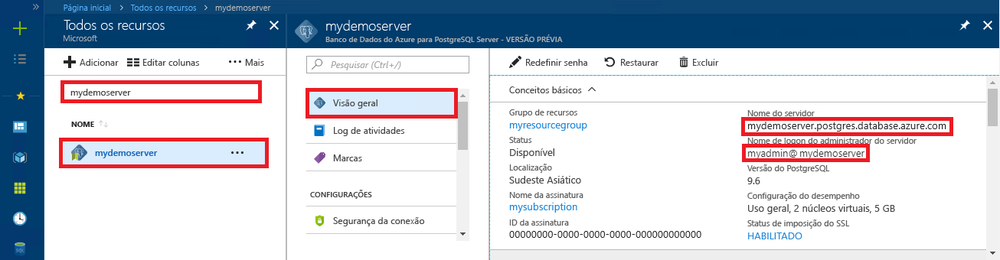

# <a name="azure-database-for-postgresql-use-go-language-to-connect-and-query-data"></a>Banco de dados do Azure para PostgreSQL: usar a linguagem Go para se conectar e consultar dados
Este guia de início rápido demonstra como se conectar a um banco de dados do Azure para PostgreSQL usando código escrito na linguagem [Go](https://golang.org/) (golang). Ele mostra como usar instruções SQL para consultar, inserir, atualizar e excluir dados no banco de dados. Este artigo pressupõem que você está familiarizado com o desenvolvimento usando Go, mas que começou recentemente a trabalhar com o Banco de Dados do Azure para PostgreSQL.

## <a name="prerequisites"></a>Pré-requisitos
Este guia de início rápido usa os recursos criados em um destes guias como ponto de partida:
- [Criar Banco de dados - Portal](quickstart-create-server-database-portal.md)
- [Criar Banco de dados - CLI do Azure](quickstart-create-server-database-azure-cli.md)

## <a name="install-go-and-pq-connector"></a>Instalar o conector pq e o Go
Instale o [Go](https://golang.org/doc/install) e o [driver de Postgres Go puro(pq)](https://github.com/lib/pq) em seu próprio computador. Dependendo da sua plataforma, siga as etapas apropriadas:

### <a name="windows"></a>Windows
1. [Baixe](https://golang.org/dl/) e instale o Go para Microsoft Windows de acordo com as [instruções de instalação](https://golang.org/doc/install).
2. Inicie o prompt de comando no menu Iniciar.
3. Crie uma pasta para o seu projeto, como `mkdir  %USERPROFILE%\go\src\postgresqlgo`.
4. Altere o diretório na pasta do projeto, como `cd %USERPROFILE%\go\src\postgresqlgo`.
5. Defina a variável de ambiente para GOPATH apontar para o diretório de código de origem. `set GOPATH=%USERPROFILE%\go`.
6. Instale o [driver de Postgres Go puro (pq)](https://github.com/lib/pq) executando o comando `go get github.com/lib/pq`.

   Em resumo, instale o Go e execute esses comandos no prompt de comando:
   ```cmd
   mkdir  %USERPROFILE%\go\src\postgresqlgo
   cd %USERPROFILE%\go\src\postgresqlgo
   set GOPATH=%USERPROFILE%\go
   go get github.com/lib/pq
   ```

### <a name="linux-ubuntu"></a>Linux (Ubuntu)
1. Abra o shell do Bash. 
2. Instale o Go executando `sudo apt-get install golang-go`.
3. Crie uma pasta para o seu projeto em seu diretório inicial, como `mkdir -p ~/go/src/postgresqlgo/`.
4. Altere o diretório na pasta, como `cd ~/go/src/postgresqlgo/`.
5. Defina a variável de ambiente GOPATH para apontar para um diretório de origem válido, como a pasta atual inicial do diretório do Go. No shell bash, execute `export GOPATH=~/go` para adicionar o diretório do Go como GOPATH para a sessão atual do shell.
6. Instale o [driver de Postgres Go puro (pq)](https://github.com/lib/pq) executando o comando `go get github.com/lib/pq`.

   Em resumo, execute estes comandos bash:
   ```bash
   sudo apt-get install golang-go
   mkdir -p ~/go/src/postgresqlgo/
   cd ~/go/src/postgresqlgo/
   export GOPATH=~/go/
   go get github.com/lib/pq
   ```

### <a name="apple-macos"></a>Apple macOS
1. Baixe e instale o Go de acordo com as [instruções de instalação](https://golang.org/doc/install) correspondentes à plataforma. 
2. Abra o shell do Bash. 
3. Crie uma pasta para o seu projeto em seu diretório inicial, como `mkdir -p ~/go/src/postgresqlgo/`.
4. Altere o diretório na pasta, como `cd ~/go/src/postgresqlgo/`.
5. Defina a variável de ambiente GOPATH para apontar para um diretório de origem válido, como a pasta atual inicial do diretório do Go. No shell bash, execute `export GOPATH=~/go` para adicionar o diretório do Go como GOPATH para a sessão atual do shell.
6. Instale o [driver de Postgres Go puro (pq)](https://github.com/lib/pq) executando o comando `go get github.com/lib/pq`.

   Em resumo, instale o Go e, em seguida, execute esses comandos bash:
   ```bash
   mkdir -p ~/go/src/postgresqlgo/
   cd ~/go/src/postgresqlgo/
   export GOPATH=~/go/
   go get github.com/lib/pq
   ```

## <a name="get-connection-information"></a>Obter informações de conexão
Obtenha as informações de conexão necessárias para se conectar ao Banco de Dados do Azure para PostgreSQL. Você precisa das credenciais de logon e do nome do servidor totalmente qualificado.

1. Faça logon no [Portal do Azure](https://portal.azure.com/).
2. No menu à esquerda no Portal do Azure, clique em **Todos os recursos** e pesquise pelo servidor que você criou, como **mypgserver-20170401**.
3. Clique no nome do servidor **mypgserver-20170401**.
4. Selecione a página **Visão geral** do servidor. Anote o **Nome do servidor** e o **Nome de logon de administrador do servidor**.
 
5. Se você se esquecer das informações de logon do servidor, navegue até a página **Visão Geral** para exibir o nome de logon do Administrador do servidor. Se necessário, redefina a senha.

## <a name="build-and-run-go-code"></a>Compilar e executar o código Go 
1. Para escrever código Golang, você pode usar um editor de texto sem formatação, como o Bloco de Notas no Microsoft Windows, [vi](http://manpages.ubuntu.com/manpages/xenial/man1/nvi.1.html#contenttoc5) ou [Nano](https://www.nano-editor.org/) no Ubuntu ou TextEdit no macOS. Se você preferir IDE (Ambiente de Desenvolvimento Integrado) mais avançado, experimente o [Gogland](https://www.jetbrains.com/go/) da Jetbrains, o [Visual Studio Code](https://code.visualstudio.com/) da Microsoft ou o [Atom](https://atom.io/).
2. Cole o código Golang das seções a seguir em arquivos de texto e salve-os em sua pasta de projeto com a extensão de arquivo \*.go, como caminho do Windows `%USERPROFILE%\go\src\postgresqlgo\createtable.go` ou caminho do Linux `~/go/src/postgresqlgo/createtable.go`.
3. Localize as constantes `HOST`, `DATABASE`, `USER`, e `PASSWORD` no código e substitua os valores de exemplo com seus próprios valores.  
4. Inicie o prompt de comando ou shell Bash. Altere o diretório na pasta do seu projeto. Por exemplo, no Windows `cd %USERPROFILE%\go\src\postgresqlgo\`. No Linux `cd ~/go/src/postgresqlgo/`. Alguns dos ambientes IDE mencionados oferecem recursos de depuração e tempo de execução sem a necessidade de comandos do shell.
5. Execute o código, digitando o comando `go run createtable.go` para compilar o aplicativo e executá-lo. 
6. Como alternativa, para compilar o código em um aplicativo nativo, `go build createtable.go`, inicie `createtable.exe` para executar o aplicativo.

## <a name="connect-and-create-a-table"></a>Conectar-se e criar uma tabela
Use o código a seguir para se conectar e criar uma tabela usando a instrução SQL **CREATE TABLE**, seguida por instruções SQL **INSERT INTO** para adicionar linhas à tabela.

O código importa três pacotes: o [pacote sql](https://golang.org/pkg/database/sql/), o [pacote pq](http://godoc.org/github.com/lib/pq) como um driver para se comunicar com o servidor PostgreSQL e o [pacote fmt](https://golang.org/pkg/fmt/) para entrada e saída impressa na linha de comando.

O código chama o método [sql. Open ()](http://godoc.org/github.com/lib/pq#Open) para se conectar ao Banco de Dados do Azure para PostgreSQL e verifica a conexão usando o método [db.Ping()](https://golang.org/pkg/database/sql/#DB.Ping). Um [identificador de banco de dados](https://golang.org/pkg/database/sql/#DB) é usado em todo o processo, mantendo o pool de conexão para o servidor de banco de dados. O código chama o método [Exec()](https://golang.org/pkg/database/sql/#DB.Exec) várias vezes para executar vários comandos SQL. Sempre que um método personalizado checkError() verificar se ocorreu um erro e for necessário sair em caso de erro.

Substitua os parâmetros `HOST`, `DATABASE`, `USER`, e `PASSWORD` pelos seus próprios valores. 

```go
package main

import (
    "database/sql"
    "fmt"
    _ "github.com/lib/pq"
)

const (
    // Initialize connection constants.
    HOST     = "mypgserver-20170401.postgres.database.azure.com"
    DATABASE = "mypgsqldb"
    USER     = "mylogin@mypgserver-20170401"
    PASSWORD = "<server_admin_password>"
)

func checkError(err error) {
    if err != nil {
        panic(err)
    }
}

func main() {
    // Initialize connection string.
    var connectionString string = fmt.Sprintf("host=%s user=%s password=%s dbname=%s sslmode=require", HOST, USER, PASSWORD, DATABASE)

    // Initialize connection object.
    db, err := sql.Open("postgres", connectionString)
    checkError(err)

    err = db.Ping()
    checkError(err)
    fmt.Println("Successfully created connection to database")

    // Drop previous table of same name if one exists.
    _, err = db.Exec("DROP TABLE IF EXISTS inventory;")
    checkError(err)
    fmt.Println("Finished dropping table (if existed)")

    // Create table.
    _, err = db.Exec("CREATE TABLE inventory (id serial PRIMARY KEY, name VARCHAR(50), quantity INTEGER);")
    checkError(err)
    fmt.Println("Finished creating table")

    // Insert some data into table.
    sql_statement := "INSERT INTO inventory (name, quantity) VALUES ($1, $2);"
    _, err = db.Exec(sql_statement, "banana", 150)
    checkError(err)
    _, err = db.Exec(sql_statement, "orange", 154)
    checkError(err)
    _, err = db.Exec(sql_statement, "apple", 100)
    checkError(err)
    fmt.Println("Inserted 3 rows of data")
}
```

## <a name="read-data"></a>Ler dados
Use o código a seguir para conectar-se e ler os dados usando uma instrução SQL **SELECT**. 

O código importa três pacotes: o [pacote sql](https://golang.org/pkg/database/sql/), o [pacote pq](http://godoc.org/github.com/lib/pq) como um driver para se comunicar com o servidor PostgreSQL e o [pacote fmt](https://golang.org/pkg/fmt/) para entrada e saída impressa na linha de comando.

O código chama o método [sql. Open ()](http://godoc.org/github.com/lib/pq#Open) para se conectar ao Banco de Dados do Azure para PostgreSQL e verifica a conexão usando o método [db.Ping()](https://golang.org/pkg/database/sql/#DB.Ping). Um [identificador de banco de dados](https://golang.org/pkg/database/sql/#DB) é usado em todo o processo, mantendo o pool de conexão para o servidor de banco de dados. A consulta select é executada chamando o método [db.Query()](https://golang.org/pkg/database/sql/#DB.Query), e as linhas resultantes são mantidas em uma variável do tipo [linhas](https://golang.org/pkg/database/sql/#Rows). O código lê a coluna de valores de dados na linha atual usando o método [rows.Scan()](https://golang.org/pkg/database/sql/#Rows.Scan) e loops em relação às linhas usando o iterador [rows.Next ()](https://golang.org/pkg/database/sql/#Rows.Next) até que não haja mais linhas. Os valores de coluna de cada linha são impressos no console de saída. A cada ocorrência, um método personalizado checkError() é usado para verificar se ocorreu um erro e se é necessário sair em caso de erro.

Substitua os parâmetros `HOST`, `DATABASE`, `USER`, e `PASSWORD` pelos seus próprios valores. 

```go
package main

import (
    "database/sql"
    "fmt"
    _ "github.com/lib/pq"
)

const (
    // Initialize connection constants.
    HOST     = "mypgserver-20170401.postgres.database.azure.com"
    DATABASE = "mypgsqldb"
    USER     = "mylogin@mypgserver-20170401"
    PASSWORD = "<server_admin_password>"
)

func checkError(err error) {
    if err != nil {
        panic(err)
    }
}

func main() {

    // Initialize connection string.
    var connectionString string = fmt.Sprintf("host=%s user=%s password=%s dbname=%s sslmode=require", HOST, USER, PASSWORD, DATABASE)

    // Initialize connection object.
    db, err := sql.Open("postgres", connectionString)
    checkError(err)

    err = db.Ping()
    checkError(err)
    fmt.Println("Successfully created connection to database")

    // Read rows from table.
    var id int
    var name string
    var quantity int

    sql_statement := "SELECT * from inventory;"
    rows, err := db.Query(sql_statement)
    checkError(err)

    for rows.Next() {
        switch err := rows.Scan(&id, &name, &quantity); err {
        case sql.ErrNoRows:
            fmt.Println("No rows were returned")
        case nil:
            fmt.Printf("Data row = (%d, %s, %d)\n", id, name, quantity)
        default:
            checkError(err)
        }
    }
}
```

## <a name="update-data"></a>Atualizar dados
Use o código a seguir para conectar-se e atualizar os dados usando uma instrução SQL **UPDATE**.

O código importa três pacotes: o [pacote sql](https://golang.org/pkg/database/sql/), o [pacote pq](http://godoc.org/github.com/lib/pq) como driver para se comunicar com o servidor Postgres e o [fmt pacote](https://golang.org/pkg/fmt/) para impressão de entrada e saída na linha de comando.

O código chama o método [sql. Open ()](http://godoc.org/github.com/lib/pq#Open) para se conectar ao Banco de Dados do Azure para PostgreSQL e verifica a conexão usando o método [db.Ping()](https://golang.org/pkg/database/sql/#DB.Ping). Um [identificador de banco de dados](https://golang.org/pkg/database/sql/#DB) é usado em todo o processo, mantendo o pool de conexão para o servidor de banco de dados. O código chama o método [Exec()](https://golang.org/pkg/database/sql/#DB.Exec) para executar a instrução SQL que atualiza a tabela. Um método personalizado checkError() é usado para verificar se ocorreu um erro e se é necessário sair em caso de erro.

Substitua os parâmetros `HOST`, `DATABASE`, `USER`, e `PASSWORD` pelos seus próprios valores. 
```go
package main

import (
  "database/sql"
  _ "github.com/lib/pq"
  "fmt"
)

const (
    // Initialize connection constants.
    HOST     = "mypgserver-20170401.postgres.database.azure.com"
    DATABASE = "mypgsqldb"
    USER     = "mylogin@mypgserver-20170401"
    PASSWORD = "<server_admin_password>"
)

func checkError(err error) {
    if err != nil {
        panic(err)
    }
}

func main() {
    
    // Initialize connection string.
    var connectionString string = 
        fmt.Sprintf("host=%s user=%s password=%s dbname=%s sslmode=require", HOST, USER, PASSWORD, DATABASE)

    // Initialize connection object.
    db, err := sql.Open("postgres", connectionString)
    checkError(err)

    err = db.Ping()
    checkError(err)
    fmt.Println("Successfully created connection to database")

    // Modify some data in table.
    sql_statement := "UPDATE inventory SET quantity = $2 WHERE name = $1;"
    _, err = db.Exec(sql_statement, "banana", 200)
    checkError(err)
    fmt.Println("Updated 1 row of data")
}
```

## <a name="delete-data"></a>Excluir dados
Use o código a seguir para conectar-se e excluir os dados usando uma instrução SQL **DELETE**. 

O código importa três pacotes: o [pacote sql](https://golang.org/pkg/database/sql/), o [pacote pq](http://godoc.org/github.com/lib/pq) como driver para se comunicar com o servidor Postgres e o [fmt pacote](https://golang.org/pkg/fmt/) para impressão de entrada e saída na linha de comando.

O código chama o método [sql. Open ()](http://godoc.org/github.com/lib/pq#Open) para se conectar ao Banco de Dados do Azure para PostgreSQL e verifica a conexão usando o método [db.Ping()](https://golang.org/pkg/database/sql/#DB.Ping). Um [identificador de banco de dados](https://golang.org/pkg/database/sql/#DB) é usado em todo o processo, mantendo o pool de conexão para o servidor de banco de dados. O código chama o método [Exec()](https://golang.org/pkg/database/sql/#DB.Exec) para executar a instrução SQL que exclui uma linha da tabela. Um método personalizado checkError() é usado para verificar se ocorreu um erro e se é necessário sair em caso de erro.

Substitua os parâmetros `HOST`, `DATABASE`, `USER`, e `PASSWORD` pelos seus próprios valores. 
```go
package main

import (
  "database/sql"
  _ "github.com/lib/pq"
  "fmt"
)

const (
    // Initialize connection constants.
    HOST     = "mypgserver-20170401.postgres.database.azure.com"
    DATABASE = "mypgsqldb"
    USER     = "mylogin@mypgserver-20170401"
    PASSWORD = "<server_admin_password>"
)

func checkError(err error) {
    if err != nil {
        panic(err)
    }
}

func main() {
    
    // Initialize connection string.
    var connectionString string = 
        fmt.Sprintf("host=%s user=%s password=%s dbname=%s sslmode=require", HOST, USER, PASSWORD, DATABASE)

    // Initialize connection object.
    db, err := sql.Open("postgres", connectionString)
    checkError(err)

    err = db.Ping()
    checkError(err)
    fmt.Println("Successfully created connection to database")

    // Delete some data from table.
    sql_statement := "DELETE FROM inventory WHERE name = $1;"
    _, err = db.Exec(sql_statement, "orange")
    checkError(err)
    fmt.Println("Deleted 1 row of data")
}
```

## <a name="next-steps"></a>Próximas etapas
> [!div class="nextstepaction"]
> [Migre seu banco de dados usando Exportar e Importar](./howto-migrate-using-export-and-import.md)
