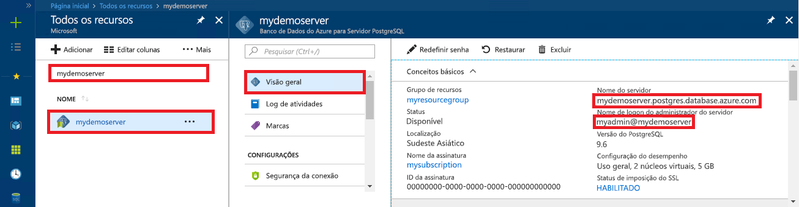

# Banco de dados do Azure para PostgreSQL: usar Node.js para se conectar e consultar dados
<a id="azure-database-for-postgresql-use-nodejs-to-connect-and-query-data" class="xliff"></a>
Este guia de início rápido demonstra como se conectar a um Banco de Dados do Azure para PostgreSQL usando [Node.js](https://nodejs.org/) de plataformas Mac, Ubuntu Linux e Windows. Ele mostra como usar instruções SQL para consultar, inserir, atualizar e excluir dados no banco de dados. As etapas neste artigo pressupõem que você esteja familiarizado com o desenvolvimento usando o Node.js e que começou recentemente a trabalhar com o Banco de Dados do Azure para PostgreSQL.

## Pré-requisitos
<a id="prerequisites" class="xliff"></a>
Este guia de início rápido usa os recursos criados em um destes guias como ponto de partida:
- [Criar Banco de dados - Portal](quickstart-create-server-database-portal.md)
- [Criar Banco de dados - CLI](quickstart-create-server-database-azure-cli.md)

Você também precisará:
- Instale o [Node.js](https://nodejs.org)
- Instalar o pacote [pg](https://www.npmjs.com/package/pg). 

## Instalar o Node. js
<a id="install-nodejs" class="xliff"></a> 
Dependendo da sua plataforma, para instalar o Node.js:

### **Mac OS**
<a id="mac-os" class="xliff"></a>
Insira os seguintes comandos para instalar **brew**, um gerenciador de pacotes fácil de usar para Mac OS X e **Node. js**.

```bash
ruby -e "$(curl -fsSL https://raw.githubusercontent.com/Homebrew/install/master/install)"
brew install node
```

### **Linux (Ubuntu)**
<a id="linux-ubuntu" class="xliff"></a>
Insira os seguintes comandos para instalar **Node.js** e o gerenciador de pacotes **npm** para Node.js.

```bash
sudo apt-get install -y nodejs npm
```

### **Windows**
<a id="windows" class="xliff"></a>
Visite o [página de downloads do Node. js](https://nodejs.org/en/download/) e selecione a opção do Windows Installer desejada.

## Instalar o cliente pg
<a id="install-pg-client" class="xliff"></a>
Instalar [pg](https://www.npmjs.com/package/pg), que é um cliente JavaScript puro sem bloqueio para Node.js, é útil para se conectar e consultar PostgreSQL.

Para fazer isso, execute o npm (gerenciador de pacotes de nó) para JavaScript na linha de comando para instalar o cliente pg.
```bash
npm install pg
```

Verifique a instalação listando os pacotes instalados.
```bash
npm list
```
A saída da lista confirma a versão de cada componente. 
```
`-- pg@6.2.3
  +-- buffer-writer@1.0.1
  +-- packet-reader@0.3.1
etc...
```

## Obter informações de conexão
<a id="get-connection-information" class="xliff"></a>
Obtenha as informações de conexão necessárias para se conectar ao Banco de Dados do Azure para PostgreSQL. Você precisa das credenciais de logon e do nome do servidor totalmente qualificado.

1. Faça logon no [Portal do Azure](https://portal.azure.com/).
2. No menu à esquerda no Portal do Azure, clique em **Todos os recursos** e pesquise pelo servidor que você acabou de criar **mypgserver-20170401**.
3. Clique no nome do servidor **mypgserver-20170401**.
4. Selecione a página **Visão geral** do servidor. Anote o **Nome do servidor** e o **Nome de logon de administrador do servidor**.
 
5. Se você se esquecer das informações de logon do servidor, navegue até a página **Visão Geral** para exibir o nome de logon do Administrador do servidor e, se necessário, redefinir a senha.

## Executar o código JavaScript no Node.js
<a id="running-the-javascript-code-in-nodejs" class="xliff"></a>
Você pode iniciar o shell bash Node.js ou o prompt de comando do Windows digitando `node` e executar o exemplo de código JavaScript interativamente copiando-o e colando-o no prompt. Como alternativa, você pode salvar o código JavaScript em um arquivo de texto e iniciar `node filename.js` com o nome do arquivo como um parâmetro para executá-lo.

## Conectar-se, criar tabela e inserir dados
<a id="connect-create-table-and-insert-data" class="xliff"></a>
Use o código a seguir para se conectar e carregar os dados usando instruções SQL **CREATE TABLE** e **INSERT INTO**.
O objeto [pg. Client](https://github.com/brianc/node-postgres/wiki/Client) é usado para se comunicar com o servidor PostgreSQL. A função [pg. Client.Connect()](https://github.com/brianc/node-postgres/wiki/Client#method-connect) é usada para estabelecer conexão com o servidor. A função [pg.Client.Query()](https://github.com/brianc/node-postgres/wiki/Query) é usada para executar a consulta SQL no banco de dados PostgreSQL. 

Substitua os parâmetros host, dbname, user e password pelos valores que você especificou ao criar o servidor e o banco de dados. 

```javascript
const pg = require('pg');

var config =
{
    host: 'mypgserver-20170401.postgres.database.azure.com',
    user: 'mylogin@mypgserver-20170401',
    password: '<server_admin_password>',
    database: 'mypgsqldb',
    port: 5432,
    ssl: true
};

const client = new pg.Client(config);

client.connect(function (err)
{
    if (err)
        throw err;
    else
    {
        queryDatabase();
    }
});

function queryDatabase()
{
    client.query(
        ' \
            DROP TABLE IF EXISTS inventory; \
            CREATE TABLE inventory (id serial PRIMARY KEY, name VARCHAR(50), quantity INTEGER); \
            INSERT INTO inventory (name, quantity) VALUES (\'banana\', 150); \
            INSERT INTO inventory (name, quantity) VALUES (\'orange\', 154); \
            INSERT INTO inventory (name, quantity) VALUES (\'apple\', 100); \
        ',
        function (err)
    {
        console.log("Connection established");

        if (err)
            throw err;
        else
        {
            client.end(function (err)
            {
                if (err)
                    throw err;

                // Else closing connection finished without error
                console.log("Closed client connection");
            });

            console.log("Finished execution, exiting now");
            process.exit()
        }
    });
}
```

## Ler dados
<a id="read-data" class="xliff"></a>
Use o código a seguir para conectar-se e ler os dados usando uma instrução SQL **SELECT**. O objeto [pg. Client](https://github.com/brianc/node-postgres/wiki/Client) é usado para se comunicar com o servidor PostgreSQL. A função [pg. Client.Connect()](https://github.com/brianc/node-postgres/wiki/Client#method-connect) é usada para estabelecer conexão com o servidor. A função [pg.Client.Query()](https://github.com/brianc/node-postgres/wiki/Query) é usada para executar a consulta SQL no banco de dados PostgreSQL. 

Substitua os parâmetros host, dbname, user e password pelos valores que você especificou ao criar o servidor e o banco de dados. 

```javascript
const pg = require('pg');

var config =
{
    host: 'mypgserver-20170401.postgres.database.azure.com',
    user: 'mylogin@mypgserver-20170401',
    password: '<server_admin_password>',
    database: 'mypgsqldb',
    port: 5432,
    ssl: true
};


const client = new pg.Client(config);

client.connect(function (err)
{
    if (err)
        throw err;

    else
    {
        console.log("Connected to Azure Database for PostgreSQL server:" + config.host);
        queryDatabase();
    }
});

function queryDatabase()
{
    // Declare array to hold query result set
    const results = [];

    console.log("Running query to PostgreSQL server:" + config.host);

    // Perform query
    var query = client.query('SELECT * FROM inventory;');

    // Print result set
    query.on('row', function(row)
    {
        console.log("Read " + JSON.stringify(row));
    });

    // Exit program after execution
    query.on('end', function(row)
    {
        console.log("Finished execution, exiting now");
        process.exit()
    });
}
```

## Atualizar dados
<a id="update-data" class="xliff"></a>
Use o código a seguir para conectar-se e ler os dados usando uma instrução SQL **UPDATE**. O objeto [pg. Client](https://github.com/brianc/node-postgres/wiki/Client) é usado para se comunicar com o servidor PostgreSQL. A função [pg. Client.Connect()](https://github.com/brianc/node-postgres/wiki/Client#method-connect) é usada para estabelecer conexão com o servidor. A função [pg.Client.Query()](https://github.com/brianc/node-postgres/wiki/Query) é usada para executar a consulta SQL no banco de dados PostgreSQL. 

Substitua os parâmetros host, dbname, user e password pelos valores que você especificou ao criar o servidor e o banco de dados. 

```javascript
const pg = require('pg');

var config =
{
    host: 'mypgserver-20170401.postgres.database.azure.com',
    user: 'mylogin@mypgserver-20170401',
    password: '<server_admin_password>',
    database: 'mypgsqldb',
    port: 5432,
    ssl: true
};

const client = new pg.Client(config);

client.connect(function (err)
{
    if (err)
        throw err;
    else
    {
        queryDatabase();
    }   
});

function queryDatabase()
{
    client.query('UPDATE inventory SET quantity= 1000 WHERE name=\'banana\';', function (err, result)
    {
        console.log("Connection established");

        if (err)
            throw err;
        else
        {
            client.end(function (err)
            {
                if (err)
                    throw err;
                
                // Else closing connection finished without error
                console.log("Closed client connection");
            });             
        }

        console.log("Finished execution, exiting now");
        process.exit()
    });
}
```

## Excluir dados
<a id="delete-data" class="xliff"></a>
Use o código a seguir para conectar-se e ler os dados usando uma instrução SQL **DELETE**. O objeto [pg. Client](https://github.com/brianc/node-postgres/wiki/Client) é usado para se comunicar com o servidor PostgreSQL. A função [pg. Client.Connect()](https://github.com/brianc/node-postgres/wiki/Client#method-connect) é usada para estabelecer conexão com o servidor. A função [pg.Client.Query()](https://github.com/brianc/node-postgres/wiki/Query) é usada para executar a consulta SQL no banco de dados PostgreSQL. 

Substitua os parâmetros host, dbname, user e password pelos valores que você especificou ao criar o servidor e o banco de dados. 

```javascript
const pg = require('pg');

var config =
{
    host: 'mypgserver-20170401.postgres.database.azure.com',
    user: 'mylogin@mypgserver-20170401',
    password: '<server_admin_password>',
    database: 'mypgsqldb',
    port: 5432,
    ssl: true
};

const client = new pg.Client(config);

client.connect(function (err)
{
    if (err)
        throw err;
    else
    {
        queryDatabase();
    }   
});

function queryDatabase()
{
    client.query('DELETE FROM inventory WHERE name=\'apple\';', function (err, result)
    {
        console.log("Connection established");
        
        if (err)
            throw err;
        else
        {
            client.end(function (err)
            {
                if (err)
                    throw err;
                
                // Else closing connection finished without error
                console.log("Closed client connection");
            });

            console.log("Finished execution, exiting now");
            process.exit()          
        }
    }); 
}
```

## Próximas etapas
<a id="next-steps" class="xliff"></a>
> [!div class="nextstepaction"]
> [Migre seu banco de dados usando Exportar e Importar](./howto-migrate-using-export-and-import.md)

