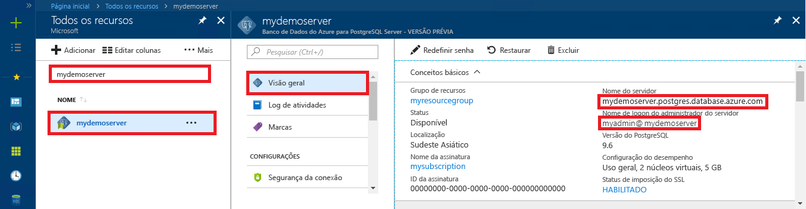

# Banco de dados do Azure para PostgreSQL: usar PHP para se conectar e consultar dados
<a id="azure-database-for-postgresql-use-php-to-connect-and-query-data" class="xliff"></a>
Este guia de início rápido demonstra como se conectar a um banco de dados do Azure para PostgreSQL usando aplicativo [PHP](http://php.net/manual/intro-whatis.php). Ele mostra como usar instruções SQL para consultar, inserir, atualizar e excluir dados no banco de dados. Este artigo pressupõem que você está familiarizado com o desenvolvimento usando PHP, mas que começou recentemente a trabalhar com o Banco de Dados do Azure para PostgreSQL.

## Pré-requisitos
<a id="prerequisites" class="xliff"></a>
Este guia de início rápido usa os recursos criados em um destes guias como ponto de partida:
- [Criar Banco de dados - Portal](quickstart-create-server-database-portal.md)
- [Criar Banco de dados - CLI do Azure](quickstart-create-server-database-azure-cli.md)

## Instalar o PHP
<a id="install-php" class="xliff"></a>
Instalar o PHP em seu próprio servidor ou crie um [aplicativo Web](https://docs.microsoft.com/en-us/azure/app-service-web/app-service-web-overview) do Azure que inclua o PHP.

### Windows
<a id="windows" class="xliff"></a>
- Baixar o [PHP 7.1.4 versão protegida não thread (x64)](http://windows.php.net/download#php-7.1)
- Instalar o PHP e consultar o [manual do PHP](http://php.net/manual/install.windows.php) para outras configurações
- O código usa a classe **pgsql** (ext/php_pgsql.dll) que está incluída na instalação do PHP. 
- Habilitou a extensão **pgsql** editando o arquivo de configuração php.ini, geralmente localizado em `C:\Program Files\PHP\v7.1\php.ini`. O arquivo de configuração deve conter uma linha com o texto `extension=php_pgsql.so`. Se não for exibido, adicione o texto e salve o arquivo. Se o texto estiver presente, mas comentado com um prefixo de ponto e vírgula, remova a marca de comentário do texto removendo o ponto e vírgula.

### Linux (Ubuntu)
<a id="linux-ubuntu" class="xliff"></a>
- Baixar o [PHP 7.1.4 versão protegida não thread (x64)](http://php.net/downloads.php) 
- Instalar o PHP e consultar o [manual do PHP](http://php.net/manual/install.unix.php) para outras configurações
- O código usa a classe **pgsql** (php_pgsql.so). Instale-a executando `sudo apt-get install php-pgsql`.
- Habilitou a extensão **pgsql** editando o arquivo de configuração `/etc/php/7.0/mods-available/pgsql.ini`. O arquivo de configuração deve conter uma linha com o texto `extension=php_pgsql.so`. Se não for exibido, adicione o texto e salve o arquivo. Se o texto estiver presente, mas comentado com um prefixo de ponto e vírgula, remova a marca de comentário do texto removendo o ponto e vírgula.

### MacOS
<a id="macos" class="xliff"></a>
- Baixar o [PHP 7.1.4 versão](http://php.net/downloads.php)
- Instalar o PHP e consultar o [manual do PHP](http://php.net/manual/install.macosx.php) para outras configurações

## Obter informações de conexão
<a id="get-connection-information" class="xliff"></a>
Obtenha as informações de conexão necessárias para se conectar ao Banco de Dados do Azure para PostgreSQL. Você precisa das credenciais de logon e do nome do servidor totalmente qualificado.

1. Faça logon no [Portal do Azure](https://portal.azure.com/).
2. No menu à esquerda no Portal do Azure, clique em **Todos os recursos** e pesquise pelo servidor que você criou, como **mypgserver-20170401**.
3. Clique no nome do servidor **mypgserver-20170401**.
4. Selecione a página **Visão geral** do servidor. Anote o **Nome do servidor** e o **Nome de logon de administrador do servidor**.
 
5. Se você se esquecer das informações de logon do servidor, navegue até a página **Visão Geral** para exibir o nome de logon do Administrador do servidor e, se necessário, redefinir a senha.

## Conectar-se e criar uma tabela
<a id="connect-and-create-a-table" class="xliff"></a>
Use o código a seguir para se conectar e criar uma tabela usando a instrução SQL **CREATE TABLE**, seguida por instruções SQL **INSERT INTO** para adicionar linhas à tabela.

O método de chamada de código [pg_connect()](http://php.net/manual/en/function.pg-connect.php) para se conectar ao Banco de Dados do Azure para PostgreSQL. Em seguida, ele chama o método [pg_query()](http://php.net/manual/en/function.pg-query.php) várias vezes para executar vários comandos e [pg_last_error()](http://php.net/manual/en/function.pg-last-error.php) para verificar os detalhes em caso de erro. Em seguida, ele chama o método [pg_close()](http://php.net/manual/en/function.pg-close.php) para fechar a conexão.

Substitua os parâmetros `$host`, `$database`, `$user` e `$password` pelos seus próprios valores. 

```php
<?php
    // Initialize connection variables.
    $host = "mypgserver-20170401.postgres.database.azure.com";
    $database = "mypgsqldb";
    $user = "mylogin@mypgserver-20170401";
    $password = "<server_admin_password>";

    // Initialize connection object.
    $connection = pg_connect("host=$host dbname=$database user=$user password=$password") 
        or die("Failed to create connection to database: ". pg_last_error(). "<br/>");
    print "Successfully created connection to database.<br/>";

    // Drop previous table of same name if one exists.
    $query = "DROP TABLE IF EXISTS inventory;";
    pg_query($connection, $query) 
        or die("Encountered an error when executing given sql statement: ". pg_last_error(). "<br/>");
    print "Finished dropping table (if existed).<br/>";

    // Create table.
    $query = "CREATE TABLE inventory (id serial PRIMARY KEY, name VARCHAR(50), quantity INTEGER);";
    pg_query($connection, $query) 
        or die("Encountered an error when executing given sql statement: ". pg_last_error(). "<br/>");
    print "Finished creating table.<br/>";

    // Insert some data into table.
    $name = '\'banana\'';
    $quantity = 150;
    $query = "INSERT INTO inventory (name, quantity) VALUES ($1, $2);";
    pg_query($connection, $query) 
        or die("Encountered an error when executing given sql statement: ". pg_last_error(). "<br/>");

    $name = '\'orange\'';
    $quantity = 154;
    $query = "INSERT INTO inventory (name, quantity) VALUES ($name, $quantity);";
    pg_query($connection, $query) 
        or die("Encountered an error when executing given sql statement: ". pg_last_error(). "<br/>");

    $name = '\'apple\'';
    $quantity = 100;
    $query = "INSERT INTO inventory (name, quantity) VALUES ($name, $quantity);";
    pg_query($connection, $query) 
        or die("Encountered an error when executing given sql statement: ". pg_last_error()). "<br/>";

    print "Inserted 3 rows of data.<br/>";

    // Closing connection
    pg_close($connection);
?>
```

## Ler dados
<a id="read-data" class="xliff"></a>
Use o código a seguir para conectar-se e ler os dados usando uma instrução SQL **SELECT**. 

 O método de chamada de código [pg_connect()](http://php.net/manual/en/function.pg-connect.php) para se conectar ao Banco de Dados do Azure para PostgreSQL. Em seguida, ele chama o método [pg_query()](http://php.net/manual/en/function.pg-query.php) para executar o comando SELECT, mantendo os resultados em um conjunto de resultados, e [pg_last_error()](http://php.net/manual/en/function.pg-last-error.php) para verificar os detalhes em caso de erro.  Para ler o resultado definido, o método [pg_fetch_row()](http://php.net/manual/en/function.pg-fetch-row.php) é chamado em um loop, uma vez por linha, e a linha de dados é recuperada de uma matriz `$row`, com um valor de dados por coluna em cada posição de matriz.  Para liberar o resultado definido, o método [pg_free_result()](http://php.net/manual/en/function.pg-free-result.php) é chamado. Em seguida, ele chama o método [pg_close()](http://php.net/manual/en/function.pg-close.php) para fechar a conexão.

Substitua os parâmetros `$host`, `$database`, `$user` e `$password` pelos seus próprios valores. 

```php
<?php
    // Initialize connection variables.
    $host = "mypgserver-20170401.postgres.database.azure.com";
    $database = "mypgsqldb";
    $user = "mylogin@mypgserver-20170401";
    $password = "<server_admin_password>";
    
    // Initialize connection object.
    $connection = pg_connect("host=$host dbname=$database user=$user password=$password")
                or die("Failed to create connection to database: ". pg_last_error(). "<br/>");

    print "Successfully created connection to database. <br/>";

    // Perform some SQL queries over the connection.
    $query = "SELECT * from inventory";
    $result_set = pg_query($connection, $query) 
        or die("Encountered an error when executing given sql statement: ". pg_last_error(). "<br/>");
    while ($row = pg_fetch_row($result_set))
    {
        print "Data row = ($row[0], $row[1], $row[2]). <br/>";
    }

    // Free result_set
    pg_free_result($result_set);

    // Closing connection
    pg_close($connection);
?>
```

## Atualizar dados
<a id="update-data" class="xliff"></a>
Use o código a seguir para conectar-se e atualizar os dados usando uma instrução SQL **UPDATE**.

O método de chamada de código [pg_connect()](http://php.net/manual/en/function.pg-connect.php) para se conectar ao Banco de Dados do Azure para PostgreSQL. Em seguida, ele chama o método [pg_query()](http://php.net/manual/en/function.pg-query.php) para executar um comando e [pg_last_error()](http://php.net/manual/en/function.pg-last-error.php) para verificar os detalhes em caso de erro. Em seguida, ele chama o método [pg_close()](http://php.net/manual/en/function.pg-close.php) para fechar a conexão.

Substitua os parâmetros `$host`, `$database`, `$user` e `$password` pelos seus próprios valores. 

```php
<?php
    // Initialize connection variables.
    $host = "mypgserver-20170401.postgres.database.azure.com";
    $database = "mypgsqldb";
    $user = "mylogin@mypgserver-20170401";
    $password = "<server_admin_password>";

    // Initialize connection object.
    $connection = pg_connect("host=$host dbname=$database user=$user password=$password")
                or die("Failed to create connection to database: ". pg_last_error(). ".<br/>");

    print "Successfully created connection to database. <br/>";

    // Modify some data in table.
    $new_quantity = 200;
    $name = '\'banana\'';
    $query = "UPDATE inventory SET quantity = $new_quantity WHERE name = $name;";
    pg_query($connection, $query) 
        or die("Encountered an error when executing given sql statement: ". pg_last_error(). ".<br/>");
    print "Updated 1 row of data. </br>";

    // Closing connection
    pg_close($connection);
?>
```


## Excluir dados
<a id="delete-data" class="xliff"></a>
Use o código a seguir para conectar-se e ler os dados usando uma instrução SQL **DELETE**. 

 O método de chamada de código [pg_connect()](http://php.net/manual/en/function.pg-connect.php) para se conectar ao Banco de Dados do Azure para PostgreSQL. Em seguida, ele chama o método [pg_query()](http://php.net/manual/en/function.pg-query.php) para executar um comando e [pg_last_error()](http://php.net/manual/en/function.pg-last-error.php) para verificar os detalhes em caso de erro. Em seguida, ele chama o método [pg_close()](http://php.net/manual/en/function.pg-close.php) para fechar a conexão.

Substitua os parâmetros `$host`, `$database`, `$user` e `$password` pelos seus próprios valores. 

```php
<?php
    // Initialize connection variables.
    $host = "mypgserver-20170401.postgres.database.azure.com";
    $database = "mypgsqldb";
    $user = "mylogin@mypgserver-20170401";
    $password = "<server_admin_password>";

    // Initialize connection object.
    $connection = pg_connect("host=$host dbname=$database user=$user password=$password")
            or die("Failed to create connection to database: ". pg_last_error(). ". </br>");

    print "Successfully created connection to database. <br/>";

    // Delete some data from table.
    $name = '\'orange\'';
    $query = "DELETE FROM inventory WHERE name = $name;";
    pg_query($connection, $query) 
        or die("Encountered an error when executing given sql statement: ". pg_last_error(). ". <br/>");
    print "Deleted 1 row of data. <br/>";

    // Closing connection
    pg_close($connection);
?>
```

## Próximas etapas
<a id="next-steps" class="xliff"></a>
> [!div class="nextstepaction"]
> [Migre seu banco de dados usando Exportar e Importar](./howto-migrate-using-export-and-import.md)

