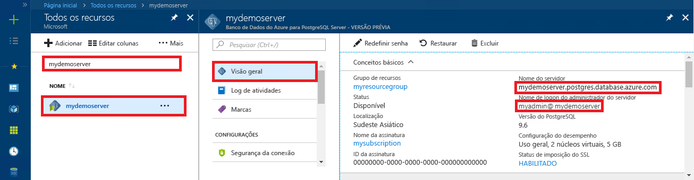

# Banco de dados do Azure para PostgreSQL: usar Python para se conectar e consultar dados
<a id="azure-database-for-postgresql-use-python-to-connect-and-query-data" class="xliff"></a>
Este guia de início rápido demonstra como usar o [Python](https://python.org) para se conectar a um banco de dados do Azure para PostgreSQL; em seguida, use instruções SQL para consultar, inserir, atualizar e excluir dados no banco de dados em plataformas Mac OS, Linux Ubuntu e Windows. As etapas neste artigo pressupõem que você está familiarizado com o desenvolvimento usando Python e que começou recentemente a trabalhar com o Banco de Dados do Azure para PostgreSQL.

## Pré-requisitos
<a id="prerequisites" class="xliff"></a>
Este guia de início rápido usa os recursos criados em um destes guias como ponto de partida:
- [Criar Banco de dados - Portal](quickstart-create-server-database-portal.md)
- [Criar Banco de dados - CLI](quickstart-create-server-database-azure-cli.md)

Você também precisará de:
- [Python](https://www.python.org/downloads/) instalado
- Pacote [pip](https://pip.pypa.io/en/stable/installing/) instalado (o pip já está instalado se você está usando binários Python 2 > = 2.7.9 ou Python 3 > = 3,4 baixados de [python.org](https://python.org), mas é necessário atualizar o pip).

## Instalar as bibliotecas de conexão do Python para PostgreSQL
<a id="install-the-python-connection-libraries-for-postgresql" class="xliff"></a>
Instalar o pacote [psycopg2](http://initd.org/psycopg/docs/install.html), que permite a conexão e a consulta ao banco de dados. psycopg2 está [disponível em PyPI](https://pypi.python.org/pypi/psycopg2/) na forma de pacotes [wheel](http://pythonwheels.com/) para as plataformas mais comuns (Linux, OSX, Windows) e, portanto, você pode usar instalação pip para obter a versão binária do módulo, incluindo todas as dependências:

```cmd
pip install psycopg2
```
Não deixe de usar uma versão atualizada do pip (você pode atualizá-lo usando algo como `pip install -U pip`)

## Obter informações de conexão
<a id="get-connection-information" class="xliff"></a>
Obtenha as informações de conexão necessárias para se conectar ao Banco de Dados do Azure para PostgreSQL. Você precisa das credenciais de logon e do nome do servidor totalmente qualificado.

1. Faça logon no [Portal do Azure](https://portal.azure.com/).
2. No menu à esquerda no Portal do Azure, clique em **Todos os recursos** e pesquise pelo servidor que você acabou de criar **mypgserver-20170401**.
3. Clique no nome do servidor **mypgserver-20170401**.
4. Selecione a página **Visão geral** do servidor. Anote o **Nome do servidor** e o **Nome de logon de administrador do servidor**.
 
5. Se você se esquecer das informações de logon do servidor, navegue até a página **Visão Geral** para exibir o nome de logon do Administrador do servidor e, se necessário, redefinir a senha.
   
## Conectar-se, criar tabela e inserir dados
<a id="connect-create-table-and-insert-data" class="xliff"></a>
Use o código a seguir para se conectar e carregar os dados usando a função [psycopg2.connect](http://initd.org/psycopg/docs/connection.html) com a instrução SQL **INSERT**. A função [cursor.execute](http://initd.org/psycopg/docs/cursor.html#execute) é usada para executar a consulta SQL no banco de dados PostgreSQL. Substitua os parâmetros host, dbname, user e password pelos valores que você especificou ao criar o servidor e o banco de dados.

```Python
import psycopg2

# Update connection string information obtained from the portal
host = "mypgserver-20170401.postgres.database.azure.com"
user = "mylogin@mypgserver-20170401"
dbname = "mypgsqldb"
password = "<server_admin_password>"

# Construct connection string
conn_string = "host={0} user={1} dbname={2} password={3}".format(host, user, dbname, password)
conn = psycopg2.connect(conn_string) 
print "Connection established"

cursor = conn.cursor()

# Drop previous table of same name if one exists
cursor.execute("DROP TABLE IF EXISTS inventory;")
print "Finished dropping table (if existed)"

# Create table
cursor.execute("CREATE TABLE inventory (id serial PRIMARY KEY, name VARCHAR(50), quantity INTEGER);")
print "Finished creating table"

# Insert some data into table
cursor.execute("INSERT INTO inventory (name, quantity) VALUES (%s, %s);", ("banana", 150))
cursor.execute("INSERT INTO inventory (name, quantity) VALUES (%s, %s);", ("orange", 154))
cursor.execute("INSERT INTO inventory (name, quantity) VALUES (%s, %s);", ("apple", 100))
print "Inserted 3 rows of data"

conn.commit()
```

## Ler dados
<a id="read-data" class="xliff"></a>
Use o código a seguir para ler os dados inseridos usando a função [cursor.execute](http://initd.org/psycopg/docs/cursor.html#execute) a instrução SQL **SELECT**. Essa função aceita uma consulta e retorna um conjunto de resultados que pode ser iterado com o uso de [cursor.fetchall()](http://initd.org/psycopg/docs/cursor.html#cursor.fetchall). Substitua os parâmetros host, dbname, user e password pelos valores que você especificou ao criar o servidor e o banco de dados.

```Python
import psycopg2

# Update connection string information obtained from the portal
host = "mypgserver-20170401.postgres.database.azure.com"
user = "mylogin@mypgserver-20170401"
dbname = "mypgsqldb"
password = "<server_admin_password>"

# Construct connection string
conn_string = "host={0} user={1} dbname={2} password={3}".format(host, user, dbname, password)
conn = psycopg2.connect(conn_string) 
print "Connection established"

cursor = conn.cursor()

# Fetch all rows from table
cursor.execute("SELECT * FROM inventory;")
rows = cursor.fetchall()

# Print all rows
for row in rows:
    print "Data row = (%s, %s, %s)" %(str(row[0]), str(row[1]), str(row[2]))

conn.commit()
```

## Atualizar dados
<a id="update-data" class="xliff"></a>
Use o código a seguir para atualizar a linha de inventário que você inseriu anteriormente usando a função [cursor.execute](http://initd.org/psycopg/docs/cursor.html#execute) com a instrução SQL **UPDATE**. Substitua os parâmetros host, dbname, user e password pelos valores que você especificou ao criar o servidor e o banco de dados.

```Python
import psycopg2

# Update connection string information obtained from the portal
host = "mypgserver-20170401.postgres.database.azure.com"
user = "mylogin@mypgserver-20170401"
dbname = "mypgsqldb"
password = "<server_admin_password>"

# Construct connection string
conn_string = "host={0} user={1} dbname={2} password={3}".format(host, user, dbname, password)
conn = psycopg2.connect(conn_string) 
print "Connection established"

cursor = conn.cursor()

# Update a data row in the table
cursor.execute("UPDATE inventory SET quantity = %s WHERE name = %s;", (200, "banana"))
print "Updated 1 row of data"

conn.commit()
```

## Excluir dados
<a id="delete-data" class="xliff"></a>
Use o código a seguir para excluir o item de inventário que você inseriu anteriormente usando a função [cursor.execute](http://initd.org/psycopg/docs/cursor.html#execute) com a instrução SQL **DELETE**. Substitua os parâmetros host, dbname, user e password pelos valores que você especificou ao criar o servidor e o banco de dados.

```Python
import psycopg2

# Update connection string information obtained from the portal
host = "mypgserver-20170401.postgres.database.azure.com"
user = "mylogin@mypgserver-20170401"
dbname = "mypgsqldb"
password = "<server_admin_password>"

# Construct connection string
conn_string = "host={0} user={1} dbname={2} password={3}".format(host, user, dbname, password)
conn = psycopg2.connect(conn_string) 
print "Connection established"

cursor = conn.cursor()

# Delete data row from table
cursor.execute("DELETE FROM inventory WHERE name = %s;", ("orange",))
print ("Deleted 1 row of data")

conn.commit()
```

## Próximas etapas
<a id="next-steps" class="xliff"></a>
> [!div class="nextstepaction"]
> [Migre seu banco de dados usando Exportar e Importar](./howto-migrate-using-export-and-import.md)

