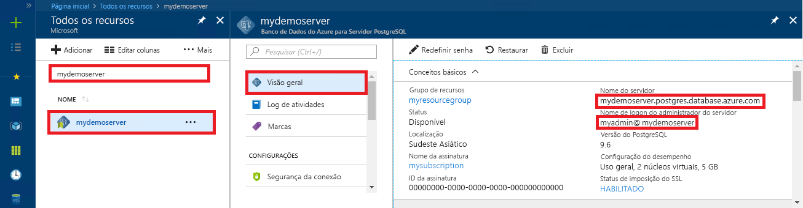

# <a name="azure-database-for-postgresql-use-ruby-to-connect-and-query-data"></a>Banco de dados do Azure para PostgreSQL: usar Ruby para se conectar e consultar dados
Este guia de início rápido demonstra como se conectar a um banco de dados do Azure para PostgreSQL usando aplicativo [Ruby](https://www.ruby-lang.org). Ele mostra como usar instruções SQL para consultar, inserir, atualizar e excluir dados no banco de dados. Este artigo pressupõem que você está familiarizado com o desenvolvimento usando Ruby, mas que começou recentemente a trabalhar com o Banco de Dados do Azure para PostgreSQL.

## <a name="prerequisites"></a>Pré-requisitos
Este guia de início rápido usa os recursos criados em um destes guias como ponto de partida:
- [Criar Banco de dados - Portal](quickstart-create-server-database-portal.md)
- [Criar Banco de dados - CLI do Azure](quickstart-create-server-database-azure-cli.md)

## <a name="install-ruby"></a>Instalar Ruby
Instale Ruby em seu próprio computador. 

### <a name="windows"></a>Windows
- Baixe e instale a versão mais recente do [Ruby](http://rubyinstaller.org/downloads/).
- Na tela de conclusão do instalador MSI, marque a caixa que diz "Executar 'ridk install' para instalar o MSYS2 e o conjunto de ferramentas de desenvolvimento". Em seguida, clique em **Concluir** para iniciar o próximo instalador.
- O instalador RubyInstaller2 para Windows é iniciado. Digite 2 para instalar a atualização do repositório MSYS2. Depois de terminar e retornar ao prompt de instalação, feche a janela de comando.
- Inicie um novo prompt de comando (cmd) no menu Iniciar.
- Teste a instalação do Ruby `ruby -v` para ver a versão instalada.
- Teste a instalação do Gem `gem -v` para ver a versão instalada.
- Crie o módulo PostgreSQL para Ruby usando o Gem com a execução do comando `gem install pg`.

### <a name="macos"></a>MacOS
- Instale o Ruby usando Homebrew, executando o comando `brew install ruby`. Para obter mais opções de instalação, consulte a [documentação da instalação](https://www.ruby-lang.org/en/documentation/installation/#homebrew) do Ruby
- Teste a instalação do Ruby `ruby -v` para ver a versão instalada.
- Teste a instalação do Gem `gem -v` para ver a versão instalada.
- Crie o módulo PostgreSQL para Ruby usando o Gem com a execução do comando `gem install pg`.

### <a name="linux-ubuntu"></a>Linux (Ubuntu)
- Instale o Ruby executando o comando `sudo apt-get install ruby-full`. Para obter mais opções de instalação, consulte a [documentação da instalação](https://www.ruby-lang.org/en/documentation/installation/) do Ruby
- Teste a instalação do Ruby `ruby -v` para ver a versão instalada.
- Instale as atualizações mais recentes do Gem executando o comando `sudo gem update --system`.
- Teste a instalação do Gem `gem -v` para ver a versão instalada.
- Instale gcc, make e outras ferramentas de compilação executando o comando `sudo apt-get install build-essential`.
- Instale as bibliotecas PostgreSQL executando o comando `sudo apt-get install libpq-dev`.
- Crie o módulo de pg do Ruby com Gem executando o comando `sudo gem install pg`.

## <a name="run-ruby-code"></a>Executar código Ruby 
- Salve o código em um arquivo de texto e salve o arquivo em uma pasta de projeto com extensão de arquivo .rb, como `C:\rubypostgres\read.rb` ou`/home/username/rubypostgres/read.rb`
- Para executar o código, inicie o prompt de comando ou o shell bash. Altere o diretório para a pasta de projeto `cd rubypostgres` e digite o comando `ruby read.rb` para executar o aplicativo.

## <a name="get-connection-information"></a>Obter informações de conexão
Obtenha as informações de conexão necessárias para se conectar ao Banco de Dados do Azure para PostgreSQL. Você precisa das credenciais de logon e do nome do servidor totalmente qualificado.

1. Faça logon no [Portal do Azure](https://portal.azure.com/).
2. No menu à esquerda no Portal do Azure, clique em **Todos os recursos** e pesquise pelo servidor que você criou, como **mypgserver-20170401**.
3. Clique no nome do servidor **mypgserver-20170401**.
4. Selecione a página **Visão geral** do servidor. Anote o **Nome do servidor** e o **Nome de logon de administrador do servidor**.
 
5. Se você se esquecer das informações de logon do servidor, navegue até a página **Visão Geral** para exibir o nome de logon do Administrador do servidor. Se necessário, redefina a senha.

## <a name="connect-and-create-a-table"></a>Conectar-se e criar uma tabela
Use o código a seguir para se conectar e criar uma tabela usando a instrução SQL **CREATE TABLE**, seguida por instruções SQL **INSERT INTO** para adicionar linhas à tabela.

O código usa um objeto [PG::Connection](http://www.rubydoc.info/gems/pg/PG/Connection) com construtor [new()](http://www.rubydoc.info/gems/pg/PG%2FConnection:initialize) para se conectar ao Banco de Dados do Azure para PostgreSQL. Em seguida, ele chama o método [EXEC ()](http://www.rubydoc.info/gems/pg/PG/Connection#exec-instance_method) para executar os comandos DROP, CREATE TABLE e INSERT INTO. O código verifica erros usando a classe [PG::Error](http://www.rubydoc.info/gems/pg/PG/Error). Em seguida, ele chama o método [close()](http://www.rubydoc.info/gems/pg/PG/Connection#lo_close-instance_method) para fechar a conexão antes de encerrar.

Substitua as cadeias de caracteres `host`, `database`, `user` e `password` pelos seus próprios valores. 
```ruby
require 'pg'

begin
    # Initialize connection variables.
    host = String('mypgserver-20170401.postgres.database.azure.com')
    database = String('postgres')
    user = String('mylogin@mypgserver-20170401')
    password = String('<server_admin_password>')

    # Initialize connection object.
    connection = PG::Connection.new(:host => host, :user => user, :dbname => database, :port => '5432', :password => password)
    puts 'Successfully created connection to database'

    # Drop previous table of same name if one exists
    connection.exec('DROP TABLE IF EXISTS inventory;')
    puts 'Finished dropping table (if existed).'

    # Drop previous table of same name if one exists.
    connection.exec('CREATE TABLE inventory (id serial PRIMARY KEY, name VARCHAR(50), quantity INTEGER);')
    puts 'Finished creating table.'

    # Insert some data into table.
    connection.exec("INSERT INTO inventory VALUES(1, 'banana', 150)")
    connection.exec("INSERT INTO inventory VALUES(2, 'orange', 154)")
    connection.exec("INSERT INTO inventory VALUES(3, 'apple', 100)")
    puts 'Inserted 3 rows of data.'

rescue PG::Error => e
    puts e.message 
    
ensure
    connection.close if connection
end
```

## <a name="read-data"></a>Ler dados
Use o código a seguir para conectar-se e ler os dados usando uma instrução SQL **SELECT**. 

O código usa um objeto [PG::Connection](http://www.rubydoc.info/gems/pg/PG/Connection) com construtor [new()](http://www.rubydoc.info/gems/pg/PG%2FConnection:initialize) para se conectar ao Banco de Dados do Azure para PostgreSQL. Em seguida, ele chama o método [EXEC ()](http://www.rubydoc.info/gems/pg/PG/Connection#exec-instance_method) para executar o comando SELECT, mantendo os resultados em um conjunto de resultados. A coleção do conjunto de resultados é iterada usando o loop `resultSet.each do`, mantendo os valores da linha atual na variável `row`. O código verifica erros usando a classe [PG::Error](http://www.rubydoc.info/gems/pg/PG/Error). Em seguida, ele chama o método [close()](http://www.rubydoc.info/gems/pg/PG/Connection#lo_close-instance_method) para fechar a conexão antes de encerrar.

Substitua as cadeias de caracteres `host`, `database`, `user` e `password` pelos seus próprios valores. 

```ruby
require 'pg'

begin
    # Initialize connection variables.
    host = String('mypgserver-20170401.postgres.database.azure.com')
    database = String('postgres')
    user = String('mylogin@mypgserver-20170401')
    password = String('<server_admin_password>')

    # Initialize connection object.
    connection = PG::Connection.new(:host => host, :user => user, :database => dbname, :port => '5432', :password => password)
    puts 'Successfully created connection to database.'

    resultSet = connection.exec('SELECT * from inventory;')
    resultSet.each do |row|
        puts 'Data row = (%s, %s, %s)' % [row['id'], row['name'], row['quantity']]
    end

rescue PG::Error => e
    puts e.message 
    
ensure
    connection.close if connection
end
```

## <a name="update-data"></a>Atualizar dados
Use o código a seguir para conectar-se e atualizar os dados usando uma instrução SQL **UPDATE**.

O código usa um objeto [PG::Connection](http://www.rubydoc.info/gems/pg/PG/Connection) com construtor [new()](http://www.rubydoc.info/gems/pg/PG%2FConnection:initialize) para se conectar ao Banco de Dados do Azure para PostgreSQL. Em seguida, ele chama o método [exec()](http://www.rubydoc.info/gems/pg/PG/Connection#exec-instance_method) para executar o comando UPDATE. O código verifica erros usando a classe [PG::Error](http://www.rubydoc.info/gems/pg/PG/Error). Em seguida, ele chama o método [close()](http://www.rubydoc.info/gems/pg/PG/Connection#lo_close-instance_method) para fechar a conexão antes de encerrar.

Substitua as cadeias de caracteres `host`, `database`, `user` e `password` pelos seus próprios valores. 

```ruby
require 'pg'

begin
    # Initialize connection variables.
    host = String('mypgserver-20170401.postgres.database.azure.com')
    database = String('postgres')
    user = String('mylogin@mypgserver-20170401')
    password = String('<server_admin_password>')

    # Initialize connection object.
    connection = PG::Connection.new(:host => host, :user => user, :dbname => database, :port => '5432', :password => password)
    puts 'Successfully created connection to database.'

    # Modify some data in table.
    connection.exec('UPDATE inventory SET quantity = %d WHERE name = %s;' % [200, '\'banana\''])
    puts 'Updated 1 row of data.'

rescue PG::Error => e
    puts e.message 
    
ensure
    connection.close if connection
end
```


## <a name="delete-data"></a>Excluir dados
Use o código a seguir para conectar-se e ler os dados usando uma instrução SQL **DELETE**. 

O código usa um objeto [PG::Connection](http://www.rubydoc.info/gems/pg/PG/Connection) com construtor [new()](http://www.rubydoc.info/gems/pg/PG%2FConnection:initialize) para se conectar ao Banco de Dados do Azure para PostgreSQL. Em seguida, ele chama o método [exec()](http://www.rubydoc.info/gems/pg/PG/Connection#exec-instance_method) para executar o comando UPDATE. O código verifica erros usando a classe [PG::Error](http://www.rubydoc.info/gems/pg/PG/Error). Em seguida, ele chama o método [close()](http://www.rubydoc.info/gems/pg/PG/Connection#lo_close-instance_method) para fechar a conexão antes de encerrar.

Substitua as cadeias de caracteres `host`, `database`, `user` e `password` pelos seus próprios valores. 

```ruby
require 'pg'

begin
    # Initialize connection variables.
    host = String('mypgserver-20170401.postgres.database.azure.com')
    database = String('postgres')
    user = String('mylogin@mypgserver-20170401')
    password = String('<server_admin_password>')

    # Initialize connection object.
    connection = PG::Connection.new(:host => host, :user => user, :dbname => database, :port => '5432', :password => password)
    puts 'Successfully created connection to database.'

    # Modify some data in table.
    connection.exec('DELETE FROM inventory WHERE name = %s;' % ['\'orange\''])
    puts 'Deleted 1 row of data.'

rescue PG::Error => e
    puts e.message 
    
ensure
    connection.close if connection
end
```

## <a name="next-steps"></a>Próximas etapas
> [!div class="nextstepaction"]
> [Migre seu banco de dados usando Exportar e Importar](./howto-migrate-using-export-and-import.md)

