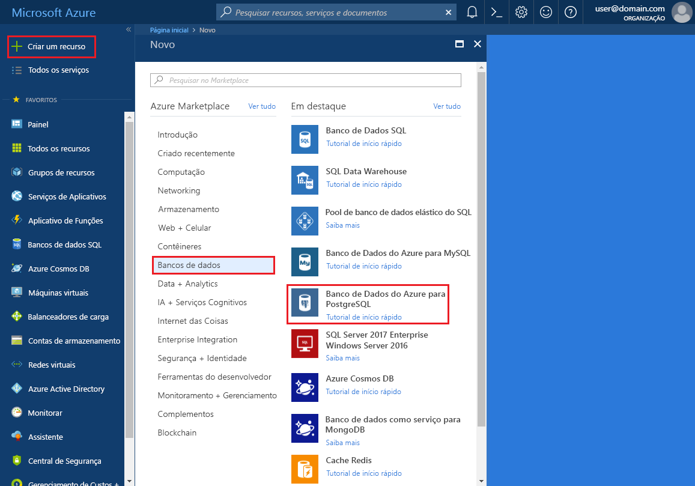
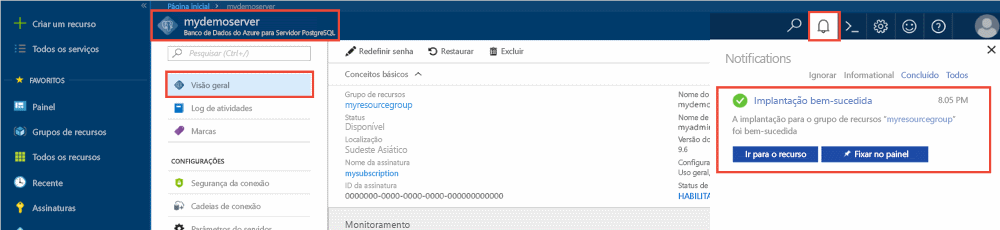
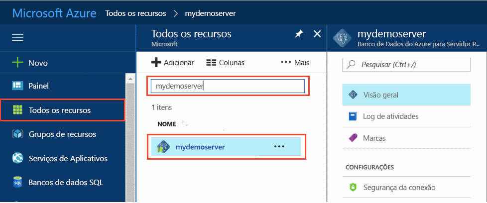
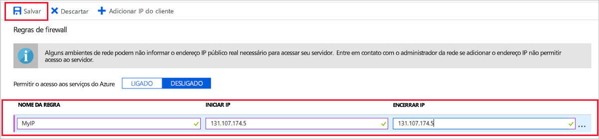
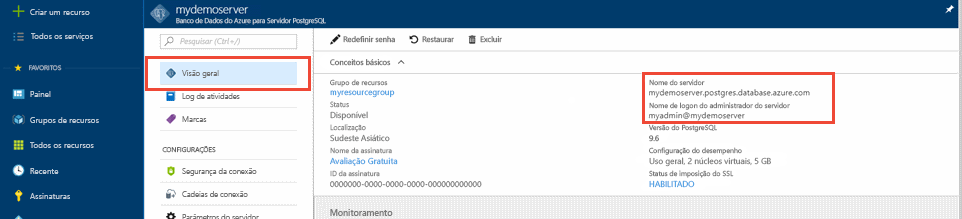
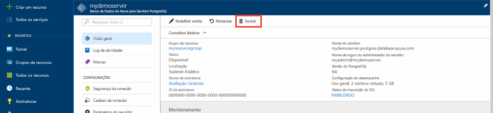

# <a name="create-an-azure-database-for-postgresql-in-the-azure-portal"></a>Criar um Banco de Dados do Azure para PostgreSQL no Portal do Azure

O Banco de Dados do Azure para PostgreSQL é um serviço gerenciado que permite executar, gerenciar e dimensionar os bancos de dados altamente disponíveis do PostgreSQL na nuvem. Este guia de início rápido mostra como criar um Banco de Dados do Azure para o servidor PostgreSQL usando o Portal do Azure.

Se você não tiver uma assinatura do Azure, crie uma conta [gratuita](https://azure.microsoft.com/free/) antes de começar.

## <a name="log-in-to-the-azure-portal"></a>Faça logon no Portal do Azure

Faça logon no [Portal do Azure](https://portal.azure.com).

## <a name="create-an-azure-database-for-postgresql"></a>Criar um Banco de Dados do Azure para o PostgreSQL

Um Banco de Dados do Azure para PostgreSQL é criado com um conjunto definido de [recursos de computação e armazenamento](./concepts-compute-unit-and-storage.md). O servidor é criado dentro de um [Grupo de recursos do Azure](../azure-resource-manager/resource-group-overview.md).

Siga estas etapas para criar um Banco de Dados do Azure para o servidor PostgreSQL:
1.    Clique no botão **Novo** no canto superior esquerdo do Portal do Azure.
2.    Selecione **Bancos de Dados** na página **Novo** e selecione **Banco de Dados do Azure para PostgreSQL** na página **Bancos de Dados**.
 

3.    Preencha o formulário de detalhes do novo servidor com as informações abaixo, conforme mostrado na imagem anterior:
    - Nome do servidor: **mypgserver-20170401** (o nome de um servidor é mapeado para o nome DNS e, portanto, deve ser globalmente exclusivo) 
    - Assinatura: se você tiver várias assinaturas, escolha a que for adequada, na qual o recurso exista ou é cobrado.
    - Grupo de recursos: **myresourcegroup**
    - Logon e senha de administrador do servidor à sua escolha
    - Local
    - Versão do PostgreSQL

  > [!IMPORTANT]
  > O logon de administrador do servidor e a senha que você especificar aqui são necessárias para fazer logon no servidor e em seus bancos de dados mais tarde neste início rápido. Lembre-se ou registre essas informações para o uso posterior.

4.    Clique em **Tipo de preço** para especificar o nível de desempenho e o tipo de serviço para o novo banco de dados. Para esse início rápido, selecione a camada **Básica**, **50 Unidades de Computação** e **50 GB** de armazenamento incluído.
 
5.    Clique em **OK**.
6.    Clique em **Criar** para provisionar o servidor. O provisionamento demora alguns minutos.

  > [!TIP]
  > Marque a opção **Fixar no painel** para permitir o controle fácil de suas implantações.

7.    Na barra de ferramentas, clique em **Notificações** para monitorar o processo de implantação.
 
   
  Por padrão, o banco de dados **postgres** é criado em seu servidor. O [postgres](https://www.postgresql.org/docs/9.6/static/app-initdb.html) é um banco de dados padrão destinado a uso por usuários, utilitários e aplicativos de terceiros. 

## <a name="configure-a-server-level-firewall-rule"></a>Configurar uma regra de firewall no nível de servidor

O serviço do Banco de Dados do Azure para PostgreSQL cria um firewall no nível do servidor. Esse firewall impede que os aplicativos e ferramentas externos se conectem ao servidor e aos bancos de dados no servidor, a menos que uma regra de firewall seja criada para abrir o firewall para endereços IP específicos. 

1.    Após a implantação ser concluída, clique em **Todos os Recursos** no menu esquerdo e digite o nome **mypgserver-20170401**, para pesquisar o servidor recém-criado. Clique no nome do servidor listado nos resultados da pesquisa. A página **Visão geral** do servidor é aberta e oferece outras opções de configuração.
 
 

2.    Na folha do servidor, selecione **Segurança de Conexão**. 
3.    Clique na caixa de texto em **Nome da regra,** e adicione uma nova regra de firewall para colocar o intervalo de IP para conectividade na lista de permissões. Para este início rápido, vamos permitir todos os IPs digitando **Nome da regra = AllowAllIps**, **IP inicial = 0.0.0.0** e **IP final = 255.255.255.255** e, em seguida, clique em **Salvar**. Você pode definir uma regra de firewall que abranja um intervalo de IP aos quais você possa se conectar de sua rede.

 

4.    Clique em **Salvar** e, em seguida, clique no **X** para fechar a página de **Segurança de Conexões**.

  > [!NOTE]
  > O servidor PostgreSQL do Azure se comunica pela porta 5432. Se você estiver tentando se conectar de dentro de uma rede corporativa, o tráfego de saída pela porta 5432 talvez não seja permitido pelo firewall de sua rede. Se isto acontecer, você não conseguirá se conectar ao servidor de Banco de Dados SQL do Azure, a menos que o departamento de TI abra a porta 5432.
  >

## <a name="get-the-connection-information"></a>Obter as informações de conexão

Quando criamos o nosso Banco de Dados do Azure para o servidor PostgreSQL, o banco de dados padrão **postgres** também foi criado. Para se conectar ao seu servidor de banco de dados, você precisa fornecer credenciais de acesso e informações de host.

1. No menu à esquerda no Portal do Azure, clique em **Todos os recursos** e pesquise pelo servidor que você acabou de criar **mypgserver-20170401**.

  

2. Clique no nome do servidor **mypgserver-20170401**.
3. Selecione a página **Visão geral** do servidor. Anote o **Nome do servidor** e o **Nome de logon de administrador do servidor**.

 

## <a name="connect-to-postgresql-database-using-psql-in-cloud-shell"></a>Conectar-se ao banco de dados PostgreSQL usando psql no Cloud Shell

Usaremos agora o utilitário de linha de comando psql para nos conectarmos ao Banco de Dados do Azure para o servidor PostgreSQL. 
1. Inicie o Azure Cloud Shell por meio do ícone do terminal no painel de navegação superior.

   

2. O Azure Cloud Shell é aberto no seu navegador, permitindo que você digite comandos de bash.

   

3. No prompt do Cloud Shell, conecte-se ao Banco de Dados do Azure para servidor PostgreSQL usando os comandos psql. O formato a seguir é usado para conectar-se a um Banco de Dados do Azure para servidor PostgreSQL com o utilitário [psql](https://www.postgresql.org/docs/9.6/static/app-psql.html):
   ```bash
   psql --host=<myserver> --port=<port> --username=<server admin login> --dbname=<database name>
   ```

   Por exemplo, o comando a seguir se conecta ao banco de dados padrão chamado **postgres** no seu servidor PostgreSQL **mypgserver-20170401.postgres.database.azure.com** usando as credenciais de acesso. Insira a senha de administrador do servidor quando solicitado.

   ```bash
   psql --host=mypgserver-20170401.postgres.database.azure.com --port=5432 --username=mylogin@mypgserver-20170401 --dbname=postgres
   ```
4.  Quando já estiver conectado ao servidor, crie um banco de dados em branco no prompt.
```bash
CREATE DATABASE mypgsqldb;
```

5.  No prompt, execute o seguinte comando para mudar a conexão para o banco de dados **mypgsqldb** recém-criado.
```bash
\c mypgsqldb
```

## <a name="connect-to-postgresql-database-using-pgadmin"></a>Conectar-se ao banco de dados PostgreSQL usando pgAdmin

Para se conectar ao servidor PostgreSQL do Azure usando a ferramenta GUI _pgAdmin_
1.    Inicie o aplicativo _pgAdmin_ no computador cliente. Você pode instalar o _pgAdmin_ de http://www.pgadmin.org/.
2.    Escolha **Adicionar Novo Servidor** no menu **Links Rápidos**.
3.    Na guia **Geral** da caixa de diálogo **Criar – Servidor**, insira um nome amigável exclusivo para o servidor, como **Servidor PostgreSQL do Azure**.

4.    Na caixa de diálogo **Criar – Servidor**, na guia **Conexão**, use as configurações conforme especificado e clique em **Salvar**.
   
    - **Nome/Endereço de host**: mypgserver-20170401.postgres.database.azure.com 
        - Nome do servidor totalmente qualificado.
    - **Porta:** 5432
        - O número da porta usada por este servidor de banco de dados é 5432.
    - **Banco de Dados de manutenção**: postgres 
        - Nome de banco de dados padrão gerado pelo sistema.
    - **Nome de usuário:** mylogin@mypgserver-20170401 
        - O logon de administrador do servidor (user@mypgserver) obtido anteriormente neste guia de início rápido.
    - **Senha**: a senha que você escolheu ao criar o servidor anteriormente neste guia de início rápido.
    - **Modo SSL**: Exigir
        - Por padrão, todos os servidores PostgreSQL do Azure são criados com a imposição de SSL ligada. Para DESLIGAR a imposição de SSL, consulte os detalhes em [Imposição de SSL](./concepts-ssl-connection-security.md).
5.    Clique em **Salvar**.
6.    No painel esquerdo do Navegador, expanda os **Grupos de Servidores**. Escolha o **Servidor PostgreSQL do Azure**.
7.  Escolha o **Servidor** ao qual você se conectou e, em seguida, escolha **Bancos de Dados** sob ele. 
8.    Clique com o botão direito do mouse em **Bancos de Dados** para criar um banco de dados.
9.    Escolha um nome de banco de dados **mypgsqldb** e o proprietário para ele como o logon de administrador de servidor **mylogin**.
10. Clique em **Salvar** para criar um banco de dados em branco.
11. No **Navegador**, expanda o **Servidor**. Expanda o servidor que você criou e veja o banco de dados **mypgsqldb** sob ele.
 


## <a name="clean-up-resources"></a>Limpar recursos
Limpe todos os recursos que você criou no início rápido, excluindo o [Grupo de recursos do Azure](../azure-resource-manager/resource-group-overview.md).

> [!TIP]
> Outros inícios rápidos nessa coleção aproveitam esse início rápido. Se você planeja continuar trabalhando com os inícios rápidos subsequentes, não limpe os recursos criados nesse início rápido. Caso contrário, siga estas etapas para excluir todos os recursos criados por esse início rápido no Portal do Azure.

1.    No menu à esquerda no Portal do Azure, clique em **Grupos de recursos** e, em seguida, clique em **myresourcegroup**.
2.    Em sua página de grupo de recursos, clique em **Excluir**, digite **myresourcegroup** na caixa de texto e, em seguida, clique em Excluir.

Se você apenas deseja excluir o servidor recém-criado:
1.    No menu à esquerda no Portal do Azure, clique em servidores PostgreSQL e, em seguida, pesquise o servidor que você acabou de criar
2.    Na página Visão geral, clique no botão Excluir no painel superior 
3.    Confirme o nome do servidor que deseja excluir e exiba sob ele os bancos de dados que são afetados. Digite **mypgserver-20170401** na caixa de texto e, em seguida, clique em Excluir.

## <a name="next-steps"></a>Próximas etapas
- Migre seu banco de dados usando [Exportar e Importar](./howto-migrate-using-export-and-import.md) ou [Despejar e Restaurar](./howto-migrate-using-dump-and-restore.md).
- Para criar o Banco de Dados do Azure para servidor PostgreSQL usando a CLI do Azure, consulte [Criar servidor PostgreSQL – CLI](./quickstart-create-server-database-azure-cli.md).
- Para uma visão geral técnica, consulte [Sobre o serviço do Banco de Dados do Azure para PostgreSQL](./overview.md).
