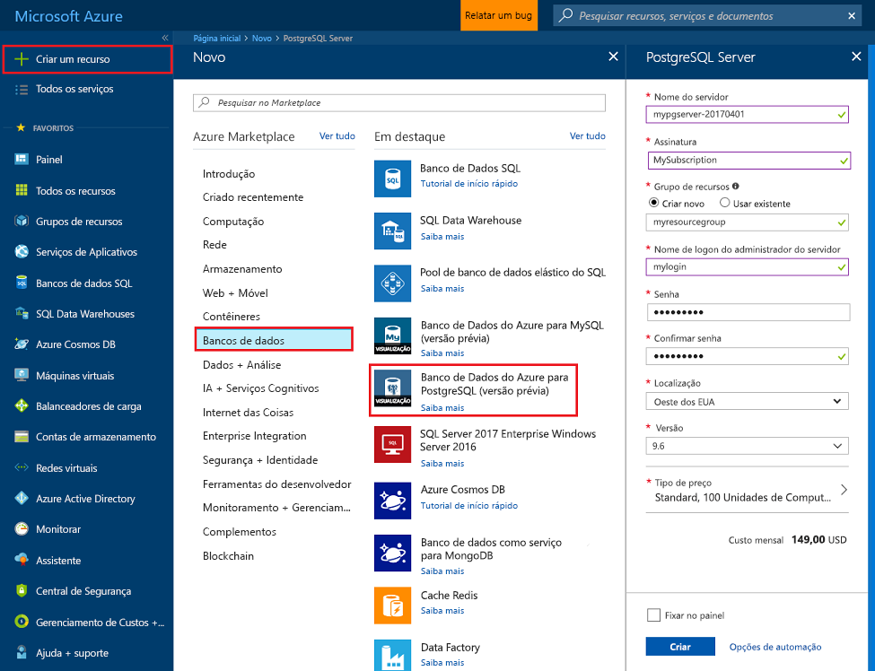
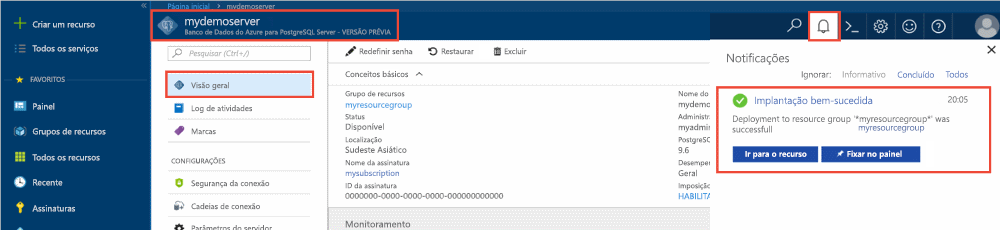
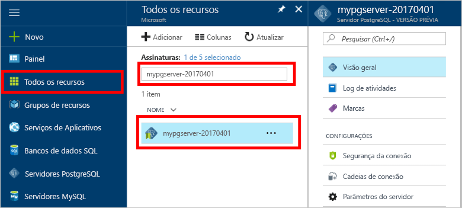
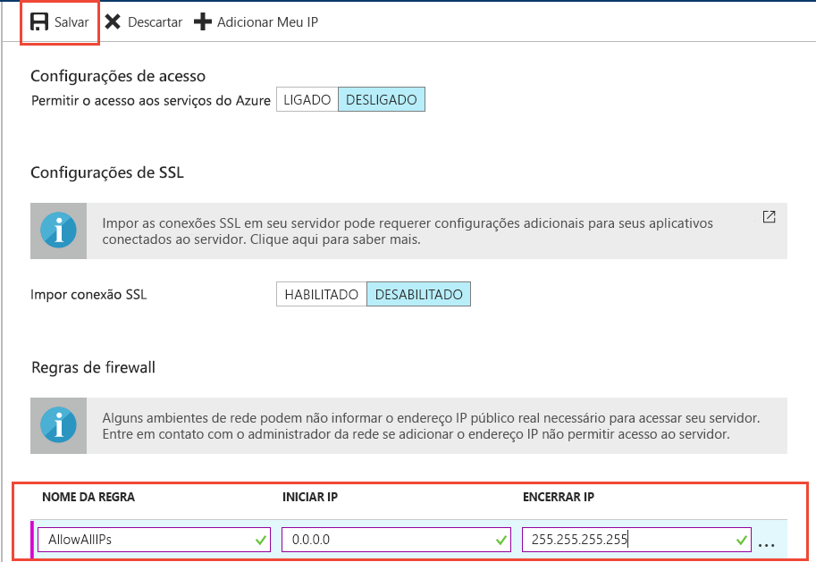
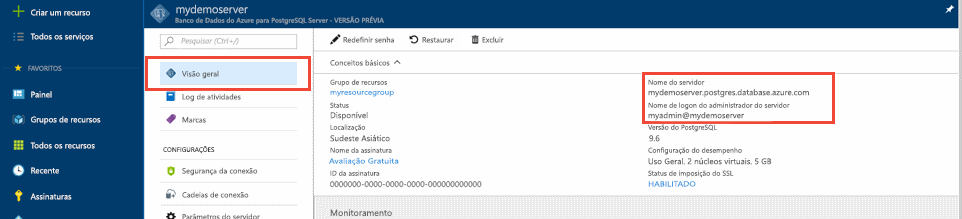
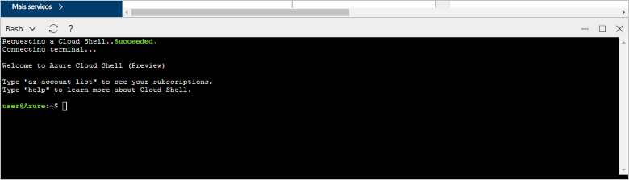

# <a name="tutorial-design-an-azure-database-for-postgresql-using-the-azure-portal"></a>Tutorial: Criar um Banco de Dados do Azure para PostgreSQL usando o Portal do Azure

O Banco de Dados do Azure para PostgreSQL é um serviço gerenciado que permite executar, gerenciar e dimensionar os bancos de dados altamente disponíveis do PostgreSQL na nuvem. Usando o Portal do Azure, você pode gerenciar facilmente seu servidor e projetar um banco de dados.

Neste tutorial, você usará o Portal do Azure para aprender a:
> [!div class="checklist"]
> * Criar um Banco de Dados do Azure para o servidor PostgreSQL
> * Configurar o firewall do servidor
> * Useo utilitário [**psql**](https://www.postgresql.org/docs/9.6/static/app-psql.html) para criar um banco de dados
> * Carregar dados de exemplo
> * Consultar dados
> * Atualizar dados
> * Restaurar dados

## <a name="prerequisites"></a>Pré-requisitos
Se você não tiver uma assinatura do Azure, crie uma conta [gratuita](https://azure.microsoft.com/free/) antes de começar.

## <a name="log-in-to-the-azure-portal"></a>Faça logon no Portal do Azure
Faça logon no [Portal do Azure](https://portal.azure.com).

## <a name="create-an-azure-database-for-postgresql"></a>Criar um Banco de Dados do Azure para o PostgreSQL

Um Banco de Dados do Azure para PostgreSQL é criado com um conjunto definido de [recursos de computação e armazenamento](./concepts-compute-unit-and-storage.md). O servidor é criado dentro de um [Grupo de recursos do Azure](../azure-resource-manager/resource-group-overview.md).

Siga estas etapas para criar um Banco de Dados do Azure para o servidor PostgreSQL:
1.  Clique em **Criar um recurso** no canto superior esquerdo do portal do Azure.
2.  Selecione **Bancos de Dados** na página **Novo** e selecione **Banco de Dados do Azure para PostgreSQL** na página **Bancos de Dados**.
  

3.  Preencha o formulário de detalhes sobre o novo servidor com as seguintes informações:

    

    - Nome do servidor: **mydemoserver** (o nome de um servidor é mapeado para o nome DNS e, portanto, deve ser globalmente exclusivo) 
    - Assinatura: se você tiver várias assinaturas, escolha a que for adequada, na qual o recurso exista ou é cobrado.
    - Grupo de recursos: **myresourcegroup**
    - Logon e senha de administrador do servidor à sua escolha
    - Local padrão
    - Versão do PostgreSQL

   > [!IMPORTANT]
   > O logon de administrador do servidor e a senha que você especificar aqui são necessários para fazer logon no servidor e em seus bancos de dados mais tarde neste tutorial. Lembre-se ou registre essas informações para o uso posterior.

4.  Clique em **Tipo de preço** para especificar o tipo de preço para o novo servidor. Para este tutorial, selecione **Uso Geral**, geração de computação **Gen 4**, 2 **vCores**, 5 GB de **armazenamento** e 7 dias de **período de retenção de backup**. Selecione a opção de redundância de backup **Com redundância geográfica** para armazenar os backups automáticos do servidor no armazenamento com redundância geográfica.
 

5.  Clique em **OK**.

6.  Clique em **Criar** para provisionar o servidor. O provisionamento demora alguns minutos.

7.  Na barra de ferramentas, clique em **Notificações** para monitorar o processo de implantação.
 

   > [!TIP]
   > Marque a opção **Fixar no painel** para permitir o controle fácil de suas implantações.

   Por padrão, o banco de dados **postgres** é criado em seu servidor. O [postgres](https://www.postgresql.org/docs/9.6/static/app-initdb.html) é um banco de dados padrão destinado a uso por usuários, utilitários e aplicativos de terceiros. 

## <a name="configure-a-server-level-firewall-rule"></a>Configurar uma regra de firewall no nível de servidor

O serviço do Banco de Dados do Azure para PostgreSQL cria um firewall no nível do servidor. Por padrão, esse firewall impede que todos os aplicativos e ferramentas externos se conectem ao servidor e a todos os bancos de dados no servidor, a menos que uma regra de firewall seja criada para abrir o firewall para um intervalo de endereços IP específico. 

1.  Após a implantação ser concluída, clique em **Todos os Recursos** no menu esquerdo e digite o nome **mydemoserver**, para pesquisar o servidor recém-criado. Clique no nome do servidor listado nos resultados da pesquisa. A página **Visão geral** do servidor é aberta e oferece outras opções de configuração.

   

2.  Na página do servidor, selecione **Segurança da conexão**. 

3.  Clique na caixa de texto em **Nome da regra,** e adicione uma nova regra de firewall para colocar o intervalo de IP para conectividade na lista de permissões. Insira o intervalo de IP. Clique em **Salvar**.

   

4.  Clique em **Salvar** e, em seguida, clique no **X** para fechar a página de **Segurança de conexões**.

   > [!NOTE]
   > O servidor PostgreSQL do Azure se comunica pela porta 5432. Se você estiver tentando se conectar de dentro de uma rede corporativa, o tráfego de saída pela porta 5432 talvez não seja permitido pelo firewall de sua rede. Se isso acontecer, você não poderá conectar o servidor de Banco de Dados SQL do Azure, a menos que o departamento de TI abra a porta 5432.
   >

## <a name="get-the-connection-information"></a>Obter informações de conexão

Quando você criou o servidor do Banco de dados do Azure para PostgreSQL, o banco de dados **postgres** padrão também foi criado. Para se conectar ao seu servidor de banco de dados, você precisa fornecer credenciais de acesso e informações de host.

1. No menu à esquerda no portal do Azure, clique em **Todos os recursos** e pesquise pelo servidor que você acabou de criar.

   

2. Clique no nome do servidor **mydemoserver**.

3. Selecione a página **Visão geral** do servidor. Anote o **Nome do servidor** e o **Nome de logon de administrador do servidor**.

   


## <a name="connect-to-postgresql-database-using-psql-in-cloud-shell"></a>Conectar-se ao banco de dados PostgreSQL usando psql no Cloud Shell

Usaremos agora o utilitário de linha de comando [psql](https://www.postgresql.org/docs/9.6/static/app-psql.html) para nos conectarmos ao servidor do Banco de Dados do Azure para PostgreSQL. 
1. Inicie o Azure Cloud Shell por meio do ícone do terminal no painel de navegação superior.

   

2. O Azure Cloud Shell é aberto no seu navegador, permitindo que você digite comandos de bash.

   

3. No prompt do Cloud Shell, conecte-se ao Banco de Dados do Azure para servidor PostgreSQL usando os comandos psql. O formato a seguir é usado para conectar-se a um Banco de Dados do Azure para servidor PostgreSQL com o utilitário [psql](https://www.postgresql.org/docs/9.6/static/app-psql.html):
   ```bash
   psql --host=<myserver> --port=<port> --username=<server admin login> --dbname=<database name>
   ```

   Por exemplo, o comando a seguir se conecta ao banco de dados padrão chamado **postgres** no seu servidor PostgreSQL **mydemoserver.postgres.database.azure.com** usando as credenciais de acesso. Insira a senha de administrador do servidor quando solicitado.

   ```bash
   psql --host=mydemoserver.postgres.database.azure.com --port=5432 --username=myadmin@mydemoserver --dbname=postgres
   ```

## <a name="create-a-new-database"></a>Criar um novo banco de dados
Quando já estiver conectado ao servidor, crie um banco de dados em branco no prompt.
```bash
CREATE DATABASE mypgsqldb;
```

No prompt, execute o seguinte comando para mudar a conexão para o banco de dados **mypgsqldb** recém-criado.
```bash
\c mypgsqldb
```
## <a name="create-tables-in-the-database"></a>Criar tabelas no banco de dados
Agora que você sabe como se conectar ao Banco de Dados do Azure para PostgreSQL, pode concluir algumas tarefas básicas:

Primeiro, crie uma tabela e carregue-a com alguns dados. Vamos criar uma tabela que acompanha as informações de inventário usando este código SQL:
```sql
CREATE TABLE inventory (
    id serial PRIMARY KEY, 
    name VARCHAR(50), 
    quantity INTEGER
);
```

Você agora pode ver a tabela recém-criada na lista de tabelas digitando:
```sql
\dt
```

## <a name="load-data-into-the-tables"></a>Carregar dados nas tabelas
Agora que você tem uma tabela, insira alguns dados nela. Na janela do prompt de comando aberta, execute a consulta a seguir para inserir algumas linhas de dados.
```sql
INSERT INTO inventory (id, name, quantity) VALUES (1, 'banana', 150); 
INSERT INTO inventory (id, name, quantity) VALUES (2, 'orange', 154);
```

Você tem agora duas linhas de dados de exemplo na tabela de inventário criada anteriormente.

## <a name="query-and-update-the-data-in-the-tables"></a>Consultar e atualizar os dados nas tabelas
Execute a seguinte consulta para recuperar as informações da tabela do banco de dados de inventário. 
```sql
SELECT * FROM inventory;
```

Também é possível atualizar os dados na tabela.
```sql
UPDATE inventory SET quantity = 200 WHERE name = 'banana';
```

Você pode ver os valores atualizados quando recuperar os dados.
```sql
SELECT * FROM inventory;
```

## <a name="restore-data-to-a-previous-point-in-time"></a>Restaurar dados para um ponto anterior no tempo
Imagine que você excluiu acidentalmente essa tabela. Essa situação é algo do qual você não pode se recuperar facilmente. O Banco de Dados do Azure para PostgreSQL permite que você volte para qualquer ponto anterior no qual o servidor tenha backups (determinados pelo período de retenção de backup que você configurou) e restaure esse ponto como um novo servidor. Use esse novo servidor para recuperar seus dados excluídos. As etapas a seguir restauram o servidor **mydemoserver** para um ponto anterior à adição da tabela de inventário.

1.  Na página de **Visão geral** do Banco de Dados do Azure para PostgreSQL para o servidor, clique em **Restaurar** na barra de ferramentas. A página **Restaurar** será aberta.

   

2.  Preencha o formulário **Restaurar** com as informações necessárias:

   

   - **Ponto de restauração**: selecione um ponto no tempo anterior à alteração do servidor
   - **Servidor de destino**: forneça um novo nome de servidor no qual você deseja restaurar
   - **Local**: não é possível selecionar a região; por padrão, ela é igual ao servidor de origem
   - **Tipo de preço**: não é possível alterar esse valor ao restaurar um servidor. Ele é igual ao servidor de origem. 
3.  Clique em **OK** para [restaurar o servidor para um ponto](./howto-restore-server-portal.md) anterior à exclusão da tabela. A restauração de um servidor para um ponto diferente no tempo cria um novo servidor duplicado como o servidor original a partir do ponto no tempo especificado por você, desde que esteja dentro do período de retenção do seu [tipo de preço](./concepts-pricing-tiers.md).

## <a name="next-steps"></a>Próximas etapas
Neste tutorial, você aprendeu a usar o portal do Azure e outros utilitários para:
> [!div class="checklist"]
> * Criar um Banco de Dados do Azure para o servidor PostgreSQL
> * Configurar o firewall do servidor
> * Useo utilitário [**psql**](https://www.postgresql.org/docs/9.6/static/app-psql.html) para criar um banco de dados
> * Carregar dados de exemplo
> * Consultar dados
> * Atualizar dados
> * Restaurar dados

Em seguida, para aprender a usar a CLI do Azure para executar tarefas semelhantes, consulte este tutorial: [Criar seu primeiro Banco de Dados do Azure para PostgreSQL usando a CLI do Azure](tutorial-design-database-using-azure-cli.md)
