# <a name="quickstart-create-an-aspnet-web-app"></a>Início Rápido: Criar um aplicativo Web ASP .NET 

## <a name="introduction"></a>Introdução

Este início rápido mostra como criar e implantar um aplicativo Web ASP.NET no Serviço de Aplicativo do Azure usando o Visual Studio 2017. O aplicativo de exemplo se conecta ao Cache Redis do Azure para armazenar e recuperar dados do cache. Depois de concluir o início rápido, você terá um aplicativo Web em execução, hospedado no Azure, que lê e grava no Cache Redis do Azure.

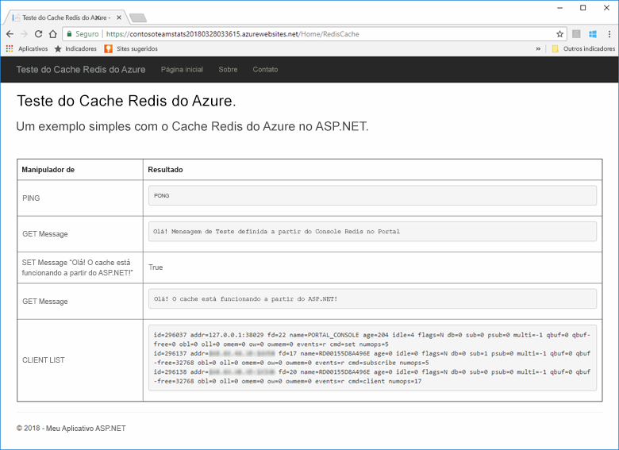

[!INCLUDE [quickstarts-free-trial-note](../../includes/quickstarts-free-trial-note.md)]

## <a name="prerequisites"></a>Pré-requisitos

Para concluir o início rápido, é preciso instalar o [Visual Studio 2017](https://www.visualstudio.com/downloads/) com os seguintes ambientes:
* Desenvolvimento Web e ASP.NET
* Desenvolvimento do Azure

## <a name="create-the-visual-studio-project"></a>Criar o projeto do Visual Studio

1. Abra o Visual Studio e depois selecione **Arquivo** >**Novo** > **Projeto**.

2. Na caixa de diálogo **Novo Projeto**, execute as seguintes etapas:

    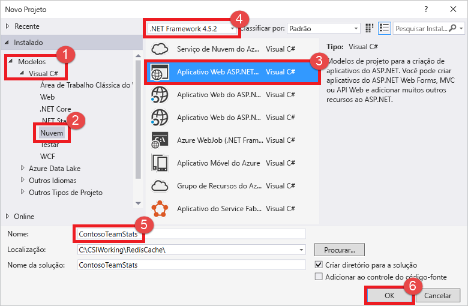

    a. Na lista **Modelos**, expanda o nó **Visual C#**.

    b. Selecione **Nuvem**.

    c. Selecione **Aplicativo Web do ASP.NET**.

    d. Verifique se o **.NET Framework 4.5.2** ou superior está selecionado.

    e. Na caixa **Nome**, dê um nome ao projeto. Neste exemplo, usamos **ContosoTeamStats**.

    f. Selecione **OK**.
   
3. Selecione **MVC** como o tipo de projeto.

4. Verifique se a opção **Sem Autenticação** está especificada para as configurações de **Autenticação**. Dependendo de sua versão do Visual Studio, o padrão de configuração de **Autenticação** pode ser definido para algo diferente. Para alterá-lo, selecione **Alterar Autenticação** e depois **Sem Autenticação**.

5. Selecione **OK** para criar o projeto.

## <a name="create-a-cache"></a>Criar um cache

Em seguida, crie o cache para o aplicativo.

[!INCLUDE [redis-cache-create](../../includes/redis-cache-create.md)]

[!INCLUDE [redis-cache-access-keys](../../includes/redis-cache-access-keys.md)]

#### <a name="to-edit-the-cachesecretsconfig-file"></a>Para editar o arquivo *CacheSecrets.config*

3. Crie um arquivo em seu computador denominado *CacheSecrets.config*. Coloque-o em um local em que ele não será verificado com o código-fonte do aplicativo de exemplo. Para este início rápido, o arquivo *CacheSecrets.config* está localizado em *C:\AppSecrets\CacheSecrets.config*.

4. Editar o arquivo *CacheSecrets.config*. Depois adicione o seguinte conteúdo:

    ```xml
    <appSettings>
        <add key="CacheConnection" value="<cache-name>.redis.cache.windows.net,abortConnect=false,ssl=true,password=<access-key>"/>
    </appSettings>
    ```

5. Substitua `<cache-name>` pelo nome do host do cache.

6. Substitua `<access-key>` pela chave primária do cache.

    > [!TIP]
    > É possível usar a chave de acesso secundária durante a rotação de chave como uma chave alternativa enquanto você regenera a chave de acesso primária.
>
7. Salve o arquivo.

## <a name="update-the-mvc-application"></a>Atualizar o aplicativo MVC

Nesta seção, você atualiza o aplicativo para dar suporte a uma nova exibição que exibe um teste simples no Cache Redis do Azure.

* [Atualizar o arquivo web.config com uma configuração de aplicativo para o cache](#Update-the-webconfig-file-with-an-app-setting-for-the-cache)
* [Configurar o aplicativo para usar o cliente StackExchange.Redis](#configure-the-application-to-use-stackexchangeredis)
* [Atualizar o HomeController e o Layout](#update-the-homecontroller-and-layout)
* [Adicionar uma nova exibição RedisCache](#add-a-new-rediscache-view)

### <a name="update-the-webconfig-file-with-an-app-setting-for-the-cache"></a>Atualizar o arquivo web.config com uma configuração de aplicativo para o cache

Quando você executa o aplicativo localmente, as informações em *CacheSecrets.config* são usadas para se conectar à instância do Cache Redis do Azure. Posteriormente, você implantará esse aplicativo no Azure. Nesse momento, você definirá uma configuração de aplicativo no Azure que será usada pelo aplicativo para recuperar as informações de conexão do cache em vez desse arquivo. 

Como o arquivo *CacheSecrets.config* não está implantado no Azure com seu aplicativo, você o usa apenas durante o teste do aplicativo localmente. Mantenha essas informações com o máximo de segurança possível para evitar o acesso mal-intencionado aos dados do cache.

#### <a name="to-update-the-webconfig-file"></a>Para atualizar o arquivo *web.config*
1. No **Gerenciador de Soluções**, clique duas vezes no arquivo *web.config* para abri-lo.

    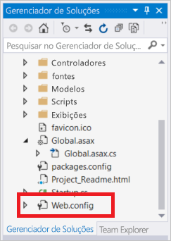

2. No arquivo *web.config*, localize o elemento `<appSetting>`. Depois adicione o atributo `file`. Se você usou um nome de arquivo ou local diferente, substitua esses valores pelos mostrados no exemplo.

* Antes: `<appSettings>`
* Após: ` <appSettings file="C:\AppSecrets\CacheSecrets.config">`

O tempo de execução do ASP.NET mescla o conteúdo do arquivo externo com a marcação no elemento `<appSettings>` . O tempo de execução ignora o atributo de arquivo se o arquivo especificado não puder ser encontrado. Seus segredos (a cadeia de conexão do cache) não são incluídos como parte do código-fonte do aplicativo. Quando você implantar o aplicativo Web no Azure, o arquivo *CacheSecrests.config* não será implantado.

### <a name="to-configure-the-application-to-use-stackexchangeredis"></a>Para configurar o aplicativo para usar o StackExchange.Redis

1. Para configurar o aplicativo para que ele use o pacote NuGet [StackExchange.Redis](https://github.com/StackExchange/StackExchange.Redis) do Visual Studio, selecione **Ferramentas > Gerenciador de Pacotes NuGet > Console do Gerenciador de Pacotes**.

2. Execute o comando a seguir na janela `Package Manager Console`:

    ```powershell
    Install-Package StackExchange.Redis
    ```

3. Os downloads de pacote NuGet acrescentam as referências de assembly necessárias para o seu aplicativo de cliente para acessar o cache Redis do Azure com o cliente de cache StackExchange.Redis. Se você preferir usar uma versão de nome forte da biblioteca de cliente `StackExchange.Redis`, instale o pacote `StackExchange.Redis.StrongName`.

### <a name="to-update-the-homecontroller-and-layout"></a>Para atualizar o HomeController e o Layout

1. No **Gerenciador de Soluções**, expanda a pasta **Controladores** e depois abra o arquivo *HomeController.cs*.

2. Adicione as duas instruções `using` a seguir na parte superior do arquivo para dar suporte às configurações de aplicativo e de cliente de cache.

    ```csharp
    using System.Configuration;
    using StackExchange.Redis;
    ```

3. Adicione o método a seguir à classe `HomeController` para dar suporte a uma nova ação `RedisCache` que execute alguns comandos no novo cache.

    ```csharp
        public ActionResult RedisCache()
        {
            ViewBag.Message = "A simple example with Azure Redis Cache on ASP.NET.";

            var lazyConnection = new Lazy<ConnectionMultiplexer>(() =>
            {
                string cacheConnection = ConfigurationManager.AppSettings["CacheConnection"].ToString();
                return ConnectionMultiplexer.Connect(cacheConnection);
            });

            // Connection refers to a property that returns a ConnectionMultiplexer
            // as shown in the previous example.
            IDatabase cache = lazyConnection.Value.GetDatabase();

            // Perform cache operations using the cache object...

            // Simple PING command
            ViewBag.command1 = "PING";
            ViewBag.command1Result = cache.Execute(ViewBag.command1).ToString();

            // Simple get and put of integral data types into the cache
            ViewBag.command2 = "GET Message";
            ViewBag.command2Result = cache.StringGet("Message").ToString();

            ViewBag.command3 = "SET Message \"Hello! The cache is working from ASP.NET!\"";
            ViewBag.command3Result = cache.StringSet("Message", "Hello! The cache is working from ASP.NET!").ToString();

            // Demostrate "SET Message" executed as expected...
            ViewBag.command4 = "GET Message";
            ViewBag.command4Result = cache.StringGet("Message").ToString();

            // Get the client list, useful to see if connection list is growing...
            ViewBag.command5 = "CLIENT LIST";
            ViewBag.command5Result = cache.Execute("CLIENT", "LIST").ToString().Replace(" id=", "\rid=");

            lazyConnection.Value.Dispose();

            return View();
        }
    ```

4. No **Gerenciador de Soluções**, expanda a pasta **Modos de Exibição** > **Compartilhadas**. Depois abra o arquivo *_Layout.cshtml*.

    Substitua:
    
    ```csharp
    @Html.ActionLink("Application name", "Index", "Home", new { area = "" }, new { @class = "navbar-brand" })
    ```

    por:

    ```csharp
    @Html.ActionLink("Azure Redis Cache Test", "RedisCache", "Home", new { area = "" }, new { @class = "navbar-brand" })
    ```

### <a name="to-add-a-new-rediscache-view"></a>Para adicionar uma nova exibição RedisCache

1. No **Gerenciador de Soluções**, expanda a pasta **Exibições** e, em seguida, clique com o botão direito do mouse na pasta **Início**. Escolha **Adicionar** > **Exibição...**

2. Na caixa de diálogo **Adicionar Exibição**, insira **RedisCache** para o Nome de Exibição. Em seguida, selecione**Adicionar**.

3. Substitua o código no arquivo *RedisCache.cshtml* pelo seguinte código:

    ```csharp
    @{
        ViewBag.Title = "Azure Redis Cache Test";
    }

    <h2>@ViewBag.Title.</h2>
    <h3>@ViewBag.Message</h3>
    <br /><br />
    <table border="1" cellpadding="10">
        <tr>
            <th>Command</th>
            <th>Result</th>
        </tr>
        <tr>
            <td>@ViewBag.command1</td>
            <td><pre>@ViewBag.command1Result</pre></td>
        </tr>
        <tr>
            <td>@ViewBag.command2</td>
            <td><pre>@ViewBag.command2Result</pre></td>
        </tr>
        <tr>
            <td>@ViewBag.command3</td>
            <td><pre>@ViewBag.command3Result</pre></td>
        </tr>
        <tr>
            <td>@ViewBag.command4</td>
            <td><pre>@ViewBag.command4Result</pre></td>
        </tr>
        <tr>
            <td>@ViewBag.command5</td>
            <td><pre>@ViewBag.command5Result</pre></td>
        </tr>
    </table>
    ```

## <a name="run-the-app-locally"></a>Executar o aplicativo localmente

Por padrão, o projeto está configurado para hospedar o aplicativo localmente no [IIS Express](https://docs.microsoft.com/iis/extensions/introduction-to-iis-express/iis-express-overview) para teste e depuração.

### <a name="to-run-the-app-locally"></a>Para executar o aplicativo localmente
1. No Visual Studio, selecione **Depurar** > **Iniciar Depuração** para criar e iniciar o aplicativo localmente para teste e depuração.

2. No navegador, selecione **Teste do Cache Redis do Azure** na barra de navegação.

3. No exemplo a seguir, a chave `Message` já tinha um valor armazenado em cache, que foi definido usando o console do Cache Redis do Azure no portal. O aplicativo atualizou esse valor armazenado em cache. O aplicativo também executou os comandos `PING` e `CLIENT LIST`.

    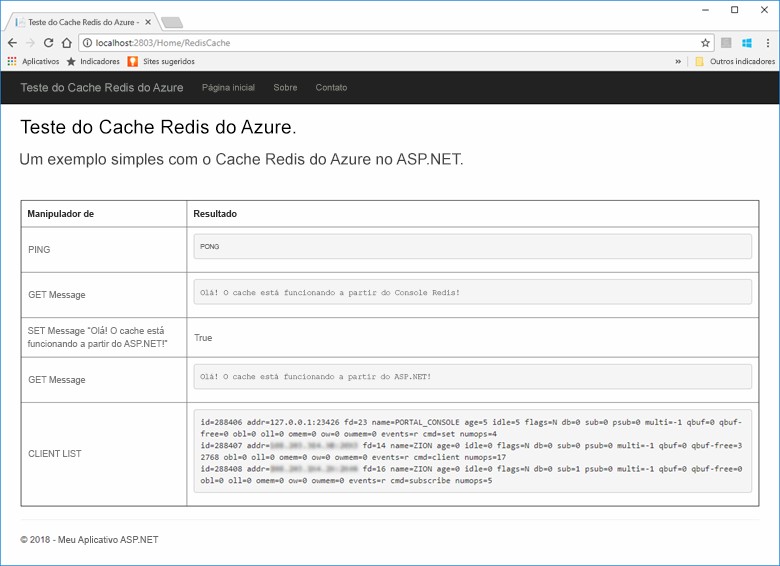

## <a name="publish-and-run-in-azure"></a>Publicar e executar no Azure

Depois de testar o aplicativo localmente com êxito, você pode implantar o aplicativo no Azure e executá-lo na nuvem.

### <a name="to-publish-the-app-to-azure"></a>Para publicar o aplicativo no Azure

1. No Visual Studio, clique com o botão direito do mouse no nó do projeto no Gerenciador de Soluções. Depois selecione **Publicar**.

    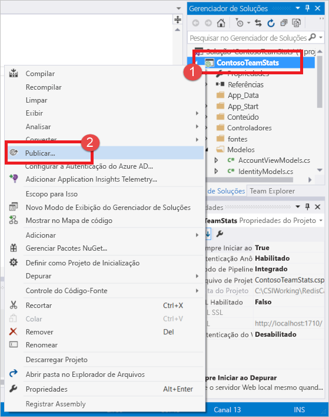

2. Selecione **Serviço de Aplicativo do Microsoft Azure**, **Criar Novo** e depois **Publicar**.

    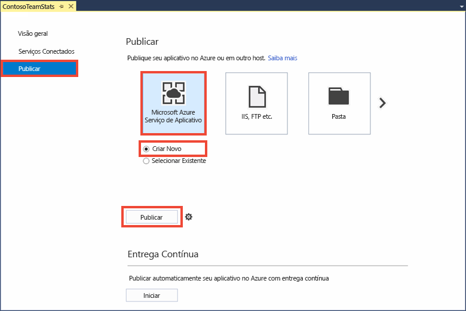

3. Na caixa de diálogo **Criar Serviço de Aplicativo**, faça as seguintes alterações:

    | Configuração | Valor recomendado | DESCRIÇÃO |
    | ------- | :---------------: | ----------- |
    | **Nome do aplicativo** | Use o padrão. | O nome do aplicativo é o nome do host para o aplicativo quando ele for implantado no Azure. O nome pode ter um sufixo de carimbo de data/hora adicionado a ele se for necessário para torná-lo exclusivo. |
    | **Assinatura** | Escolha a sua assinatura do Azure. | Essa assinatura será cobrada quanto aos encargos de hospedagem relacionados. Caso tenha várias assinaturas do Azure, verifique se a assinatura desejada está selecionada.|
    | **Grupo de recursos** | Use o mesmo grupo de recursos no qual o cache foi criado (por exemplo, *TestResourceGroup*). | O grupo de recursos ajuda você a gerenciar todos os recursos como um grupo. Posteriormente, quando desejar excluir o aplicativo, você poderá simplesmente excluir o grupo. |
    | **Plano do Serviço de Aplicativo** | Selecione **Novo** e depois crie um novo Plano do Serviço de Aplicativo chamado *TestingPlan*. <br />Use o mesmo **Local** usado ao criar o cache. <br />Escolha **Gratuito** para o tamanho. | Um Plano do Serviço de Aplicativo define um conjunto de recursos de computação com o qual um aplicativo Web será executado. |

    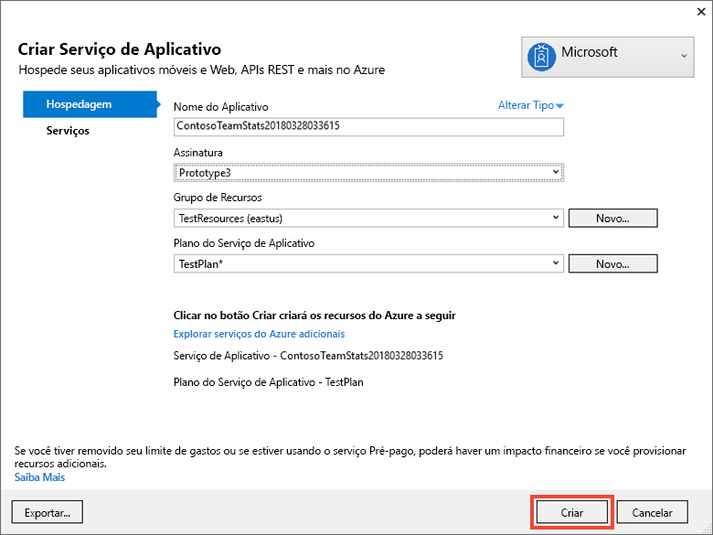

4. Depois de definir as configurações de hospedagem do Serviço de Aplicativo, selecione **Criar**.

5. Monitore a janela **Saída** no Visual Studio para ver o status de publicação. Depois de o aplicativo ter sido publicado, a URL para o aplicativo é registrada:

    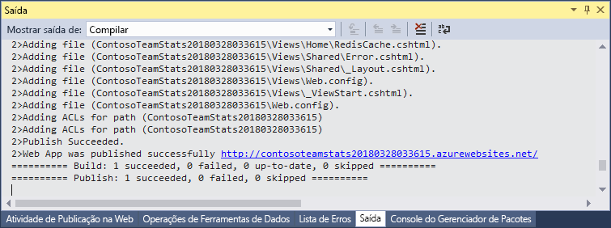

### <a name="add-the-app-setting-for-the-cache"></a>Adicionar a configuração de aplicativo ao cache

Depois de o novo aplicativo ter sido publicado, adicione uma nova configuração de aplicativo. Essa configuração é usada para armazenar as informações de conexão do cache. 

#### <a name="to-add-the-app-setting"></a>Para adicionar a configuração do aplicativo 

1. Digite o nome do aplicativo na barra de pesquisa na parte superior do portal do Azure para encontrar o novo aplicativo que você criou.

    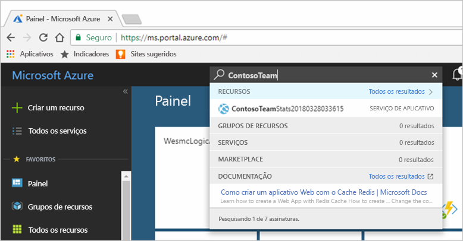

2. Adicione uma nova configuração de aplicativo chamada **CacheConnection** ao aplicativo a ser usada para se conectar ao cache. Use o mesmo valor configurado para `CacheConnection` no arquivo *CacheSecrets.config*. O valor contém o nome do host do cache e a chave de acesso.

    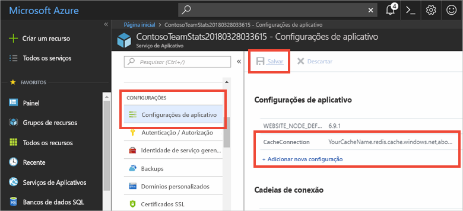

### <a name="run-the-app-in-azure"></a>Executar o aplicativo no Azure

No navegador, vá até a URL do aplicativo. A URL aparece nos resultados da operação de publicação na janela de saída do Visual Studio. Ela também é fornecida no portal do Azure, na página de visão geral do aplicativo que você criou.

Selecione **Teste do Cache Redis do Azure** na barra de navegação para testar o acesso ao cache.


## <a name="clean-up-resources"></a>Limpar recursos

Se você pretende continuar até o próximo tutorial, pode manter os recursos criados neste início rápido e reutilizá-los.

Caso contrário, se você não for mais usar o aplicativo de exemplo do início rápido, exclua os recursos do Azure criados neste início rápido para evitar encargos. 

> [!IMPORTANT]
> A exclusão de um grupo de recursos é irreversível. Ao excluir o grupo de recursos, todos os recursos nele são excluídos permanentemente. Não exclua acidentalmente o grupo de recursos ou os recursos incorretos. Se tiver criado os recursos para hospedar este exemplo dentro de um grupo de recursos existente que contém recursos que você quer manter, exclua cada recurso individualmente de suas respectivas folhas, em vez de excluir o grupo de recursos.

### <a name="to-delete-a-resource-group"></a>Para excluir um grupo de recursos

1. Entre no [portal do Azure](https://portal.azure.com) e selecione **Grupos de recursos**.

2. Na caixa **Filtrar por nome...**, digite o nome do seu grupo de recursos. As instruções deste artigo usaram um grupo de recursos chamado *TestResources*. Em seu grupo de recursos, na lista de resultados, selecione **...**, depois selecione **Excluir grupo de recursos**.

    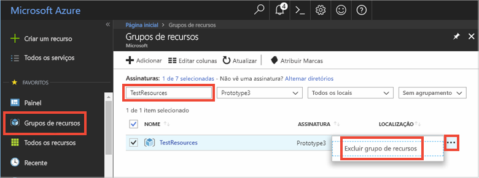

Você receberá uma solicitação para confirmar a exclusão do grupo de recursos. Digite o nome do grupo de recursos para confirmar e selecione **Excluir**.

Após alguns instantes, o grupo de recursos, e todos os recursos nele são excluídos.

## <a name="next-steps"></a>Próximas etapas

No próximo tutorial, você usará o Cache Redis do Azure em um cenário mais realista para melhorar o desempenho de um aplicativo. Você atualizará esse aplicativo para armazenar em cache os resultados do placar de líderes usando o padrão cache-aside com o ASP.NET e um banco de dados.

> [!div class="nextstepaction"]
> [Criar um placar de líderes cache-aside no ASP.NET](cache-web-app-cache-aside-leaderboard.md)
