<properties
   pageTitle="Execute qualquer aplicativo do Windows em qualquer dispositivo com o Azure RemoteApp | Microsoft Azure"
   description="Saiba como compartilhar qualquer aplicativo do Windows com os usuários usando o Azure RemoteApp."
   services="remoteapp"
   documentationCenter=""
   authors="lizap"
   manager="mbaldwin"
   editor=""/>

<tags
   ms.service="remoteapp"
   ms.devlang="na"
   ms.topic="hero-article"
   ms.tgt_pltfrm="na"
   ms.workload="compute"
   ms.date="08/15/2016"
   ms.author="elizapo"/>

# Execute qualquer aplicativo do Windows em qualquer dispositivo com o Azure RemoteApp

> [AZURE.IMPORTANT]
O RemoteApp do Azure está sendo descontinuado. Leia o [comunicado](https://go.microsoft.com/fwlink/?linkid=821148) para obter detalhes.

Você pode executar um aplicativo do Windows em qualquer lugar e em qualquer dispositivo, agora, é sério: basta usar o Azure RemoteApp. Seja um aplicativo personalizado escrito há 10 anos ou um aplicativo do Office, os usuários não precisam mais estar vinculados a um sistema operacional específico (como o Windows XP) para esses poucos aplicativos.

Com o RemoteApp, os usuários também podem usar seus próprios dispositivos Android ou Apple e obter a mesma experiência que eles têm no Windows (ou em Windows Phones). Isso é realizado hospedando seus aplicativos do Windows em uma coleção de máquinas virtuais do Windows no Azure, em que os usuários podem acessá-los em qualquer lugar em que com conexão à Internet.

Continue lendo para obter um exemplo de como fazer isso.

Neste artigo, vamos compartilhar o Access com todos os nossos usuários. No entanto, você pode usar QUALQUER aplicativo. Desde que você possa instalar o aplicativo em um computador com Windows Server 2012 R2, poderá compartilhá-lo seguindo as etapas abaixo. Você pode examinar os [requisitos de aplicativo](remoteapp-appreqs.md) para certificar-se de que seu aplicativo funcionará.

Como o Access é um banco de dados e queremos que esse banco de dados seja útil, podemos realizar algumas etapas adicionais para permitir que os usuários acessem o compartilhamento de dados do Access. Se seu aplicativo não é um banco de dados ou se você não precisa que seus usuários sejam capazes de acessar um compartilhamento de arquivos, poderá ignorar as etapas neste tutorial

> [AZURE.NOTE] Você precisa de uma conta do Azure para concluir este tutorial:
> - Você pode [abrir uma conta do Azure gratuitamente](https://azure.microsoft.com/free/?WT.mc_id=A261C142F): você recebe créditos que podem ser usados para experimentar serviços pagos do Azure e, mesmo após eles serem utilizados, você pode manter a conta e usar os serviços gratuitos do Azure, como os Sites. Seu cartão de crédito nunca será cobrado, a menos que você altere explicitamente suas configurações, solicitando esse tipo de cobrança.
> - Você pode [ativar benefícios para assinantes do MSDN](https://azure.microsoft.com/pricing/member-offers/msdn-benefits-details/?WT.mc_id=A261C142F): todos os meses, sua assinatura do MSDN concede créditos que podem ser usados para serviços pagos do Azure.

## Criar uma coleção de RemoteApp

Comece pela criação de uma coleção. A coleção serve como um contêiner para seus aplicativos e usuários. Cada coleção é baseada em uma imagem - você pode criar sua própria ou usar uma fornecida com sua assinatura. Para este tutorial, estamos usando a imagem de avaliação do Office 2013 - ela contém o aplicativo deseja compartilhar.

1. No portal do Azure, role para baixo na árvore de navegação à esquerda até ver o RemoteApp. Abra essa página.
2. Clique em **Criar uma coleção de RemoteApp**.
3. Clique em **Criação rápida** e digite um nome para a coleção.
4. Selecione a região que você deseja usar para criar sua coleção. Para obter a melhor experiência, selecione a região mais próxima geograficamente do local onde os usuários acessarão o aplicativo. Por exemplo, neste tutorial, os usuários estarão localizados em Redmond, Washington. A região do Azure mais próxima é **Oeste dos EUA**.
5. Selecione o plano de cobrança que você deseja usar. O plano de cobrança básico coloca 16 usuários em uma VM grande do Azure, enquanto o plano de cobrança padrão tem 10 usuários em uma VM grande do Azure. Como um exemplo geral, o plano básico funciona muito bem para fluxo de trabalho de tipo de entrada de dados. Para um aplicativo de produtividade, como o Office, você desejaria o plano padrão.
6. Por fim, selecione a imagem do Office 2013 Professional. Esta imagem contém aplicativos do Office 2013. Um lembrete: essa imagem é válida somente para coleções de avaliação e POCs. Você não pode usar essa imagem em uma coleção de produção.
7. Clique em **Criar coleção do RemoteApp**.

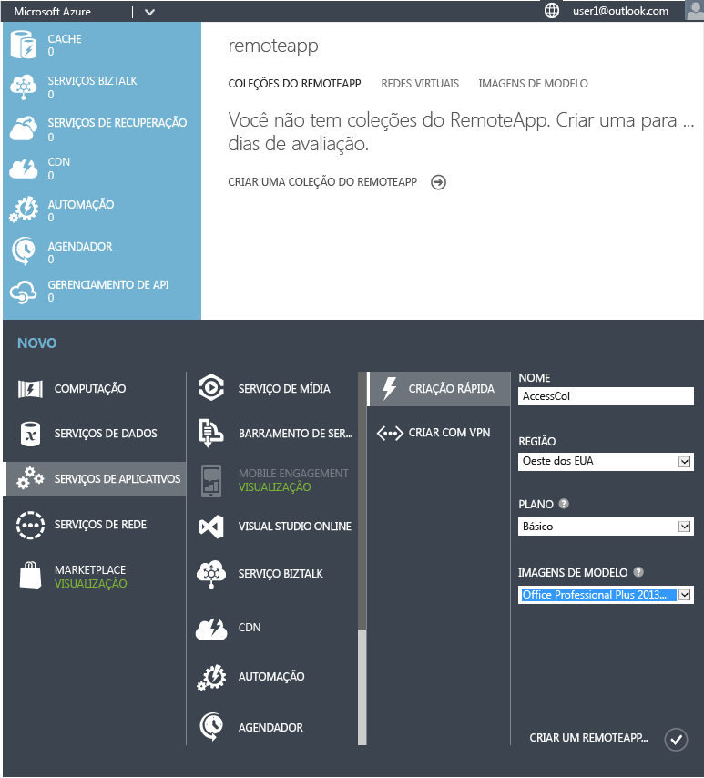

Isso inicia a criação de sua coleção, mas pode demorar até uma hora.

Agora você está pronto para adicionar os usuários.

## Compartilhar o aplicativo com usuários

Depois que a coleção foi criada com êxito, é hora de publicar o Access a usuários e adicionar os usuários que devem ter acesso a ele.

Se você navegou para fora do nó do Azure RemoteApp enquanto a coleção estava sendo criada, comece fazendo seu caminho de volta para ele na home page do Azure.

2. Clique na coleção que você criou anteriormente para acessar opções adicionais e configurar a coleção. 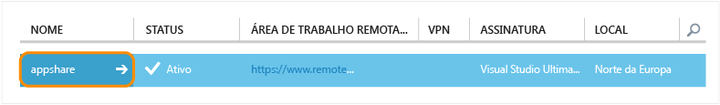
3. Na guia **Publicação**, clique em **Publicar** na parte inferior da tela e, em seguida, clique **Publicar programas do menu Iniciar**. 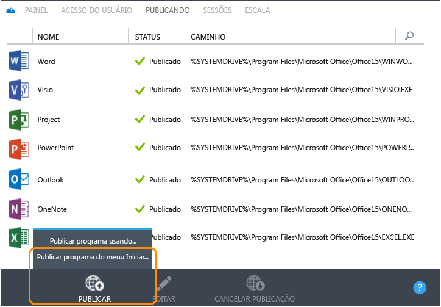
4. Selecione os aplicativos que você deseja publicar na lista. Para nossa finalidade, escolhemos o Access. Clique em **Concluído**. Aguarde até que os aplicativos concluam a publicação. 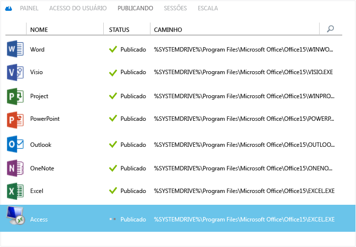

1. Quando o aplicativo tiver terminado de publicação, vá até a guia **Acesso de usuário** para adicionar todos os usuários que precisem acessar seus aplicativos. Insira nomes de usuário (endereço de email) para seus usuários e, em seguida, clique em **Salvar**.

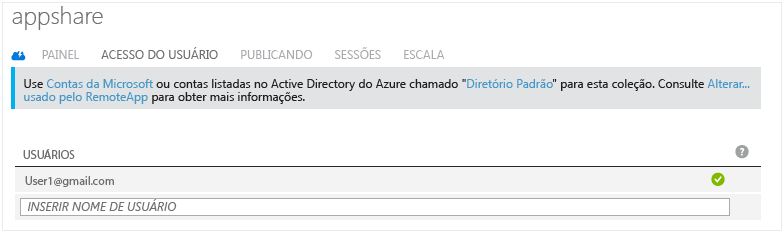

1. Agora, é hora de falar aos usuários sobre esses novos aplicativos e como acessá-los. Para fazer isso, envie um email que os direcione para a URL de download do cliente de área de trabalho remota. 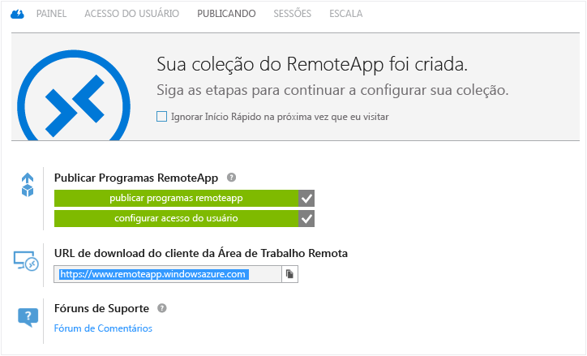

## Configurar o acesso ao Access

Alguns aplicativos precisam de configuração adicional após você implantá-los por meio do RemoteApp. Em particular, para o Access, vamos criar um compartilhamento de arquivo no Azure que qualquer usuário pode acessar. (Se não quiser fazer isso, você pode criar uma [coleção híbrida](remoteapp-create-hybrid-deployment.md) [em vez de nossa coleção de nuvem] que permite que os usuários acessem arquivos e informações em sua rede local.) Em seguida, precisaremos dizer a nossos usuários para mapear uma unidade local no seu computador para o sistema de arquivos do Azure.

A primeira parte você, no papel de administrador, faz. Em seguida, temos algumas etapas para seus usuários.

1. Comece publicando a interface de linha de comando (cmd.exe). Na guia **Publicação**, selecione **cmd** e, em seguida, clique em **Publicar > Publicar programa usando o caminho**.
2. Digite o nome do aplicativo e o caminho. Para nosso objetivo, use "Gerenciador de Arquivos" como o nome e "% SYSTEMDRIVE%\\windows\\explorer.exe" como o caminho. 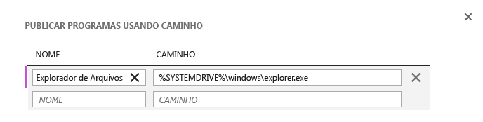
3. Agora, você precisa criar uma [conta de armazenamento](../storage/storage-create-storage-account.md) do Azure. Nomeamos o nosso "accessstorage", então escolha um nome que seja significativo para você. (Para citar Highlander incorretamente, pode haver apenas um "accessstorage".) 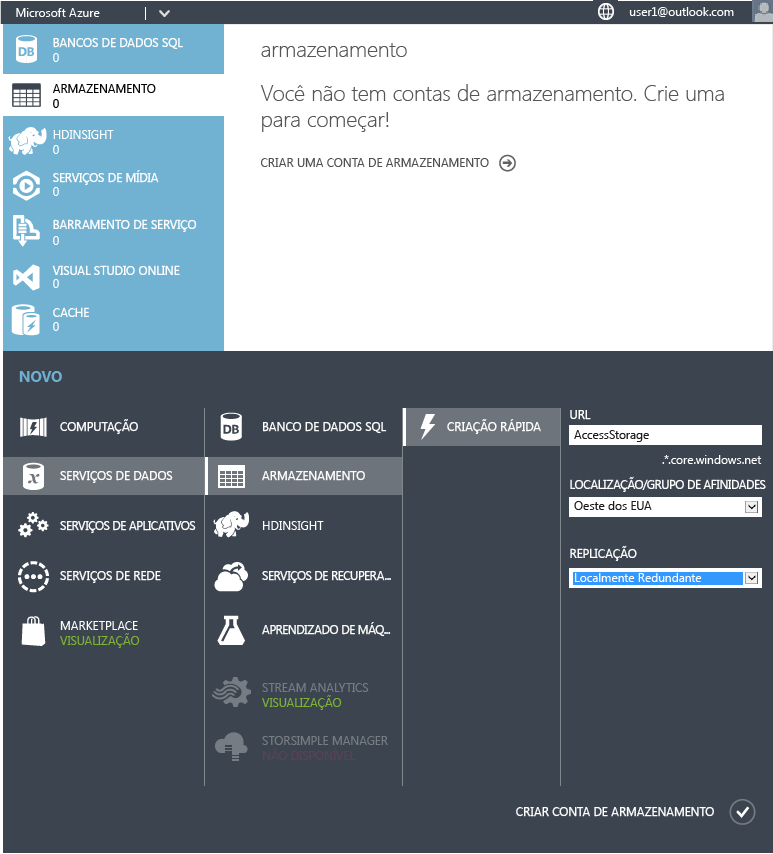
4. Agora volte ao seu painel para que você possa obter o caminho para o armazenamento (local de ponto de extremidade). Você usará isso daqui a pouco, portanto certifique-se de copiá-lo em algum lugar. 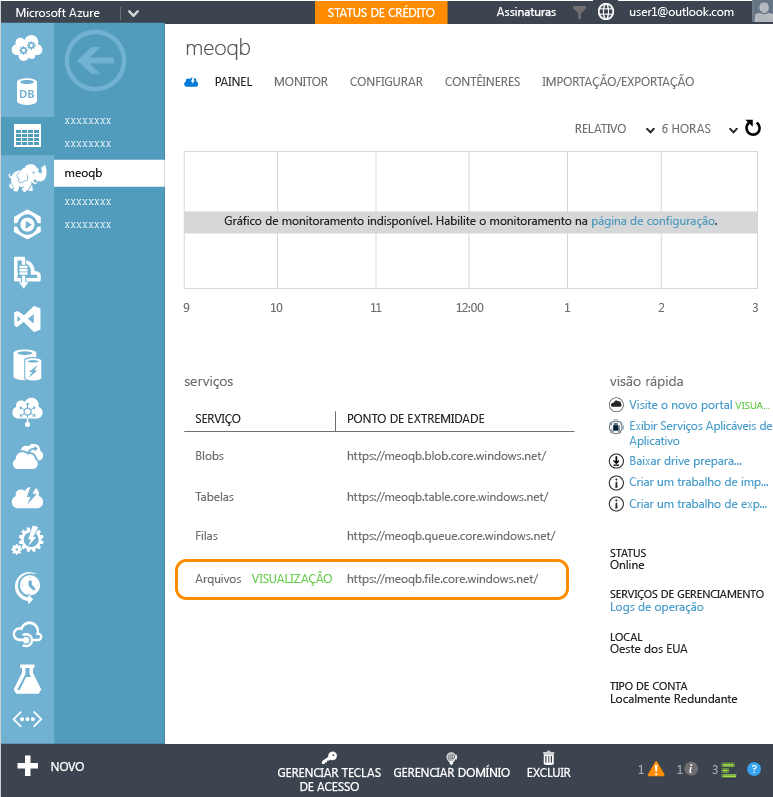
5. Em seguida, quando a conta de armazenamento tiver sido criada, você precisa da chave de acesso primário. Clique em **Gerenciar chaves de acesso** e, em seguida, copie a chave de acesso primário.
6. Agora, defina o contexto da conta de armazenamento e crie um novo compartilhamento de arquivo para o Access. Execute os seguintes cmdlets em uma janela elevada do Windows PowerShell:

        $ctx=New-AzureStorageContext <account name> <account key>
    	$s = New-AzureStorageShare <share name> -Context $ctx

	Estes são os cmdlets que executamos para nosso compartilhamento:

	    $ctx=New-AzureStorageContext accessstorage <key>
    	$s = New-AzureStorageShare <share name> -Context $ctx

Agora, é a vez do usuário. Primeiro, faça com que os usuários instalem um [cliente RemoteApp](remoteapp-clients.md). Em seguida, os usuários precisam mapear uma unidade de sua conta para esse compartilhamento de arquivo do Azure criado por você e adicionar seus arquivos do Access. É desse jeito que eles fazem isso:

1. No cliente RemoteApp, acesse os aplicativos publicados. Inicie o programa cmd.exe.
2. Execute o seguinte comando para mapear uma unidade do computador para o compartilhamento de arquivos:

		net use z: \<accountname>.file.core.windows.net<share name> /u:<user name> <account key>

	Se você definir o parâmetro **/persistent** como sim, a unidade mapeada persistirá entre as sessões.
1. Agora, inicie o aplicativo do Gerenciador de arquivos no RemoteApp. Copie quaisquer arquivos do Access que você deseje usar no aplicativo compartilhado para o compartilhamento de arquivos. 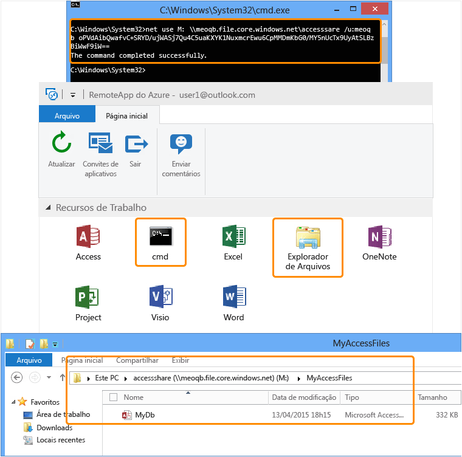
1. Por fim, abra o Access e abra o banco de dados que você acabou de compartilhar. Você deve ver os dados no Access em execução na nuvem. 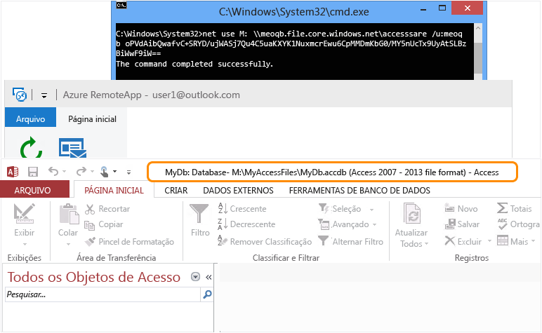

Agora você pode usar o Access em qualquer um dos seus dispositivos - certifique-se de instalar um cliente RemoteApp.

<!--Every topic should have next steps and links to the next logical set of content to keep the customer engaged-->
## Próximas etapas

Agora que você já dominou a criação de uma coleção, tente criar uma [coleção que use o Office 365](remoteapp-tutorial-o365anywhere.md). Ou você pode criar uma [coleção híbrida ](remoteapp-create-hybrid-deployment.md)que possa acessar sua rede local.

<!--Image references-->
 

<!---HONumber=AcomDC_0817_2016-->