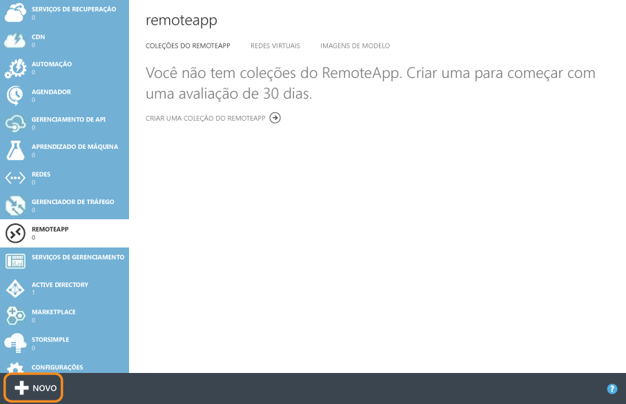
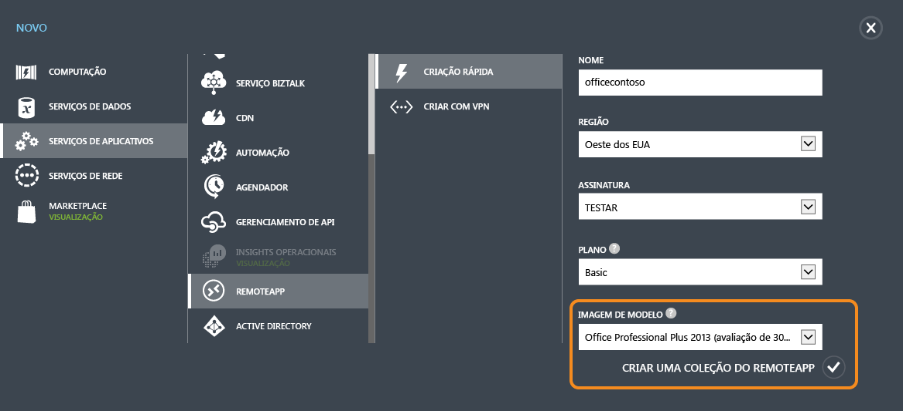
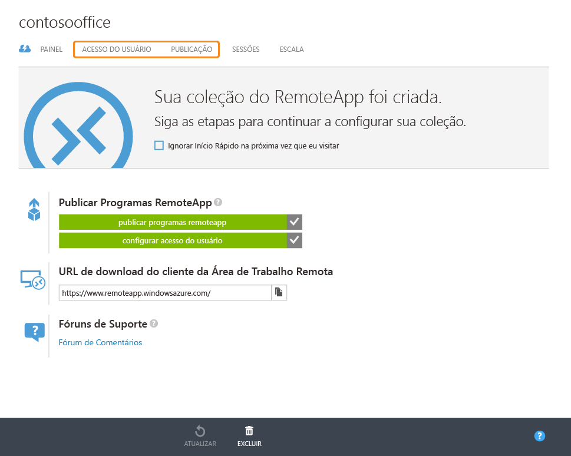
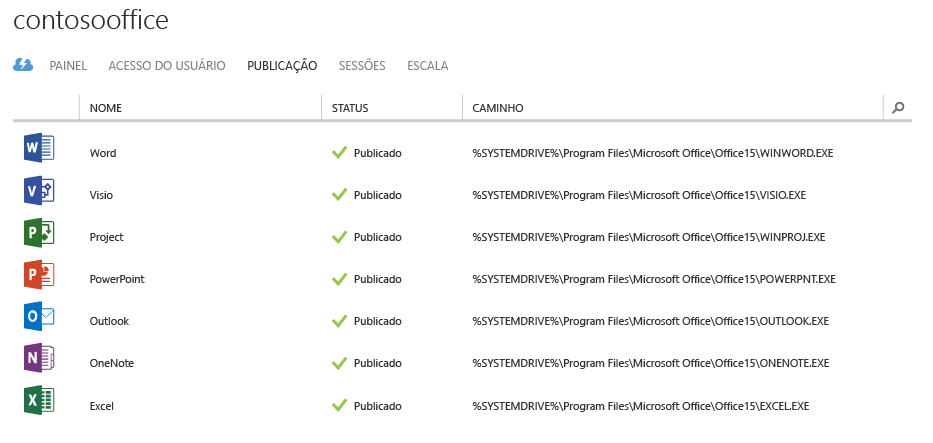
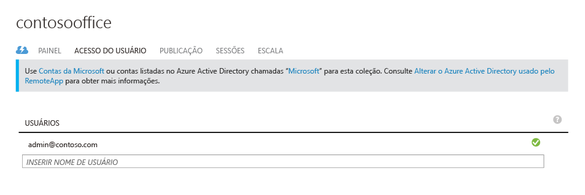
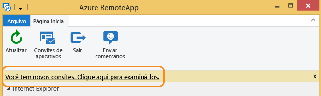
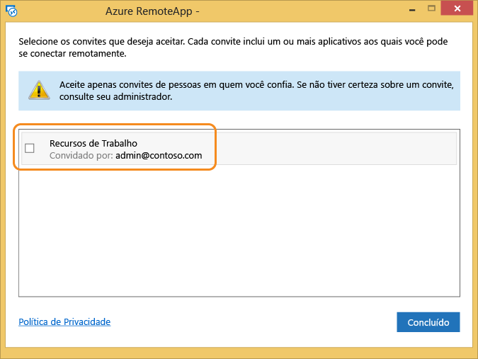
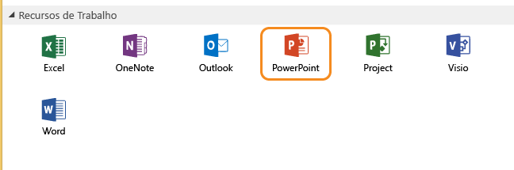
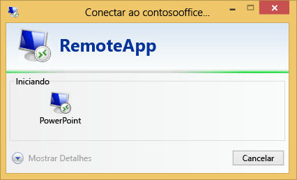
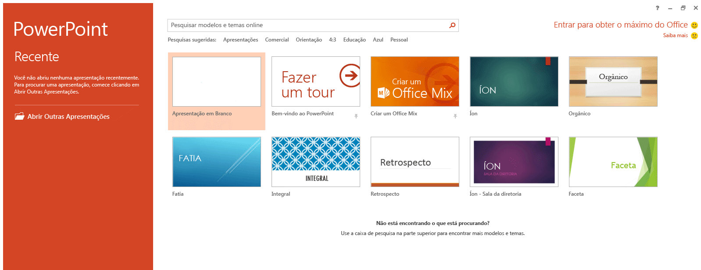

# Obter a mesma experiência de Office 365 em qualquer dispositivo com RemoteApp do Azure
> [!IMPORTANT]
> O RemoteApp do Azure está sendo descontinuado. Leia o [comunicado](https://go.microsoft.com/fwlink/?linkid=821148) para obter detalhes.
> 
> 

Este artigo abordará como implantar o Office 365 em qualquer dispositivo em sua empresa. Os usuários possam obter as mesmas capacidades e a experiência de interface de usuário em Android, Apple e Windows.

Faremos isso usando o RemoteApp do Azure hospedando o Office 365 em máquinas virtuais com capacidade de dimensionamento no Azure, às quais os usuários possam se conectar. Chamamos esse conjunto de máquinas virtuais de uma “coleção nuvem”.

## Criar uma coleção na nuvem
Pela primeira vez depois de criar uma conta do Azure, navegue até **RemoteApp** clicando no link no lado esquerdo.

Depois, prossiga clicando em **novo** na parte inferior e fazendo a "criação rápida" de uma coleção. Forneça um nome, região, assinatura, plano e imagem "Office Professional 2013" que fornecemos.

Depois de você concluir o formulário, o processo de criação de coleção deve começar. Isso pode levar até uma hora ou mais.

Depois que o processo for concluído, ele terá a aparência a seguir. Se clicarmos em **Publicação** , podemos ver que a maioria dos aplicativos do Office já foram publicados para nós.

Nesse ponto você também pode adicionar mais usuários que têm acesso a esta coleção, clicando em **Acesso de usuário**.

Agora vamos experimentar conectar ao Office 365!

## Conectar ao Office 365
Vamos acessar [https://www.remoteapp.windowsazure.com/](https://www.remoteapp.windowsazure.com/), rolar para baixo e clicar em **Baixar clientes** para instalar o cliente do Azure RemoteApp no dispositivo no qual você está. As capturas de tela abaixo são para o Windows.

Depois que o aplicativo for iniciado, você será solicitado a entrar com a conta da Microsoft (chamada anteriormente de “Live ID”), insira a mesma usada na sua conta do Azure por enquanto. Quando você tiver feito logon, você deve receber uma notificação sobre novos convites, clique nos mesmos e você deve ver uma lista como a mostrada abaixo. Aceite o convite que corresponde ao seu e-mail de proprietário de conta do Azure.

Abaixo, sua aparência quando há novos convites.

Depois de aceitar o convite, você deve ver todos os aplicativos do Office no cliente do RemoteApp do Azure.

Quando você clica em qualquer um desses, o aplicativo deve ser iniciado na máquina virtual do Azure e você deve estar com tudo pronto! Aproveite!

<!--HONumber=Nov16_HO2-->

